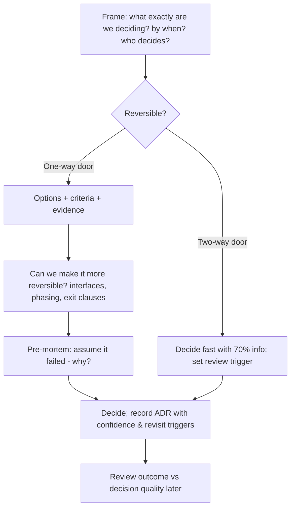

# Decision-making under ambiguity

!!! abstract "At a glance"
    **Priority:** P0 · **Complexity:** 3/5 · **Est. time:** 2 h · **Phase:** 5 · **Prereqs:** [Communicating with executives](communication-stakeholders.md), [ADRs](../architecture/adrs.md)
    **You're done when:** you've written a decision memo for a genuinely ambiguous choice using a reversibility analysis and pre-mortem, logged it in a decision journal with your confidence level, and scheduled a review date.

## Why it matters

Seniors solve well-defined problems. Staff engineers are paid to make — or shape — decisions where information is incomplete, stakes are high, stakeholders disagree, and waiting has a cost. The AI landscape in 2026 is the purest example: models, frameworks, protocols and vendor terms change quarterly; whatever you choose will be partly wrong within a year. The skill is choosing well *anyway*, and structuring choices so being wrong is cheap.

Interviewers test this directly ("Tell me about a decision you made with incomplete information") and indirectly in system design ("which would you pick, and why?").

## Core concepts

### Classify the decision first

**Reversibility (Bezos's Type 1 / Type 2, 2016 shareholder letter):**

| Type | Nature | How to decide | Examples |
|---|---|---|---|
| **Type 1 — one-way door** | Hard/expensive to reverse | Slow, deliberate, senior input, more data | Core data model, primary cloud region for regulated data, multi-year vendor contract, public API contract |
| **Type 2 — two-way door** | Cheap to reverse | Fast, by small groups/individuals, learn by doing | Library choice behind an interface, prompt design, internal tool UI, which model for a pilot |

The most common mistake in large enterprises is treating Type 2 decisions as Type 1 — slow, committee-driven decisions on reversible things. The second most common: treating a Type 1 as a Type 2 because "we're agile".

**Complexity (Cynefin framework, Dave Snowden):**

| Domain | Cause–effect | Approach | Example |
|---|---|---|---|
| Clear | Obvious | Sense → categorise → respond (best practice) | Apply a known patch |
| Complicated | Knowable by experts | Sense → analyse → respond (good practice) | Capacity plan for a Kafka cluster |
| Complex | Only visible in retrospect | Probe → sense → respond (experiment) | How users will adopt an AI assistant; agent behaviour in the wild |
| Chaotic | None perceivable | Act → sense → respond | Active SEV1 |

Many AI decisions are **complex**, not complicated: more analysis won't settle them; small experiments will.

### A practical decision process

### Tools

- **Framing:** Write the question as a single sentence. Many debates are two people answering different questions.
- **Decision roles (DACI/RAPID):** name the Driver, Approver (one person), Contributors, Informed. Consensus is not required; input is.
- **Weighted criteria matrix:** agree criteria and weights *before* scoring options — prevents reverse-engineering the answer.
- **Pre-mortem (Gary Klein):** "It's 12 months later and this failed. Write down why." Surfaces risks people won't say otherwise.
- **Make it reversible:** interfaces/abstractions (e.g., gateway over providers), phased rollouts, short contracts, feature flags, exit clauses.
- **Set tripwires:** "If eval accuracy < 95% by week 6, or cost > $0.05/doc, we switch to option B."
- **70% rule:** for reversible decisions, decide with ~70% of the information you'd like; waiting for 90% is usually too slow.
- **Decision journal:** record decision, context, options, expected outcome, confidence. Review later to separate *decision quality* from *outcome luck* (Annie Duke's "resulting" trap).

### Worked example: choose an agent runtime for the first production use case

**Question:** "Which runtime do we use for the customs-document agent pilot (launch in 12 weeks), given EU residency and our Java/Python skills?"

| Criterion (weight) | Managed agent service on our cloud | Self-hosted LangGraph on AKS | Spring AI in existing service |
|---|---|---|---|
| Time to pilot (30%) | 4 | 3 | 4 |
| Residency/compliance (25%) | 4 (verify region) | 5 | 5 |
| Durable execution/HITL (20%) | 4 | 5 | 2 |
| Ops burden (15%) | 5 | 2 | 4 |
| Exit cost (10%) | 2 | 5 | 4 |
| **Weighted** | **3.95** | **3.95** | **3.85** |

A tie on the matrix is information: the matrix can't decide it, so the real question is **reversibility**. Recommendation: self-hosted LangGraph behind the gateway with MCP tools, because tools/evals/gateway are portable and durable HITL is critical; revisit managed service in 6 months. Tripwire: if ops burden exceeds 0.5 FTE by month 3, move to managed. Confidence: ~65%.

### Senior-level nuance

- **Decision speed is a feature.** An 80%-right decision this week often beats a 95%-right decision next quarter.
- **Separate decision quality from outcome.** Good decisions can have bad outcomes (and vice versa). Judge the process given what was knowable.
- **Disagree and commit** once decided; reopen only on new evidence or tripwires.
- **Not deciding is a decision** — usually the most expensive one, with costs hidden (teams diverge).
- **Know your role:** often the Staff engineer's job is to *make the decision easy for the decider* (framing, options, recommendation), not to decide.
- **AI as a decision aid:** use LLMs to generate options, criteria, and pre-mortem failure modes; never to assign the weights or make the call.

## Resources

| Resource | Type | Why this one | Level | Cost |
|---|---|---|---|---|
| [Amazon 2016 shareholder letter (Type 1/Type 2 decisions)](https://www.aboutamazon.com/news/company-news/2016-letter-to-shareholders) | letter | The source of one-way/two-way door and "disagree and commit" | intermediate | free |
| [Cynefin framework (Cynefin.io)](https://www.cynefin.io/wiki/Cynefin) | wiki | Match decision approach to problem complexity | advanced | free |
| [DACI decision framework (Atlassian)](https://www.atlassian.com/team-playbook/plays/daci) | playbook | Clear decision roles; runnable template | intermediate | free |
| [Mental models (Farnam Street)](https://fs.blog/mental-models/) :gem: | article | Inversion, second-order thinking, probabilistic thinking — well explained | intermediate | free |
| [Architecture Decision Records](https://adr.github.io) | docs | Recording decisions with context and consequences | intermediate | free |
| [Refactoring (Luca Rossi)](https://refactoring.fm/) :gem: | newsletter | Practical essays on engineering decision-making | intermediate | freemium |
| [The Architect Elevator (Gregor Hohpe)](https://architectelevator.com/) :gem: | blog | Architecture as selling options; decisions under uncertainty | advanced | free |
| Thinking in Bets (Annie Duke) | book | Decision quality vs outcome; decision journals | intermediate | paid |

## Hands-on lab

**Produce: decision memo + decision journal entry (Staff artifact #8a). 60–90 min.**

1. Pick a genuinely ambiguous decision in your capstone or work (e.g., runtime choice above; pgvector vs dedicated vector DB; build vs buy eval tooling).
2. Frame it in one sentence with deadline and decider.
3. Classify it: Type 1/2? Cynefin domain? If complex, design a 2-week probe instead of more analysis.
4. Build the weighted matrix (agree weights first), then run a pre-mortem (list ≥ 5 failure reasons).
5. List 2–3 ways to make it more reversible.
6. Write the memo using the template from [Communicating with executives](communication-stakeholders.md), with confidence %, tripwires, and review date.
7. Add a decision-journal entry: expected outcome and confidence. Put a calendar reminder for the review.

**Expected output:** `docs/log/decisions/<date>-<topic>.md` + ADR if architectural.

## Questions

### L1 — Recall

??? question "Q1. What are Type 1 and Type 2 decisions?"
    ??? success "Answer"
        Type 1 decisions are consequential and hard to reverse ("one-way doors") and deserve careful, deliberate processes. Type 2 decisions are reversible ("two-way doors") and should be made quickly by small groups or individuals. Organisations often wrongly apply Type 1 processes to Type 2 decisions, slowing everything down.

??? question "Q2. What is a pre-mortem?"
    ??? success "Answer"
        Before committing, the team imagines the decision has failed in the future and writes down all the reasons why. It legitimises dissent, surfaces risks people are reluctant to raise, and feeds mitigations and tripwires into the plan.

??? question "Q3. Name the four main Cynefin domains and the approach for each."
    ??? success "Answer"
        Clear (sense–categorise–respond; best practice), Complicated (sense–analyse–respond; experts), Complex (probe–sense–respond; experiments), Chaotic (act–sense–respond; stabilise first). There's also "confusion" when you don't know which domain you're in.

### L2 — Apply

??? question "Q4. Classify these and pick a decision approach: (a) which LLM for an internal summarisation pilot, (b) the canonical shipment event schema, (c) the primary region for EU customer data."
    ??? success "Answer"
        (a) Type 2, complex → decide fast behind the gateway, run evals, switch freely. (b) Type 1-ish (many consumers, costly to change) and complicated → careful design, RFC, versioning strategy; make it more reversible with schema versioning and a compatibility policy. (c) Type 1, regulatory → deliberate, legal/security input, exec approval; document in ADR.

??? question "Q5. A team has debated vector DB options for six weeks. How do you unstick it?"
    ??? success "Answer"
        Reframe: is it reversible? Behind a repository interface, a vector store choice is largely Type 2 at pilot scale. Agree criteria and weights in one meeting, time-box a 1-week benchmark on real data (recall@k, latency, ops cost), name a decider, and set a date. Recommend the simplest viable option (e.g., pgvector on existing Postgres) with a tripwire (e.g., > 50M vectors or p99 > X ms → re-evaluate).

??? question "Q6. Write tripwires for a decision to launch an AI assistant for customer-service agents."
    ??? success "Answer"
        "Pause/rollback if: (1) human-override rate > 25% for 3 consecutive days; (2) any verified incident of disclosing another customer's data; (3) online eval groundedness < 90%; (4) cost per resolved ticket > $0.40; (5) CSAT on assisted tickets drops > 5 points vs control." Each with an owner who monitors it and authority to act.

### L3 — Design & trade-offs

??? question "Q7. Consensus vs single decider for architecture decisions — trade-offs?"
    ??? success "Answer"
        Consensus increases buy-in and surfaces concerns, but is slow, biased to the status quo, and gives vetoes to anyone. A single accountable decider (with required consultation) is faster and clearer, but risks poor buy-in if consultation is performative. Best practice: consent-based or advice-process decisions — the decider must seek advice from affected parties and experts, record it, then decide. Reserve broader consensus for standards that everyone must live with.

??? question "Q8. How do you make a Type 1 decision more like a Type 2 one?"
    ??? success "Answer"
        Add abstraction layers (gateways, interfaces, adapters), phase the rollout (pilot → region → global), negotiate contract exit clauses and shorter terms, use open standards at boundaries (OTel, MCP, SQL), keep data portable, run in parallel for a period, and set explicit revisit points. Each reduces the cost of reversal.

??? question "Q9. Your decision turned out badly. How do you evaluate whether it was a bad decision?"
    ??? success "Answer"
        Separate process from outcome. Was the information available reasonably gathered? Were alternatives and risks considered? Was the reasoning sound given what was known? Was there bad luck (an unforeseeable event)? Review the decision journal entry against what happened. Learn about process gaps, not just the outcome. Share the review openly — it builds trust and improves future decisions.

### L4 — Staff-level ambiguity

??? question "Q10. The CTO wants a decision in two weeks on whether to standardise on one hyperscaler's agent platform company-wide. Data is thin and vendor claims are loud. How do you run the decision?"
    ??? success "Answer"
        Frame the actual question (company-wide standard for what layer? runtime, models, tooling?). Identify it as Type 1 if it's a multi-year commitment — then look for ways to make it reversible (standardise on seams, not the whole stack; short initial term). Define criteria with stakeholders in days 1–2 (residency, security, integration with identity/data, eval/observability, cost, exit). Run a focused probe on one real use case with the same eval set in days 3–10. Pre-mortem with security and platform. Deliver a memo with a recommendation, confidence level, what would change it, and a phased commitment (e.g., adopt for new pilots with a 12-month review, not a mandatory migration).

??? question "Q11. Two principal engineers deadlock on event sourcing vs CRUD+outbox for a new shipment-tracking system. You're asked to break the tie. What do you do?"
    ??? success "Answer"
        Don't just pick a favourite. Clarify the requirements that would favour each (audit/temporal queries, replay needs, team skills, operational complexity). Have each write the strongest case for the *other* option. Find what's reversible: CRUD+outbox can emit events that later feed an event store; event sourcing is harder to undo. Given uncertainty, favour the more reversible path unless a hard requirement (full temporal audit) exists. Name the decider, document in ADR with revisit triggers, and ask both to commit.

??? question "Q12. (Behavioral) Tell me about a time you made a significant decision with incomplete information."
    ??? success "Answer"
        Show structure: why waiting was costly, how you classified reversibility, what information you sought in the time available, how you made it reversible or phased, the tripwires you set, the outcome, and what you learned — including what you'd do differently. Avoid "I trusted my gut" without process.

## Real-world use cases

- **Region selection for regulated data** (Type 1): legal + security + architecture, documented ADR.
- **Model choice for a pilot** (Type 2): gateway abstraction, evals, switch within days.
- **Vendor contract for an agent platform:** negotiated 12-month term with exit clause; open standards at boundaries.
- **Peak-season freeze exceptions:** fast, risk-based decisions with clear decider and rollback plan.

## Pitfalls & anti-patterns

- Treating reversible decisions as irreversible (analysis paralysis).
- Unclear decider; "consensus" meaning anyone can veto.
- Choosing criteria after scoring options.
- No tripwires; decisions never revisited.
- Judging decisions only by outcomes ("resulting").
- Letting the loudest voice or the vendor's demo decide.
- Re-litigating decided questions without new evidence.

## Checklist

- [ ] I can explain Type 1/2, Cynefin, pre-mortems and tripwires without notes
- [ ] I wrote a decision memo with reversibility analysis, confidence and tripwires
- [ ] I started a decision journal and scheduled a review
- [ ] I answered all L3 questions out loud in < 3 min each
