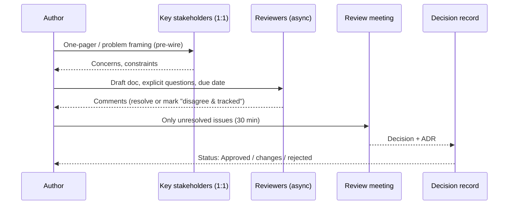

# Design docs & RFCs that get approved

!!! abstract "At a glance"
    **Priority:** P0 · **Complexity:** 2/5 · **Est. time:** 2 h · **Phase:** 2 · **Prereqs:** [Staff archetypes](staff-archetypes.md), [ADRs](../architecture/adrs.md)
    **You're done when:** you've written a design doc for your capstone agent platform using the template below, run it through at least one async review round, and recorded the outcome as an ADR.

## Why it matters

Writing is the primary medium of Staff work. A design doc is how you (1) think clearly, (2) scale your judgement to people who weren't in the room, and (3) create a durable record of *why*. In large enterprises — multiple time zones, many teams, heavy governance — a well-written doc is often the only way a cross-team decision actually gets made.

"Approved" is the operative word. Plenty of good designs die because the doc was too long, asked the wrong question, surprised a stakeholder, or buried the decision. This page is about docs that *move decisions*.

AI-era angle: agents can now draft a 10-page design in minutes. That makes the **editing, framing and trade-off judgement** more valuable, and it makes it easier to produce plausible-looking docs that nobody has really thought through. Reviewers are getting better at spotting that.

## Core concepts

### Types of decision documents

| Doc | Purpose | Length | Decision owner | When |
|---|---|---|---|---|
| **Design doc** | How we'll build a specific system/feature, with alternatives | 3–10 pages | Tech lead + reviewers | Before significant build (> ~2 eng-weeks or cross-team) |
| **RFC** | Proposal open for comment from a wider audience; often changes a standard | 2–8 pages | Named approvers / review body | Cross-team or org-wide changes |
| **ADR** | Record one decision + context + consequences | < 1 page | Whoever owns the decision | At the moment of decision; forever after |
| **Decision memo** | Ask an exec to choose between options | 1–2 pages | Exec | When authority sits above you |
| **One-pager / pitch** | Get permission to invest in writing a full design | 1 page | Manager/director | Before spending weeks |

Google's culture (described by Malte Ubl) treats design docs as lightweight, informal and mainly about **trade-offs** — the doc's job is to document the trade-offs you considered and get early feedback when changes are cheap. Oxide's RFD process and many companies' RFC processes add explicit states (prediscussion → discussion → published → committed/abandoned).

### Design doc template (the one to use)

```markdown
# <Title> — Design Doc
Author(s) · Reviewers (named, with the decision they own) · Status: Draft | In Review | Approved | Superseded
Last updated · Decision needed by: <date>

## 1. TL;DR (≤ 5 lines: problem, proposal, key trade-off, ask)
## 2. Context & problem
   - Why now; who is affected; evidence (metrics, incidents, customer pain)
## 3. Goals / Non-goals  (non-goals prevent 50% of review debate)
## 4. Requirements & constraints
   - Functional; NFRs with numbers (latency, throughput, availability, cost, residency)
## 5. Proposed design
   - Diagram (C4 container level), data flow, APIs/contracts, data model
   - Failure modes & how handled; security & privacy; observability
   - For AI systems: model/prompt strategy, eval plan, guardrails, HITL points, cost per request
## 6. Alternatives considered (≥ 2, incl. "do nothing") with why rejected
## 7. Rollout & migration (phases, flags, backfill, rollback)
## 8. Risks & open questions (owner + due date per question)
## 9. Operational readiness (SLOs, on-call, runbooks, cost budget)
## Appendix: capacity math, benchmarks, prior art
```

### The approval workflow



Tactics that raise approval rates:

1. **Pre-wire.** Before the doc circulates, the 3–4 most affected people have seen the framing 1:1. No surprises in public.
2. **Ask specific questions.** "Security: is token exchange acceptable for the MCP server calling the booking API?" beats "please review".
3. **Name the decider.** Use DACI/RAPID-style roles: who approves, who is consulted, who is informed.
4. **Time-box.** "Comments by Thursday; decision meeting Friday; silence = consent for informed parties."
5. **Put the hard trade-off up front.** Reviewers respect honesty; they punish discovered omissions.
6. **Meeting only for disagreements.** Don't read the doc aloud (or, Amazon-style, give 10 minutes of silent reading at the start if people haven't pre-read).
7. **Close the loop.** Update status; write the ADR; link the doc from the code repo.

### Writing quality: what separates Staff-level docs

- **BLUF** — bottom line up front. The TL;DR should let a VP stop reading after 5 lines.
- **Numbers over adjectives.** "p99 < 800 ms at 50 RPS, ~$0.004/request" not "fast and cheap".
- **Alternatives are real.** If alternative B is a strawman, reviewers notice. Include the option you rejected that a smart person would pick.
- **Non-goals** explicitly fence scope ("Not replacing the existing search service in this phase").
- **Diagrams at one level of abstraction** each (C4 context/container), not one diagram with everything.
- **Short.** If it's over 10 pages, you probably have two docs or an appendix problem.

### Using AI to write docs well (not badly)

| Good use | Bad use |
|---|---|
| Ask an agent to critique your draft as a specific reviewer (SRE, security, finance) | Generate the whole doc from a one-line prompt |
| Generate alternative designs you hadn't considered, then evaluate them yourself | Paste plausible numbers you haven't verified |
| Summarise 200 comments into themes | Let it "resolve" disagreements by averaging |
| Draft the ADR from the final doc | Produce 15 pages to look thorough |

Rule of thumb: you should be able to defend every sentence in a review without looking at the doc.

## Resources

| Resource | Type | Why this one | Level | Cost |
|---|---|---|---|---|
| [Design Docs at Google (Malte Ubl)](https://www.industrialempathy.com/posts/design-docs-at-google/) :gem: | article | The clearest description of lightweight, trade-off-focused design docs | intermediate | free |
| [Software engineering RFC and design doc examples (Pragmatic Engineer)](https://blog.pragmaticengineer.com/rfcs-and-design-docs/) | article | Real templates from many companies | intermediate | free |
| [Oxide RFD 1: Requests for Discussion](https://rfd.shared.oxide.computer/rfd/0001) :gem: | docs | A mature, public RFC process with states and norms | advanced | free |
| [Architecture Decision Records](https://adr.github.io) | docs | ADR formats and tooling; pair with design docs | intermediate | free |
| [C4 model](https://c4model.com) | docs | Diagram conventions reviewers can read fast | intermediate | free |
| [How to write email with military precision (HBR)](https://hbr.org/2016/11/how-to-write-email-with-military-precision) | article | BLUF and subject-line discipline; applies to TL;DRs | intermediate | free |
| [DACI decision framework (Atlassian)](https://www.atlassian.com/team-playbook/plays/daci) | docs | Name the Driver/Approver/Contributors/Informed | intermediate | free |
| [The Staff Engineer's Path (Tanya Reilly)](https://www.oreilly.com/library/view/the-staff-engineers/9781098118723/) | book | Chapters on RFCs, design review etiquette | advanced | paid |

## Hands-on lab

**Produce: capstone design doc + ADR (Staff artifact #2). 90–120 min.**

1. Choose the capstone component: e.g., "Enterprise agent gateway with MCP tool registry and eval harness" (see [Agent platform](../ai-system-design/agent-platform.md)).
2. Write the **one-pager** (15 min): problem, proposal, key trade-off, ask. Send it to one person (colleague or a critical LLM persona) before writing more.
3. Fill the template (60 min). Must include: NFRs with numbers, a C4 container diagram in Mermaid, ≥ 2 real alternatives (e.g., managed agent runtime vs self-hosted LangGraph service), an eval plan, cost per request estimate, rollout phases.
4. **Review round** (20 min): prompt three reviewer personas separately — "You are the security architect…", "You are the SRE who'll carry the pager…", "You are the finance partner…". List their top 3 concerns each; resolve or record.
5. Write the **ADR** (10 min): context, decision, consequences, status.

**Expected output:** `capstone/docs/design/agent-gateway.md` + `capstone/docs/adr/0001-agent-gateway.md`. A reviewer should be able to state your decision and main trade-off after reading only the TL;DR.

## Questions

### L1 — Recall

??? question "Q1. What is the difference between a design doc, an RFC and an ADR?"
    ??? success "Answer"
        A **design doc** explains how a specific system will be built, with alternatives and trade-offs, before the build. An **RFC** is a proposal opened for comment to a wider audience, usually for cross-team or standard-changing decisions, with named approvers. An **ADR** is a short, immutable record of one decision, its context and consequences, written at decision time and kept with the code. Design docs/RFCs often *produce* ADRs.

??? question "Q2. Why do non-goals matter in a design doc?"
    ??? success "Answer"
        They fence scope explicitly, preventing reviewers from debating things you've deliberately excluded, and they surface disagreements about scope early. A reviewer who thinks a non-goal should be a goal tells you now, not after launch.

??? question "Q3. What does 'pre-wiring' mean for a design review?"
    ??? success "Answer"
        Sharing the problem framing and proposal 1:1 with the key stakeholders before the doc circulates or the meeting happens, so their concerns are addressed early and nobody is surprised or embarrassed in public. It turns the review into confirmation plus resolving the remaining open issues.

### L2 — Apply

??? question "Q4. Write the TL;DR for a doc proposing an LLM gateway for your company."
    ??? success "Answer"
        "**Problem:** 7 teams call 3 LLM providers directly; no central logging, PII controls or cost attribution; spend up 4x in 2 quarters. **Proposal:** a shared gateway (LiteLLM-based, deployed in our cloud) providing routing, PII redaction, per-team keys/budgets, OTel traces, and fallback between 2 providers. **Key trade-off:** adds ~20–40 ms latency and a new tier-1 dependency in exchange for control and 20–30% cost savings via caching/routing. **Ask:** approve Phase 1 (3 highest-spend services) by 15 Nov; platform team owns."

??? question "Q5. You've received 140 comments on your RFC. How do you process them?"
    ??? success "Answer"
        Cluster them into themes (an LLM helps here, but verify). Classify each theme: clarification (fix the doc), valid concern (change design or add mitigation), preference (acknowledge, author decides), fundamental disagreement (needs a decision). Reply in-thread with resolution. Publish a short "changes since v1" summary. Take only the fundamental disagreements to a 30-minute meeting with the decider. Mark the rest resolved.

??? question "Q6. What must an AI-system design doc include that a classic CRUD service doc might not?"
    ??? success "Answer"
        Model and prompt strategy (which model, why, fallbacks), **eval plan** (offline dataset, metrics, thresholds for launch), guardrails and prompt-injection threat model (especially for tool-using agents: lethal trifecta analysis), HITL points for irreversible actions, data flows and residency (what data goes to which provider), cost per request and budget controls, observability (traces of LLM/tool calls), and a degradation plan when the model/provider is unavailable or quality regresses.

### L3 — Design & trade-offs

??? question "Q7. When should you *not* write a design doc?"
    ??? success "Answer"
        When the change is small, reversible and local (a two-day change within one team's service), when the solution is obvious and uncontested, or when a quick prototype would answer the question faster than prose. Then an ADR, a PR description, or a spike report suffices. Over-documenting slows teams and devalues docs. Write when the decision is expensive to reverse, cross-team, or contested.

??? question "Q8. Async-first review vs synchronous design review meetings — trade-offs for a global team?"
    ??? success "Answer"
        Async (comments on the doc) respects time zones, lets people think, leaves a record, and scales to many reviewers — but can stall, generate endless threads, and hide disagreements. Synchronous meetings resolve disagreements quickly and build shared understanding but exclude time zones and favour loud voices. Best practice: async-first with a deadline, then a short meeting only for unresolved issues with the decider present; rotate meeting times for global fairness.

??? question "Q9. A senior engineer used an agent to produce a polished 18-page design doc. Reviewers are unsure it's been thought through. What do you do?"
    ??? success "Answer"
        Don't reject for using AI; reject for quality signals. Ask the author for a 1-page TL;DR with the key trade-off and a 15-minute walkthrough where they defend the alternatives and numbers. Check that NFR numbers are sourced and alternatives are real. Coach: AI for drafting and critique, but the author owns every claim. Consider a team norm: design docs must state which numbers are measured vs estimated, and length guidance (≤ 10 pages + appendix).

### L4 — Staff-level ambiguity

??? question "Q10. Your company has no design review culture; decisions happen in hallway conversations and Slack. How do you introduce design docs without creating bureaucracy?"
    ??? success "Answer"
        Start by example, not mandate: write good docs for your own work and share them. Offer a lightweight template (TL;DR, context, proposal, alternatives, risks). Define a *trigger* rather than a rule (e.g., cross-team impact, > 2 eng-weeks, new external dependency, or data leaving the company). Make reviews fast (async + 1 week SLA). Showcase wins ("this doc caught a residency issue before build"). After a quarter, propose formalising with a director's sponsorship. Measure cycle time so it doesn't become a gate.

??? question "Q11. Your design is blocked by a principal engineer in another org who repeatedly asks for more analysis. How do you unblock it?"
    ??? success "Answer"
        Talk 1:1 to learn the real concern (risk to their system? disagreement on direction? not consulted early?). Ask: "What evidence would make you comfortable?" and agree on a bounded list. Offer a reversible first phase or a spike to answer the question empirically. If still blocked, agree together to escalate to the decider with a framing that both of you endorse: options, risks, cost of delay. Keep it respectful and documented; their concern may be right.

??? question "Q12. (Behavioral) Describe a design you proposed that was rejected or significantly changed in review."
    ??? success "Answer"
        Show openness and outcome: "I proposed a self-hosted vector DB cluster; review from SRE and finance showed on-call burden and cost outweighed benefits at our scale. I reran analysis, switched to pgvector on our managed Postgres, which reduced operating cost and time-to-launch by 6 weeks. Lesson: bring SRE in at the one-pager stage." Interviewers look for ego-less incorporation of feedback and learning.

## Real-world use cases

- **Carrier integration platform:** RFC to replace point-to-point EDI adapters with an event-driven integration layer; ADRs record Kafka vs managed event bus.
- **Customs document extraction agent:** design doc with eval plan (field-level accuracy threshold), HITL for low-confidence fields, residency constraints per region.
- **Org-wide standard:** RFC adopting OpenTelemetry for all services including GenAI spans, with migration phases.
- **Decision memo to a VP:** build vs buy for the agent runtime, 2 pages, options with cost and reversibility.

## Pitfalls & anti-patterns

- Burying the decision on page 7.
- Strawman alternatives; missing "do nothing".
- No named decider → endless review.
- Surprising a key stakeholder in the meeting.
- Doc written after the build (post-hoc justification).
- Unsourced numbers, especially AI-generated ones.
- Docs never updated to "Approved/Superseded"; no ADR, so the *why* is lost.

## Checklist

- [ ] I can explain doc vs RFC vs ADR vs decision memo and when to use each without notes
- [ ] I wrote the capstone design doc with NFR numbers, alternatives, eval plan and rollout
- [ ] I ran a reviewer-persona critique and recorded outcomes as an ADR
- [ ] I answered all L3 questions out loud in < 3 min each
