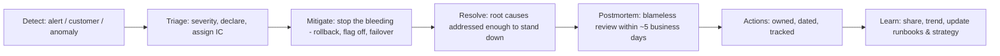

# Incident leadership & blameless postmortems

!!! abstract "At a glance"
    **Priority:** P1 · **Complexity:** 2/5 · **Est. time:** 2 h · **Phase:** 4 · **Prereqs:** [Observability & SLOs](../system-design/observability-slos.md), [Reliability patterns](../system-design/reliability-patterns.md)
    **You're done when:** you've run a game-day on your capstone (including an AI-specific failure), acted as incident commander, and written a blameless postmortem with owned, dated action items.

## Why it matters

Incidents are where Staff engineers earn trust fastest — and lose it fastest. In a crisis, people look for someone calm who brings structure. Afterwards, the postmortem is one of the most powerful levers for systemic change: it's the rare moment when leadership is paying attention to reliability.

For logistics, incidents have real-world consequences: missed vessel cut-offs, stuck customs clearances, bookings lost at peak season. For AI systems, incidents look different: no stack trace, just an agent that confidently did the wrong thing to 3% of requests for two days. Staff engineers need a playbook for both.

Interview relevance: "Tell me about a major incident you handled" is a staple; Staff answers focus on coordination, communication and systemic fixes, not heroic debugging.

## Core concepts

### Incident roles (Incident Command System, adapted)

| Role | Responsibility | Anti-pattern |
|---|---|---|
| **Incident Commander (IC)** | Owns coordination and decisions; delegates; keeps timeline | IC who debugs instead of coordinating |
| **Ops / Tech lead** | Leads hands-on investigation and mitigation | Five people making changes in parallel |
| **Communications lead** | Updates stakeholders on a fixed cadence | Execs pinging engineers directly |
| **Scribe** | Records timeline, decisions, hypotheses | Reconstructing the timeline from memory later |
| **Subject-matter experts** | Pulled in by IC as needed | Everyone joins the bridge "to help" |

Google's SRE book on managing incidents and PagerDuty's open incident response docs are the canonical references. For small incidents, one person may hold several roles — but make it explicit.

### Incident lifecycle



**Mitigate before you diagnose.** If a rollback or feature flag stops the impact, do it, then investigate. Staff-level ICs ask "what's the fastest safe way to reduce customer impact?" every 15 minutes.

### Severity and communication cadence

| Sev | Example (logistics) | Update cadence | Who's told |
|---|---|---|---|
| SEV1 | Booking platform down globally; EDI to carriers failing | Every 30 min | Execs, customer service, status page |
| SEV2 | One region's tracking delayed > 1 h; AI doc-extraction error rate spikes | Every 60 min | Product leadership, affected teams |
| SEV3 | Degraded non-critical feature | On resolution | Owning team |

**Status update template:**
```text
[SEV2] Customs doc extraction — update #3 — 14:30 IST
Impact: ~8% of customs declarations in EU routed to manual review since 11:10; no incorrect submissions detected.
Current status: Mitigated — rolled back prompt v42 → v41 at 14:05; error rate returning to baseline.
Next steps: Confirm backlog cleared by 16:00; root cause investigation ongoing.
Next update: 15:30 IST or sooner if status changes. IC: <name>
```

### AI-specific incidents

| Failure | Detection signal | Mitigation |
|---|---|---|
| Quality regression after model/prompt change | Online eval scores, HITL override rate, user feedback | Roll back prompt/model version (keep them versioned!) |
| Provider outage / rate limiting | Gateway error rate, latency | Fallback provider/model via gateway; degrade to non-AI path |
| Prompt injection → unwanted tool action | Tool-call anomaly, audit log, guardrail hits | Disable tool/agent via kill switch; revoke credentials |
| Cost runaway (agent loops) | Spend per request, token budget alerts | Budget caps, max-iteration limits, disable the agent |
| Data leakage to model/logs | DLP alerts, audit | Stop flow, notify privacy/legal, follow breach process |
| RAG staleness | Freshness SLO, wrong-answer reports | Re-index; show "last updated" to users |

Design implication: every AI feature needs a **kill switch**, versioned prompts/models for rollback, and a non-AI fallback path.

### Blameless postmortems

Blameless doesn't mean accountability-free; it means assuming people acted reasonably given what they knew, and fixing the **system** that allowed the failure. "Human error" is where investigation starts, not ends. Modern practice (learning from incidents community, Jeli/PagerDuty Howie guide) prefers asking "how did this make sense at the time?" and exploring contributing factors rather than a single root cause.

**Postmortem template:**

```markdown
# Postmortem: <title> — SEV<n> — <date>  (Status: draft/reviewed)
## Summary (3–4 sentences: what happened, impact, duration, how resolved)
## Impact
   - Customers/users affected, duration, business impact (bookings, SLAs, revenue), data impact
## Timeline (UTC + local) — detection, key decisions, mitigation, resolution
## Contributing factors (not "root cause = person X")
   - Technical, process, organisational; "how did this make sense at the time?"
## What went well / where we got lucky
## Detection & response analysis (time to detect, to mitigate; alert quality)
## Action items
   | # | Action | Type (prevent/detect/mitigate/process) | Owner | Due | Ticket |
## Lessons & follow-ups (docs, runbooks, strategy implications)
```

Action items: few (3–7), owned by a person, dated, tracked in the normal backlog, and reviewed at an operational review. Twenty unowned actions = zero actions.

### Running the postmortem meeting

1. Share the draft 24 h before; timeline must be agreed facts.
2. Facilitator ≠ person closest to the failure.
3. Open with the blameless norm stated out loud.
4. Walk the timeline; at each decision ask "what did you know, what did you expect?"
5. Brainstorm contributing factors; then prioritise actions.
6. Close: owners confirm actions and dates.

### Senior-level nuance

- **The Staff engineer's biggest postmortem lever is the trend**, not the single incident. Read postmortems quarterly; find systemic themes (e.g., "config changes without canary cause 40% of SEV2s") and turn them into strategy.
- **Protect the blameless culture from leadership pressure** ("who did this?"). Redirect to systems, and don't let blame leak via tone.
- **Near misses are free lessons**; review them too.
- **AI-generated code in incidents:** don't blame the agent or the engineer — ask why review, tests and canaries didn't catch it.

## Resources

| Resource | Type | Why this one | Level | Cost |
|---|---|---|---|---|
| [Postmortem Culture (Google SRE book)](https://sre.google/sre-book/postmortem-culture/) | book chapter | The canonical blameless postmortem rationale | intermediate | free |
| [Managing Incidents (Google SRE book)](https://sre.google/sre-book/managing-incidents/) | book chapter | Roles and the incident command model | intermediate | free |
| [Incident Response (SRE Workbook)](https://sre.google/workbook/incident-response/) | book chapter | Practical case studies of incident response | intermediate | free |
| [PagerDuty Incident Response docs](https://response.pagerduty.com/) :gem: | docs | Open, detailed IC/scribe/comms role guides | intermediate | free |
| [PagerDuty Postmortem docs](https://postmortems.pagerduty.com/) | docs | Templates and facilitation guidance | intermediate | free |
| [Howie: post-incident guide (Jeli / PagerDuty)](https://www.jeli.io/howie/welcome) :gem: | guide | Learning-focused incident analysis beyond root cause | advanced | free |
| [The practical guide to incident management (incident.io)](https://incident.io/guide) :gem: | guide | Readable, modern end-to-end guide | intermediate | free |
| [Postmortem templates collection](https://github.com/dastergon/postmortem-templates) | repo | Many real company templates to compare | intermediate | free |

## Hands-on lab

**Produce: game-day + blameless postmortem (Staff artifact #5). 90–120 min.**

1. On your capstone, define two failure injections: (a) primary LLM provider returns 429/500 for 10 minutes; (b) a prompt change that silently drops a required field in structured output for 20% of requests.
2. Set up detection: gateway error-rate alert for (a), an online eval/validation check for (b).
3. Run the game-day with yourself as IC (or with a colleague as ops lead). Keep a scribe log with timestamps. Post status updates using the template.
4. Mitigate: fallback provider for (a); prompt version rollback for (b). Measure time to detect and time to mitigate.
5. Write the postmortem for (b) using the template; 3–5 action items (e.g., "structured-output schema validation in CI eval suite", "canary prompt releases at 5%").

**Expected output:** `capstone/docs/postmortems/2027-01-xx-prompt-regression.md` with timeline, contributing factors, and owned actions; runbook updated.

## Questions

### L1 — Recall

??? question "Q1. What are the core incident roles and why separate IC from ops lead?"
    ??? success "Answer"
        Incident Commander, ops/tech lead, communications lead, scribe, plus SMEs. The IC coordinates, decides and keeps the big picture; if the IC is also debugging, nobody manages communication, parallel changes or escalation, and tunnel vision sets in. Separating roles keeps the response structured.

??? question "Q2. What does 'blameless' mean in a postmortem?"
    ??? success "Answer"
        Assuming people acted in good faith with the information they had, and focusing on how the system (tools, processes, incentives, design) allowed the failure. It's not the absence of accountability: teams remain accountable for fixing the system. Blame drives people to hide information, which makes future incidents worse.

??? question "Q3. Why 'mitigate before diagnose'?"
    ??? success "Answer"
        Customer impact accrues every minute. Rolling back, flipping a feature flag or failing over often stops impact without knowing the root cause. Diagnosis can continue after impact is contained, with less pressure and better decisions.

### L2 — Apply

??? question "Q4. An AI booking assistant starts quoting wrong surcharges for some routes. You're IC. Walk through the first 30 minutes."
    ??? success "Answer"
        0–5 min: declare SEV2 (possibly SEV1 if customers are being charged), assign ops lead, comms lead, scribe. Assess scope: which routes, since when, how many quotes. 5–15 min: mitigate — disable the surcharge tool/agent path via kill switch or route to the deterministic pricing service/human review; roll back the most recent prompt/model/tool change if correlated. Notify customer service. 15–30 min: confirm mitigation via metrics; first status update; start identifying affected quotes for remediation; preserve logs/traces for the postmortem. Don't let anyone ship a "quick fix prompt" untested.

??? question "Q5. Write three good action items for a postmortem where a config change took down EDI processing."
    ??? success "Answer"
        (1) "Require canary deployment (5% partners for 30 min) for EDI routing config — owner: A, due: 15 Nov, type: prevent." (2) "Add alert on EDI message throughput drop > 30% vs 7-day baseline — owner: B, due: 1 Nov, type: detect." (3) "One-click config rollback in the deploy tool + runbook — owner: C, due: 30 Nov, type: mitigate." Each is specific, owned, dated, and addresses a different phase.

??? question "Q6. An executive asks in the postmortem review: 'Who made the change?' How do you respond?"
    ??? success "Answer"
        Redirect calmly: "The change was made through our normal process by an engineer following the runbook. The more useful question is why our process let a change like this reach production without a canary or alert — that's where our actions focus." Afterwards, privately explain why blame reduces reporting and learning. Protecting the norm is part of Staff leadership.

### L3 — Design & trade-offs

??? question "Q7. Single root cause (5 Whys) vs contributing-factors analysis — trade-offs?"
    ??? success "Answer"
        5 Whys is simple and fast but pushes towards one linear cause and often ends at "human error" or a single fix. Contributing-factors / systems approaches acknowledge that complex failures emerge from multiple interacting conditions (tooling, pressure, design, missing signals) and produce richer learning, but take more time and facilitation skill. Use 5 Whys for simple incidents; use contributing factors for SEV1/2 and recurring themes.

??? question "Q8. What must be designed into an agentic system so incidents are manageable?"
    ??? success "Answer"
        Kill switches per agent/tool; versioned prompts, models and tool schemas with fast rollback; a non-AI fallback path; per-request tracing of LLM and tool calls (OTel); online quality signals (evals, validation failures, human override rates); budget and iteration caps; least-privilege tool credentials that can be revoked; audit logs for every write action; and HITL for irreversible actions. Without these, you can't detect, contain or explain AI incidents.

??? question "Q9. How many postmortems should a team write, and for which incidents?"
    ??? success "Answer"
        Define triggers: all SEV1/SEV2, any customer-visible data issue, any security or AI-safety event, and significant near misses. Lightweight template for SEV3 if valuable. Too many postmortems create fatigue and unowned actions; too few lose learning. Track action item completion rate — if it's below ~70–80%, write fewer, better postmortems with fewer actions.

### L4 — Staff-level ambiguity

??? question "Q10. Your org has frequent incidents, postmortems are written, but the same themes recur. What do you do as a Staff engineer?"
    ??? success "Answer"
        Aggregate: analyse 6–12 months of postmortems for themes (change management, missing alerts, dependency failures). Quantify cost (hours, customer impact). Check action item completion. Present a short reliability strategy to leadership: 2–3 systemic investments (e.g., progressive delivery for all tier-1 services, SLOs with error budgets, dependency timeouts standard), with owners and metrics. Introduce an operational review cadence where actions are tracked. Turn the postmortem archive into strategy input.

??? question "Q11. An agent with write access to a TMS (transport management system) made 200 incorrect shipment updates due to prompt injection in a partner email. Leadership wants to shut down all agent projects. How do you lead?"
    ??? success "Answer"
        Immediately: contain (disable agent, revoke credentials), remediate data, notify stakeholders, follow security incident process. Then lead a blameless postmortem on the design: the agent combined untrusted input, private data and write actions (the lethal trifecta) without HITL or scoped permissions. Propose concrete controls: HITL for writes, input isolation, least-privilege tools, allow-lists, rate limits, red-teaming. Offer leadership a risk-tiered policy instead of a blanket ban: read-only and HITL agents continue; autonomous write agents paused until controls pass review. Show you take the risk seriously while preserving the programme.

??? question "Q12. (Behavioral) Tell me about the worst incident you were involved in. What did you do and what changed afterwards?"
    ??? success "Answer"
        Staff-level answer: brief technical context; your role (IC or coordinating), how you structured the response (roles, mitigation first, comms cadence), the impact; the postmortem you drove, and — critically — the systemic change afterwards (e.g., canary deploys adopted org-wide, SLOs introduced) with measurable effect. Show calm and learning, not heroics.

## Real-world use cases

- **Peak-season booking outage:** IC structure, status page, rollback within 20 minutes, postmortem leading to progressive delivery adoption.
- **Carrier EDI failure:** partner-facing communication plan, backlog replay, idempotency fixes.
- **Customs AI extraction regression:** prompt rollback, eval gap identified, canary for prompt releases.
- **Provider outage:** gateway failover to secondary model with slightly lower quality; documented acceptable degradation.

## Pitfalls & anti-patterns

- IC who debugs; no scribe.
- Diagnosing for an hour before rolling back.
- Execs on the bridge asking for updates every 5 minutes (fix with comms lead + cadence).
- "Root cause: human error."
- 20 action items with no owners.
- Postmortems nobody reads; no trend analysis.
- AI features without kill switches or version rollback.

## Checklist

- [ ] I can explain incident roles, lifecycle and blameless principles without notes
- [ ] I ran a game-day on my capstone including an AI-quality failure
- [ ] I wrote a blameless postmortem with 3–7 owned, dated actions
- [ ] I answered all L3 questions out loud in < 3 min each
