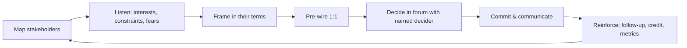

# Influence without authority & alignment

!!! abstract "At a glance"
    **Priority:** P0 · **Complexity:** 3/5 · **Est. time:** 2 h · **Phase:** 3 · **Prereqs:** [Staff archetypes](staff-archetypes.md), [Design docs & RFCs](design-docs-rfcs.md)
    **You're done when:** you have a stakeholder map for one real cross-team initiative, have run at least two pre-wiring conversations using the scripts below, and can tell a STAR story about changing a decision you didn't own.

## Why it matters

Staff engineers rarely have reporting lines. You need five teams, security and a VP to change course, and none of them work for you. Influence is therefore not a "soft skill" add-on — it is the delivery mechanism for everything else on this track.

In a large enterprise, influence has specific textures: matrix organisations, long approval chains, regional autonomy, vendor relationships, and governance bodies. In AI adoption specifically, you'll need to align groups with conflicting incentives: product teams want speed, security wants control, legal wants certainty, finance wants predictable spend.

Interviewers probe this more than anything: "Tell me about a time you convinced another team to change their approach."

## Core concepts

### Sources of influence (when you have no positional power)

| Source | What it is | How to build it |
|---|---|---|
| **Expertise** | People trust your technical judgement | Be right in public, admit when wrong, go deep where it matters |
| **Relationships / trust** | People believe you have their interests in mind | 1:1s before you need them; help first; keep promises |
| **Information** | You see across silos | Read widely (incidents, roadmaps, other orgs' docs); connect dots |
| **Borrowed authority** | A sponsor with authority backs you | Align with leadership goals; get explicit sponsorship |
| **Reciprocity** | You helped them before | Unblock others, review their docs, share credit |
| **Process ownership** | You run a forum (arch review, guild) | Run it well; make decisions faster, not slower |
| **Artifacts** | Written docs that frame the problem | The person who writes the framing doc shapes the decision |

### The alignment loop

### Stakeholder mapping

Plot on **influence × interest**, then add **stance** (champion / neutral / sceptic / blocker) and **what they care about**.

| Stakeholder | Influence | Interest | Stance | Cares about | My move |
|---|---|---|---|---|---|
| VP Engineering (sponsor) | High | High | Champion | Cost, speed, audit findings | Monthly update; ask for mandate |
| Head of Security | High | High | Sceptic | Data leakage, compliance | Co-design controls; give them a veto on data-class rules |
| Booking team EM | Med | High | Blocker | Q4 deadline | Offer migration help; phase after deadline |
| Finance BP | Med | Med | Neutral | Predictable spend | Cost dashboard; budget alerts |
| Regional IT (Asia) | Med | Low | Unknown | Residency | Early 1:1; include in design review |

### Interests, not positions

From negotiation theory (Fisher & Ury, *Getting to Yes*): the booking EM's **position** is "we won't migrate to the gateway"; their **interest** is "don't jeopardise the Q4 release". Satisfy the interest (phase migration after Q4, provide an adapter) and the position dissolves.

### Scripts for hard conversations

**Pre-wiring a sceptic (security lead):**
> "Before I share the gateway proposal more widely, I want your view — you'll see the risks I'm missing. The problem I'm trying to solve is that teams are sending data to providers without logging. What would a design need for you to be comfortable? … If we made data classification rules yours to own in the gateway policy, would that address the concern?"

**Disagreeing with a more senior engineer:**
> "I see it differently, and I may be missing context. My concern is X, based on Y data. Can we agree on what evidence would settle it — maybe a two-day spike measuring Z?"

**Saying no to a director's request while keeping the relationship:**
> "I want this to succeed. If I take it on now, the gateway migration slips a quarter, which puts the audit finding at risk. Two options: I advise your team for two hours a week, or we revisit in January. Which is more useful?"

**Disagree and commit (after losing):**
> "I've made my case and it's been heard. We're going with option B. I'm committed to making it work — I'll help with the rollout plan, and I've logged my concern in the ADR so we can revisit if metric M crosses T."

**Escalating without burning bridges:**
> "We've tried to resolve this and we see it differently. Let's write a one-page summary together — both options, trade-offs — and take it to <decider>. I'd rather we escalate jointly than argue indefinitely."

### Staying aligned with authority

Larson's guidance: your influence depends on being *aligned with your management chain*. Practical rules:

- No surprises upward. Your manager hears bad news from you first.
- Disagree privately and specifically; support publicly once decided.
- Understand what your leadership is being measured on; frame proposals in those terms.
- Don't use your manager's authority without asking ("the VP wants this") — it's borrowed and can be revoked.

### Senior-level nuance

- **Influence is a long game.** Trust built over months is spent in minutes. Bank it before you need it.
- **Credit is a currency — give it away.** Let teams present the solution you co-designed. You'll get more done.
- **Know when to stop influencing and escalate.** If the cost of delay exceeds the relationship cost, escalate jointly.
- **The artifact wins.** The person who writes the clearest framing doc shapes the decision; meetings rarely do.
- **AI adoption politics:** people fear AI for real reasons (job security, quality, blame for agent errors). Acknowledge those interests explicitly; don't dismiss them as resistance.

## Resources

| Resource | Type | Why this one | Level | Cost |
|---|---|---|---|---|
| [Staying aligned with authority (StaffEng)](https://staffeng.com/guides/staying-aligned-with-authority/) | article | Why alignment with your chain is the base of Staff influence | intermediate | free |
| [Getting in the room (StaffEng)](https://staffeng.com/guides/getting-in-the-room/) | article | How to earn and keep a seat where decisions are made | intermediate | free |
| [The Staff Engineer's Path (Tanya Reilly)](https://www.oreilly.com/library/view/the-staff-engineers/9781098118723/) | book | Excellent on maps (locator, topographic, treasure) of the org | advanced | paid |
| [Being Glue (Tanya Reilly)](https://noidea.dog/glue) :gem: | talk | Coordination work as leadership — and how to get credit for it | intermediate | free |
| [Engineering Leadership (Gregor Ojstersek)](https://newsletter.eng-leadership.com/) :gem: | newsletter | Frequent practical pieces on stakeholder management | intermediate | freemium |
| [Refactoring (Luca Rossi)](https://refactoring.fm/) :gem: | newsletter | Clear, visual essays on engineering collaboration and decision-making | intermediate | freemium |
| [Resilient Management (Lara Hogan)](https://resilient-management.com/) :gem: | book | Tools for hard conversations and coaching, useful beyond managers | intermediate | paid |
| Getting to Yes (Fisher & Ury) | book | Interests vs positions — the single most useful negotiation idea | intermediate | paid |

## Hands-on lab

**Produce: stakeholder map + pre-wire plan for one initiative (feeds Staff artifact #3). 60–90 min.**

1. Pick a real cross-team initiative (e.g., "Adopt the shared LLM gateway" or your capstone's rollout).
2. Build the stakeholder table above for 6–10 stakeholders, including stance and interests (not positions).
3. For the two most resistant stakeholders, write a **pre-wire script** (3–5 lines each) and the concession you're prepared to make.
4. Identify your **sponsor** and the specific ask ("announce the gateway as the paved road at the Q1 all-hands").
5. Run one pre-wire conversation for real (or role-play with an LLM instructed to be a sceptical security lead who has been burned by a prior vendor). Note what changed in your proposal.
6. Write a 5-line after-action: what worked, what you'll change.

**Expected output:** `docs/log/stakeholder-map-<initiative>.md` with table, scripts and after-action.

## Questions

### L1 — Recall

??? question "Q1. List five sources of influence available to someone without positional authority."
    ??? success "Answer"
        Expertise, relationships/trust, information (seeing across silos), borrowed authority (sponsorship), reciprocity, process ownership (running forums), and written artifacts that frame decisions. Staff engineers usually combine several.

??? question "Q2. What is the difference between a position and an interest?"
    ??? success "Answer"
        A **position** is what someone says they want ("we won't migrate"); an **interest** is why they want it ("we can't risk the Q4 deadline"). Negotiating on interests opens options that satisfy both sides; negotiating on positions produces deadlock or a winner and loser.

??? question "Q3. What does 'disagree and commit' require of you after a decision goes against you?"
    ??? success "Answer"
        Having voiced your disagreement clearly beforehand, you commit fully to making the chosen option succeed — no passive resistance, no "I told you so". Good practice: record your concern and a revisit trigger (metric/threshold) in the ADR so the question can be reopened on evidence, not politics.

### L2 — Apply

??? question "Q4. Three product teams refuse to adopt your eval harness: 'we don't have time'. What do you do?"
    ??? success "Answer"
        Find the interest behind "no time": deadline pressure, unclear value, or setup friction. Reduce the cost (template repo, 30-minute setup, you pair on the first eval), increase the value (show a regression it would have caught in their system; tie to an incident), and use borrowed authority carefully (VP policy "no prod launch without evals" from next quarter, with a grace period). Start with the most willing team, make them successful, then showcase them — peer proof beats mandate.

??? question "Q5. Draft the message to a VP asking for sponsorship of a cross-team initiative."
    ??? success "Answer"
        "Subject: Ask — sponsor LLM gateway as paved road (decision by 30 Oct). **BLUF:** I'd like you to sponsor consolidating our LLM access onto one gateway. **Why it matters to you:** closes the Q2 audit finding, gives cost attribution (spend up 4x), cuts security review from 6 weeks to ~1 for standard patterns. **What I need:** (1) announce it as the default path at the next eng all-hands; (2) 2 platform engineers for Q1. **What you get:** monthly one-page update, first 3 services migrated by end of Q1. 20 minutes this week to discuss?"

??? question "Q6. A peer Staff engineer keeps undermining your proposal in meetings. How do you handle it?"
    ??? success "Answer"
        Go 1:1, privately and curiously: "I've noticed we disagree in meetings about X; I'd like to understand your concerns — you may be seeing something I'm not." Look for their interest (ownership, being consulted late, genuine technical concern). Invite them to co-author or review the next draft. If the pattern continues after good-faith efforts, discuss with your manager with specific examples, focusing on the impact on the decision process, not on personality.

### L3 — Design & trade-offs

??? question "Q7. Mandate vs persuade: when should a Staff engineer seek a top-down mandate for a standard?"
    ??? success "Answer"
        Seek a mandate when (a) the risk is existential or regulatory (e.g., data leakage to unapproved LLM vendors), (b) network effects require near-universal adoption (identity, logging, gateway), or (c) persuasion has failed and the cost of divergence is high. Prefer persuasion when the benefit is local, the standard is immature, or you need feedback. Even with a mandate, do the persuasion work — otherwise you get malicious compliance. A good pattern: paved road first, mandate later once the road is proven.

??? question "Q8. Your sponsor leaves the company mid-initiative. What do you do?"
    ??? success "Answer"
        Act quickly: brief your manager and the interim leader with a one-page status (goal, progress, value delivered, risks, asks). Identify who inherits the budget/authority and re-establish sponsorship — frame it in the new leader's goals. Meanwhile, strengthen peer-level support (team leads who benefit) so the initiative has grassroots momentum. If the new leader deprioritises it, negotiate a graceful scope reduction rather than letting it die half-done.

??? question "Q9. You're right technically, but the org chose the other option for political reasons. Fight or commit?"
    ??? success "Answer"
        Distinguish "politics" from legitimate non-technical constraints (vendor contracts, skills, timelines, relationships) — often what looks political is a trade-off you weren't weighting. If the risk is reversible and moderate, commit and record your concern with a revisit trigger. If it's irreversible and high-risk (security, safety, compliance), escalate once more with a crisp risk statement to the accountable exec, then commit. Repeated fighting after a decision erodes your influence for future decisions.

### L4 — Staff-level ambiguity

??? question "Q10. You need five teams across three regions and two VPs to converge on one agent framework. Nobody has asked you to do this. Plan it."
    ??? success "Answer"
        (1) Validate the problem is worth it: cost of divergence (duplicated effort, security reviews, inconsistent evals). (2) Talk to your manager; find a sponsor who owns the outcome. (3) Map stakeholders and interests per region (residency, skills, deadlines). (4) Reframe from "one framework" to "shared seams": gateway, MCP tools, OTel traces, eval harness — teams may keep frameworks above those seams, which lowers resistance. (5) Write a short RFC; pre-wire every team lead and both VPs. (6) Pilot with the most willing team; publish results. (7) Formal decision in architecture review with named decider; migration path and timelines for others. (8) Track adoption and give credit publicly.

??? question "Q11. A senior leader publicly commits to an unrealistic AI delivery date that your teams can't meet safely. What do you do?"
    ??? success "Answer"
        Don't contradict them publicly. Within 24–48 h, bring them a private, data-backed view: what can be delivered safely by the date (scope options), what it would take to hit the full scope (people, risk acceptance), and the specific risks (no evals, no HITL, data exposure). Offer options: reduced-scope launch, internal pilot, or date move with interim milestone. Frame it as protecting their commitment and reputation. Document the decision and risk acceptance by the accountable person.

??? question "Q12. (Behavioral) Tell me about a time you changed another team's technical direction."
    ??? success "Answer"
        Strong answers include: the stakes and why it was your business; how you understood their interests; the artifact (doc, prototype, data) that changed minds; pre-wiring; what you conceded; the measurable result; and how you gave them credit. Avoid stories where you "won" by escalating — interviewers want persuasion, with escalation as a last resort handled jointly.

## Real-world use cases

- **Security + platform co-design:** turning the security team from blocker to co-owner by giving them ownership of data-classification policies in the LLM gateway.
- **Regional autonomy:** convincing an Asia-Pacific IT group to adopt the global integration standard by addressing residency (regional deployment) rather than arguing standards.
- **Coding-agent rollout:** addressing engineers' fear of being blamed for agent-generated defects by setting review norms and blameless incident rules for AI-generated code.
- **Vendor lock-in debate:** aligning procurement, architecture and product on open standards at the seams (MCP, OTel) while buying a managed runtime.

## Pitfalls & anti-patterns

- Leading with the solution before understanding interests.
- Big-meeting persuasion with no pre-wiring.
- Invoking the VP's name without permission.
- Winning the argument, losing the relationship.
- Passive resistance after a decision.
- Treating AI scepticism as ignorance rather than legitimate concern.
- Hoarding credit.

## Checklist

- [ ] I can explain interests vs positions and the sources of influence without notes
- [ ] I built a stakeholder map with stances and interests for a real initiative
- [ ] I ran at least one pre-wire conversation and changed my proposal based on it
- [ ] I have a STAR story about influencing another team
- [ ] I answered all L3 questions out loud in < 3 min each
