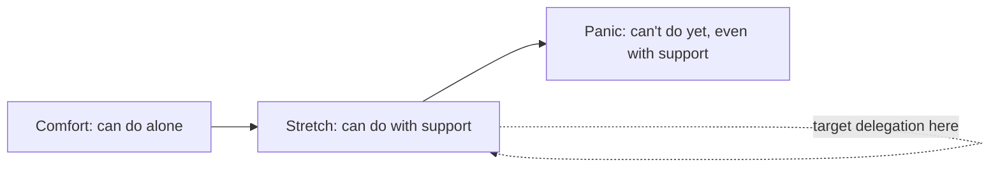

# Mentoring, sponsorship & growing engineers

!!! abstract "At a glance"
    **Priority:** P1 · **Complexity:** 2/5 · **Est. time:** 2 h · **Phase:** 5 · **Prereqs:** [Staff archetypes](staff-archetypes.md)
    **You're done when:** you have a written growth plan for two engineers (one mentoring, one sponsorship), a reusable 1:1 agenda, and have delegated one piece of "your" work to someone who stretches on it.

## Why it matters

Levelling up others is one of the three pillars of Staff work. It is also the clearest way to multiply impact: if you grow two seniors into owners of platform components, you've added more capacity than any amount of personal output.

In promotion calibrations, "who has this person grown?" is a standard question for Staff+. In interviews: "Tell me about someone you mentored and what changed for them."

AI-era twist: coding agents are changing how people learn. Juniors can produce working code without building the mental models that come from struggling with it; seniors can skip the reading that used to make them experts. Staff engineers now need to mentor *judgement* — how to evaluate, debug and design around agent output — not just technique.

## Core concepts

### Coaching, mentoring, sponsoring

| Mode | What you do | Your time | Best for |
|---|---|---|---|
| **Teaching** | Explain how to do X | High | Clear skill gaps |
| **Coaching** | Ask questions so they find the answer | Medium | Growing judgement |
| **Mentoring** | Share experience, advice, perspective | Medium | Career direction, context |
| **Sponsoring** | Spend your reputation to create opportunities for them | Low time, high risk | Promotion, visibility, stretch |

Lara Hogan's distinction: mentors *talk with* you; sponsors *talk about* you in rooms you're not in. Sponsorship examples: recommending someone to lead a project, putting their name forward to present at an architecture review, sharing their work with leadership, giving them the "Staff project" you could have taken.

### A growth model: stretch zones



Delegate at the **stretch** level with a safety net. Too easy = no growth; too hard = failure that damages confidence and the project.

### Delegation ladder

Adapted from situational leadership: calibrate per task, not per person.

1. **I do, you watch** — pair on the design doc.
2. **You do, I review closely** — they draft, you give detailed feedback.
3. **You do, I review lightly** — they own it, you spot-check key decisions.
4. **You own it, I'm informed** — they present it; you are an escalation path.
5. **You teach others** — they mentor the next person.

State the level explicitly: "For this RFC I'd like you at level 3 — you own it, and let's sync on the alternatives section before it goes out."

### 1:1 mentoring agenda (reusable)

```markdown
## Mentoring 1:1 — <name> — <date> (30–45 min, bi-weekly)
1. Their agenda first (10–15 min) — "What's on your mind?"
2. Progress on growth goal (10 min)
   - Goal: e.g., "Lead the eval harness design end-to-end by Q2"
   - Since last time: what did you try? what happened?
3. One specific piece of feedback (5 min) — SBI: situation, behaviour, impact
4. Stretch opportunity (5 min) — next task at the stretch level
5. Commitments (5 min) — theirs and mine (I will: intro to X, review Y, mention Z to director)
```

### Feedback that lands

- **SBI (Situation–Behaviour–Impact):** "In Tuesday's design review (S), you answered the SRE's latency question with p99 data from the load test (B). That ended a 20-minute debate and got the design approved (I)."
- **Lara Hogan's feedback equation:** observation + impact + question/request. Ends with a question ("What do you think?") to keep it a conversation.
- Frequent, small, specific beats rare and big. Praise publicly; critique privately.

### Scripts

**Offering stretch work:**
> "I'd like you to lead the gateway migration design. It's a step up — you'll deal with security and two other teams. I'll pair with you on the first stakeholder meeting and review the doc before it goes out. After that, it's yours. Interested?"

**When mentoring isn't working:**
> "We've been meeting for three months and I'm not sure I'm being useful. What would make these sessions more valuable for you? It's fine if the answer is 'less often'."

**Sponsoring in calibration/leadership meetings:**
> "For the agent platform, Priya designed the eval harness and got four teams to adopt it. That's Staff-scope influence; I'd like her considered for the promo track."

### Growing engineers who work with agents

| Risk | Mentoring response |
|---|---|
| Accepting agent output without understanding | "Explain this function without looking at the chat" in reviews; ask for the design rationale |
| Skill atrophy (debugging, reading code) | Periodic "no-agent" debugging exercises; review agent-generated diffs line by line together |
| Over-trust in plausible designs | Teach to ask for alternatives and failure modes, then verify with tests/evals |
| Poor prompting/context engineering | Pair sessions showing how you structure tasks, context and AGENTS.md rules |
| Juniors getting less practice on fundamentals | Deliberately give small tasks done without agents, then compare with agent output |

The goal is *judgement*: knowing when output is wrong, and why.

### Senior-level nuance

- **Sponsorship has the biggest career impact and is under-used**, especially for people from under-represented groups who are often over-mentored and under-sponsored.
- **Delegating your best work is the point.** If you keep all the interesting problems, you cap your team and yourself.
- **Office hours scale**; 1:1 mentoring doesn't. Staff engineers mentor a few deeply and many lightly (office hours, doc reviews, talks).
- **Mentoring is not managing.** Don't set their priorities; coordinate with their manager.

## Resources

| Resource | Type | Why this one | Level | Cost |
|---|---|---|---|---|
| [What does sponsorship look like? (Lara Hogan)](https://larahogan.me/blog/what-sponsorship-looks-like/) :gem: | article | Concrete list of sponsorship actions | intermediate | free |
| [The feedback equation (Lara Hogan)](https://larahogan.me/blog/feedback-equation/) :gem: | article | A precise, low-drama feedback structure | intermediate | free |
| [Resilient Management (Lara Hogan)](https://resilient-management.com/) | book | Mentoring/coaching/sponsoring distinctions; useful to ICs | intermediate | paid |
| [The Staff Engineer's Path (Tanya Reilly)](https://www.oreilly.com/library/view/the-staff-engineers/9781098118723/) | book | "Levelling up" chapter: teaching, mentoring, being a role model | advanced | paid |
| [Being Glue (Tanya Reilly)](https://noidea.dog/glue) :gem: | talk | Protecting mentees from invisible, non-promotable work | intermediate | free |
| [Radical Candor](https://www.radicalcandor.com/) | book/site | Care personally + challenge directly | intermediate | freemium |
| [Engineering Leadership (Gregor Ojstersek)](https://newsletter.eng-leadership.com/) :gem: | newsletter | Practical pieces on growing engineers | intermediate | freemium |
| [Brag documents (Julia Evans)](https://jvns.ca/blog/brag-documents/) | article | Give this to every mentee | intermediate | free |

## Hands-on lab

**Produce: two growth plans + 1:1 agenda (bonus artifact). 60–90 min.**

1. Pick two people (real colleagues or anonymised composites).
2. For person A (**mentoring**): write the goal, current strengths, gap, 3 stretch tasks over 12 weeks at delegation levels 2→4, and how you'll know it worked.
3. For person B (**sponsoring**): list 3 concrete sponsorship actions for the next quarter (project nomination, presenting slot, intro to a director) and the risk you're taking on.
4. Adapt the 1:1 agenda template to your context; include one agent-era learning goal (e.g., "can explain and defend agent-generated code in review").
5. Delegate one real task from your list at the stretch level; write down the level you set.

**Expected output:** `docs/log/growth-plans.md` (keep private if using real names).

## Questions

### L1 — Recall

??? question "Q1. What's the difference between mentoring and sponsoring?"
    ??? success "Answer"
        Mentoring is advice and perspective given to the person (you talk *with* them). Sponsoring is using your influence and reputation to create opportunities for them — nominating them for projects, advocating in calibration, giving visibility (you talk *about* them, in rooms they're not in). Sponsorship typically has more career impact and carries more personal risk.

??? question "Q2. Describe the SBI feedback model."
    ??? success "Answer"
        **Situation** (when/where), **Behaviour** (observable action, not interpretation), **Impact** (the effect on people/outcomes). It keeps feedback specific and non-judgemental. Adding a question at the end ("what was your thinking?") turns it into a conversation.

??? question "Q3. What is the 'stretch zone' and why does it matter for delegation?"
    ??? success "Answer"
        The zone between what someone can do alone (comfort) and what they can't do even with support (panic). Growth happens in stretch. Delegate tasks in that zone with explicit support so people grow without failing badly.

### L2 — Apply

??? question "Q4. A strong senior wants to reach Staff in 18 months. Design a plan with them."
    ??? success "Answer"
        Start with their goals and the Staff rubric. Identify gaps (typically cross-team scope and influence). Plan: (1) own a cross-team design (e.g., eval harness) at delegation level 3→4; (2) present at architecture review; (3) mentor a junior; (4) write one strategy-flavoured doc; (5) start a brag doc; (6) quarterly check-ins against the rubric with their manager. Your sponsorship: nominate them for a Staff-scope project and mention their outcomes to the director. Be honest about the timeline being dependent on org need.

??? question "Q5. A junior produces lots of code with a coding agent but can't debug it when it breaks in staging. How do you mentor them?"
    ??? success "Answer"
        Treat it as a judgement gap, not laziness. Pair on the bug without the agent first: read logs, form hypotheses, reproduce. Then show how to use the agent as a *tool* in debugging (explain code paths, generate test cases) rather than a replacement. Set norms: they must be able to explain any code they submit; PRs include a short rationale. Assign smaller tasks without agents occasionally to build fundamentals. Review progress in 1:1s.

??? question "Q6. Write feedback for a senior who dominated a design review and dismissed a junior's valid concern."
    ??? success "Answer"
        Privately: "In yesterday's review (S), when Ana raised the retry-storm concern, you said 'that won't happen' and moved on (B). It turned out to be valid — we added a circuit breaker later — and Ana didn't speak again for the rest of the meeting (I). What was going on for you there? I'd like reviews to be a place where juniors feel safe to raise concerns; could you help by asking a follow-up question next time?"

### L3 — Design & trade-offs

??? question "Q7. You have 5 hours a week for people development. How do you allocate it across 1:1 mentoring, office hours, and doc reviews?"
    ??? success "Answer"
        Something like: 2 h deep 1:1s with 2–3 high-potential people (biggest per-person impact, including sponsorship), 1.5 h office hours (scales to many; surfaces problems), 1.5 h doc/PR reviews with teaching comments (leverages existing work). Revisit quarterly: if a mentee is ready, graduate them to sponsoring (lower time, higher leverage) and start with someone new.

??? question "Q8. Should you delegate a high-visibility, business-critical design to a less experienced engineer?"
    ??? success "Answer"
        Often yes, with guardrails. Visibility is exactly what grows people and is what sponsorship means. Mitigate risk: set delegation level 2–3, pair on key decisions, review before circulation, agree on escalation triggers, and be the backstop in reviews. Don't delegate if the timeline is so tight that any learning curve risks failure, or if the person is in their panic zone. Communicate to stakeholders that you're accountable for the outcome.

??? question "Q9. How does AI change what 'good mentoring' means for engineers in 2026?"
    ??? success "Answer"
        Less on syntax and APIs (agents cover that), more on: problem framing and decomposition, context engineering for agents, verifying output (tests, evals, reading diffs critically), system design and trade-off judgement, debugging, and responsible use (security, data handling). Also: protecting fundamentals through deliberate practice, and modelling how *you* use agents — pair sessions where they see your prompting, review and rejection of output.

### L4 — Staff-level ambiguity

??? question "Q10. Your org has no senior engineers growing into Staff; all Staff hires come from outside. What would you propose?"
    ??? success "Answer"
        Diagnose: are there Staff-shaped opportunities for internal people? Is there a clear rubric? Who sponsors? Propose: (1) publish a Staff rubric with examples; (2) a sponsorship programme pairing each Staff+ engineer with 1–2 high-potential seniors; (3) route cross-team projects (e.g., AI platform components) to internal seniors as stretch work; (4) architecture review presenting slots for seniors; (5) track internal promotions as a leadership metric. Get a director to sponsor it and report quarterly.

??? question "Q11. Leadership wants to hire fewer juniors because 'agents do junior work'. What's your position as a Staff engineer?"
    ??? success "Answer"
        Engage with the economics honestly: agents do reduce some routine tasks. But without juniors, the senior pipeline dries up in 3–5 years; the org loses fresh perspectives; and agent output still needs humans who understand the system. Propose a balanced model: fewer but deliberately developed juniors, apprenticeship-style pairing, learning paths that combine fundamentals with agent fluency, and measurement of time-to-productivity. Frame it as long-term capability risk, which leadership understands.

??? question "Q12. (Behavioral) Tell me about someone you helped grow. What did you do and what changed?"
    ??? success "Answer"
        Specific person, specific gap, specific actions (stretch project at a named delegation level, feedback, sponsorship), specific outcome (promotion, led a cross-team design, now mentors others). Include one thing you did wrong and adjusted (e.g., over-reviewing their doc and undermining ownership). Interviewers look for deliberateness and sponsorship, not just "I answered their questions".

## Real-world use cases

- **Platform component ownership:** a Staff engineer grows two seniors into owners of the LLM gateway and the eval harness; both present at architecture review within two quarters.
- **Regional team development:** mentoring a newer engineering hub (e.g., an offshore centre) from "ticket takers" to owners of domain services, through design-doc coaching.
- **Agent fluency programme:** office hours and pair sessions to spread effective, safe coding-agent practices.
- **Sponsoring an under-represented engineer** into leading a customer-visible AI feature, including advocacy in promotion calibration.

## Pitfalls & anti-patterns

- Mentoring = giving answers; never coaching.
- Keeping all the interesting work.
- Over-mentoring, under-sponsoring.
- Unclear delegation level → micromanaging or abandoning.
- Feedback only at review time.
- Assuming agent-produced output means the engineer has the skill.
- Undermining a mentee's ownership by rewriting their doc.

## Checklist

- [ ] I can explain teaching vs coaching vs mentoring vs sponsoring without notes
- [ ] I wrote growth plans for two engineers and a reusable 1:1 agenda
- [ ] I delegated one stretch task with an explicit delegation level
- [ ] I took one concrete sponsorship action this quarter
- [ ] I answered all L3 questions out loud in < 3 min each
