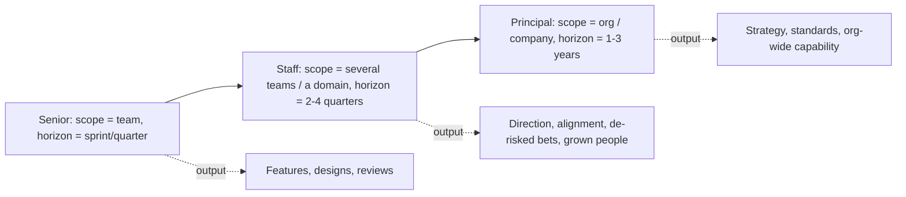

# Staff archetypes & operating at Staff+

!!! abstract "At a glance"
    **Priority:** P0 · **Complexity:** 2/5 · **Est. time:** 2 h · **Phase:** 1 · **Prereqs:** none (start here)
    **You're done when:** you have a one-page *Staff role charter* naming your archetype, your 2–3 "what matters" bets for the next two quarters, and a running brag doc with at least five entries.

## Why it matters

At Senior, your output is mostly *your* code and designs. At Staff+, your output is **the delta in what the organisation ships because you were there**. That shift is the single biggest reason strong seniors stall: they keep optimising personal throughput while the job has quietly become about leverage, direction and risk.

In 2026 two things make this sharper:

- **Coding agents compress the "hands" part of the job.** When an agent can draft a service in an afternoon, the scarce skill is deciding *what* to build, *how it should fit*, and *how to know it's right* (evals, reviews, guardrails). That is Staff work.
- **AI architect roles are Staff roles in disguise.** "AI architect" at a large enterprise means aligning platform, security, data, legal and five product teams around a shared agent platform. The technical content is agentic AI; the job mechanics are Staff mechanics.

In interviews, Staff loops test this explicitly: "Tell me about a time you changed the direction of a team you didn't manage." If your stories are all "I built X", you'll be levelled Senior.

## Core concepts

### The four archetypes (Larson)

Will Larson's *Staff Engineer* book popularised four archetypes. They are descriptions, not boxes — most people blend two, and the mix shifts by company size.

| Archetype | Core loop | Typical at | Signals you're doing it well | Failure mode |
|---|---|---|---|---|
| **Tech Lead** | Guides execution of one team/area; partners with an EM; scopes, sequences, unblocks | Every company | Team ships predictably; decisions get made without you in every meeting | Becomes the team's bottleneck / best IC doing all the hard tickets |
| **Architect** | Owns direction and quality of a critical domain across teams | Larger orgs (enterprise!) | Cross-team designs converge; fewer "surprise" integrations | Ivory tower: diagrams nobody implements |
| **Solver** | Parachutes into the gnarliest problem, fixes it, moves on | Orgs with recurring fires | Named hard problems disappear | Leaves no ownership behind; bored by follow-through |
| **Right Hand** | Extends an exec's attention; runs org-level initiatives | Large orgs, VP/CTO level | Exec delegates whole problem spaces to you | Proxy power; loses technical credibility |

**Where you'll likely sit:** in a global logistics enterprise moving into AI architecture, the natural blend is **Architect + Tech Lead** (own the agent-platform direction, lead the first team that builds on it), drifting towards **Right Hand** if the CTO org adopts you as the "AI person".

### What actually changes at Staff+



Key shifts, in the order people usually learn them the hard way:

1. **From tasks to problems to problem spaces.** Seniors get handed problems; Staff engineers *find* the problems worth solving and frame them so others can solve them.
2. **From being right to being effective.** A correct design that three teams ignore has zero value. Tanya Reilly's framing: the job has three pillars — **big-picture thinking, project execution, and levelling up others** — and all three are about outcomes through other people.
3. **From visible work to glue work.** Much Staff work (writing the doc nobody asked for, chasing the dependency, noticing the org-level risk) is invisible. Tanya Reilly's "Being Glue" talk is the canonical warning: glue work is essential, but if it isn't *named and credited*, it can stall your promotion. Make it visible deliberately.
4. **From calendar-as-default to calendar-as-strategy.** Your time is the scarcest resource you allocate. A useful budget: ~40% deep technical work (designs, prototypes, reviews, evals), ~30% alignment and communication, ~20% people (mentoring, sponsorship), ~10% slack for fires.

### Work on what matters

Larson's "Work on what matters" gives a practical filter. Prioritise:

- **Existential issues** — things that could sink the company/programme (e.g., an unowned data-residency risk in your AI rollout).
- **Work where attention is scarce but value is high** — "foster growth", "edit, don't write", finishing half-done migrations.
- **Avoid "snacking"** (easy, low-impact wins that feel productive) and **"preening"** (high-visibility, low-impact work that impresses execs but changes nothing).

### Getting and staying in the room

Staff influence depends on being present where decisions are made. Larson's guidance: you earn the room by being *useful in it* — concise, prepared, solving the exec's problem, not yours — and you keep it by being **aligned with authority** (disagreeing in private, committing in public, never surprising your leadership chain).

### Your operating system

| Mechanism | Cadence | Purpose |
|---|---|---|
| Brag doc (Julia Evans) | Weekly, 10 min | Evidence for promo/perf; also shows you where time really went |
| "What matters" list | Monthly | 3–5 bets you're pushing; kill one before adding one |
| Skip-level / manager sync | Bi-weekly | Stay aligned with authority; surface risks early |
| Writing slot | 2× 90 min / week | Design docs, strategy, memos — the Staff medium |
| Office hours | Weekly | Scalable mentoring; discover problems early |
| Agent-review slot (new) | Weekly | Review AI-generated PRs/eval dashboards for your domain; set conventions (AGENTS.md, review rules) |

### Senior-level nuance juniors miss

- **Title follows scope, not the reverse.** Most promotions to Staff happen after 6–12 months of already operating at Staff scope. Build the "Staff project" (a named, cross-team, business-relevant initiative) *before* the promo cycle.
- **Archetype must fit the company's need.** An Architect in a 40-person startup is often overhead; a Solver in a stable enterprise may have no problems big enough. Ask your manager: "Which archetype does this org need right now?"
- **Sponsorship matters more than mentorship for promotion.** Someone at Director+ must be willing to say your name in calibration.
- **The AI-era twist:** "10x output via agents" is not Staff impact. *Raising the floor* of how 50 engineers use agents safely is.

## Resources

| Resource | Type | Why this one | Level | Cost |
|---|---|---|---|---|
| [StaffEng — Staff archetypes](https://staffeng.com/guides/staff-archetypes/) | article | The canonical archetype definitions, free | intermediate | free |
| [Staff Engineer: Leadership beyond the management track (Larson)](https://staffeng.com/book) | book | Archetypes + 14 real Staff stories; best "what is the job" book | intermediate | paid |
| [The Staff Engineer's Path (Tanya Reilly)](https://www.oreilly.com/library/view/the-staff-engineers/9781098118723/) | book | Best book on *how* to do the job day to day: maps, execution, levelling up | advanced | paid |
| [Staff Engineer's Path resources (noidea.dog)](https://noidea.dog/staff-resources) :gem: | article | Tanya Reilly's curated companion links; excellent reading list | intermediate | free |
| [Being Glue (Tanya Reilly)](https://noidea.dog/glue) :gem: | video/article | Why invisible work stalls careers and how to make it count | intermediate | free |
| [Work on what matters (Larson)](https://lethain.com/work-on-what-matters/) :gem: | article | The prioritisation filter above, in 10 minutes | intermediate | free |
| [Thriving on the technical leadership path (Keavy McMinn)](https://keavy.com/work/thriving-on-the-technical-leadership-path/) :gem: | article | Practical, humane essay on sustaining a Staff+ career | intermediate | free |
| [Brag documents (Julia Evans)](https://jvns.ca/blog/brag-documents/) :gem: | article | The template for making your impact visible | intermediate | free |
| [The Software Engineer's Guidebook (Orosz)](https://www.engguidebook.com/) | book | Big-tech levelling expectations Senior → Staff → Principal | intermediate | paid |
| [Engineering Leadership (Gregor Ojstersek)](https://newsletter.eng-leadership.com/) :gem: | newsletter | Weekly, pragmatic Staff/EM leadership advice | intermediate | freemium |

## Hands-on lab

**Produce: your Staff role charter + brag doc (Staff artifact #1). 90 min.**

1. **Archetype self-assessment (20 min).** For each archetype, list the last 12 months of work that fits it. Score 1–5 on "energy" and "impact". Pick a primary + secondary.
2. **Org-need check (15 min).** Write three sentences answering: *What is my org's biggest technical risk in the next 12 months? Who owns it? What archetype would fix it?* (Likely answer in your context: "Uncoordinated AI/agent adoption across product teams; nobody owns the shared platform; Architect needed.")
3. **Write the charter (40 min)** using this skeleton:

    ```markdown
    # Staff role charter — Rahul Singh — v0.1 (2026-10)
    ## Archetype: Architect (primary), Tech Lead (secondary)
    ## Scope: Agent/LLM platform for <domain> — teams A, B, C
    ## What matters (next 2 quarters)
    1. Converge 3 ad-hoc LLM integrations onto one gateway + eval harness (outcome: 1 path, 1 dashboard)
    2. Ship first production agent use case with HITL (outcome: X hours/week saved, <Y% error)
    3. Grow 2 seniors to own components (outcome: they present at arch review)
    ## Not doing
    - Hand-writing features for team A; one-off vendor demos
    ## Time budget: 40 deep / 30 align / 20 people / 10 slack
    ## Stakeholders & cadence: <manager bi-weekly>, <director monthly>, <security monthly>
    ## How I'll know it's working (by Week 12)
    ```

4. **Start the brag doc (15 min):** five entries from the last quarter, each with *what, why it mattered, who benefited, evidence (link/metric)*.

**Expected output:** `docs/log/staff-charter.md` (private if you prefer) + brag doc. Review with your manager in your next 1:1 and ask: "Is this the Staff-shaped problem you'd want me on?"

## Questions

### L1 — Recall

??? question "Q1. Name Larson's four Staff archetypes and the core loop of each."
    ??? success "Answer"
        **Tech Lead** (guides one team's execution with an EM), **Architect** (owns direction and quality of a critical domain across teams), **Solver** (goes deep on the hardest problems, then moves on), **Right Hand** (extends an executive's reach across the org). Most people blend two; the needed mix depends on company size and current problems.

??? question "Q2. What are Tanya Reilly's three pillars of Staff engineering?"
    ??? success "Answer"
        **Big-picture thinking** (seeing beyond your team, time horizons, strategy), **project execution** (driving ambiguous, cross-team work to done), and **levelling up** others (mentoring, sponsoring, setting standards, being a role model). All three are about outcomes achieved through others, not personal output.

??? question "Q3. What is 'glue work' and why is it a career risk?"
    ??? success "Answer"
        Glue work is the non-promotable-looking but essential work that makes teams succeed: onboarding, unblocking, writing the missing doc, coordinating dependencies, noticing risks. It is a risk when it is done *instead of* visible technical work and not named as leadership — managers may conclude you're "not technical enough". The fix: do it deliberately, name it as a Staff-scope contribution, tie it to outcomes, and track it in your brag doc.

### L2 — Apply

??? question "Q4. Your manager says 'you're operating at Senior+, not Staff yet'. Give a concrete 90-day plan."
    ??? success "Answer"
        1. Ask for the gap in specifics: which Staff expectations (scope, ambiguity, influence) are missing, and one example of someone who meets them.
        2. Pick one **Staff project**: cross-team, tied to a business outcome, currently unowned (e.g., consolidating LLM integrations onto one gateway with evals).
        3. Write the design/strategy doc in weeks 1–3; get sign-off from 2+ team leads and your director.
        4. Delegate implementation to seniors you mentor; you own the sequencing, risks and communication.
        5. Monthly exec update; brag doc weekly.
        6. At day 90, review evidence with your manager against the Staff rubric and ask what's still missing.

??? question "Q5. Allocate a Staff engineer's 40-hour week on a team adopting coding agents. Justify."
    ??? success "Answer"
        Roughly: 14–16 h deep technical (designs, prototyping with the agents, reviewing agent-generated PRs for architectural drift, writing eval/test harnesses), 10–12 h alignment (design reviews, stakeholder syncs, writing), 7–8 h people (office hours, pairing on agent workflows, mentoring), 4 h slack. The justification: agents raise code volume, so review and conventions (AGENTS.md, repo rules, CI gates) are the leverage point; your hands-on time should go to *setting patterns* others and agents follow, not writing features.

??? question "Q6. You're asked to be the 'AI Architect' for a 600-engineer enterprise. Which archetype(s) does that map to and what's your first month?"
    ??? success "Answer"
        Primarily **Architect** (own direction of the AI/agent platform domain) with **Right Hand** elements (acting for the CTO on AI adoption). Month one: (1) inventory existing AI usage and spend (shadow integrations, vendors, data flows); (2) interview 10–15 stakeholders (product, security, legal, data, platform) to learn problems and constraints; (3) identify the top 2–3 risks (data leakage, duplicated platforms, no evals); (4) publish a short "current state + proposed first bets" memo; (5) agree success measures and cadence with your sponsor. Avoid designing the grand platform before you know the landscape.

### L3 — Design & trade-offs

??? question "Q7. Tech Lead vs Architect: you're offered both roles for the same agent platform. How do you choose?"
    ??? success "Answer"
        Decide on (a) **where the risk is**: if the risk is *execution* (one team, clear goal, tight deadline) — Tech Lead; if the risk is *divergence* (many teams building incompatible things) — Architect. (b) **Org need**: does an EM already provide strong delivery leadership? (c) **Your evidence gaps for promotion**: if you lack cross-team stories, Architect builds them. (d) **Energy**: Architect has slower feedback loops. A common compromise: Architect for the platform domain, but embed as Tech Lead with the first consuming team for one quarter to stay grounded and prove the design works.

??? question "Q8. Is 'I 10x'd my output with coding agents' a Staff-level impact story? Defend your answer."
    ??? success "Answer"
        Not by itself. Personal throughput is Senior-scope impact, and interviewers will probe whether quality, review load and maintainability held up. It becomes Staff-level when you **generalise** it: you designed the conventions, guardrails, evals and review process that let 40 engineers get safe gains; you measured outcomes (lead time, change-failure rate, incident rate), and you changed how the org works. Staff impact = the floor rose for many people, with evidence.

??? question "Q9. Your org values 'shipping' and doesn't reward glue work. What do you do?"
    ??? success "Answer"
        Don't stop doing necessary glue work, but (1) **reframe** it in outcome terms ("reduced cross-team integration defects by 40%" not "ran syncs"), (2) **make it visible** via written artifacts (docs, decision logs, updates) which count as output, (3) **delegate/rotate** repeatable glue (e.g., rotate release captain) so it grows others rather than consuming you, (4) **negotiate explicitly** with your manager that this work is part of your Staff expectations, and (5) balance it with at least one visibly technical contribution each quarter.

### L4 — Staff-level ambiguity

??? question "Q10. You join a new org as Staff with no defined project. Three directors each want you on their problem. What do you do in the first 60 days?"
    ??? success "Answer"
        Resist committing in week one. (1) Clarify who your actual sponsor/manager is and what *they* think the org's top risk is. (2) Spend 3–4 weeks listening: 1:1s with each director, their tech leads, and on-call/incident data. (3) Map the three problems on impact × urgency × "does it need Staff-level cross-team work?" × "is anyone else able to do it?". (4) Write a short options memo with your recommendation and what happens to the other two (who else can own them, or a smaller advisory role). (5) Get your manager to endorse the choice publicly, so the other directors hear the trade-off from leadership, not from you. Revisit in a quarter.

??? question "Q11. Your company's leadership believes AI will let them cut Staff engineers because 'agents can do architecture'. How do you respond, and what do you change about your own role?"
    ??? success "Answer"
        Engage on evidence, not defensiveness. Acknowledge what agents do well (drafting designs, exploring options, generating code and docs). Point to where value is concentrated: deciding what to build, cross-team alignment, accountability for risk (security, compliance, reliability), and verifying AI output — DORA's 2025 research frames AI as an *amplifier* of existing organisational strengths and weaknesses, so judgement and system quality matter more, not less. Then change your role: use agents aggressively for your own analysis and drafting, own the org's AI engineering standards and evals, and measure your impact in outcomes leadership cares about. The best defence is being the person who made AI adoption work.

??? question "Q12. (Behavioral) Tell me about a time you worked on something that wasn't your job but mattered to the organisation."
    ??? success "Answer"
        Structure (STAR, Staff-level): **S** — a cross-team gap nobody owned (e.g., no shared approach to LLM data handling; three teams sending customer data to different vendors). **T** — you decided it was worth your time because of the risk, and got your manager's agreement. **A** — inventoried usage, wrote a one-page risk memo, convened security/legal/team leads, proposed a minimal shared gateway + policy, secured a sponsor, handed ownership to a platform team. **R** — measurable: vendors reduced 3→1, all traffic logged, zero data incidents, pattern adopted by N teams. Close with what you learned (e.g., get a sponsor earlier). Emphasise *why* you chose it and how you made the work visible.

## Real-world use cases

- **Logistics enterprise, AI platform convergence:** an Architect-type Staff engineer notices booking, customs-docs and customer-service teams each built RAG prototypes with different vector stores and no evals. They frame the problem, get a VP sponsor, and lead convergence — classic Architect + Right Hand.
- **Tech Lead in a carrier-integration team:** partners with an EM to deliver EDI → API migration; success is measured in the team shipping without them in every decision.
- **Solver on a fragile planning engine:** a Staff engineer is dropped into a vessel-schedule optimiser with weekly incidents; stabilises, documents, hands to the team, moves on.
- **Right Hand to a CTO during an AI mandate:** runs the cross-org AI adoption programme, including vendor evaluations and policy, with delegated authority.

## Pitfalls & anti-patterns

- Being "the best senior" — taking the hardest tickets instead of making the team better.
- Declaring yourself an archetype the org doesn't need.
- Waiting for the title before doing the scope.
- Invisible glue work with no written trail.
- Preening: building flashy AI demos for execs that never reach production.
- Saying yes to everything; no written "not doing" list.
- Losing hands-on credibility entirely — in the AI era, you must personally use and review agent workflows to lead them.

## Checklist

- [ ] I can explain the four archetypes and which blend I am, with evidence, without notes
- [ ] I wrote my Staff role charter and reviewed it with my manager
- [ ] My brag doc has ≥ 5 entries and a weekly reminder
- [ ] I have named one "Staff project" and a sponsor for it
- [ ] I answered all L3 questions out loud in < 3 min each
