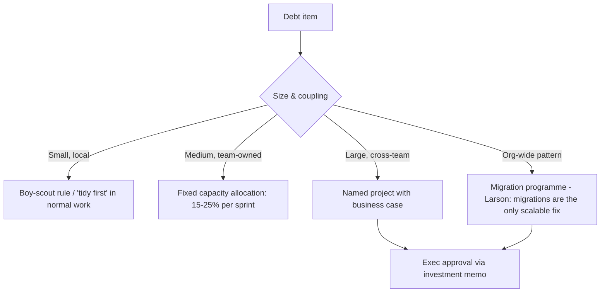

# Managing technical debt & quality

!!! abstract "At a glance"
    **Priority:** P0 · **Complexity:** 3/5 · **Est. time:** 2 h · **Phase:** 4 · **Prereqs:** [Legacy modernisation](../architecture/legacy-modernization.md), [Communicating with executives](communication-stakeholders.md)
    **You're done when:** you have a tech-debt register for one real system with ≥ 10 items scored by interest cost, plus a one-page investment case a director could approve.

## Why it matters

Every 15-year engineer knows debt exists. The Staff-level skill is different: **deciding which debt matters, quantifying it in business terms, and getting it funded** — while keeping delivery moving. "We need a refactoring quarter" almost never gets approved; "this reduces booking-incident MTTR by 40% and unblocks the EU launch" does.

AI changes the debt equation in both directions:

- **Faster debt creation:** coding agents generate large volumes of plausible code. Without conventions, review and tests, you accumulate duplicated logic, inconsistent patterns and untested edge cases faster than ever.
- **Cheaper debt repayment:** agents make migrations, test backfilling and mechanical refactors dramatically cheaper. Work that was "never worth it" (upgrading 200 services' logging library) may now be a sprint.
- **New debt categories:** prompt debt, eval debt (no regression suite), model-version pinning debt, and undocumented agent tool contracts.

## Core concepts

### What debt actually is

Ward Cunningham's metaphor: shipping imperfect code is like borrowing — fine if you pay it back; dangerous if interest compounds. The **interest** is the ongoing extra cost (slower changes, incidents, onboarding pain). The **principal** is the cost to fix.

**Fowler's Technical Debt Quadrant:**

| | Reckless | Prudent |
|---|---|---|
| **Deliberate** | "We don't have time for design" | "Ship now, deal with consequences — consciously" |
| **Inadvertent** | "What's layering?" | "Now we know how we should have done it" |

Prudent-deliberate debt is a legitimate business tool. Reckless debt is a quality problem, not a debt strategy.

### Not everything is debt

| Category | Example | Right response |
|---|---|---|
| Tech debt | Duplicated pricing logic in 3 services | Prioritise by interest |
| Missing capability | No multi-region support | Roadmap item, not debt |
| Obsolescence | Java 11 end of support, deprecated LLM API | Lifecycle management with a deadline |
| Operational toil | Manual cert rotation | SRE toil budget |
| Design mismatch | Architecture built for 10x less load | Strategy/re-architecture |

Calling everything "debt" makes it impossible to prioritise and sounds like engineers complaining.

### Prioritisation: interest × reach × risk

Score each item:

- **Interest (1–5):** how much it slows change or causes incidents *now* (use data: lead time on affected modules, incident count, on-call pages).
- **Reach (1–5):** how many teams/changes touch it per quarter.
- **Risk (1–5):** probability × impact of a bad event (security, compliance, outage).
- **Cost (S/M/L/XL):** principal to fix — re-estimate with agent-assisted refactoring in mind.

Priority ≈ (Interest × Reach + Risk) / Cost. Focus on **hotspots**: code with high churn *and* high complexity (Adam Tornhill's approach). Code that is ugly but never changes has low interest.

### Funding models



- **Tidy first (Kent Beck):** small structural improvements *before* the behaviour change that needs them. No permission required.
- **Capacity allocation:** a standing % of team capacity; simple, but can become a dumping ground. Tie it to measurable targets.
- **Named projects:** best for big items; need a business case.
- **Migrations:** Larson's point — at org scale, migrations are the only way debt actually gets paid. Run them well: de-risk with the hardest consumer first, make the new path easy (tooling, automation, agents), then drive the long tail with deadlines and dashboards.

### Managing technical quality (Larson's ladder)

Larson's "Manage technical quality" escalates interventions from cheap to expensive: fix hot spots → adopt best practices → prioritise leverage points (interfaces, data models) → align technical vectors (standards) → measure quality → create a quality team → run a quality programme. Don't start at the top.

### Investment case template

```markdown
# Investment: <name> — one page
**Ask:** 2 engineers × 1 quarter (≈ $X) · decision by <date>
**Problem (business terms):** Booking changes take 9 days median vs 3 elsewhere; 6 P1 incidents in 2 quarters traced to pricing duplication.
**Proposal:** Consolidate pricing logic into one service; agent-assisted migration of 3 callers; contract tests.
**Return:** lead time → ~4 days; incidents −50% (est.); unblocks EU surcharge feature (revenue impact $Y).
**Cost of not doing:** each new surcharge rule = 3 changes + 3 test cycles; audit risk on inconsistent pricing.
**Measures:** lead time, change-failure rate on pricing modules, incident count — reported monthly.
**Risks & mitigations:** migration regressions → shadow traffic + contract tests.
```

### AI-era debt and quality controls

| Risk | Control |
|---|---|
| Agent-generated duplication and drift | AGENTS.md / repo rules, lint + architecture fitness functions in CI, human review of structure |
| Untested generated code | Coverage/mutation gates on changed lines; agents write tests *first* |
| Prompt/eval debt | Prompts versioned in repo, eval suites as regression tests, model version pinned with upgrade plan |
| Review overload | Smaller PRs, agent pre-review, reviewers focus on design and risk |
| "Nobody understands this code" | Require design notes in PRs for non-trivial agent-generated modules |

Measure outcomes with DORA metrics (lead time, deploy frequency, change-failure rate, recovery time) rather than lines of code or AI acceptance rates.

### Senior-level nuance

- **Never pitch "refactoring". Pitch outcomes.** Speed, reliability, risk reduction, unblocked revenue.
- **Pair debt paydown with feature work** on the same area — cheapest context, easiest to justify.
- **Some debt should never be paid.** Systems being retired within 12 months get only safety fixes.
- **Track it where work lives** (issue tracker label + register), not in a forgotten wiki.
- **Quality is a system property**: CI speed, test reliability and review culture matter more than any single refactor.

## Resources

| Resource | Type | Why this one | Level | Cost |
|---|---|---|---|---|
| [Technical Debt Quadrant (Fowler)](https://martinfowler.com/bliki/TechnicalDebtQuadrant.html) | article | The vocabulary for deliberate vs reckless debt | intermediate | free |
| [Is High Quality Software Worth the Cost? (Fowler)](https://martinfowler.com/articles/is-quality-worth-cost.html) :gem: | article | The best argument to execs that quality speeds delivery | intermediate | free |
| [Manage technical quality (StaffEng)](https://staffeng.com/guides/manage-technical-quality/) | article | Larson's escalating ladder of quality interventions | advanced | free |
| [Migrations: the sole scalable fix to tech debt (Larson)](https://lethain.com/migrations/) :gem: | article | How to run migrations that actually finish | advanced | free |
| [Tidy First? (Kent Beck's newsletter)](https://tidyfirst.substack.com/) :gem: | newsletter | Small structural changes and the economics of software design | intermediate | freemium |
| [DORA](https://dora.dev/) | research | Outcome metrics to measure quality and speed | intermediate | free |
| [Refactoring (Luca Rossi)](https://refactoring.fm/) :gem: | newsletter | Clear, visual essays on tech debt and team quality practices | intermediate | freemium |
| [State of AI-assisted Software Development 2025 (DORA)](https://dora.dev/research/2025/dora-report/) | report | Evidence on how AI affects throughput and stability | advanced | free |

## Hands-on lab

**Produce: tech-debt register + investment case (Staff artifact #4). 90 min.**

1. Pick a real system you know well (or your capstone after 8+ weeks of building).
2. Pull evidence: `git log` churn per file for the last 6 months (`git log --since=6.months --name-only --format='' | sort | uniq -c | sort -rn | head -30`), incident list, slow-to-change areas, dependency/EOL list.
3. Create a register with ≥ 10 items: *id, description, category (debt/obsolescence/toil/…), interest, reach, risk, cost, owner, evidence link*.
4. Include at least two **AI-specific** items (unpinned model version, no eval regression suite, prompts in code strings, untested agent-generated module).
5. Pick the top item and write the one-page investment case using the template.
6. Estimate the cost twice: traditional vs agent-assisted. Note what still needs humans (design, review, rollout).

**Expected output:** `docs/log/tech-debt-register.md` (table) + `docs/log/investment-case-<item>.md`.

## Questions

### L1 — Recall

??? question "Q1. Explain Fowler's Technical Debt Quadrant."
    ??? success "Answer"
        Two axes: **deliberate vs inadvertent** and **reckless vs prudent**. Prudent-deliberate: conscious trade-off to ship now with a plan. Reckless-deliberate: skipping design because "no time". Reckless-inadvertent: not knowing better practices. Prudent-inadvertent: learning later how it should have been done. Only prudent-deliberate is a strategy; reckless debt is a quality/skills problem.

??? question "Q2. What is the 'interest' on technical debt, and how do you measure it?"
    ??? success "Answer"
        The ongoing extra cost of living with the debt: slower changes, more defects/incidents, onboarding time, toil. Measure via lead time for changes in affected modules, change-failure rate, incident and page counts, and churn × complexity hotspots. Code that never changes has near-zero interest regardless of how ugly it is.

??? question "Q3. Why does Larson argue migrations are the sole scalable fix to tech debt?"
    ??? success "Answer"
        At org scale, debt lives in patterns repeated across many systems (old libraries, frameworks, platforms). Local fixes don't move the needle; only coordinated migrations to a better platform/pattern retire the debt everywhere. The key is running migrations well: de-risk with hard cases first, make migration cheap with tooling, then drive completion — unfinished migrations *add* debt (two systems).

### L2 — Apply

??? question "Q4. Your team has a 20% debt allocation but nothing measurable improves. Fix it."
    ??? success "Answer"
        The allocation lacks targeting and measures. Build a register scored by interest/reach/risk; tie allocation to 2–3 named outcomes per quarter (e.g., "cut pricing module lead time from 9 to 5 days", "remove Java 11"); report progress monthly; stop spending it on pet refactors. Consider converting the top item into a named project with a business case if it's too big for sprint slices.

??? question "Q5. Coding agents have doubled PR volume; review queues and change-failure rate are rising. What do you change?"
    ??? success "Answer"
        Treat it as a quality-system problem. (1) Repo-level agent instructions (AGENTS.md) encoding architecture rules and conventions. (2) CI gates: tests on changed lines, lint/architecture fitness functions, security scans. (3) Smaller PRs; agents must include tests and a rationale. (4) Agent-assisted pre-review so humans focus on design and risk. (5) Measure DORA metrics and review time, not PR counts. (6) Classify AI-related incidents in postmortems to learn patterns.

??? question "Q6. Estimate the case for upgrading logging across 150 services now that agents can do mechanical refactors."
    ??? success "Answer"
        Old estimate: ~1 day per service × 150 = 150 eng-days, never funded. Agent-assisted: prepare a codemod/agent playbook + tests (5–10 days), agent runs per repo with human review (~1–2 h/service ≈ 20–35 days), plus rollout and verification. Total maybe 30–45 eng-days — a 3–5x reduction. Pair with the benefit (trace correlation → faster incident resolution; OTel standardisation). The bottleneck shifts to review capacity and rollout risk, so batch by criticality and use canaries.

### L3 — Design & trade-offs

??? question "Q7. Rewrite vs incremental refactor (strangler fig) for a 12-year-old booking monolith — decide and defend."
    ??? success "Answer"
        Default to **incremental strangler fig**: carve seams by domain (DDD bounded contexts), route new capabilities to new services, migrate slices with shadow traffic and contract tests, keep delivering features. Big-bang rewrites fail because the old system keeps moving, hidden behaviour is lost, and value arrives only at the end. A rewrite is justified only for small, well-understood systems or when the platform is truly end-of-life with no seams. Agents make strangler slices cheaper (test characterisation, code translation) but don't remove the need for incremental risk reduction.

??? question "Q8. Capacity allocation vs named debt projects — trade-offs?"
    ??? success "Answer"
        Allocation: steady, low overhead, team autonomy; but diffuse impact, easily raided by feature pressure, hard to justify to execs. Named projects: clear outcome, visible, fundable, but require business cases and compete with features. Use both: allocation for small, local improvements (tidy first, toil), named projects for high-interest, cross-cutting items with measurable outcomes.

??? question "Q9. What new kinds of debt do LLM-based systems introduce, and how do you govern them?"
    ??? success "Answer"
        Prompt debt (unversioned prompt strings scattered in code), eval debt (no regression suite, so model upgrades are risky), model-lifecycle debt (pinned model versions nearing deprecation), tool contract debt (undocumented agent tools/MCP schemas), and data debt (stale RAG indexes). Govern with: prompts as versioned artifacts, eval suites in CI, model lifecycle register with deprecation dates, schema-versioned tool contracts, index freshness SLOs, and debt items in the same register as code debt.

### L4 — Staff-level ambiguity

??? question "Q10. Leadership says 'no debt work this year, only features'. The platform is degrading. What do you do?"
    ??? success "Answer"
        Don't fight the framing — translate. Show how debt is already slowing features: lead-time trends, incident costs, specific features delayed. Propose bundling debt work into feature delivery ("to ship EU surcharges, we consolidate pricing first; net faster by Q2"). Identify one high-risk item (security/EOL/compliance) with a hard deadline that leadership must accept. Make risk acceptance explicit and signed by the accountable exec. Meanwhile, use tidy-first in normal work. Report monthly on the leading indicators.

??? question "Q11. Four teams each own part of a shared, degraded integration layer and none will prioritise fixing it. How do you drive resolution?"
    ??? success "Answer"
        It's a tragedy of the commons; fix ownership first. Quantify shared cost (incidents, delays per team). Propose an ownership model (one owning team with others contributing, or a platform team) through architecture review with a sponsor. Fund it as a named project with contributions from each team's capacity. Define the target architecture and migration path; start with the highest-interest seam. Track on a shared dashboard; celebrate milestones.

??? question "Q12. (Behavioral) Tell me about a time you got leadership to invest in reducing technical debt."
    ??? success "Answer"
        Show translation to business outcomes: the evidence you gathered (incidents, lead times), the one-page case, the sponsor, how you phased it to keep delivering features, and results (lead time down X%, incidents down Y). Mention what you'd do differently (e.g., baseline metrics earlier). Avoid stories that sound like "I convinced them to let us refactor for its own sake".

## Real-world use cases

- **Pricing/surcharge logic duplicated across booking channels** — consolidation justified by incidents and a blocked regulatory change.
- **EDI adapter sprawl** — migration programme to a shared integration platform with automated adapter generation.
- **Model deprecation** — a provider retires an API version (e.g., Azure's Assistants API retirement in Aug 2026); teams without an abstraction and eval suite scramble.
- **Agent-assisted Java upgrade** — dozens of Spring services moved to a current LTS with agent-run codemods plus human review.

## Pitfalls & anti-patterns

- Pitching "refactoring" instead of outcomes.
- Everything labelled debt; no prioritisation.
- Fixing ugly-but-stable code instead of hotspots.
- Starting migrations and never finishing (two systems forever).
- Measuring AI productivity by PR count while quality drops.
- Debt register in a wiki nobody opens.
- Big-bang rewrites.

## Checklist

- [ ] I can explain the debt quadrant, interest, and the funding models without notes
- [ ] I built a scored tech-debt register with ≥ 10 items including AI-specific ones
- [ ] I wrote a one-page investment case in business terms
- [ ] I answered all L3 questions out loud in < 3 min each
