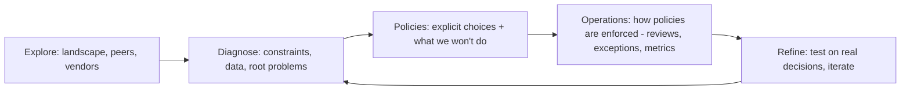

# Writing engineering strategy & vision

!!! abstract "At a glance"
    **Priority:** P0 · **Complexity:** 4/5 · **Est. time:** 3 h · **Phase:** 4 · **Prereqs:** [Design docs & RFCs](design-docs-rfcs.md), [Influence without authority](influence-without-authority.md), [Architect role & trade-offs](../architecture/architect-role-tradeoffs.md)
    **You're done when:** you've written a 3–5 page engineering strategy (diagnosis → guiding policies → coherent actions) for an enterprise agent platform, and at least two people have tried to poke holes in it.

## Why it matters

Strategy is where Staff and Principal engineers create the most leverage: one good strategy doc can prevent a hundred bad local decisions. It's also the most commonly faked artifact — slide decks full of goals ("be AI-first", "modernise the platform") with no diagnosis and no hard choices.

For an AI architect in 2026 this is the core deliverable. Every large enterprise is asking: *build vs buy the agent platform? Which model providers? Central platform or federated? How do we govern it?* The answers are strategies, and the people who write them well get pulled into the room.

Interviews: Principal/Staff loops increasingly include "walk me through a technical strategy you wrote" and "how would you set AI strategy for our engineering org?"

## Core concepts

### Strategy vs vision vs plan

| Artifact | Answers | Horizon | Shape | Failure mode |
|---|---|---|---|---|
| **Vision** | Where are we going and why is it good? | 2–3 years | Narrative, "a day in the life in 2028" | Fantasy with no path |
| **Strategy** | Given our situation, what will we do (and *not* do)? | 1–2 years | Diagnosis + policies + actions | Goals list with no trade-offs |
| **Roadmap/plan** | What happens when, by whom? | Quarters | Milestones, owners | Mistaken for strategy |
| **Standard / ADR** | How do we do X here? | Until revised | Rule + rationale | Written without the strategy that justifies it |

Visions pull; strategies constrain. You usually need a strategy first; write a vision when teams need a shared picture to align independent decisions.

### Rumelt's kernel (the non-negotiable structure)

From Richard Rumelt's *Good Strategy / Bad Strategy*, adopted by Larson for engineering:

1. **Diagnosis** — an honest, specific description of the challenge. Most of the value is here.
2. **Guiding policies** — the approach you'll take; each one *rules things out*.
3. **Coherent actions** — concrete steps that implement the policies and reinforce each other.

**Bad strategy tells:** fluff ("leverage synergies"), no diagnosis, goals masquerading as strategy ("99.99% uptime"), and a laundry list of 15 unrelated initiatives.

### How strategies actually get written: "write five, then synthesize"

Larson's advice is that good engineering strategy is *boring*: write five design docs (real decisions), then look for the patterns — those patterns are your strategy. Strategy grounded in real decisions is credible; strategy written top-down from nothing is fiction.



Larson's later framework (*Crafting Engineering Strategy*, 2025) splits it into **explore → diagnose → refine → policy → operations**, emphasising *strategy testing* (try the strategy on a few real decisions before rolling out broadly — avoid "waterfall strategy") and **operations** (how policies are actually enforced: review mechanisms, exception process, metrics).

### Strategy doc skeleton (use this)

```markdown
# <Name> Engineering Strategy — v0.3 — owner — status: draft/approved
## 1. Summary (5 sentences: problem, key choices, what changes, ask)
## 2. Context & scope
   - In scope / out of scope; which orgs; time horizon (e.g., FY27)
## 3. Diagnosis
   - Current state with evidence (numbers, incidents, spend, survey data)
   - Root causes (not symptoms); constraints (regulatory, skills, contracts)
   - What happens if we do nothing
## 4. Guiding policies (5–8, each an explicit trade-off)
   - P1: "We will <do X> rather than <Y>, because <diagnosis item>"
## 5. Coherent actions (next 2-3 quarters; owners; sequencing)
## 6. Operating the strategy
   - How decisions are checked against it (arch review, ADR tags)
   - Exception process (who can approve deviations, how logged)
   - Metrics & review cadence (quarterly refresh)
## 7. Alternatives considered & why rejected
## 8. Risks, open questions, assumptions to test
## Appendix: data, interviews, vendor analysis
```

### Worked example: enterprise agent platform strategy (abridged)

**Diagnosis:** Seven product teams in a logistics company run LLM features on three providers via direct API keys. No shared eval, no central logging; two incidents in Q2 where customer booking data was sent to a non-approved endpoint. Monthly LLM spend grew 4x in two quarters with no attribution. Teams are blocked on security reviews for 6–8 weeks per use case. Skills: strong Java/Spring core, a small Python ML group.

**Guiding policies:**

- **P1 — One paved road, not a mandate by decree.** All LLM calls go through a shared gateway (routing, logging, PII redaction, cost attribution); teams keep their framework choice above the gateway. *Rules out:* direct provider keys in services.
- **P2 — Buy the commodity, build the differentiator.** Use managed model hosting and a managed agent runtime where it meets residency needs; build only domain tools (MCP servers for bookings, tracking, customs) and evals. *Rules out:* self-hosting frontier-class models in FY27.
- **P3 — No production without evals.** Every use case ships with an offline eval set and online monitoring owned by the product team. *Rules out:* "vibe-checked" launches.
- **P4 — Pre-approved patterns shorten security review.** Security signs off on 3 reference architectures (RAG over internal docs, read-only tool agent, HITL write agent); conforming use cases get a 1-week review.
- **P5 — Polyglot by design.** Java/Spring AI for transactional services, Python for agent orchestration and evals, joined at the gateway and MCP boundary.

**Coherent actions (Q1–Q2):** stand up gateway (platform team), migrate 3 highest-spend services, publish eval harness + template, approve reference architectures with security, cost dashboard per team, quarterly strategy review.

Notice every policy ties back to a diagnosis item, and the actions reinforce each other (gateway enables cost attribution *and* logging for evals *and* faster security review).

### Senior-level nuance

- **Strategy is mostly diagnosis and deletion.** If your doc has no "we will not", it isn't a strategy.
- **Pre-wire before publishing.** Share drafts 1:1 with the most affected leaders; no one should be surprised in the review meeting. (See [Influence without authority](influence-without-authority.md).)
- **Authority matters.** A strategy only binds if someone with authority endorses it. Staff engineers write; a VP/CTO sponsors. Know who your sponsor is before you write page one.
- **Right-size it.** A team-level strategy can be 2 pages. An org strategy rarely needs more than 6 plus appendices.
- **Date-stamp assumptions** in fast-moving AI: "as of Sept 2026, managed agent runtimes on our cloud meet EU residency" — then schedule a re-check.
- **Wardley mapping** helps with build-vs-buy by showing which components are commodity vs genesis. Use it in exploration, not as the deliverable.

## Resources

| Resource | Type | Why this one | Level | Cost |
|---|---|---|---|---|
| [Writing an engineering strategy (Larson)](https://lethain.com/eng-strategies/) | article | The most practical free guide; structure + examples | advanced | free |
| [Write five, then synthesize: good engineering strategy is boring (Larson)](https://lethain.com/good-engineering-strategy-is-boring/) :gem: | article | The bottom-up method that makes strategy credible | advanced | free |
| [Crafting Engineering Strategy (Larson)](https://lethain.com/crafting-engineering-strategy/) | book | Full framework with many worked strategies (2025) | advanced | paid |
| [Strategy testing (Larson)](https://lethain.com/testing-strategy-iterative-refinement/) :gem: | article | How to avoid waterfall strategy | advanced | free |
| [StaffEng — Writing engineering strategy](https://staffeng.com/guides/engineering-strategy/) | article | Concise version tied to the Staff role | intermediate | free |
| [Refining strategy with Wardley Mapping (Larson)](https://lethain.com/wardley-mapping/) :gem: | article | Wardley maps applied to an engineering decision | advanced | free |
| [The Architect Elevator (Gregor Hohpe)](https://architectelevator.com/) :gem: | blog/book | Connecting the engine room to the penthouse; enterprise strategy | advanced | free/paid |
| [The Staff Engineer's Path (Tanya Reilly)](https://www.oreilly.com/library/view/the-staff-engineers/9781098118723/) | book | Chapter on vision and strategy docs, with templates | advanced | paid |
| Good Strategy / Bad Strategy (Richard Rumelt) | book | The origin of the kernel; read ch. 1–5 | advanced | paid |

## Hands-on lab

**Produce: "Agent Platform Engineering Strategy v0.3" (Staff artifact #6). 2–3 h across a week.**

1. **Explore (30 min):** list 5 real decisions your org (or your capstone) has made or faces about LLMs/agents — e.g., which gateway, where evals live, framework choice, data residency, build vs buy for agent runtime. Write two sentences on each.
2. **Diagnose (45 min):** write the diagnosis section with at least 4 pieces of evidence (spend, incidents, lead time for security review, number of duplicated stacks). Use estimates if you must, labelled as such.
3. **Policies (30 min):** 5–7 guiding policies, each in the form "We will X rather than Y because Z". Delete any policy that doesn't rule something out.
4. **Actions + operations (30 min):** 6–10 actions with owners and quarter; describe how compliance is checked (arch review checklist item, ADR tag) and the exception path.
5. **Test it (30 min):** apply the policies to two of the five decisions. Do they give a clear answer? If not, sharpen.
6. **Red-team:** ask an LLM to argue as a sceptical security lead and as a product director with a deadline. Then ask one real human.

**Expected output:** a 3–5 page doc in `docs/log/` (or your capstone repo) using the skeleton above, plus a list of open questions.

## Questions

### L1 — Recall

??? question "Q1. What are the three parts of Rumelt's strategy kernel?"
    ??? success "Answer"
        **Diagnosis** (what's really going on and why it's hard), **guiding policy** (the overall approach, which rules options out), **coherent actions** (coordinated steps that carry out the policy). Most bad strategies skip the diagnosis or substitute goals for policies.

??? question "Q2. Distinguish engineering vision from engineering strategy."
    ??? success "Answer"
        A **vision** describes a desirable future state (2–3 years) to align independent decisions — it pulls. A **strategy** addresses a specific challenge with explicit choices and trade-offs for the next 1–2 years — it constrains. Visions without strategies are wishful; strategies without visions can feel like a list of restrictions. Typically, write strategies first; write a vision when many teams need a shared picture.

??? question "Q3. What does 'write five, then synthesize' mean?"
    ??? success "Answer"
        Larson's method: write (or collect) around five design docs on real decisions in your area, then extract the recurring patterns and trade-offs into a strategy. It keeps strategy grounded in reality and makes it credible because it describes how good decisions are already being made.

### L2 — Apply

??? question "Q4. Rewrite this 'strategy' so it's a real strategy: 'Our goal is to be AI-first, improve developer productivity by 30% and ensure responsible AI.'"
    ??? success "Answer"
        It's three goals, no diagnosis, no choices. Rewrite: **Diagnosis:** "Engineers use 4 unapproved coding assistants; code review time is up 35% since Q1; two secrets leaked via prompts; no measurement of outcomes." **Policies:** "We standardise on one approved coding agent with enterprise data controls rather than allowing any tool; we measure outcomes (lead time, change-failure rate, review time) rather than lines of code or acceptance rates; AI-generated changes follow the same review bar, with repo-level agent instructions and CI gates." **Actions:** procurement + SSO rollout by Q1, AGENTS.md in top 20 repos, secret scanning on prompts, DX/DORA baseline and quarterly review.

??? question "Q5. Your strategy needs a guiding policy on model providers. Draft it with the trade-off explicit."
    ??? success "Answer"
        "We will route all model access through our gateway and support **two** approved providers (one primary, one fallback) rather than a single provider or an open marketplace, because (a) a single provider is a concentration and pricing risk and has caused outages, (b) open choice fragments evals, security review and cost control. Adding a third provider requires an architecture review demonstrating a capability gap on our eval suite." This rules out teams integrating providers directly and sets the exception path.

??? question "Q6. How would you test a draft strategy before broad rollout?"
    ??? success "Answer"
        Pick 2–3 live decisions (e.g., team X wants a vector DB, team Y wants to call a new model) and apply the policies. Check: does the strategy give an unambiguous answer? Do affected teams find it reasonable? What exceptions arise? Run it for a few weeks with a small set of teams, log exceptions, then revise before announcing org-wide. This is Larson's "strategy testing" — avoid waterfall strategy.

### L3 — Design & trade-offs

??? question "Q7. Centralised AI platform team vs federated 'enablement + standards' model — which do you recommend for a 600-engineer enterprise, and why?"
    ??? success "Answer"
        Usually a **hybrid**: a small central platform team owns the thin, shared, risk-bearing layer (gateway, identity, logging, eval harness, reference MCP servers, policy) as a paved road; product teams own use cases, prompts, domain tools and their evals. Pure centralisation becomes a bottleneck and loses domain context; pure federation duplicates stacks and fails on security/cost. Decide based on diagnosis: if the main risk is data leakage and spend, centralise the gateway early; if the main risk is slow delivery, invest in enablement and templates. Use Team Topologies language: platform team + enabling team, product teams stream-aligned.

??? question "Q8. How do you handle a strategy that must hold while the AI landscape changes monthly?"
    ??? success "Answer"
        Separate **durable policies** (evals before prod, gateway-mediated access, HITL for writes, data classification rules) from **volatile choices** (specific model, framework, vendor). Put volatile choices behind interfaces (gateway, MCP, OTel conventions) and in an appendix with dates ("as of Sept 2026"). Schedule quarterly reviews and define triggers that force a re-look (e.g., a provider changes data terms, a new model beats ours on eval by >X% at lower cost). The strategy is a living doc with a changelog.

??? question "Q9. Your strategy's diagnosis is contested — a director says the incidents were 'one-offs'. How do you respond?"
    ??? success "Answer"
        Treat it as data, not opposition. Bring evidence (incident timelines, spend data, audit findings) and ask what evidence would change their mind. Separate facts from interpretation in the doc; add their view to "alternatives/risks" if it has merit. If disagreement remains on the diagnosis, you won't agree on policies — escalate to the sponsor with a clear framing: "We disagree on whether X is systemic; here's the data; decision needed." Pre-wiring 1:1 beats arguing in a big meeting.

### L4 — Staff-level ambiguity

??? question "Q10. The CTO asks you for 'our AI strategy' in 3 weeks. There is no budget allocated, no clear owner, and five teams are already mid-build. How do you approach it?"
    ??? success "Answer"
        (1) Clarify scope with the CTO: engineering AI (building AI features) vs AI for engineers (coding agents) vs both; decisions they want to make; constraints (budget, regulatory). (2) Week 1: rapid discovery — inventory the five builds, spend, vendors, incidents; 10 stakeholder interviews. (3) Week 2: draft diagnosis + 5–6 policies, pre-wire with each team lead and security; explicitly decide what to do with in-flight builds (grandfather with a migration path, not stop-the-world). (4) Week 3: present a short strategy with 2–3 options for org model/funding and a recommendation; ask for decisions (owner, budget, mandate). Be explicit that v1 will be refined after testing on real decisions. Deliver something useful on time rather than something complete late.

??? question "Q11. Two VPs sponsor competing strategies: one wants a single vendor's end-to-end agent platform; the other wants open-source frameworks on your own infrastructure. You're asked to recommend. How?"
    ??? success "Answer"
        Reframe from "vendor vs OSS" to the diagnosis: what capabilities matter (residency, integration with existing identity/data, eval/observability, time-to-value, skills, exit cost)? Build a weighted evaluation with both VPs agreeing on criteria *before* scoring. Run a time-boxed bake-off on one real use case with the same eval set. Likely outcome is layered: managed runtime/model hosting where commodity, open standards (MCP, OTel, A2A) at the seams to keep exit options, own your evals and domain tools. Present the trade-off transparently, with a reversibility analysis, and let the accountable exec decide; document it as an ADR.

??? question "Q12. (Behavioral) Tell me about a strategy you wrote that didn't land. What happened?"
    ??? success "Answer"
        Good answers show self-awareness: e.g., "I wrote a platform strategy top-down, presented it in a big review, and it was politely ignored. Root cause: no sponsor with authority, no pre-wiring, and policies that didn't connect to teams' pain." Then actions: rebuilt it bottom-up from real decisions, found a VP sponsor, piloted with two teams, added an exception process. Result: adopted by N teams, measurable outcome. Lesson: strategy is a social artifact — authority, pre-wiring and testing matter as much as the content.

## Real-world use cases

- **Logistics AI platform strategy:** diagnosis of duplicated RAG stacks and unmanaged spend → gateway paved road, eval policy, pre-approved reference architectures.
- **Mainframe/legacy modernisation strategy:** strangler-fig policy, "no new logic in the monolith", event-driven integration via Kafka — see [Legacy modernisation](../architecture/legacy-modernization.md).
- **Data residency strategy for a global company:** regional deployment policy, data classification tiers, which workloads may use which model regions.
- **Coding-agent adoption strategy:** one approved tool, outcome metrics, repo-level agent rules, security controls — see [Leading engineering in the AI era](ai-era-leadership.md).

## Pitfalls & anti-patterns

- Goals presented as strategy ("be AI-first").
- No diagnosis, or a diagnosis without evidence.
- Policies that don't rule anything out.
- 15 initiatives with no coherence.
- Writing alone for months, then a "big reveal".
- No sponsor with authority; no enforcement or exception mechanism.
- Hard-coding volatile vendor/model choices as permanent policy.
- Confusing a roadmap with a strategy.

## Checklist

- [ ] I can explain diagnosis / guiding policy / coherent actions with an example without notes
- [ ] I wrote a 3–5 page strategy using the skeleton, with ≥ 5 policies that each rule something out
- [ ] I tested the policies against 2 real decisions and revised
- [ ] I got critique from at least one sceptical reviewer
- [ ] I answered all L3 questions out loud in < 3 min each
