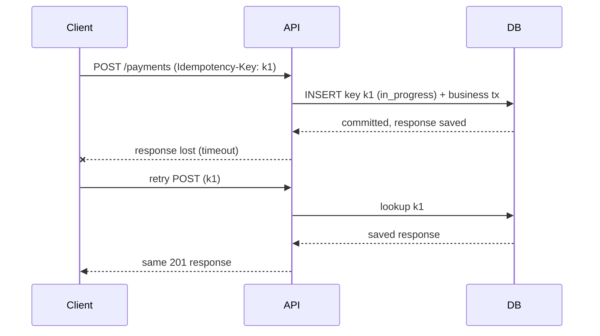

# API design: REST, gRPC, GraphQL, idempotency, pagination

!!! abstract "At a glance"
    **Priority:** P0 · **Complexity:** 2/5 · **Est. time:** 3 h · **Phase:** 1 · **Prereqs:** none
    **You're done when:** you can choose REST vs gRPC vs GraphQL per boundary, design idempotent writes with idempotency keys, choose cursor over offset pagination and explain why, define an error and versioning contract, and design APIs that LLM agents can call safely.

## Why it matters

APIs are the most durable design decision you make: schemas outlive the services behind them, and every client you don't control turns a change into a migration. Staff engineers are judged on API *contracts*: retry safety, evolvability, pagination that survives growth, error semantics that clients can act on, and consistent conventions across dozens of teams.

In 2026 the consumer set includes **LLM agents**. Agents retry, hallucinate parameters, call tools in loops and read your error messages as instructions. Idempotency, precise validation errors, small well-named operations and explicit side-effect semantics are no longer polish; they are the safety layer. Tool definitions for MCP and function calling are essentially API design with a probabilistic client (see [Tool calling](../agentic-ai/tool-calling.md)).

## Core concepts

### Choosing a style

| Style | Strengths | Weaknesses | Use for |
|---|---|---|---|
| **REST/JSON over HTTP** | Ubiquitous, cacheable (GET), tooling, easy debugging, browser-native | Over/under-fetching, weak typing unless OpenAPI, chatty for graphs | Public and partner APIs, CRUD-shaped resources |
| **gRPC (HTTP/2 + protobuf)** | Compact, fast, strong contracts, streaming (server/client/bidi), codegen, deadlines propagate | Poor browser support (needs gRPC-Web), harder to debug, needs L7/client LB | Internal service-to-service, low-latency, streaming |
| **GraphQL** | Client picks fields, one round trip for graph data, typed schema, good for many UI clients | Caching harder, N+1 resolver traps, query cost/DoS control, authz per field, complexity | BFF for product UIs with varied clients |
| **Async / events** | Decoupled, replayable | Eventually consistent, harder to reason | Facts and long-running work ([Messaging](messaging-streaming.md)) |
| **Webhooks** | Push notifications to partners | Retry/verification/ordering burden | Integrations; sign payloads, retry with backoff, provide event IDs |

Default: REST/OpenAPI for external, gRPC for internal hot paths, GraphQL only as a BFF over internal services when UI variety justifies it. Do not expose an ORM-shaped GraphQL schema as a public API.

### Resource modelling and naming (Google AIP / Microsoft guidelines)

- Nouns for resources, standard methods (List, Get, Create, Update, Delete) and custom verbs only when needed (`:cancel`, `:retry`).
- Consistent naming, casing, timestamps (RFC 3339 UTC), money as integer minor units + currency, IDs as opaque strings.
- **PATCH** with field masks / merge semantics rather than PUT of entire objects when clients hold partial views.
- Long-running operations: return `202 Accepted` with an operation resource (`/operations/{id}`) clients can poll or subscribe to; do not hold connections for minutes.
- Bulk operations: explicit batch endpoints with partial-success semantics documented.

### Idempotency

Networks fail after the server acted and before the client heard. Clients retry. Therefore **every non-idempotent write needs an idempotency contract**.

- `GET`, `PUT`, `DELETE` are idempotent by definition; `POST` is not. Make POST safe with an **`Idempotency-Key`** header (IETF draft `draft-ietf-httpapi-idempotency-key-header`; popularised by Stripe).
- Server flow: on first request, atomically record `(key, request fingerprint, status=in_progress)`; execute; store the response; on repeat with same key return the stored response; on same key with a **different payload** return 422; on concurrent in-flight duplicate return 409 or wait. Store keys 24 h+ (Stripe: 24 h).
- Do the key insert and the business write **in the same transaction** where possible; otherwise you get "charged but no record". Brandur's "Implementing Stripe-like idempotency keys in Postgres" details recovery points.
- Scope keys per client/tenant to avoid collisions and information leaks.

### Pagination

| Approach | Mechanics | Problems |
|---|---|---|
| **Offset/limit** | `OFFSET 10000 LIMIT 50` | O(offset) scan cost; duplicates/skips when data changes between pages; unbounded deep pages |
| **Cursor/keyset** | `WHERE (created_at, id) < (:c, :i) ORDER BY created_at DESC, id DESC LIMIT 50` | No random page jumps; requires stable unique sort key |
| **Page token (opaque)** | Server encodes cursor state | Best contract: lets you change the implementation |

Use **opaque cursor tokens** with keyset queries; cap page size; include `next_page_token`; document sort stability. Slack's engineering post covers migrating to cursors. Total counts are expensive on large tables; offer approximate counts or omit.

### Errors, versioning, evolution

- Use standard HTTP status codes plus a structured body (RFC 9457 Problem Details): stable machine-readable `type`/`code`, human `detail`, field-level errors, `retry_after`. Distinguish **retryable** (429, 503, 504, some 409) from **non-retryable** (400, 401, 403, 404, 422).
- **Rate limit headers** (`RateLimit`, `Retry-After`): see [Rate limiting](rate-limiting.md).
- **Evolution over versioning:** additive changes only (new optional fields, new endpoints); never repurpose a field; tolerate unknown fields (tolerant reader); deprecate with `Sunset` headers and telemetry on who still uses old shapes. Version (URL/header) only for breaking changes, and cap the number of live versions. Deeper: [API contracts, versioning & schema evolution](../architecture/api-contracts-versioning.md).
- gRPC/protobuf: never reuse field numbers, reserve removed ones, use `optional` deliberately, prefer enums with an `UNSPECIFIED = 0` default.

### Performance and reliability on the wire

- Timeouts and **deadline propagation** (gRPC deadlines; pass remaining budget downstream).
- Compression, HTTP/2 or HTTP/3 multiplexing, conditional requests (`ETag`/`If-None-Match`) for caching.
- Streaming for large results or long generations: SSE for one-way server push (LLM tokens), WebSocket/gRPC bidi for interactive sessions.
- **Authentication and authorization on every endpoint**, including object-level authorization (BOLA/IDOR is OWASP API #1). See [Security](security-authn-authz.md).

### APIs for LLMs and agents

- **Small, single-purpose, well-named operations** with descriptions that state *when to use* and *side effects*; return concise, structured results (agents pay per token; return only needed fields, support field selection or summaries).
- **Idempotent and conditional** side-effecting tools (`Idempotency-Key`, `If-Match`). Agents will retry.
- **Errors as guidance:** actionable messages ("`carrier_id` must be one of: …") let the model self-correct; but don't leak internals.
- **Confirmation for destructive/financial actions** (two-phase: `prepare` returns a preview + token; `commit` executes).
- Expose OpenAPI → MCP servers or function schemas; keep schemas tight (enums, min/max) since the model's output is validated by them.
- **Streaming LLM APIs:** SSE with event types, heartbeats, a final usage event, resumable via `Last-Event-ID` where feasible; report token usage for cost attribution.

## Resources

| Resource | Type | Why this one | Level | Cost |
|---|---|---|---|---|
| [Google API Improvement Proposals (AIP)](https://google.aip.dev/) :gem: | docs | Rigorous, consistent resource-oriented design rules incl. pagination, LROs, field masks | advanced | free |
| [Stripe — Designing robust and predictable APIs with idempotency](https://stripe.com/blog/idempotency) | article | The canonical explanation of idempotency keys | intermediate | free |
| [Brandur — Implementing Stripe-like idempotency keys in Postgres](https://brandur.org/idempotency-keys) :gem: | article | Concrete transactional implementation with recovery points | advanced | free |
| [Microsoft REST API Guidelines](https://github.com/microsoft/api-guidelines) | docs | Practical conventions incl. long-running operations, errors | intermediate | free |
| [Zalando RESTful API Guidelines](https://opensource.zalando.com/restful-api-guidelines/) | docs | Opinionated, checklist-style rules used at scale | intermediate | free |
| [Slack — Evolving API pagination](https://slack.engineering/evolving-api-pagination-at-slack/) | article | Real migration from offset to cursor pagination | intermediate | free |
| [IETF Idempotency-Key header draft](https://datatracker.ietf.org/doc/draft-ietf-httpapi-idempotency-key-header/) | docs | The emerging standard semantics | advanced | free |
| [gRPC docs](https://grpc.io/docs/) | docs | Deadlines, streaming, load-balancing guidance | intermediate | free |
| [GraphQL learn](https://graphql.org/learn/) | docs | Official concepts incl. schema design and best practices | intermediate | free |

## Hands-on lab

**Goal:** implement an idempotent, paginated payments-style API (90 min).

1. FastAPI + Postgres. `POST /transfers` requiring `Idempotency-Key`; table `idempotency_keys(key, tenant, request_hash, status, response_body, created_at)` with unique `(tenant,key)`.
2. Flow: insert key row in the same transaction as the transfer; on replay return stored response; on mismatched payload return 422; on concurrent duplicate (use `asyncio.gather` with 20 identical calls) exactly one executes.
3. `GET /transfers?page_size=&page_token=` keyset pagination on `(created_at, id)`; opaque base64 token; insert new rows between page fetches and verify no duplicates/skips (then show offset pagination failing).
4. Publish OpenAPI; generate an MCP/function-calling tool from it; have an LLM call it with retries and confirm no double transfer when you inject timeouts.
5. **Expected output:** 20 concurrent identical requests produce 1 transfer and 20 identical responses; keyset pagination is stable under inserts; offset is not.

## Questions

### L1 — Recall

??? question "Q1. Which HTTP methods are idempotent, and how do you make POST safe to retry?"
    ??? success "Answer"
        GET, HEAD, PUT, DELETE (and OPTIONS) are idempotent by definition (repeat gives the same server state). POST isn't. Make it retry-safe with a client-generated `Idempotency-Key` stored server-side with the request fingerprint and response; replays return the stored response, mismatched payloads are rejected.

??? question "Q2. Why is cursor pagination preferred over offset pagination?"
    ??? success "Answer"
        Offset costs O(offset) in most databases (scanning and discarding rows) and produces duplicates/skips when rows are inserted/deleted between page fetches. Keyset cursors seek directly via an index on the sort key and remain stable, at the cost of no random page access and a requirement for a unique, stable sort order.

??? question "Q3. What makes gRPC unsuitable as a default for public browser-facing APIs?"
    ??? success "Answer"
        Browsers can't use native gRPC (HTTP/2 trailers/framing); you need gRPC-Web with a proxy, losing bidirectional streaming. Binary protobuf is harder to debug and explore, third-party developers expect REST/JSON tooling, and HTTP caching/CDN behaviour is weaker. It excels internally.

??? question "Q4. Name two GraphQL-specific operational risks."
    ??? success "Answer"
        Unbounded query cost (deeply nested or wide queries as a DoS vector: need depth/complexity limits, persisted queries) and N+1 resolver fan-out to backends (need DataLoader batching). Also authorisation must be enforced per field/object, and HTTP-level caching is largely lost.

### L2 — Apply

??? question "Q5. Design the response semantics for a duplicate request whose first attempt is still in progress."
    ??? success "Answer"
        The key row exists in `in_progress` state. Options: return `409 Conflict` (with `Retry-After`) so the client retries shortly, or block briefly awaiting completion then return the stored response. Never execute again. If the first attempt crashed, a recovery mechanism (lock timeout with resumable steps, à la Brandur's recovery points) must finish or roll back the operation; otherwise the key is stuck forever. Return 422 if the payload hash differs.

??? question "Q6. An endpoint `GET /orders?offset=..` is timing out for customers with 2M orders. Fix without breaking clients."
    ??? success "Answer"
        Add keyset pagination as the new default with opaque `page_token`; keep `offset` working but cap it (e.g. reject offset > 10k with a 400 pointing to the cursor docs) and add a covering index on `(customer_id, created_at DESC, id)`. Announce deprecation with `Sunset`/`Deprecation` headers, monitor usage per client, and drop total counts (or make them approximate). Provide export endpoints/async jobs for full dumps.

??? question "Q7. Define the error contract for an LLM-callable `create_shipment` tool."
    ??? success "Answer"
        Structured errors with stable codes (`INVALID_ARGUMENT`, `NOT_FOUND`, `CONFLICT`, `RATE_LIMITED`, `FAILED_PRECONDITION`), field-level details with allowed values/format hints so the model can self-correct, a `retryable` boolean and `retry_after`, and no stack traces or internal IDs. Distinguish "you can fix by changing args" from "stop and ask the user". Idempotency-Key required; the response echoes it plus a resource ID so duplicates are detectable. Log tool-call args for audit.

### L3 — Design & trade-offs

??? question "Q8. REST vs GraphQL vs gRPC for a mobile app, a web app, and 30 internal microservices. Decide per boundary."
    ??? success "Answer"
        Internal service-to-service: gRPC (contracts, deadlines, streaming, efficiency), behind a mesh/L7 LB. Client-facing: a BFF per experience; GraphQL is justified if web and mobile need different shapes of the same graph and teams want to move independently, otherwise REST BFFs with tailored endpoints are simpler to cache and secure. Public/partner: REST + OpenAPI + webhooks. Avoid GraphQL directly over databases; enforce depth/cost limits, persisted queries, and per-field authorisation. Record the decision in an ADR with the client-variety evidence.

??? question "Q9. How would you design an API for long-running LLM agent tasks (minutes) consumed by web clients and other services?"
    ??? success "Answer"
        `POST /runs` with Idempotency-Key returns `202` + `run_id`. `GET /runs/{id}` for status/result (state machine: queued, running, waiting_for_input, succeeded, failed, cancelled). `GET /runs/{id}/events` as SSE with resumable event IDs for progress/tokens (or WebSocket/AG-UI for interactive UIs). `POST /runs/{id}:cancel` and `:resume` for human-in-the-loop input. Webhooks for service consumers with signed payloads and retries. Include cost/usage in the run resource, timeouts, and quotas. Back it with durable execution so runs survive worker crashes. See [Durable execution & HITL](../agentic-ai/durable-execution-hitl.md).

??? question "Q10. Webhooks vs polling vs streaming for partner notifications."
    ??? success "Answer"
        Polling: simplest for partners, wasteful, latency = interval; provide `updated_since`/ETag to make it cheap. Webhooks: push, efficient, but you own retries with backoff, ordering (include sequence/event IDs and timestamps; consumers must be idempotent), signature verification (HMAC), replay endpoint and delivery logs, and handling slow/broken receivers (circuit break and disable). Streaming (SSE/WebSocket/Kafka): lowest latency for sophisticated partners, more connection state. Offer webhooks + a polling/replay fallback (an events API with cursor) — the combination is robust.

### L4 — Staff-level ambiguity

??? question "Q11. 40 teams publish inconsistent APIs (naming, pagination, errors). How do you drive consistency without becoming a bottleneck?"
    ??? success "Answer"
        Build guidelines from the best existing practice (adopt AIP/Zalando as a base, adapt), keep them short with rationale and examples. Automate: OpenAPI linting (Spectral) in CI with a ruleset, breaking-change detection (oasdiff/buf), a shared error and pagination library. Governance via a lightweight review for new public APIs (office hours, async review) rather than approval gates for everything. Measure conformance and consumer-reported friction; fix the top 3 inconsistencies first; grandfather old APIs with a migration path when consumers exist. Staff impact is in the paved road (tools, templates) rather than policing.

??? question "Q12. A partner is integrating with your API through an LLM agent, and it double-submitted 200 orders during a retry storm. How do you respond technically and contractually?"
    ??? success "Answer"
        Immediately: identify duplicates via request fingerprints/timestamps, cancel/refund, and communicate. Technical: require Idempotency-Key on order creation (reject requests without), dedupe by natural business key within a window, add per-client rate limits and concurrency caps, return `429/503` with `Retry-After`, and expose a "get by client reference" lookup so clients can check before retrying. Contractual: update integration docs with retry guidance (exponential backoff with jitter, cap retries), add a test/sandbox harness partners can run, and set expectations for agent-based clients (confirmation for irreversible actions). Post-incident: add duplicate-detection alerting.

## Real-world use cases

- **Stripe:** idempotency keys, versioning by date-pinned API versions, expandable objects.
- **Google Cloud APIs:** AIP-driven resource models, LROs, page tokens across hundreds of services.
- **GitHub:** REST plus GraphQL; cursor pagination (Relay-style connections), rate limiting by cost in GraphQL.
- **Logistics booking APIs:** partner-facing REST with idempotent booking creation, webhooks for milestone events, cursor-paginated event history.
- **LLM providers:** SSE streaming with usage events, idempotent batch APIs, structured errors including rate-limit headers.

## Pitfalls & anti-patterns

- Offset pagination on large mutable collections.
- Idempotency keys stored outside the business transaction.
- Exposing database schemas as APIs; chatty CRUD that forces N calls.
- Breaking changes by repurposing fields; unbounded page sizes.
- 200 OK with error bodies; unstructured error strings.
- Agent tools that are large multi-purpose "do everything" endpoints.

## Checklist

- [ ] I can pick REST/gRPC/GraphQL/webhooks per boundary and justify it
- [ ] I implemented idempotency keys and keyset pagination
- [ ] I can define an error/versioning contract
- [ ] I can design tools/APIs safe for LLM agents
- [ ] I answered all L3 questions out loud in < 3 min each
