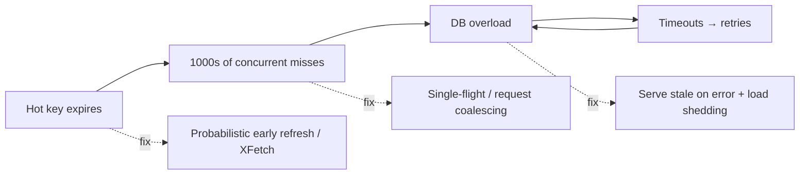
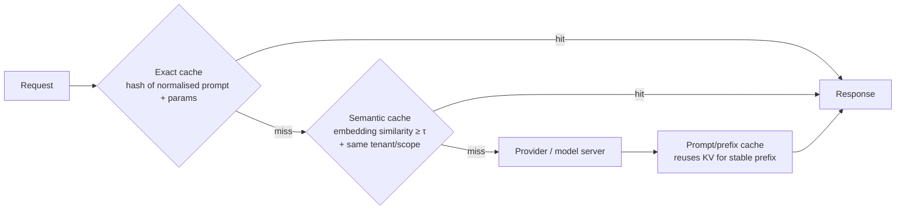

# Caching strategies

!!! abstract "At a glance"
    **Priority:** P0 · **Complexity:** 3/5 · **Est. time:** 4 h · **Phase:** 2 · **Prereqs:** [Scalability fundamentals](scalability-fundamentals.md), [Databases](databases-sql-nosql.md)
    **You're done when:** you can pick a caching pattern and invalidation strategy for any read path, prevent stampedes and hot keys, explain the "cache as load-bearing dependency" failure mode, and design an LLM caching stack (provider prompt caching, KV prefix caching, exact and semantic response caches).

## Why it matters

Caching is the highest-leverage and highest-risk optimisation in system design. It turns a 5 ms DB read into a 0.3 ms memory read and cuts DB load 10–100×. It also introduces **stale data, consistency bugs, stampedes and a new kind of outage**: when the cache fails or is flushed, the backing store — sized for the post-cache load — collapses. Staff engineers are judged on whether they treat the cache as an optimisation or as a load-bearing part of the system, and design accordingly.

For AI systems caching is now a primary cost lever: provider **prompt caching** can discount repeated input tokens heavily (often ~90% on cache reads, as of 2026 — provider-specific), **KV prefix caching** in vLLM/SGLang skips prefill, and **response caches** (exact or semantic) avoid calls entirely. But semantic caching has correctness risks that ordinary caches don't.

## Core concepts

### Where caches live

| Layer | Examples | Latency | Notes |
|---|---|---|---|
| Client / browser | HTTP cache, service worker | 0 | Controlled by `Cache-Control`, `ETag` |
| CDN / edge | Cloudflare, Fastly, CloudFront | 10–50 ms from user | See [Blob storage, CDN & edge](storage-cdn.md) |
| In-process | Caffeine, `functools.lru_cache`, Guava | ~100 ns | Fastest; N copies, inconsistent across pods |
| Distributed | Redis, Valkey, Memcached | 0.2–1 ms | Shared, network hop, separate failure domain |
| Database-internal | Buffer pool, query cache | — | Often enough if working set fits RAM |
| LLM provider | Prompt caching (prefix) | cuts TTFT and input cost | Prefix must be byte-identical; TTL minutes |
| LLM server | vLLM Automatic Prefix Caching, SGLang RadixAttention | skips prefill | Needs cache-aware routing |

### Read/write patterns

| Pattern | Read path | Write path | Pros | Cons |
|---|---|---|---|---|
| **Cache-aside (lazy)** | App reads cache; on miss reads DB and populates | App writes DB, then deletes cache key | Simple, resilient to cache loss, caches only hot data | First-read miss latency; race conditions if you *set* instead of *delete* |
| **Read-through** | Cache library loads from DB on miss | — | Encapsulated loading | Same staleness issues; library coupling |
| **Write-through** | — | Write cache and DB synchronously | Cache always fresh for written keys | Write latency; caches cold data |
| **Write-behind (write-back)** | — | Write cache; flush to DB async | Very fast writes, coalescing | Data loss on cache failure; ordering complexity |
| **Refresh-ahead** | Proactively refresh before TTL expiry | — | No miss latency for hot keys | Wasted refreshes for keys that go cold |

Default: **cache-aside with delete-on-write + TTL as a safety net**. Why delete rather than set? Two concurrent writers can interleave "write DB, set cache" so that the older value lands in cache last and stays forever. Delete + TTL bounds the damage. Even delete has a race (reader loads old value, writer deletes, reader sets old value); mitigations: short TTLs, versioned values (set only if version newer), or lease tokens (Facebook's memcache leases).

### Invalidation strategies

1. **TTL only** — simplest; bounded staleness = TTL. Add jitter (±10–20%) to avoid synchronised expiry.
2. **Explicit invalidation on write** — delete keys when data changes. Hard when one row feeds many cached views.
3. **Event-driven (CDC)** — tail the DB's change stream (Debezium, DynamoDB Streams) and invalidate; decouples writers from cache knowledge; handles writes from any source. Latency: sub-second typically.
4. **Versioned keys** — include a version or content hash in the key (`user:42:v17`); writes bump the version; old entries expire naturally. Great for CDN assets and prompts.

"There are only two hard things…" — the hard part is *dependency tracking*: which cached aggregates depend on which rows. Keep cached objects close to storage entities where possible, and cache computed aggregates with short TTLs.

### Failure modes and their fixes

- **Stampede / thundering herd / dog-piling:** hot key expires, many concurrent misses hit the DB. Fixes: **single-flight** (one loader per key, others wait), **locks/leases** in the distributed cache, **probabilistic early expiration** (XFetch: refresh with probability rising as TTL nears), **stale-while-revalidate**.
- **Hot keys:** one key gets 100k QPS on one Redis shard. Fixes: local in-process L1 cache with short TTL in front of Redis, key replication (`key#1..#N`, read a random suffix), read replicas.
- **Cache penetration:** requests for non-existent keys always miss. Fixes: cache negative results (short TTL), Bloom filter of existing keys.
- **Cold cache / cache as load-bearing:** after a flush, deploy, or failover, hit rate drops to 0 and the DB — sized for 5% of traffic — falls over. Fixes: size the DB (or a degraded mode) for cache-loss, warm caches before cutover, rate-limit misses to the DB, shed load, keep in-process L1 as a buffer. Brooker's essay "Caches, modes, and unstable systems" frames this as a *bimodal* system — the scariest kind.
- **Inconsistency across layers:** L1 in-process caches on 200 pods are each stale differently. Use very short L1 TTLs or pub/sub invalidation.

### Eviction and sizing

- LRU is default; **LFU/TinyLFU (W-TinyLFU in Caffeine)** resists scan pollution and has better hit rates for skewed workloads. Redis offers `allkeys-lru`, `allkeys-lfu`, `volatile-*`.
- Size by working set: with Zipfian access, caching the top 10–20% of keys often yields 80–95% hit rate. Measure with hit-rate-vs-size curves (miss ratio curves) rather than guess.
- **Hit rate is not the goal; backend load and latency are.** A 99% hit rate vs 98% halves DB load.

### Caching for LLM systems

- **Provider prompt caching:** Anthropic (explicit `cache_control` breakpoints), OpenAI (automatic for prompts over a threshold), Azure OpenAI and Gemini offer variants. Requirements: **stable prefix first** (system prompt, tool definitions, few-shot, long documents), variable parts last; byte-identical prefixes; TTL on the order of minutes (some providers offer longer TTLs at a price). Design prompts for cacheability — putting a timestamp at the top of the system prompt destroys the hit rate.
- **KV prefix caching (self-hosted):** vLLM Automatic Prefix Caching and SGLang RadixAttention reuse KV blocks for shared prefixes; requires cache-aware routing (see [Load balancing](load-balancing.md)).
- **Exact response cache:** key = hash(model, normalised prompt, params, tool versions, tenant). Safe when `temperature=0`-style determinism is acceptable and inputs repeat (FAQ bots, classification, embeddings — **always cache embeddings**).
- **Semantic cache:** embed the query, return a cached answer if similarity ≥ threshold. Risks: *"How do I cancel order 123?"* vs *"…order 124?"* are near-identical embeddings with different correct answers; tenant data leakage if the cache isn't scoped; stale answers after source documents change. Mitigate with tenant/user scoping, entity extraction in the key, conservative thresholds tuned on labelled pairs, TTLs tied to source-document versions, and evals measuring false-hit rate. Often better to semantic-cache *retrieval results* or *intermediate steps* than final answers.
- **Tool-result caching in agents:** cache idempotent tool calls (lookups, searches) within a run or across runs with TTL; never cache side-effecting calls.

## Resources

| Resource | Type | Why this one | Level | Cost |
|---|---|---|---|---|
| [Scaling Memcache at Facebook (NSDI '13)](https://www.usenix.org/conference/nsdi13/technical-sessions/presentation/nishtala) | paper | Leases, thundering herds, regional invalidation via MySQL replication — the canonical production caching paper | advanced | free |
| [Marc Brooker — Caches, modes, and unstable systems](https://brooker.co.za/blog/2021/08/27/caches.html) :gem: | article | The best explanation of why caches create dangerous bimodal behaviour | advanced | free |
| [AWS — Caching best practices](https://aws.amazon.com/caching/best-practices/) | article | Concise overview of patterns, TTLs, thundering herd | intermediate | free |
| [Hello Interview — Caching](https://www.hellointerview.com/learn/system-design/core-concepts/caching) | article | Interview-oriented framing of patterns and pitfalls | intermediate | free |
| [Optimal Probabilistic Cache Stampede Prevention (VLDB)](https://www.vldb.org/pvldb/vol8/p886-vattani.pdf) :gem: | paper | The XFetch algorithm; short and directly implementable | advanced | free |
| [Anthropic — Prompt caching](https://docs.claude.com/en/docs/build-with-claude/prompt-caching) | docs | How prefix caching, breakpoints, TTLs and pricing work for Claude | intermediate | free |
| [OpenAI — Prompt caching](https://platform.openai.com/docs/guides/prompt-caching) | docs | Automatic prefix caching behaviour and prompt structuring tips | intermediate | free |
| [vLLM — Automatic prefix caching design](https://docs.vllm.ai/en/latest/design/prefix_caching.html) | docs | How KV blocks are hashed and reused on self-hosted inference | advanced | free |
| [Redis docs](https://redis.io/docs/latest/) | docs | Eviction policies, data types, client-side caching | intermediate | free |
| [GPTCache](https://github.com/zilliztech/GPTCache) | docs | Reference semantic cache implementation — study its design, then decide if you need it | intermediate | free |

## Hands-on lab

**Goal:** build a cache-aside layer with stampede protection and an LLM response cache (90–120 min).

1. FastAPI + Postgres + Redis (docker-compose). Endpoint `GET /product/{id}` with cache-aside, delete-on-write, TTL 60 s ± jitter.
2. Simulate a stampede: set a hot key TTL to 5 s, hit it at 2,000 RPS with k6, and chart DB queries/s at expiry. Then add single-flight (per-key `asyncio.Lock` locally + Redis `SET NX PX` lock across pods) and XFetch early refresh. Compare DB QPS spikes.
3. LLM cache: wrap your LLM client (any provider or Ollama) with (a) exact cache on `sha256(model|prompt|params)` and (b) semantic cache with pgvector, scoped by tenant, threshold 0.95. Build a 40-pair labelled set of "same meaning" and "similar but different answer" queries; measure false-hit rate at thresholds 0.85/0.9/0.95.
4. Restructure a long system prompt so static content comes first and measure provider-reported cached tokens (e.g. `cache_read_input_tokens` / `cached_tokens` in usage).
5. **Expected output:** stampede DB spike drops from ~hundreds of queries to ~1 per expiry; semantic cache false-hit rate is non-trivial at 0.85 and drops at 0.95 (at the cost of hit rate); cached-token counts > 0 after restructuring.

## Questions

### L1 — Recall

??? question "Q1. Why delete the cache key on write rather than set the new value?"
    ??? success "Answer"
        With concurrent writers, "update DB then set cache" can interleave so that an older value is written to the cache after a newer one, leaving it stale until TTL (or forever without TTL). Deleting forces the next read to load from the source of truth. Delete still has a narrower race (a slow reader re-populating an old value) — mitigate with TTLs, versioned sets, or leases.

??? question "Q2. Define cache stampede, cache penetration and hot key."
    ??? success "Answer"
        Stampede: many concurrent misses for the same key (usually on expiry) overload the backend. Penetration: repeated lookups for keys that don't exist bypass the cache every time (often malicious). Hot key: a single key receives disproportionate traffic, overloading the shard/node that holds it.

??? question "Q3. What conditions must hold for provider prompt caching to hit?"
    ??? success "Answer"
        The request must share a byte-identical prefix with a recent request (tools, system prompt, messages in the same order), meet the provider's minimum cacheable length, hit within the cache TTL (minutes by default), and — for explicit-breakpoint APIs — mark cache breakpoints. Anything variable (timestamps, user names, request IDs) placed early in the prompt breaks the prefix.

??? question "Q4. Why is W-TinyLFU often better than LRU?"
    ??? success "Answer"
        LRU admits every accessed item, so one-off scans evict genuinely hot items. TinyLFU uses a compact frequency sketch to admit a new item only if it's likely more popular than the eviction victim, with a small LRU "window" for recency bursts. For skewed (Zipfian) workloads this yields higher hit rates at the same size.

### L2 — Apply

??? question "Q5. A product catalogue has 10M SKUs, 1 KB each, 50k RPS reads, Zipfian access. Size a Redis cache for ~95% hit rate."
    ??? success "Answer"
        Full dataset ≈ 10 GB plus Redis overhead (~1.5–2× for small values) → ~20 GB for everything, which is cheap enough to simply cache all of it. If budget-constrained, Zipfian access typically gives ~95% hits with the top ~10–20% of keys → ~2–4 GB. 50k RPS is within one Redis node's capability, but use a small cluster (3 shards + replicas) for headroom and availability, plus an in-process L1 for the very hottest SKUs. Validate with a miss-ratio curve from production key logs.

??? question "Q6. After a Redis failover the DB goes down every time. What's happening and what do you change?"
    ??? success "Answer"
        The new cache is cold (or was flushed), hit rate drops to near zero, and the DB — provisioned for the ~5% miss traffic — receives 20× load; timeouts cause retries, amplifying it. Changes: replicas with persistence so failover keeps data warm; request coalescing; rate-limit DB-bound misses and shed or serve stale on overload; keep an L1 in-process cache; capacity-plan the DB for a degraded-mode load; warm caches before routing traffic in cutovers; retry budgets. Treat "cache down" as a tested failure scenario.

??? question "Q7. Design the cache key for an exact-match LLM response cache in a multi-tenant assistant."
    ??? success "Answer"
        Key = hash(tenant_id, model + version, system prompt version, tool schema version, normalised user input, retrieved-context fingerprint (doc IDs + versions), generation params (temperature, max_tokens, response format)). Include the user or permission scope if answers depend on ACLs. TTL tied to data freshness; invalidate when source documents change (context fingerprint handles that). Only cache when outputs are acceptable to repeat (deterministic tasks), and log hits for audit.

### L3 — Design & trade-offs

??? question "Q8. Event-driven invalidation via CDC vs explicit invalidation in application code — choose for a system with 12 services writing to the same database."
    ??? success "Answer"
        With many writers (including batch jobs, admin tools, migrations), explicit invalidation will be missed somewhere. CDC (Debezium/logical replication → Kafka → invalidator) catches every committed change regardless of source, decouples writers from cache topology, and preserves commit order per key. Costs: extra infrastructure, sub-second lag (brief staleness), and mapping rows to affected cache keys for aggregates. Choose CDC plus TTL as a safety net; keep explicit invalidation only for read-your-writes paths where the writer needs immediate freshness (or have the writer bypass the cache for its own reads briefly).

??? question "Q9. Should you add a semantic cache in front of an internal HR policy assistant? Decide and defend."
    ??? success "Answer"
        Probably not at the final-answer level initially. HR answers depend on user attributes (country, grade, employment type) — two semantically identical questions from different users have different correct answers — and policies change. False hits are costly (wrong entitlements) and hard to detect. Better levers: provider prompt caching for the static prefix, exact caching of retrieval results per (query, user-segment, policy-version), and embeddings caching. If you do add a semantic cache, scope by user segment and policy version, use a strict threshold validated on labelled pairs, and monitor false-hit rate via sampled LLM-judge review. Decide with data from the eval set, not intuition.

??? question "Q10. Write-behind caching for a high-write counter (likes, views) — when is it appropriate and what are the failure modes?"
    ??? success "Answer"
        Appropriate when writes are frequent, individually low-value, commutative, and slight loss or delay is acceptable (view counts, likes). Increment in Redis (INCR), flush aggregated deltas to the DB periodically. Failure modes: data loss if the cache node dies before flush (mitigate with AOF persistence / replication, or log increments to Kafka as the durable record); double counting on flush retries (use idempotent flushes with delta IDs); ordering issues are irrelevant for commutative counters but matter for non-commutative data. Not appropriate for money, inventory, or anything requiring durability at acknowledge time.

### L4 — Staff-level ambiguity

??? question "Q11. Your org's LLM spend is growing 25% month-on-month. Every team built its own caching (or none). Propose an org-wide caching strategy."
    ??? success "Answer"
        (1) Measure first: per-team token spend, cacheable-prefix ratio, repeated-request rate, and provider-reported cached tokens. (2) Centralise the mechanical wins in the **LLM gateway**: exact response caching (opt-in per route), embeddings caching, usage/cache telemetry, and prompt-caching-friendly request normalisation. (3) Publish a **prompt structure guideline** (static-first, no volatile tokens early, stable tool ordering) with a lint/check in CI and a dashboard of cache hit rate per app. (4) Keep semantic caching opt-in with a required eval (false-hit rate on a labelled set) and tenant scoping enforced by the gateway. (5) Set targets (e.g. 50%+ cached input tokens for chat apps) and show savings per team. (6) Governance: caching must respect data residency and deletion requests (cached responses containing personal data need TTLs and purge paths). Expected impact: 30–60% input-cost reduction without model changes.

??? question "Q12. A critical service's p99 depends entirely on a 99.5% cache hit rate, and the DB cannot handle cache-miss load. The team says 'it's fine, Redis never goes down.' How do you handle this?"
    ??? success "Answer"
        Reframe as a risk with evidence: the system is bimodal — its capacity depends on cache state — and every cold-start, failover, bad deploy or key-schema change is a potential full outage. Quantify: miss load at 0% hit rate vs DB capacity; historical Redis incidents; time to rewarm. Propose options with costs: (a) capacity for degraded mode (bigger DB or read replicas absorbing miss load), (b) protective controls (coalescing, miss rate limiting, serve-stale, load shedding with prioritisation), (c) warm-standby cache with replication and pre-warming runbooks, (d) game-day testing "flush the cache in staging under load". Get agreement on an explicit SLO for degraded mode (e.g. "survive cache loss with 5× latency, no errors"). Record the decision in an ADR so the risk is owned, not implicit.

## Real-world use cases

- **Facebook memcache:** leases to prevent stale sets and thundering herds; regional "remote markers" for cross-region consistency.
- **E-commerce catalogue:** CDN for images, in-process L1 + Redis L2 for product JSON, CDC invalidation on price changes.
- **Logistics rate quotes:** freight rates cached per lane/date with short TTLs; tariffs versioned so quotes are reproducible for audit.
- **Enterprise RAG copilot:** prompt caching on system prompt + tools, embedding cache, retrieval-result cache keyed by document versions; semantic answer cache only for public FAQ content.

## Pitfalls & anti-patterns

- Caching without TTLs ("we'll invalidate correctly") — you won't, always.
- Set-on-write races; caching before the DB transaction commits.
- Treating the cache as optional while capacity-planning as if it's always warm.
- Synchronised expiries (no jitter) and no stampede protection.
- Unscoped semantic caches in multi-tenant systems — a data leak waiting to happen.
- Volatile content at the top of LLM prompts, destroying prompt-cache hits.
- Caching side-effecting tool calls in agents.

## Checklist

- [ ] I can explain cache-aside, write-through, write-behind and their races
- [ ] I can prevent stampede, penetration and hot-key problems
- [ ] I built the stampede lab and measured the improvement
- [ ] I can design a layered LLM caching strategy and name semantic-cache risks
- [ ] I answered all L3 questions out loud in < 3 min each
