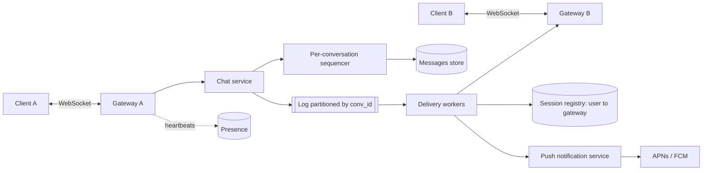

# Chat / messaging system

!!! abstract "At a glance"
    **Priority:** P0 · **Complexity:** 4/5 · **Est. time:** 3 h · **Phase:** 3 · **Prereqs:** [Messaging & streaming](../messaging-streaming.md), [Partitioning](../partitioning-sharding.md), [Load balancing](../load-balancing.md), [Consistency models](../consistency-models.md), [Reliability patterns](../reliability-patterns.md)
    **You're done when:** you can design delivery with per-conversation ordering and at-least-once + dedupe semantics, size the connection tier, and explain how group chats of 100 k members change fan-out.

Chat is hard because it combines **stateful long-lived connections**, **strict per-conversation ordering**, **offline delivery**, and **fan-out** — and users notice every lost, duplicated, or reordered message.

## Problem statement

Design WhatsApp/Slack/Discord-style messaging: 1:1 and group chats, online presence, delivery/read receipts, multi-device sync, offline delivery via push notifications, message history.

## Clarifying questions to ask

| Question | Why | Assumption |
|---|---|---|
| 1:1 only, small groups, or huge channels (Discord servers, Slack orgs)? | Fan-out model | 1:1 + groups up to 1 k; channels up to 100 k (read-mostly) |
| End-to-end encryption? | Server can't read/search content | E2EE for 1:1/small groups (WhatsApp-like); enterprise variant server-side encrypted + searchable |
| Multi-device? | Per-device cursors & key management | Yes, up to 5 devices |
| History retention? | Storage size | Forever (enterprise: retention policies) |
| Ordering guarantees? | Sequencing design | Total order per conversation; no global order |
| Scale? | Sizing | 500 M DAU, 40 msgs/user/day |

## Functional & non-functional requirements

**Functional:** send/receive messages (text, media refs); groups; delivery/read receipts; typing indicators; presence; history sync on new device; push notifications when offline; search (enterprise).

**Non-functional:** send→deliver p99 < 300 ms when both online (same region); no message loss after server ack; no visible duplicates; per-conversation ordering; 99.99% availability for send; horizontal scalability of connections.

## Back-of-envelope estimation

```text
Messages:   500 M DAU × 40 = 20 B/day ≈ 230 k/s avg → peak ×3 ≈ 700 k/s
Concurrent connections: ~30% of DAU online at peak ≈ 150 M WebSockets
Gateway sizing: a tuned box holds ~200–500 k idle connections (memory ~10–20 KB/conn incl. TLS)
                → 150 M / 250 k ≈ 600 gateway nodes (+30% headroom ≈ 800)
Storage:    20 B × ~200 B (payload + metadata) ≈ 4 TB/day ≈ 1.5 PB/yr (×3 replication ≈ 4.4 PB/yr)
Group fan-out: if avg recipients = 5 → 1.15 M deliveries/s avg, 3.5 M/s peak
Presence:   heartbeats every 30 s × 150 M = 5 M/s  → must NOT hit a DB; in-memory + coalesced
```

Presence and typing indicators are the silent killers: they generate more events than messages. Say so.

## API design

Transport: WebSocket (or MQTT on mobile) for real-time; HTTPS for history, media upload (pre-signed URLs to blob storage).

```text
Client → Server (WS frames)
  SEND   { client_msg_id: uuid, conv_id, body, sent_at_client }
  ACK    { conv_id, up_to_seq }            # delivery receipt / cursor advance
  READ   { conv_id, seq }
  TYPING { conv_id }
Server → Client
  SENT_ACK { client_msg_id, conv_id, seq, server_ts }   # durable
  MSG      { conv_id, seq, sender, body, server_ts }
  RECEIPT  { conv_id, user_id, delivered_seq, read_seq }

HTTP
  GET /v1/conversations/{id}/messages?before_seq=&limit=50
  GET /v1/sync?since=<device_cursor>        # catch-up after reconnect
```

`client_msg_id` gives idempotent sends across reconnects; `seq` is the per-conversation monotonically increasing sequence assigned by the server.

## Data model

| Table | Partition key | Clustering | Notes |
|---|---|---|---|
| `messages` | `(conv_id, bucket)` | `seq DESC` | bucket = time window (e.g. 10 days) to bound partition size — Discord's approach |
| `conversations` | `conv_id` | — | type, members hash, last_seq |
| `members` | `conv_id` | `user_id` | role, joined_at |
| `user_inbox` | `user_id` | `last_activity DESC` | conversation list with unread counts |
| `device_cursors` | `(user_id, device_id)` | `conv_id` | last delivered/read seq per device |
| presence | in-memory (Redis / gateway state) | — | TTL-based, not durable |

Wide-column store (Cassandra/ScyllaDB) fits: write-heavy, partition-local range reads ("last 50 messages"). Discord publicly migrated trillions of messages from 177 Cassandra nodes to 72 ScyllaDB nodes, with p99 read latency dropping from 40–125 ms to 15 ms (March 2023 post).

## High-level design



Send path: A → gateway → chat service assigns `seq` for the conversation, persists (quorum write), returns `SENT_ACK` to A, publishes to the log → delivery workers look up recipients' sessions → push to their gateways; offline recipients → push notification + message waits in history for sync.

## Deep dives

### 1. Ordering and sequencing

| Option | Pros | Cons |
|---|---|---|
| Client timestamps | Free | Clock skew → wrong order; spoofable |
| Global sequence (single counter) | Total order everywhere | Bottleneck; unnecessary |
| Per-conversation sequence via single-writer (conversation owned by one chat-service shard, consistent hashing on conv_id) | Cheap, strict order, gap detection on clients | Shard failover must not reuse seq → fencing / lease |
| Per-conversation counter in DB (LWT / `UPDATE ... RETURNING`) | Simple | Contention on hot groups; LWT (Paxos) is ~4 round trips |
| Snowflake-ish time-ordered IDs | Decentralised | Only approximately ordered across senders |

**Decision:** single-writer per conversation (conversation → shard by consistent hashing; shard holds a lease with a fencing token, see [consensus](../consensus-raft.md)); `seq` persisted with the message. Clients detect gaps (`seq` jumps) and fetch missing ranges via `/sync`. This turns "exactly-once, in-order" into "at-least-once delivery + client dedupe by seq".

### 2. Delivery semantics & multi-device

The server acks A only after durable write → no loss. Delivery to B is **at-least-once**: retries after reconnect may redeliver, clients dedupe by `(conv_id, seq)`. Each device keeps a cursor; on reconnect it calls `/sync?since=cursor`. Receipts: "delivered" when any device of B acks; "read" on explicit READ. Cursors make multi-device and offline sync the same code path — the most elegant part of the design and worth emphasising.

### 3. Group fan-out: small groups vs huge channels

| | Fan-out on write (per-recipient inbox) | Fan-out on read (shared conversation log) |
|---|---|---|
| Used for | 1:1, small groups (≤ ~500) | Large channels (Discord/Slack) |
| Write cost | O(members) | O(1) |
| Read | Per-user inbox read | Read shared log + per-user cursor |
| Unread counts | Precomputed | Computed from `last_seq - read_seq` |

**Decision:** always store once per conversation (shared log), and fan out only **notifications of new seq** to *online* members' gateways. For 100 k-member channels, don't even push to all online members: push to members who have that channel open/subscribed, and let others see an unread badge computed lazily. With E2EE (WhatsApp-style), group messages are encrypted per sender key, so server fan-out is of ciphertext — same topology.

### 4. Connection tier & routing

Gateways are stateful; a session registry (`user_id → [gateway_id, device]`) in Redis or a sharded in-memory store tells delivery workers where to send. Options: route via pub/sub channel per gateway (each gateway subscribes to its own topic) or direct RPC. On gateway death, clients reconnect (jittered backoff to avoid thundering herd) to any gateway, re-register, and sync from cursors — no in-flight state lost because the durable log is the source of truth. Deploys drain connections gradually (e.g. 1% of connections/minute).

## Scaling & bottlenecks

- **Presence:** 5 M heartbeats/s. Keep presence on the gateway, publish only *transitions* (online→offline with a grace period of ~30–60 s), and fan presence out only to users who are looking (subscribed contact list on screen). Lazy presence for large groups.
- **Hot conversations:** a celebrity channel with 100 k online readers → coalesce reads (Discord's Rust data services do request coalescing so concurrent reads of the same row hit the DB once).
- **Partition growth:** time-bucketed partitions keep partitions < ~100 MB.
- **Push notification bursts:** batch and rate-limit per device; collapse keys ("5 new messages").

## Failure modes & reliability

| Failure | Mitigation |
|---|---|
| Gateway crash (250 k users drop) | Jittered reconnect, cursor-based sync; capacity headroom per AZ |
| Chat shard failover | Lease expiry + fencing token so old owner can't assign stale seqs |
| Message store partial outage | Quorum writes (RF=3, QUORUM) tolerate 1 replica loss; hinted handoff/repair |
| Delivery worker lag | Consumers scale by partition; clients still receive via sync on next poll |
| Region outage | Conversations homed in a region; failover of ownership with RPO ≈ replication lag; see [multi-region](../multi-region-dr.md) |
| Poison message | DLQ, per-conversation isolation so one bad message doesn't block a partition forever |

## Security & multi-tenancy

- **E2EE (Signal protocol):** server stores ciphertext; keys per device; server-side search/moderation impossible → client-side search, reporting flows that upload specific messages with consent.
- **Enterprise (Slack-like):** tenant = workspace; data residency, retention/legal hold, eDiscovery export, DLP scanning — requires server-readable content (encryption at rest with per-tenant keys, BYOK).
- Authn per connection (short-lived token, re-auth on expiry); authz check on every SEND (membership cached, invalidated on leave/kick — a kicked user must stop receiving immediately).
- Abuse: rate limits on sends and group creation; spam detection.

## How the design changes at 10x / in an AI-era variant

**10x (5 B DAU-equivalents, 7 M msgs/s):** multi-region with conversation homing (each conversation lives in the region of its creator or majority of members), cross-region delivery via replicated log; gateway tier ~8 k nodes → invest in connection density (epoll/io_uring, Rust/Erlang/Go runtimes).

**AI-era variant:** bots and AI assistants as first-class members (Slack AI, Teams Copilot): (1) bots subscribe to conversations through the same delivery path but via an outbound event API, not WebSockets; (2) LLM responses are streamed as message edits (seq stays, `version` increments) — design the protocol for message updates; (3) channel summarisation and semantic search need server-readable content (incompatible with E2EE → product decision per tier); (4) per-tenant LLM cost quotas and prompt-injection risk (messages from external users become LLM input — see [agentic security topics](../../agentic-ai/guardrails-security.md)).

## What a Staff-level answer adds (vs senior)

- Reframes guarantees precisely: durable-on-ack, at-least-once delivery, idempotent send, per-conversation total order, client dedupe — instead of hand-waving "exactly once".
- Identifies presence/typing as the dominant event volume and designs them as lossy, ephemeral, and subscription-scoped.
- Addresses operations: connection draining on deploy, reconnect storms, capacity per AZ, and the cost of long-lived connections.
- Makes E2EE vs server-side features (search, AI, compliance) an explicit product/strategy fork with consequences.

## Resources

| Resource | Type | Why this one | Level | Cost |
|---|---|---|---|---|
| [How Discord Stores Trillions of Messages](https://discord.com/blog/how-discord-stores-trillions-of-messages) | article | Real partitioning, hot-partition and migration story with numbers | advanced | free |
| [How Discord Stores Billions of Messages](https://discord.com/blog/how-discord-stores-billions-of-messages) :gem: | article | The earlier post — why bucketed partitions; great for data modelling | intermediate | free |
| [How Discord Scaled Elixir to 5,000,000 Concurrent Users](https://discord.com/blog/how-discord-scaled-elixir-to-5-000-000-concurrent-users) | article | Fan-out to huge guilds at the connection layer | advanced | free |
| [Slack — Real-time Messaging](https://slack.engineering/real-time-messaging/) | article | Channel servers, gateway servers, consistent hashing in production | advanced | free |
| [Netflix — Pushy to the Limit](https://netflixtechblog.com/pushy-to-the-limit-evolving-netflixs-websocket-proxy-for-the-future-b468bc0ff658) :gem: | article | Operating hundreds of millions of WebSockets; deploy/drain lessons | advanced | free |
| [Hello Interview — Design WhatsApp](https://www.hellointerview.com/learn/system-design/problem-breakdowns/whatsapp) | article | Interview-paced baseline | intermediate | free |
| [Alex Xu — System Design Interview Vol 1, ch. 12](https://bytebytego.com) | book | Standard reference design | intermediate | paid |

## Follow-up questions

### L2 — Apply

??? question "Q1. A user sends a message, loses connectivity before receiving SENT_ACK, and resends on reconnect. What prevents a duplicate?"
    ??? success "Answer"
        The `client_msg_id` (UUID generated on the device) is the idempotency key. The chat service keeps a dedupe record `(conv_id, client_msg_id) → seq` (TTL ~24 h, or a unique index in the messages table). On resend, it returns the existing `seq` in SENT_ACK without writing again. Recipients never see a duplicate because only one seq exists.

??? question "Q2. Size the gateway tier for 150 M concurrent connections with N+1 AZ redundancy across 3 AZs."
    ??? success "Answer"
        At ~250 k conns/node, raw need = 600 nodes. To survive losing one AZ, the remaining two must carry 100% → each AZ sized for 50% of load: 300 nodes/AZ × 3 = 900 nodes, plus ~20% burst headroom ≈ 1,080. Memory: 250 k × ~15 KB ≈ 3.75 GB/node for connection state — CPU for TLS handshakes during reconnect storms is the real constraint, so rate-limit reconnects with jitter.

??? question "Q3. How do you compute unread counts for a user in 300 conversations cheaply?"
    ??? success "Answer"
        Store `last_seq` per conversation and `read_seq` per (user, conversation). Unread = `last_seq - read_seq` (approximate if some seqs are system events — acceptable, or maintain a filtered counter). The inbox query reads 300 small rows from `user_inbox` / cursors, typically cached. No per-message counter updates needed.

### L3 — Design & trade-offs

??? question "Q4. WebSocket vs long polling vs SSE vs MQTT for mobile clients — decide."
    ??? success "Answer"
        WebSocket: bidirectional, low overhead, universal — default for web/desktop. MQTT: designed for flaky mobile networks, small headers, QoS levels, session resumption — Facebook Messenger historically used MQTT for battery reasons. SSE: server→client only, works through proxies, fine for notifications but sends need a separate HTTP call. Long polling: fallback only. Decision: WebSocket (or MQTT over WebSocket) with HTTP fallback, plus OS push (APNs/FCM) when the app is backgrounded because mobile OSes kill background sockets.

??? question "Q5. Why not use Kafka topics per conversation?"
    ??? success "Answer"
        Hundreds of millions of conversations would mean hundreds of millions of topics/partitions — Kafka's metadata and file handles don't scale to that (practical limits are in the ~100 k–few-million partitions per cluster range even with KRaft). Instead: partition a small number of topics by `hash(conv_id)` — ordering per conversation holds because one conversation maps to one partition. The downside is head-of-line blocking between conversations sharing a partition; mitigate with enough partitions and per-conversation processing in consumers.

??? question "Q6. E2EE is mandated for all chats, but enterprise customers demand search and compliance export. Options?"
    ??? success "Answer"
        (a) Client-side search index (works, limited to device history). (b) Customer-managed escrow: messages encrypted to an additional tenant-controlled compliance key (a "compliance participant") — transparent to users per policy, legally common in regulated industries. (c) Separate enterprise product without E2EE but with BYOK encryption at rest. Trade-offs are trust model vs features; the decision is product/legal, and your design should support per-tenant crypto policy rather than one global choice.

### L4 — Staff-level ambiguity

??? question "Q7. You must migrate 2 PB of message history from Cassandra to a new store without downtime. Plan."
    ??? success "Answer"
        Dual-write new messages to both stores (new store as shadow), backfill history with a throttled, idempotent migrator keyed by partition (Discord's Rust migrator hit ~3.2 M msgs/s and finished in 9 days), verify with checksums/sampled read comparison (shadow reads comparing results), flip reads per cohort (internal → 1% → 100%) behind flags, keep the old store read-only for rollback for N weeks, then decommission. Define success metrics (p99 read, error rate) and a rollback plan up front. Communicate a timeline and risk register to stakeholders.

??? question "Q8. Leadership wants to add an AI assistant that can read and act on any channel. What guardrails do you require before launch?"
    ??? success "Answer"
        Authorization: the assistant acts with the *invoking user's* permissions, never a superuser; it can only read channels the user can read. Prompt injection: channel content from external/guest users is untrusted input; tool actions (send message, create ticket) need confirmation or allow-lists — the lethal trifecta (private data + untrusted content + exfiltration channel) must be broken. Data residency and retention for prompts/responses; audit logs; per-tenant opt-in and cost quotas; evals for summarisation faithfulness. Launch to internal tenants first with red-teaming.

??? question "Q9. Your chat product's on-call load is dominated by reconnect storms after deploys. What systemic fix do you drive?"
    ??? success "Answer"
        Treat it as a design defect: connection draining (migrate a small percentage per minute with a server-sent 'reconnect' hint and randomized delay), client exponential backoff with full jitter, admission control on gateways (reject with retry-after when handshake CPU > threshold), separate TLS termination capacity, and SLOs on reconnect success. Add a pre-deploy canary that measures reconnect rate. Make the fix owned by the platform team with a runbook and a game day.

## Checklist

- [ ] I can explain per-conversation sequencing and client gap detection
- [ ] I can size the gateway tier and presence traffic
- [ ] I can justify shared-log storage + notify-only fan-out for large channels
- [ ] I can describe multi-device sync with cursors
- [ ] I answered all L3 questions out loud in < 3 min each
