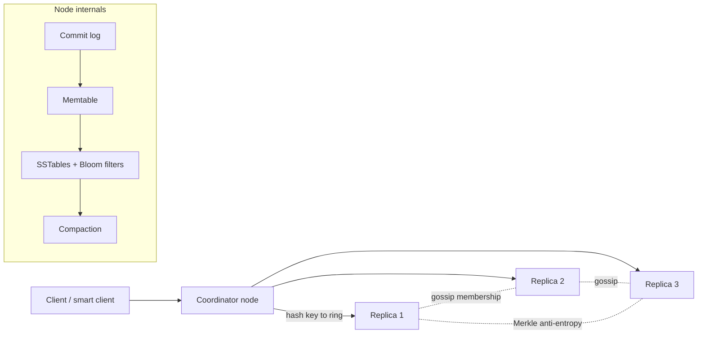

# Distributed key-value store

!!! abstract "At a glance"
    **Priority:** P1 · **Complexity:** 5/5 · **Est. time:** 4 h · **Phase:** 5 · **Prereqs:** [Partitioning & consistent hashing](../partitioning-sharding.md), [Replication](../replication.md), [Consistency models](../consistency-models.md), [Consensus: Raft](../consensus-raft.md), [Databases & storage engines](../databases-sql-nosql.md)
    **You're done when:** you can design both a Dynamo-style (leaderless, AP) and a Raft-based (CP) KV store, explain quorum math, conflict resolution, membership, and the storage engine, and pick one for a given workload.

This is the "build the database" question. It tests whether you understand the distributed-systems primitives underneath every managed service you use: **partitioning, replication, quorums, failure detection, conflict resolution, and storage engines**.

## Problem statement

Design a horizontally scalable, highly available key-value store (`get(key)`, `put(key, value)`, `delete(key)`) serving many internal services — like Amazon Dynamo/DynamoDB, Cassandra, Riak, or etcd/TiKV on the CP side.

## Clarifying questions to ask

| Question | Why | Assumption |
|---|---|---|
| Consistency requirement: linearizable or eventual? | AP vs CP architecture | Tunable per request; default eventual (shopping cart style) |
| Value size? | Storage engine, network | ≤ 100 KB typical, avg 1 KB |
| Read/write mix? | LSM vs B-tree | Write-heavy (50/50 to 30/70) |
| Scale? | Node count | 100 TB logical, 1 M ops/s |
| Multi-region? | Replication topology | Single region first, multi-region later |
| Range scans / secondary indexes? | Partitioning scheme | Point ops only (hash partitioning) |
| Transactions? | Coordination | Single-key atomicity; conditional put (CAS) |

## Functional & non-functional requirements

**Functional:** get/put/delete; conditional put (compare-and-set on version); TTL; per-request consistency level.

**Non-functional:** p99 < 10 ms for gets within region; 99.99% availability; durability 11 nines-ish via replication + backups; linear horizontal scalability; tolerate node and AZ failures without downtime; online rebalancing.

## Back-of-envelope estimation

```text
Data:      100 TB logical × RF 3 = 300 TB raw; + ~30% compaction/space amp ≈ 400 TB
Node:      ~4 TB usable NVMe/node (keep < 50–60% full for compaction headroom) → ~2 TB effective
           → 400 TB / 2 TB ≈ 200 nodes
Throughput: 1 M ops/s (50% reads) → per node ≈ 5 k client ops/s, but each write hits 3 replicas
           → ~7.5 k replica writes/s/node; a modern LSM node handles 20–50 k/s → headroom OK
Key count: 100 TB / 1 KB ≈ 100 B keys; Bloom filters at 10 bits/key ≈ 125 GB across cluster (~0.6 GB/node) → fits in RAM
Network:   1 M ops × 1 KB × ~3 (replication) ≈ 3 GB/s cluster-wide ≈ 15 MB/s/node — trivial
Virtual nodes: 200 nodes × 256 vnodes = 51,200 token ranges
```

## API design

```text
get(key, consistency=ONE|QUORUM|ALL) → (value, version/context)
put(key, value, context?, consistency=..., ttl?) → version
put_if(key, value, expected_version) → ok | conflict      # CAS; needs consensus/LWT in AP systems
delete(key) → tombstone write
```

The `context` (vector clock or version) returned by `get` and passed back on `put` is Dynamo's mechanism for causal tracking — mention it explicitly.

## Data model

Flat namespace of `key → (value, version, ttl, tombstone flag)`, hashed onto a ring. Internally per node: commit log (WAL), memtable, SSTables with Bloom filters and sparse index; hinted-handoff store; Merkle trees per token range for anti-entropy.

## High-level design



Write: coordinator hashes key → preference list of N replicas (next N distinct physical nodes clockwise on the ring, across AZs) → sends to all N, waits for W acks. Read: sends to R replicas (or all, with speculative retry), returns newest version, triggers read-repair for stale replicas.

## Deep dives

### 1. Partitioning: consistent hashing with virtual nodes

| Scheme | Pros | Cons |
|---|---|---|
| Modulo hashing | Trivial | Adding a node remaps ~all keys |
| Consistent hashing (1 token/node) | Adding a node moves ~1/N keys | Uneven load, hotspots when a node dies (neighbour takes all) |
| Consistent hashing + vnodes (Dynamo/Cassandra) | Even spread, rebuild load shared by many nodes | More metadata, repair across many ranges |
| Fixed partitions (e.g. 4,096) assigned to nodes (Riak, Kafka, DynamoDB-like) | Rebalancing = moving whole partitions; simple ops | Must choose partition count upfront (split later) |

**Decision:** fixed large number of partitions mapped to nodes by a placement service (or vnodes if leaderless and fully decentralised). Placement must be AZ-aware: replicas of a partition in 3 different AZs.

### 2. Replication & consistency: leaderless quorums vs Raft groups

| | Leaderless (Dynamo) | Leader per partition with Raft (TiKV, CockroachDB, etcd) |
|---|---|---|
| Consistency | Tunable; R+W>N gives overlap but **not** linearizability (sloppy quorums, concurrent writes) | Linearizable reads/writes (with leader leases or ReadIndex) |
| Availability under partition | Writes accepted on any reachable nodes (sloppy quorum + hinted handoff) | Minority side unavailable |
| Write latency | 1 RTT to W fastest replicas | Leader + majority ack (1 RTT from leader) + client→leader hop |
| Conflicts | Possible → vector clocks / LWW / CRDTs | None (single leader order) |
| Complexity | Anti-entropy, read repair, tombstones | Consensus, leader election, membership changes |

Quorum math to say out loud: N=3, W=2, R=2 → tolerate 1 replica down for both reads and writes; W=1,R=3 for write-heavy; W=3 kills write availability on any failure. **Decision:** depends on the workload — for a cart/session/profile store, leaderless AP with LWW or CRDTs; for metadata, config, locks, inventory counts → Raft-based CP. A strong answer offers both and picks per requirement.

### 3. Conflict resolution

| Strategy | Use when | Risk |
|---|---|---|
| Last-write-wins (timestamp) | Idempotent overwrites, caches | Silent data loss under clock skew |
| Vector clocks + client merge (Dynamo cart) | Application can merge | Clients must handle siblings; clock pruning |
| CRDTs (counters, sets, maps) | Commutative data types | Limited data types, metadata growth |
| Conditional writes via Paxos/Raft (LWT) | Must-not-lose updates | Latency (~4 RTT in Cassandra LWT) |

**Decision:** LWW default with hybrid logical clocks, CRDT types for counters/sets, and LWT/CAS for the few operations that need it.

### 4. Storage engine: LSM vs B-tree

| | LSM-tree (RocksDB, Cassandra) | B-tree (InnoDB, BoltDB, WiredTiger default) |
|---|---|---|
| Writes | Sequential, fast; high ingest | Random in-place updates; WAL + page writes |
| Reads | May check multiple SSTables (Bloom filters help) | One tree traversal |
| Amplification | Write amp from compaction (10–30x leveled), space amp lower with leveled | Write amp from page rewrites; fragmentation |
| Tuning | Compaction strategy (size-tiered vs leveled vs time-window) | Page size, fill factor |

**Decision:** LSM (RocksDB) for a write-heavy KV; leveled compaction for read-heavy partitions, time-window compaction for TTL-heavy data. Tombstones + TTL need `gc_grace` longer than max repair interval or deleted data resurrects — a classic production bug.

## Scaling & bottlenecks

- **Hot keys/partitions:** detect via per-partition metrics; split partitions; add a cache tier; for extreme hot keys, application-level key salting (append suffix, read all shards).
- **Rebalancing:** stream partitions to new nodes with throttling (bandwidth caps) so client latency isn't hurt; bootstrapping a 2 TB node at 200 MB/s ≈ 3 h.
- **Compaction debt:** under sustained writes, compaction falls behind → read amp grows; monitor pending compactions and throttle writes (backpressure) before latency collapses.
- **Large partitions / wide rows:** cap value and partition sizes.

## Failure modes & reliability

| Failure | Mechanism |
|---|---|
| Node temporarily down | Sloppy quorum + hinted handoff (AP) / Raft re-election (CP, ~1–10 s) |
| Node permanently lost | Re-replicate from other replicas; vnodes spread rebuild across many nodes |
| Divergent replicas | Read repair + periodic anti-entropy via Merkle trees |
| Failure detection | Gossip + phi-accrual detector (adaptive to network jitter) |
| Split brain (CP) | Majority quorum + leader leases with fencing |
| Correlated failure (AZ) | AZ-aware placement; RF=3 across 3 AZs |
| Operator error / corruption | Snapshots to object storage, PITR, checksums per block |

Jepsen analyses are the reality check: many stores advertising strong consistency have failed under partitions — quote that you'd test with fault injection.

## Security & multi-tenancy

Tenant isolation via namespaces/tables with per-tenant quotas (ops/s, storage) enforced at the coordinator ([rate limiting](../rate-limiting.md)); noisy-neighbour protection via request scheduling (per-tenant fair queues, as DynamoDB describes in its 2022 USENIX paper). Encryption at rest (per-tenant keys for BYOK), TLS/mTLS between nodes, authn/z per namespace, audit logs for admin operations.

## How the design changes at 10x / in an AI-era variant

**10x (1 PB, 10 M ops/s, ~2,000 nodes):** gossip overhead and membership churn become real → move to a central placement/metadata service (itself Raft-backed) with nodes reporting heartbeats; automated partition splitting; multi-region with async replication and per-key home regions or CRDTs.

**AI-era variant:** KV stores now back **agent memory, session state, feature stores and prompt/KV caches**. Implications: (1) vector values — adding ANN indexes turns the KV into a vector DB (different access pattern: top-k similarity, index build cost); (2) LLM inference prefix/KV-cache offloading uses tiered KV (GPU HBM → CPU RAM → SSD) with very large values (MBs) → value size assumptions change, favour blob-style storage with a small index; (3) agent checkpoints (LangGraph-style) are write-heavy, small, per-thread keys — a perfect LSM workload with TTLs.

## What a Staff-level answer adds (vs senior)

- Presents AP and CP designs as a choice driven by the business invariant, and explains precisely why R+W>N is not linearizability.
- Talks about operability: compaction debt, repair schedules, tombstone resurrection, rebalancing throttles, upgrade procedures.
- Brings in testing: Jepsen-style fault injection, deterministic simulation testing (FoundationDB, TigerBeetle).
- Knows when *not* to build: a managed service (DynamoDB, Cosmos DB, Spanner) plus clear SLOs usually beats a bespoke store; justify build only for unique cost/latency/control needs.

## Resources

| Resource | Type | Why this one | Level | Cost |
|---|---|---|---|---|
| [Dynamo: Amazon's Highly Available Key-value Store (SOSP 2007)](https://www.allthingsdistributed.com/files/amazon-dynamo-sosp2007.pdf) | paper | The source of the leaderless design vocabulary | advanced | free |
| [Amazon DynamoDB: A Scalable, Predictably Performant, Fully Managed NoSQL Database (USENIX ATC '22)](https://www.usenix.org/conference/atc22/presentation/elhemali) :gem: | paper | How the managed service diverged from Dynamo (Multi-Paxos, admission control) | advanced | free |
| [Designing Data-Intensive Applications, 2nd ed.](https://martin.kleppmann.com/2026/03/24/designing-data-intensive-applications-2e.html) | book | Chapters on replication, partitioning, storage engines | advanced | paid |
| [Raft paper & visualisation](https://raft.github.io) | docs | CP alternative; read with the interactive demo | advanced | free |
| [Jepsen analyses](https://jepsen.io/analyses) :gem: | article | What actually breaks under partitions | advanced | free |
| [Patterns of Distributed Systems (Unmesh Joshi)](https://martinfowler.com/articles/patterns-of-distributed-systems/) | article | Named patterns: WAL, HLC, gossip, lease, quorum | intermediate | free |
| [Hello Interview — Distributed cache](https://www.hellointerview.com/learn/system-design/problem-breakdowns/distributed-cache) | article | Interview-paced sibling problem | intermediate | free |
| [Alex Xu — System Design Interview Vol 1, ch. 6](https://bytebytego.com) | book | Standard interview framing of this problem | intermediate | paid |

## Follow-up questions

### L2 — Apply

??? question "Q1. N=3, W=2, R=2. One replica is down and another is slow (200 ms). What are read and write latencies?"
    ??? success "Answer"
        Only two replicas are reachable, and both are needed for W=2 and R=2, so every operation waits for the slow one: ~200 ms. Mitigations: sloppy quorum (write to a healthy fallback node with a hint), speculative retries, or temporarily lowering to W=1/R=1 for tolerant requests. Illustrates why tail latency in quorum systems is governed by the k-th fastest replica.

??? question "Q2. You delete a key and it reappears two weeks later. Explain and fix."
    ??? success "Answer"
        A replica was down (or missed the delete) longer than `gc_grace_seconds`; the tombstone was compacted away on other replicas, then anti-entropy/read-repair propagated the old value back from the stale replica. Fix: run full repairs more often than gc_grace (e.g. weekly repair, 10-day grace), never bring back a node down longer than grace without wiping it, and alert on repair lag.

??? question "Q3. A new node joins a 200-node cluster with vnodes. How much data moves and from where?"
    ??? success "Answer"
        Roughly 1/201 of total data ≈ 400 TB / 201 ≈ 2 TB, streamed from many existing nodes (each vnode range is taken from a different neighbour), so each source sends only ~10 GB. At a throttle of 200 MB/s inbound on the new node, ~3 h. Without vnodes, a single neighbour would source it all, overloading that node.

### L3 — Design & trade-offs

??? question "Q4. A team needs a KV store for inventory counts that must never oversell. Leaderless or Raft? Defend."
    ??? success "Answer"
        Raft (or Paxos) per partition. The invariant (count ≥ 0) needs linearizable conditional updates; leaderless LWW can lose decrements under concurrency, and sloppy quorums allow divergent writes. Alternatives: CRDT counters can't enforce a lower bound without coordination (escrow/reservation schemes can, by pre-allocating quota per replica). Cost: minority partitions become unavailable and writes pay leader RTT — acceptable for inventory.

??? question "Q5. LSM or B-tree for a read-heavy (95% reads), point-lookup workload with small values?"
    ??? success "Answer"
        B-tree is a strong fit: single traversal per read, predictable latency, no compaction stalls. An LSM with leveled compaction, large block cache, and Bloom filters can also deliver ~1 disk read per lookup and better space efficiency with compression. If data fits mostly in RAM, either works; choose by ops familiarity. Mention write amplification only matters little at 5% writes.

??? question "Q6. How do you detect failures without false positives in a 200-node cluster across AZs?"
    ??? success "Answer"
        Gossip-based heartbeats with a phi-accrual failure detector (suspicion level adapts to observed inter-arrival distribution) rather than fixed timeouts; require indirect probes (SWIM-style: ask k other nodes to ping the suspect) before marking down. Separate 'down for routing' (fast, reversible) from 'removed from ring' (slow, operator or long timeout) to avoid rebalancing storms on transient blips.

### L4 — Staff-level ambiguity

??? question "Q7. Your org runs a self-managed Cassandra fleet (600 nodes, 5 teams). Leadership asks whether to move to a managed service. How do you decide and drive it?"
    ??? success "Answer"
        Build a TCO including people (on-call, upgrades, repairs — often 3–6 FTE), hardware, incidents; compare to managed pricing at current and 2x load, including egress and provisioned vs on-demand. Evaluate fit: data model compatibility (Keyspaces/Astra/Scylla Cloud vs DynamoDB rewrite), latency, features (LWT, TTL, counters), lock-in. Pilot with one team's workload using dual writes and shadow reads. Present an ADR with options, cost curves, risks and a phased migration; get buy-in from all 5 teams by addressing their specific pain points.

??? question "Q8. An incident: a network partition caused two coordinators to accept conflicting writes and customers saw data loss under LWW. What changes?"
    ??? success "Answer"
        Short-term: identify affected keys from logs/hints, restore from siblings/backup, notify customers. Design: classify data by conflict tolerance — move must-not-lose data to CP storage or CAS/LWT paths; for mergeable data adopt CRDTs; replace wall-clock LWW with HLC to reduce skew damage; add clock-skew monitoring. Process: Jepsen-style partition tests in CI for the storage layer; document consistency guarantees per API so product teams choose knowingly.

??? question "Q9. Agent-memory and LangGraph checkpoint traffic now dominates your KV platform. What do you change?"
    ??? success "Answer"
        Profile the workload: small frequent writes per thread, reads of latest checkpoint, long tail of cold threads, TTLs. Tune: dedicated tables with time-window compaction and TTL, tiered storage for cold checkpoints (object storage), per-tenant quotas to protect other workloads, and compression of large JSON states. Consider a purpose-specific API (checkpoint store) rather than raw KV so you can change storage later. Add cost attribution per agent/team.

## Checklist

- [ ] I can explain consistent hashing with vnodes vs fixed partitions
- [ ] I can do quorum math and explain why R+W>N ≠ linearizable
- [ ] I can compare LWW, vector clocks, CRDTs, and LWT
- [ ] I can explain LSM compaction, Bloom filters, and tombstone resurrection
- [ ] I answered all L3 questions out loud in < 3 min each
