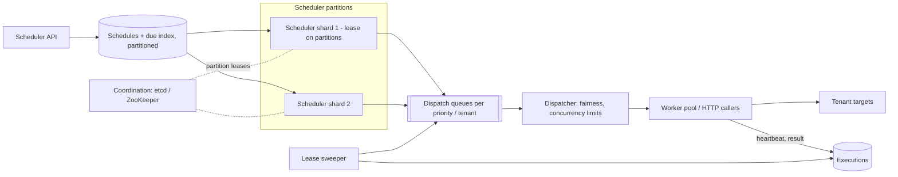

# Distributed job scheduler

!!! abstract "At a glance"
    **Priority:** P1 · **Complexity:** 4/5 · **Est. time:** 3 h · **Phase:** 3 · **Prereqs:** [Messaging & streaming](../messaging-streaming.md), [Consensus: leases & fencing](../consensus-raft.md), [Reliability patterns](../reliability-patterns.md), [Partitioning](../partitioning-sharding.md)
    **You're done when:** you can design a multi-tenant scheduler for one-off, delayed and cron jobs that fires on time at scale, survives scheduler and worker crashes via leases and fencing, and gives clear at-least-once semantics with idempotent jobs.

"Distributed cron" sounds small. The hard parts are: **firing millions of jobs at the same instant (top of the hour)**, **exactly-once illusions** (a job runs twice or never after a crash), **fairness across tenants**, and knowing when you've outgrown a scheduler and need a **durable workflow engine**.

## Problem statement

Design a platform service that lets internal teams schedule jobs: run once now, at a time (delayed), or on a cron schedule; with retries, timeouts, priorities, concurrency limits, and visibility (status, logs, history). Examples: send reminder emails in 24 h, nightly report generation, hourly data syncs, container-demurrage calculations at midnight per port timezone.

## Clarifying questions to ask

| Question | Why | Assumption |
|---|---|---|
| Job types: one-off, delayed, cron, DAGs? | Scope | One-off, delayed, cron; simple dependencies; complex DAGs → workflow engine |
| Scale: scheduled jobs, executions/day, peak burst? | Sizing | 50 M active schedules, 100 M executions/day, top-of-hour bursts of 2 M |
| Timing precision? | Architecture | Fire within 1 s p99 of due time (seconds, not ms) |
| Who executes? Our workers or callbacks to tenants? | Isolation | Both: HTTP/queue callbacks to tenant services + managed container jobs |
| Semantics? | Idempotency burden | At-least-once; jobs must be idempotent (we provide an execution ID) |
| Duration? | Leases/heartbeats | Seconds to hours |

## Functional & non-functional requirements

**Functional:** create/update/pause/delete schedules; run-now; retries with backoff; timeouts; per-tenant concurrency limits and priorities; timezone-aware cron (DST!); execution history and logs; misfire policy (skip vs catch up); dependencies (job B after job A succeeds).

**Non-functional:** 99.99% availability of the firing path; fire p99 < 1 s after due time under normal load; no lost jobs (a due job always eventually runs); duplicates rare and detectable; horizontal scalability; tenant isolation.

## Back-of-envelope estimation

```text
Executions:   100 M/day ≈ 1,160 /s avg
Burst:        cron clustering — ~40% of cron jobs are "0 * * * *" or "0 0 * * *"
              → 2 M jobs due at hh:00:00; firing in ≤ 60 s needs ~33 k dispatches/s (spread with jitter)
Schedules:    50 M × ~1 KB (definition) ≈ 50 GB
Due index:    next_run_at per schedule: 50 M × ~40 B ≈ 2 GB — fits in memory across a few partitions
History:      100 M executions/day × ~500 B ≈ 50 GB/day → 30-day hot ≈ 1.5 TB, then archive
Worker fleet: avg job 30 s, 1,160 starts/s → ~35 k concurrently running jobs (Little's law: L = λW)
```

Little's law is worth saying: concurrency = arrival rate × duration. It sizes the worker fleet and exposes why long jobs need different handling from short ones.

## API design

```http
POST /v1/schedules
{ "name": "nightly-demurrage-ROTTERDAM", "tenant": "billing",
  "cron": "0 0 * * *", "timezone": "Europe/Amsterdam",
  "target": { "type": "http", "url": "https://billing.internal/jobs/demurrage", "timeout_s": 900 },
  "retry": { "max_attempts": 5, "backoff": "exponential", "initial_s": 30 },
  "concurrency": "forbid",            # forbid | allow | replace (overlapping runs)
  "misfire": "run_once",              # skip | run_once | catch_up
  "jitter_s": 120 }
POST /v1/jobs     { "run_at": "2026-09-26T09:00:00Z", "target": {...}, "idempotency_key": "remind-u42-2026-09-26" }
POST /v1/schedules/{id}:pause | :resume | :trigger
GET  /v1/executions?schedule_id=&status=failed
```

Each execution carries an `execution_id` (and `scheduled_for` time) that targets use as an idempotency key.

## Data model

| Table | Key | Notes |
|---|---|---|
| `schedules` | `schedule_id` | tenant, cron/tz, target, retry policy, version, paused |
| `due_index` | `(partition, next_run_at, schedule_id)` | range-scannable by time within partition |
| `executions` | `execution_id` | schedule_id, scheduled_for, attempt, state, lease_owner, lease_expires, fencing_token |
| `tenant_limits` | `tenant` | max concurrency, rate, priority weight |

State machine for executions: `scheduled → queued → running(lease) → succeeded | failed → retry_scheduled | dead`.

## High-level design



Flow: scheduler shards own partitions of the due index (via leases from a coordinator); each shard scans `next_run_at <= now + lookahead` (e.g. 10 s), creates execution records, enqueues them, and advances `next_run_at` for cron schedules in the same transaction. Dispatchers apply tenant fairness and concurrency limits; workers lease executions, heartbeat, and report results.

## Deep dives

### 1. Finding due jobs efficiently

| Option | Pros | Cons |
|---|---|---|
| Poll DB: `WHERE next_run_at <= now() ... FOR UPDATE SKIP LOCKED` | Simple, transactional; great up to ~thousands/s | Index hot spot at "now"; polling latency |
| Redis sorted set (score = due time), `ZRANGEBYSCORE` + atomic claim (Lua) | Fast, ~100 k ops/s per shard | Durability depends on Redis persistence; must reconcile with DB |
| Hierarchical timing wheels in memory (Kafka's purgatory design) | O(1) insert/expire, great for short delays | Memory-bound; needs durable backing store and rebuild |
| Delay queues (SQS delay ≤ 15 min, Kafka delayed topics by bucket) | Managed | Limited max delay; coarse |

**Decision:** durable source of truth in a partitioned DB (due index), with each scheduler shard loading the next few minutes of due jobs into an in-memory timing wheel/heap for precise firing. Partition the due index by `hash(schedule_id) % P` (not by time) so "top of the hour" load spreads across all shards. Postgres `SKIP LOCKED` is an excellent answer at smaller scale — say where it stops (tens of thousands of jobs/s, vacuum pressure).

### 2. Scheduler high availability without double firing

| Option | Pros | Cons |
|---|---|---|
| Single active scheduler + standby (leader election) | Simple (Google's distributed cron used Paxos-replicated state with a single leader) | Throughput ceiling of one leader |
| Partitioned schedulers with leases per partition | Horizontal scale | Rebalancing; must fence old owners |
| Every node scans everything, DB row claims decide | No coordinator | Wasteful, contention |

**Decision:** partitioned ownership with leases + **fencing tokens**. When a shard's lease expires and another takes over, the old shard may still be alive (GC pause) — the fencing token (monotonic lease epoch) is stored on writes, and the DB rejects writes with a stale token. Creating the execution record with a unique `(schedule_id, scheduled_for)` constraint makes firing idempotent: two schedulers trying to fire the same instant produce one row.

### 3. Execution semantics: at-least-once + idempotency

Workers take a lease on an execution (`lease_expires = now + 60 s`) and heartbeat every 20 s. If heartbeats stop (worker died), the sweeper re-queues after expiry — so a job **may run twice** (the worker might have been partitioned but still running). Therefore: provide `execution_id`, document at-least-once, require idempotent handlers, and pass the fencing token so downstream writes can reject stale attempts. "Exactly-once" = at-least-once delivery + idempotent effect.

### 4. Scheduler vs workflow engine

| Need | Scheduler | Durable workflow engine (Temporal, Step Functions, Airflow for batch DAGs) |
|---|---|---|
| Fire a job at time T | Yes | Yes (timers) |
| Multi-step with state, compensation, human waits | Painful (tenants build their own state machines) | Native (event-sourced history, replay) |
| Long waits (days) | Via delayed jobs | Durable timers |
| DAG data pipelines | Basic dependencies | Airflow/Dagster excel |

**Decision:** keep the scheduler focused on time-based triggering and simple retries; route multi-step business processes to a workflow engine and batch DAGs to an orchestrator. Resist scope creep — it's the most common way these platforms rot.

## Scaling & bottlenecks

- **Thundering herd at hh:00:** partition by schedule hash, pre-load due jobs minutes early, apply per-schedule `jitter_s`, and encourage tenants to use `H` (hashed) minutes like Jenkins' cron syntax.
- **Tenant fairness:** weighted fair queuing across tenants in the dispatcher; per-tenant concurrency caps; separate pools for long-running jobs so they don't starve short ones.
- **Downstream protection:** jobs that call tenant services must respect their rate limits (token buckets per target) — the scheduler must not DDoS its own company.
- **History growth:** TTL/partition by day; archive to object storage.

## Failure modes & reliability

| Failure | Mitigation |
|---|---|
| Scheduler shard crash | Lease expiry (e.g. 10 s) → another shard takes partition; unique constraint prevents double execution records |
| Worker crash mid-job | Heartbeat lease expiry → retry with attempt+1 |
| Zombie worker (GC pause) completes after re-queue | Fencing token check on completion and downstream writes |
| Scheduler down for 10 min | Misfire policy per schedule: skip, run once, or catch up (bounded) |
| DST transitions | Timezone-aware cron library; define behaviour for skipped/doubled local hours (02:30 on spring-forward day) |
| Poison job (always fails) | Max attempts → dead state + alert to owning tenant; never infinite retries |
| Coordinator (etcd) outage | Existing leases continue until expiry; keep lease durations > typical coordinator failover time |

## Security & multi-tenancy

Jobs execute code or call endpoints on behalf of tenants → per-tenant service identities (workload identity, short-lived tokens), secrets fetched at runtime from a vault (never stored in job definitions), sandboxed containers for managed jobs, network egress policies, and RBAC on who can create/trigger schedules for a service. Audit every manual trigger. Quotas per tenant for concurrency and executions/day.

## How the design changes at 10x / in an AI-era variant

**10x (1 B executions/day, 20 M-job bursts):** in-memory timing wheels per shard with a durable log (Kafka) of scheduled events, more partitions, and push-based dispatch to regional worker pools; history moves to a columnar store.

**AI-era variant:** agents need **long-running, interruptible, resumable** tasks (research agents running 30 min, waiting for human approval for days) — this is durable execution, not cron: checkpointed state (LangGraph checkpointers, Temporal workflows), timers, signals for human-in-the-loop, and idempotent tool calls. Also: LLM batch jobs (batch inference APIs with 24 h SLAs at ~50% discount) are a natural scheduler workload — schedule, submit batch, poll, collect. GPU-bound jobs need capacity-aware dispatch (queue by GPU type, preemption, priority for interactive traffic).

## What a Staff-level answer adds (vs senior)

- States semantics precisely (at-least-once, idempotency contract, fencing) and pushes the idempotency requirement into the platform's API contract and docs.
- Identifies cron clustering as the real peak and designs spreading mechanisms (hash partitioning, jitter, hashed cron syntax).
- Draws a firm boundary between scheduler and workflow engine and explains the organisational cost of blurring it.
- Designs for operability: misfire policies, DST, dead-letter handling, tenant-facing observability (why didn't my job run?).

## Resources

| Resource | Type | Why this one | Level | Cost |
|---|---|---|---|---|
| [Reliable Cron across the Planet (ACM Queue)](https://queue.acm.org/detail.cfm?id=2745840) | article | Google's Paxos-based distributed cron; idempotency and failure analysis | advanced | free |
| [Google SRE book — Distributed Periodic Scheduling with Cron](https://sre.google/sre-book/distributed-periodic-scheduling/) | book | Same system, SRE lens: skip vs double-run trade-offs | intermediate | free |
| [Dropbox — Asynchronous Task Scheduling at Dropbox](https://dropbox.tech/infrastructure/asynchronous-task-scheduling-at-dropbox) :gem: | article | ATF design: lambdas, priorities, at-least-once semantics | advanced | free |
| [Slack — Scaling Slack's Job Queue](https://slack.engineering/scaling-slacks-job-queue/) :gem: | article | Real migration from Redis to Kafka-backed queue under load | advanced | free |
| [Netflix — Timestone priority queue](https://netflixtechblog.com/timestone-netflixs-high-throughput-low-latency-priority-queueing-system-with-built-in-support-1abf249ba95f) | article | Deadline-ordered queues, exclusive (non-parallel) queues | advanced | free |
| [Temporal documentation](https://docs.temporal.io/) | docs | When the scheduler should become a durable workflow engine | intermediate | free |
| [PostgreSQL SELECT ... FOR UPDATE SKIP LOCKED](https://www.postgresql.org/docs/current/sql-select.html) | docs | The simplest robust job-claiming primitive | intermediate | free |
| [Hello Interview — Job scheduler](https://www.hellointerview.com/learn/system-design/problem-breakdowns/job-scheduler) | article | Interview-paced walkthrough | intermediate | free |

## Follow-up questions

### L2 — Apply

??? question "Q1. Write the SQL for workers claiming due jobs in Postgres without contention."
    ??? success "Answer"
        ```sql
        WITH next AS (
          SELECT id FROM executions
          WHERE state = 'queued' AND run_at <= now()
          ORDER BY priority DESC, run_at
          LIMIT 50
          FOR UPDATE SKIP LOCKED)
        UPDATE executions e
        SET state = 'running', lease_owner = :worker, lease_expires = now() + interval '60 seconds',
            fencing_token = fencing_token + 1
        FROM next WHERE e.id = next.id
        RETURNING e.*;
        ```
        `SKIP LOCKED` lets concurrent workers grab disjoint rows. Needs an index on `(state, run_at)`; watch for vacuum/bloat at high churn.

??? question "Q2. 2 M jobs are due at 00:00 UTC and each takes ~5 s. How many workers to finish within 5 minutes?"
    ??? success "Answer"
        Work = 2 M × 5 s = 10 M worker-seconds; in 300 s → ~33 k concurrent slots. If a worker process handles 50 concurrent I/O-bound jobs, ~670 processes; CPU-bound jobs need ~33 k cores. Alternatives: spread with jitter over 30 min (→ ~5.5 k slots), or negotiate SLAs per tenant. Also check downstream capacity — the targets must absorb ~6.7 k jobs/s.

??? question "Q3. A cron schedule says 02:30 daily in Europe/Amsterdam. What happens on DST days?"
    ??? success "Answer"
        Spring forward: 02:00→03:00, so 02:30 doesn't exist — define behaviour (run at 03:00, i.e. next valid time, is the common choice). Fall back: 02:30 occurs twice — run once (first occurrence) by tracking the UTC instant of the last run. Store schedules with IANA timezone, compute next run in local time and convert to UTC, and test with a DST-aware library.

### L3 — Design & trade-offs

??? question "Q4. A team wants 'exactly-once' job execution. What do you offer?"
    ??? success "Answer"
        Explain that distributed systems can't guarantee a side effect happens exactly once when workers can fail after the effect but before the ack. Offer: at-least-once delivery + `execution_id` as idempotency key + fencing token for stale attempts + dedupe on `(schedule_id, scheduled_for)`. For effects in our own DB, the job can commit its effect and completion in one transaction (transactional outbox pattern), which is effectively-once.

??? question "Q5. Redis sorted sets vs a relational DB for the due index?"
    ??? success "Answer"
        Redis: very fast `ZRANGEBYSCORE` + Lua claim, ~100 k ops/s per shard, but persistence (AOF fsync) and failover can lose recent writes → lost jobs unless reconciled with a durable store. Relational: durable, transactional with job definitions, simpler reasoning, scales to thousands/s per partition. Common design: DB as source of truth + Redis/in-memory wheel as a near-term cache rebuilt from the DB on failover.

??? question "Q6. When should a team move from the scheduler to Temporal/Step Functions?"
    ??? success "Answer"
        When their 'job' becomes a multi-step process with intermediate state, compensations, waits for external events/humans, or long durations with checkpoints — signs: they're storing progress flags in their own DB, chaining jobs via callbacks, or writing retry state machines. The workflow engine gives event-sourced history, deterministic replay, durable timers and signals. Keep simple time triggers in the scheduler.

### L4 — Staff-level ambiguity

??? question "Q7. Five teams run their own cron setups (Kubernetes CronJobs, Airflow, a homegrown Quartz cluster, Lambda schedules, and a VM crontab). Leadership asks for 'one scheduler'. What do you propose?"
    ??? success "Answer"
        Don't force one tool for different jobs: categorise workloads — time triggers (platform scheduler or cloud-native schedules), data DAGs (Airflow/Dagster), business workflows (Temporal/Step Functions). Converge on a small paved-road set with shared observability, identity, secrets and alerting standards. Migrate the riskiest first (VM crontab = single point of failure, no history). Success metrics: missed-job incidents, time to diagnose failed jobs, number of unmanaged schedules. Write an ADR and get team buy-in by solving their top pain.

??? question "Q8. Agent teams want to run 30-minute autonomous tasks with human approvals mid-way on your scheduler. Accept or redirect?"
    ??? success "Answer"
        Redirect to durable execution (Temporal or LangGraph with a durable checkpointer) with the scheduler only triggering the start. Requirements they'll hit: checkpoint after each step, idempotent tool calls, signals for approvals that may take days, timeouts and escalation, cost limits per run, and replay/debugging. Offer a platform template that combines scheduler triggers + workflow engine + LLM gateway, so teams don't build it five times.

??? question "Q9. An incident: a scheduler failover caused 40 k billing jobs to run twice and customers were double-invoiced. Postmortem actions?"
    ??? success "Answer"
        Root cause likely missing fencing (old owner kept firing after lease loss) and non-idempotent billing handler. Actions: unique `(schedule_id, scheduled_for)` constraint on execution creation; fencing tokens validated on all writes; idempotency key in the billing service keyed by `(customer, billing_period)`; chaos test that pauses a scheduler shard past lease expiry; document the at-least-once contract prominently and add an idempotency checklist to onboarding. Remediate customers (credit notes) and communicate.

## Checklist

- [ ] I can explain partitioned due-index + timing wheel and why partition by hash not time
- [ ] I can explain leases, heartbeats, and fencing tokens with a GC-pause example
- [ ] I can apply Little's law to size workers for a top-of-hour burst
- [ ] I can draw the line between scheduler and workflow engine
- [ ] I answered all L3 questions out loud in < 3 min each
