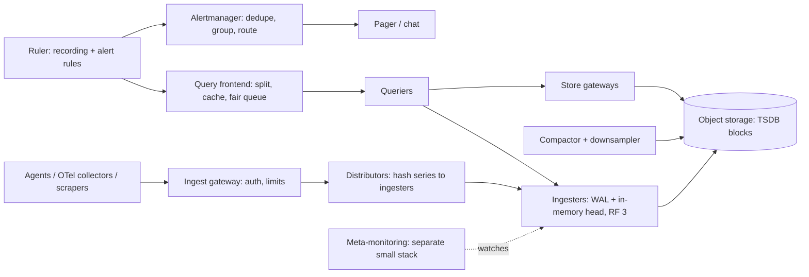

# Metrics & monitoring system

!!! abstract "At a glance"
    **Priority:** P1 · **Complexity:** 4/5 · **Est. time:** 3 h · **Phase:** 4 · **Prereqs:** [Observability & SLOs](../observability-slos.md), [Messaging & streaming](../messaging-streaming.md), [Partitioning](../partitioning-sharding.md), [Data pipelines](../data-pipelines.md)
    **You're done when:** you can design a multi-tenant metrics platform (ingest, TSDB, query, alerting), size it in samples/s and bytes/sample, and explain why cardinality — not volume — is the primary scaling and cost problem.

Building Datadog/Prometheus-at-scale is a great Staff-level question because the naive design works at small scale and fails in instructive ways: **cardinality explosions, query fan-out, and the monitoring system being down exactly when you need it**.

## Problem statement

Design an internal metrics and alerting platform for a company with ~50 k hosts / 200 k containers and hundreds of services: collect time-series metrics, store them with retention tiers, serve dashboards and ad-hoc queries (PromQL-like), and evaluate alert rules reliably.

## Clarifying questions to ask

| Question | Why | Assumption |
|---|---|---|
| Metrics only, or logs/traces too? | Scope | Metrics (traces/logs integrate via exemplars/IDs) |
| Push or pull? Prometheus compatibility? | Ingest design | Prometheus-compatible; both scrape and OTLP push |
| Active series and resolution? | Sizing | 100 M active series, 10 s resolution |
| Retention? | Storage tiers | Raw 15 days, 5-min rollups 13 months |
| Alerting latency? | Evaluation design | Alerts fire within 1 min of condition |
| Multi-tenant? | Isolation & cost | Yes, per team, with quotas and chargeback |

## Functional & non-functional requirements

**Functional:** ingest (scrape/push/OTLP), query language with aggregations over labels, dashboards, recording rules, alert rules with routing (PagerDuty/Slack), downsampling, per-tenant limits, metadata/label browsing.

**Non-functional:** ingest availability 99.9%+ with no silent loss; query p99 < 2 s for dashboard queries over 1 h; alerting pipeline more available than the systems it monitors (99.99%) and **independent of them**; cost-efficient storage.

## Back-of-envelope estimation

```text
Active series:   100 M; scrape every 10 s → 10 M samples/s ingest
Raw sample:      16 B (8 B ts + 8 B float) → Gorilla-style compression ≈ 1.3–1.5 B/sample
Per day:         10 M × 86,400 ≈ 864 B samples ≈ 1.2 TB/day compressed (≈ 14 TB uncompressed)
15 d raw:        ≈ 18 TB (× RF 3 in hot tier ≈ 54 TB, or object storage with RF inherent)
Rollups (5 m):   100 M series × 288 pts/day × ~5 aggregates × 1.5 B ≈ 216 GB/day → 13 mo ≈ 85 TB
Index:           100 M series × ~300 B label set ≈ 30 GB in-memory postings per replica set
Series churn:    containers restart → e.g. 20 M new series/day → index growth is the hidden cost
Ingest network:  10 M samples/s × ~30 B on wire (remote-write, snappy) ≈ 300 MB/s
Alert rules:     20 k rules evaluated every 30–60 s ≈ 400–700 rule queries/s
```

Say it: *bytes are cheap thanks to delta-of-delta + XOR compression (Facebook Gorilla paper reported ~1.37 B/sample); series count drives memory, index size and query cost.*

## API design

```http
POST /api/v1/push              # Prometheus remote-write (protobuf+snappy) / OTLP metrics
GET  /api/v1/query?query=sum by (service) (rate(http_requests_total{env="prod"}[5m]))&time=...
GET  /api/v1/query_range?query=...&start=&end=&step=30s
GET  /api/v1/labels , /api/v1/series?match[]=...
POST /api/v1/rules             # recording + alerting rules (GitOps-managed in practice)
```

Tenant identity via header (e.g. `X-Scope-OrgID` in Mimir/Cortex) set by the authenticating gateway, never by the client.

## Data model

A series = metric name + sorted label set, e.g. `http_requests_total{service="checkout",route="/pay",code="500",pod="..."}` → series ID (hash). Samples `(ts, value)` stored in compressed chunks (~120 samples or 2 h per chunk). Inverted index: `label=value → posting list of series IDs` for selection. Blocks: 2 h head block in memory + WAL → flushed to immutable blocks → compacted into larger blocks in object storage.

## High-level design



This is the Cortex/Mimir/Thanos architecture family: stateless distributors, stateful ingesters for recent data, object storage for history, and horizontally scalable queriers.

## Deep dives

### 1. Push vs pull ingestion

| | Pull (Prometheus scrape) | Push (remote-write, OTLP, StatsD) |
|---|---|---|
| Liveness | `up` metric for free — you know a target is dead | Silence is ambiguous (dead or idle?) |
| Discovery | Needs service discovery | Targets self-report |
| Short-lived jobs | Missed | Natural |
| Firewalls / edge / serverless | Hard | Easy |
| Load control | Server controls rate | Clients can flood — need limits |

**Decision:** hybrid — local agents scrape (pull semantics and `up` locally), then **push** via remote-write to the central platform. Serverless/batch push via OTLP. Central ingest enforces per-tenant rate and series limits.

### 2. Cardinality control

The failure mode: someone adds `user_id` or `request_id` as a label → millions of new series → ingester OOM → platform-wide outage. Options:

| Control | Effect |
|---|---|
| Per-tenant active-series limits (reject beyond) | Hard protection; tenants see errors |
| Per-metric label cardinality limits + drop rules at agent | Stops worst offenders at the edge |
| Relabel/aggregate at the collector (drop `pod`, keep `service`) | Reduces cost; loses detail |
| Cardinality dashboards + cost chargeback | Changes behaviour over time |
| Exemplars (attach trace ID to a sample instead of a label) | Keeps the high-cardinality link without series |

**Decision:** all of the above — limits for safety, visibility + chargeback for behaviour, exemplars and traces/logs for high-cardinality debugging. This is where a Staff answer shines: it's a socio-technical problem.

### 3. Storage: TSDB design and retention tiers

Head block in memory with WAL (crash recovery), 2 h immutable blocks, compaction into 24 h+ blocks, stored in object storage (cheap, durable), with store gateways caching index headers. Downsample into 5 m and 1 h resolutions for long-range queries. Alternatives: a columnar OLAP (ClickHouse) for metrics — great for high-cardinality analytics, weaker PromQL ecosystem; purpose-built TSDB (M3DB, VictoriaMetrics). Uber's M3 held over 6.6 B time series (2018 post), showing the scale these systems reach.

### 4. Query path at scale

Dashboards fan out: a 30-day query over 50 k series touches thousands of chunks. Techniques: query frontend splits by time (per-day sub-queries) and by shard, results cache per step-aligned interval, **recording rules** precompute expensive aggregations, per-tenant fair queuing so one heavy query doesn't starve others, query limits (max series, max samples, timeout).

## Scaling & bottlenecks

- Ingesters: memory-bound by active series (~2–4 KB/series incl. index and chunk buffers → 100 M × 3 KB × RF 3 ≈ 900 GB RAM across the ingester fleet ≈ 30–60 nodes).
- Series churn from autoscaled pods inflates the index; shorter head block or label hygiene (`pod` label drop for aggregate metrics).
- Compaction of object-store blocks is heavy; shard compactors by tenant/time.
- Alertmanager dedupe/grouping must be HA (gossip cluster) — duplicate pages erode trust.

## Failure modes & reliability

| Failure | Mitigation |
|---|---|
| Ingester crash | WAL replay; RF 3 with quorum writes from distributors |
| Cardinality bomb | Per-tenant series limits; circuit breaker on new-series rate |
| Query of death | Query limits, timeouts, isolated query pools per tenant |
| Monitoring down during an incident | **Meta-monitoring** on separate infra; alerting path isolated from query path; "dead man's switch" alert that fires continuously and pages if it stops |
| Region outage | Alerting evaluated regionally; global view degraded, local alerts continue |
| Clock skew on clients | Reject samples too far in the future; out-of-order window |

## Security & multi-tenancy

Tenant isolation by ID at the gateway (authn via service identity/OIDC), per-tenant limits (ingest rate, active series, query concurrency), label-level access control for sensitive metrics (e.g. revenue), encryption at rest in object storage, and **no secrets/PII in labels** — lint for it at the collector. Chargeback per tenant based on active series and query CPU.

## How the design changes at 10x / in an AI-era variant

**10x (1 B active series, 100 M samples/s):** hierarchical aggregation (Google Monarch-style: regional zones with a global query layer), aggressive pre-aggregation at the edge, and tiered retention defaults (raw 3–7 days). Cost governance becomes the product.

**AI-era variant:** (1) **LLM observability** adds token counts, cost, latency per model/tenant, eval scores — new metric families with high cardinality (model × prompt version × tenant) → prefer traces with OTel GenAI conventions (still "Development" status as of Jul 2026) and aggregate to metrics; (2) AI-assisted investigation: natural-language-to-PromQL, anomaly detection, incident summarisation — needs guardrails (queries run with the user's tenant scope, query cost limits) and evals on query correctness; (3) GPU fleet metrics (DCGM) at high resolution for inference platforms.

## What a Staff-level answer adds (vs senior)

- Frames cardinality as the core problem and proposes governance (limits, chargeback, education), not just tech.
- Designs the alerting path for independence and meta-monitoring — "who watches the watchers".
- Ties to SLOs: the platform's job is to make SLO burn-rate alerting cheap and reliable ([observability & SLOs](../observability-slos.md)).
- Makes a build-vs-buy call with numbers (SaaS per-series/host pricing vs self-hosted Mimir/VictoriaMetrics + a team).

## Resources

| Resource | Type | Why this one | Level | Cost |
|---|---|---|---|---|
| [Gorilla: A Fast, Scalable, In-Memory Time Series Database (VLDB 2015)](https://www.vldb.org/pvldb/vol8/p1816-teller.pdf) | paper | Delta-of-delta + XOR compression; 1.37 B/sample | advanced | free |
| [Monarch: Google's Planet-Scale In-Memory Time Series Database (VLDB 2020)](https://www.vldb.org/pvldb/vol13/p3181-adams.pdf) :gem: | paper | Hierarchical, regional design at the largest scale | advanced | free |
| [Prometheus storage docs](https://prometheus.io/docs/prometheus/latest/storage/) | docs | Head block, WAL, blocks, compaction — concrete | intermediate | free |
| [Grafana Mimir docs](https://grafana.com/docs/mimir/latest/) | docs | Reference architecture for horizontally scalable Prometheus | advanced | free |
| [M3: Uber's open source large-scale metrics platform](https://www.uber.com/us/en/blog/m3/) | article | Scale story, rollups, multi-tenancy | advanced | free |
| [Datadog — Introducing Husky](https://www.datadoghq.com/blog/engineering/introducing-husky/) :gem: | article | Event store design for observability at SaaS scale | advanced | free |
| [Google SRE book — Monitoring Distributed Systems](https://sre.google/sre-book/monitoring-distributed-systems/) | book | Golden signals, alerting philosophy | intermediate | free |
| [Hello Interview — Metrics monitoring](https://www.hellointerview.com/learn/system-design/problem-breakdowns/metrics-monitoring) | article | Interview-paced version | intermediate | free |

## Follow-up questions

### L2 — Apply

??? question "Q1. A service has 200 pods, 50 routes, 10 status codes, 5 methods, and a histogram with 12 buckets. How many series?"
    ??? success "Answer"
        200 × 50 × 10 × 5 = 500 k label combinations (upper bound; real is lower since not all combos occur). A histogram emits buckets + `_sum` + `_count` = 14 series per combination → up to 7 M series from one metric. Fix: drop `pod` for this metric (aggregate at collector) → 35 k; consider native/exponential histograms which store buckets in one series.

??? question "Q2. Estimate storage for 15 days raw at 20 M samples/s."
    ??? success "Answer"
        20 M × 86,400 = 1.73 T samples/day × ~1.4 B ≈ 2.4 TB/day → 15 days ≈ 36 TB, plus index (~5–10%) → ~40 TB in object storage (durability handled by the store; no extra RF). Hot ingesters only hold ~2 h: 20 M × 7,200 × 1.4 B ≈ 200 GB ×3 RF.

??? question "Q3. Write a burn-rate alert for a 99.9% availability SLO."
    ??? success "Answer"
        Error budget = 0.1%. Multi-window: page if 1 h error ratio > 14.4 × 0.001 AND 5 m ratio > 14.4 × 0.001 (burns 2% of a 30-day budget in 1 h); ticket if 6 h ratio > 6 × 0.001 AND 30 m > 6 × 0.001. Implement with recording rules for `sum(rate(errors[1h])) / sum(rate(requests[1h]))` per service so alert evaluation is cheap.

### L3 — Design & trade-offs

??? question "Q4. Self-host (Mimir/VictoriaMetrics) vs SaaS (Datadog/Grafana Cloud) for 100 M active series?"
    ??? success "Answer"
        SaaS at list prices for 100 M custom series is typically very expensive (custom-metric pricing), but includes UX, integrations, and zero ops. Self-hosted: object storage + compute is far cheaper at this scale, but needs a team (4–6 engineers) and on-call. Middle: managed Prometheus-compatible services. Decide with TCO, required features (APM, RUM), and strategic lock-in; many large orgs self-host metrics and buy APM/logs selectively.

??? question "Q5. Why keep alert evaluation separate from dashboard queries?"
    ??? success "Answer"
        Different SLOs and failure modes: a heavy dashboard query storm during an incident must not delay alert evaluation. Separate ruler pool with reserved query capacity (or local evaluation close to ingesters), separate Alertmanager cluster, and meta-monitoring on independent infrastructure. Alerting is the product during incidents; dashboards are best-effort.

??? question "Q6. Metrics vs logs vs traces for per-customer latency debugging in a B2B SaaS with 20 k tenants?"
    ??? success "Answer"
        Per-tenant metrics labels (20 k × routes × codes) are a cardinality risk. Use metrics at service/route level for SLOs, and traces (with tenant as a span attribute, sampled with tail-based sampling prioritising slow/error requests) + exemplars linking metric spikes to traces. For top-N enterprise tenants, a limited per-tenant metric set is acceptable. Wide-event stores (ClickHouse, Honeycomb-style) handle high-cardinality analysis better than TSDBs.

### L4 — Staff-level ambiguity

??? question "Q7. Observability spend grew 3x in a year and is now 12% of infra cost. Plan to halve it without losing incident capability."
    ??? success "Answer"
        Attribute cost per team/metric (top 10 metrics are often 50% of series). Actions: drop unused metrics (query logs show which are never read), drop high-churn labels, shorten raw retention, recording rules + downsampling, tail-based trace sampling, log levels and sampling. Governance: chargeback dashboards, per-team budgets, lint in CI for label cardinality. Protect: SLO metrics and alerting untouched. Report monthly with a cost vs MTTR guardrail.

??? question "Q8. Your monitoring platform was down during a major outage and the company flew blind for 40 minutes. What do you change?"
    ??? success "Answer"
        Postmortem finding is likely shared fate (same cluster, network, auth, or DNS as production). Changes: isolate the alerting path (separate cluster/account/region), minimal-dependency meta-monitoring, dead man's switch, cached auth, static fallback dashboards, and a game day that simulates losing the primary stack. Define the platform's own SLO higher than production's and staff on-call accordingly.

??? question "Q9. Teams want to add LLM-call metrics (tokens, cost, eval scores) per prompt version and tenant. How do you accommodate this?"
    ??? success "Answer"
        Push high-cardinality dimensions to traces (OTel GenAI attributes on spans) and an analytics store (ClickHouse/Langfuse-style) where per-prompt-version/tenant queries are cheap; emit bounded metrics (per model, per service, per tier) for SLOs and cost alerts. Provide a standard SDK/collector config so teams don't invent labels. Set cost-per-tenant budgets and alerts. Revisit as the GenAI semantic conventions stabilise.

## Checklist

- [ ] I can size ingest in samples/s and storage in bytes/sample
- [ ] I can explain the ingester/object-store/querier architecture
- [ ] I can list five cardinality controls and when to use each
- [ ] I can explain meta-monitoring and the dead man's switch
- [ ] I answered all L3 questions out loud in < 3 min each
