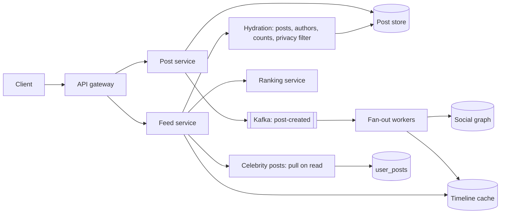

# News feed / timeline

!!! abstract "At a glance"
    **Priority:** P0 · **Complexity:** 3/5 · **Est. time:** 3 h · **Phase:** 2 · **Prereqs:** [Caching](../caching.md), [Messaging & streaming](../messaging-streaming.md), [Partitioning](../partitioning-sharding.md), [Consistency models](../consistency-models.md)
    **You're done when:** you can defend a hybrid fan-out design with a numeric celebrity threshold, size the timeline cache, and explain how ranking changes the architecture.

The feed question tests one idea above all: **where do you pay the cost of the social graph — at write time or at read time?** Everything else (caching, ranking, pagination, consistency) follows from that choice.

## Problem statement

Design the home timeline for a Twitter/X-, Instagram- or LinkedIn-style product: users follow others; the home feed shows recent/relevant posts from followed accounts (plus recommendations), paginated, fast, on mobile.

## Clarifying questions to ask

| Question | Why it matters | Assumption |
|---|---|---|
| Follow model: asymmetric (Twitter) or symmetric (Facebook friends)? | Fan-out skew | Asymmetric; some accounts have 100 M followers |
| Chronological or ranked? | Ranking needs candidate generation + ML serving | Ranked, with a "Latest" chronological toggle |
| Media? | Storage/CDN, not feed logic | Yes; media via [CDN](../storage-cdn.md), feed carries IDs |
| Freshness expectation? | Fan-out latency SLO | New post visible to followers in < 5 s p95 |
| Scale (DAU, posts/day, feed opens)? | Sizing | 500 M DAU, 100 M posts/day, 10 feed loads/user/day |
| Edits/deletes/blocks/privacy? | Correctness on read | Must be honoured on read (filter at hydration) |

## Functional & non-functional requirements

**Functional:** publish post; follow/unfollow; get home feed (cursor-paginated); get user profile timeline; like/comment counts; hide/block/mute.

**Non-functional:** feed p99 < 200 ms server-side; availability 99.95% for reads (a stale feed beats no feed); eventual consistency acceptable (a post can take seconds to appear) but **deletes and blocks must be enforced on read**; publish must never be lost.

## Back-of-envelope estimation

```text
Feed reads:   500 M DAU × 10 = 5 B/day ≈ 58 k/s avg → peak ×3 ≈ 175 k/s
Posts:        100 M/day ≈ 1,160 /s avg → peak ≈ 5 k/s
Avg fan-out:  ~200 followers/post (median far lower, mean dragged up by celebrities)
Fan-out writes (push): 100 M × 200 = 20 B timeline inserts/day ≈ 230 k/s avg, spikes to millions/s
Timeline cache: keep last 800 entries/user × (8 B post ID + 8 B author/flags) ≈ 13 KB
               × 300 M active users ≈ 3.9 TB in memory (Redis/Memcached cluster ~60–80 nodes @ 64 GB)
Post store:   100 M/day × ~1 KB (text + metadata) ≈ 100 GB/day ≈ 36 TB/yr (media separate)
Feed response: 20 posts × ~1 KB hydrated ≈ 20 KB → 175 k/s × 20 KB ≈ 3.5 GB/s egress at peak
```

Say it: *push fan-out is ~200x write amplification; a single 100 M-follower account posting would enqueue 100 M writes — at 1 M inserts/s that's 100 s of lag.* That number motivates the hybrid.

## API design

```http
POST /v1/posts                { "text": "...", "media_ids": [...], "visibility": "public" }  Idempotency-Key: ...
GET  /v1/feed?cursor=<opaque>&limit=20   → { "items": [ {post...} ], "next_cursor": "..." }
GET  /v1/users/{id}/posts?cursor=...
POST /v1/follows              { "followee_id": "..." }
```

Use **opaque cursors** (encode `(score, post_id)` or a snapshot ID), never offsets — the feed mutates between page loads and offsets cause duplicates/skips (see [API design](../api-design.md)).

## Data model

| Entity | Store | Key / partitioning |
|---|---|---|
| `posts` | Wide-column (Cassandra/Manhattan) or sharded MySQL | `post_id` (Snowflake, time-sortable) |
| `user_posts` | Wide-column | partition `author_id`, cluster `post_id DESC` |
| `follows` / `followers` | Graph store or two adjacency tables (Facebook TAO-style) | `(follower_id → followee_id)` and reverse |
| `home_timeline` | Redis lists / sorted sets | `timeline:{user_id}` → capped list of post IDs |
| counters (likes) | Sharded counters + cache | `post_id` |

## High-level design



## Deep dives

### 1. Fan-out on write vs read vs hybrid

| | Push (fan-out on write) | Pull (fan-out on read) | Hybrid |
|---|---|---|---|
| Write cost | O(followers) per post | O(1) | O(followers) for normal users |
| Read cost | O(1) read of precomputed list | O(followees) merge per read | O(1) + merge of few celebrities |
| Latency | Fast reads | Slow reads (merge 500 timelines) | Fast |
| Waste | Pushes to inactive users | None | Skip inactive users |
| Celebrity problem | Catastrophic | None | Solved |

**Decision:** hybrid. Push for authors below a threshold (~10 k–100 k followers — tune by measuring fan-out lag), pull for celebrities at read time and merge. Skip push to users inactive > 30 days; rebuild their timeline on next login from `user_posts` of followees. This is essentially what Twitter described publicly (see the InfoQ talk in Resources).

### 2. Ranking changes the architecture

Chronological feeds can be served straight from the timeline list. Ranked feeds become a **two-stage recommender**: candidate generation (followed posts from the timeline cache + celebrity pull + out-of-network recommendations via embeddings ANN) → lightweight ranker (hundreds of candidates, GBDT or small NN, < 30 ms) → heavy ranker (top ~100, larger model) → business rules / diversity / dedupe → blend ads. Trade-off table:

| Choice | Simple | Ranked |
|---|---|---|
| Latency budget | ~50 ms | ~150–250 ms (feature fetch dominates) |
| Infra | Cache + DB | + feature store, model serving, logging for training |
| Pagination | Cursor on time | Snapshot the ranked list per session (store top-N for 10–30 min) so page 2 is consistent |

**Decision:** keep push fan-out as the candidate source (cheap, fresh), and add ranking as a stage in the feed service with session snapshots. Log impressions for training — the feed is a data product.

### 3. Timeline storage format

Store **IDs only** (~16 B/entry) in the timeline cache, hydrate at read time. Pros: tiny memory footprint (13 KB vs ~800 KB per user with full posts), edits/deletes are automatically honoured. Con: hydration is a multi-get of 20–50 keys → must hit a post cache (Memcached-style, >99% hit rate). Facebook's memcache paper is the canonical reference for lease-based invalidation at this layer.

### 4. Consistency on read: deletes, blocks, privacy

Fan-out is async, so a deleted post may still be in 10 M timelines. Don't chase it; **filter at hydration**: posts table has `deleted` flag; blocked/muted sets are checked per request (small sets, cached). Privacy changes (account goes private) likewise. This is a key senior insight: *push the data, pull the policy.*

## Scaling & bottlenecks

- **Fan-out workers** are the throughput bottleneck: partition Kafka by author; batch timeline writes (pipeline 1 k Redis LPUSH+LTRIM per round trip); back-pressure when lag > SLO and degrade by switching borderline authors to pull.
- **Hot posts** (viral): counters via sharded counters/CRDT-ish increments, cache aggressively, batch updates to storage.
- **Graph reads:** followers of a 50 M account = 400 MB of IDs; page through in chunks, cache follower lists.
- **Thundering herd** on big events (World Cup goal): read-path load shedding — serve cached feed without ranking.

## Failure modes & reliability

| Failure | Effect | Mitigation |
|---|---|---|
| Timeline cache node loss | Users' feeds empty | Rebuild on read from `user_posts` (slow path, rate-limited); replicas |
| Fan-out lag | Posts appear late | Lag SLO + autoscale + temporary pull for affected authors |
| Ranking service down | No feed | Fall back to chronological from cache (graceful degradation) |
| Post store degraded | Hydration fails | Serve stale post cache; omit un-hydratable items rather than fail the page |
| Duplicate events | Duplicate entries | Idempotent inserts (sorted set keyed by post_id), dedupe at read |

## Security & multi-tenancy

Privacy is enforced **on read**, never trusted to fan-out. Audience-restricted posts (close friends) require ACL checks at hydration — a candidate for a Zanzibar-style authorization service ([security](../security-authn-authz.md)). Rate-limit posting and following (spam follow-bots inflate fan-out cost). For enterprise feeds (LinkedIn-like internal social), tenant isolation means separate graphs and keyspaces per org.

## How the design changes at 10x / in an AI-era variant

**10x:** push becomes too expensive even for mid-tier authors → raise pull share, move to per-region timeline caches, and compress timelines (delta-encoded IDs). Ranking cost dominates; distill models and cache features.

**AI-era variant:** (1) embedding-based out-of-network candidates (two-tower models + ANN index); (2) LLM-generated "catch-up summaries" of what you missed — generated lazily per user on open, cached, costed per DAU (e.g. 100 M summaries/day × ~2 k tokens is a real line item → use a small model and only for users away > 24 h); (3) LLM-based content understanding (topics, safety) computed once per post on the write path, not per viewer. Evals for summaries (faithfulness, no hallucinated posts) become part of the release process.

## What a Staff-level answer adds (vs senior)

- Quantifies the celebrity threshold and describes how to *tune it with a metric* (fan-out lag p95).
- Separates data freshness (eventual) from policy enforcement (strict, on read).
- Treats the feed as an ML system: logging, training data, feedback loops, experimentation platform, and guardrail metrics (not just engagement).
- Discusses cost per DAU and graceful degradation modes as explicit product decisions.
- Knows the organisational split: feed infra team vs ranking team vs integrity team, and designs interfaces (candidate sources as plugins) that let them ship independently.

## Resources

| Resource | Type | Why this one | Level | Cost |
|---|---|---|---|---|
| [Timelines at Scale — Raffi Krikorian (InfoQ)](https://www.infoq.com/presentations/Twitter-Timeline-Scalability/) :gem: | video | Primary source for Twitter's push/pull hybrid, with real numbers | advanced | free |
| [Hello Interview — Design Facebook News Feed](https://www.hellointerview.com/learn/system-design/problem-breakdowns/fb-news-feed) | article | Interview-paced, calls out what senior vs staff candidates say | intermediate | free |
| [TAO: Facebook's Distributed Data Store for the Social Graph (USENIX ATC '13)](https://www.usenix.org/conference/atc13/technical-sessions/presentation/bronson) | paper | How the graph layer is actually built | advanced | free |
| [Scaling Memcache at Facebook (NSDI '13)](https://www.usenix.org/conference/nsdi13/technical-sessions/presentation/nishtala) | paper | Leases, invalidation, thundering herds on the hydration cache | advanced | free |
| [Announcing Snowflake (Twitter)](https://blog.twitter.com/engineering/en_us/a/2010/announcing-snowflake) | article | Time-sortable IDs that make cursors cheap | intermediate | free |
| [Alex Xu — System Design Interview Vol 1, ch. 11](https://bytebytego.com) | book | Clean baseline design to compare against | intermediate | paid |

## Follow-up questions

### L2 — Apply

??? question "Q1. A user with 40 M followers posts. Walk through what happens in your hybrid design."
    ??? success "Answer"
        Author is flagged celebrity (above threshold), so no push. The post is written to `posts` and `user_posts(author)`. When a follower loads the feed, the feed service reads their precomputed timeline (push entries from normal authors) plus, for each followed celebrity (typically < 50 per user), the latest N posts from `user_posts` (heavily cached, since millions read the same list), merges by time/score, ranks, hydrates. Cost: a few extra cache reads per feed load instead of 40 M writes.

??? question "Q2. Estimate memory for timeline caches if you store 800 IDs for every one of 2 B registered users vs only 300 M monthly actives."
    ??? success "Answer"
        800 × 16 B ≈ 12.8 KB/user. 2 B users → ~25.6 TB; 300 M → ~3.8 TB. With Redis overhead (~1.5–2x for list encoding) ≈ 40–50 TB vs 6–8 TB. Storing only actives saves ~85%; inactive users get their timeline rebuilt on login (a few hundred ms once). Clear win.

??? question "Q3. Why are offset-based pages wrong for a feed, and what do you use instead?"
    ??? success "Answer"
        New posts are inserted at the head between requests, so `offset=20` shifts and the user sees duplicates or misses items. Use an opaque cursor encoding the last item's sort key `(score or timestamp, post_id)` for chronological feeds; for ranked feeds, snapshot the ranked candidate list server-side (session ID + position) with a 10–30 min TTL.

### L3 — Design & trade-offs

??? question "Q4. How do you pick the celebrity threshold, and should it be static?"
    ??? success "Answer"
        Derive from fan-out capacity and freshness SLO: if workers sustain 1 M inserts/s and the SLO is p95 < 5 s, one author's fan-out must finish well within that; cost-wise, compare push cost (followers × write) to pull cost (followers' read rate × merge overhead). In practice 10 k–100 k. Make it **dynamic**: classify by follower count *and* post rate; temporarily move authors to pull when lag rises. Track fan-out lag p95 and feed latency p99 as the control metrics.

??? question "Q5. Deleted posts keep appearing in feeds. Where's the bug likely and what's the right design?"
    ??? success "Answer"
        Likely the timeline or post cache stores hydrated post bodies and relies on fan-out to remove deleted items. Right design: timelines hold IDs only; hydration reads the post (cache with invalidation on delete; deletion writes a tombstone and invalidates the post cache key); feed service filters tombstoned/blocked items and back-fills to keep page size. Never rely on async fan-out to enforce correctness-critical policy.

??? question "Q6. Ranking model latency grew from 40 ms to 150 ms. How do you protect the feed SLO?"
    ??? success "Answer"
        Hard timeout on the ranker with fallback (chronological or last snapshot), cascade ranking (cheap model on 500 candidates, heavy on top 50), precompute features asynchronously, cache ranked lists per session, and move heavy ranking to prefetch when the app backgrounds. Define a latency budget per stage and enforce it in CI with load tests.

### L4 — Staff-level ambiguity

??? question "Q7. Product wants to add AI catch-up summaries for all 500 M DAU. Evaluate feasibility and propose a rollout."
    ??? success "Answer"
        Cost model first: 500 M × (2 k input + 200 output tokens) per day is ~1.1 T tokens/day — expensive even with small models. Scope: only users away > 24 h (maybe 20% of DAU), lazily on open, cached 12 h; use a small model with prompt caching of shared context. Risks: hallucinated or misattributed posts (need faithfulness evals + citations to post IDs), privacy (never summarise content the viewer can't see — summarise post-hydration, post-ACL), latency (stream or show after feed). Roll out via A/B with guardrail metrics (report rate, time spent, cost per DAU). Present a cost/benefit to leadership with a kill criterion.

??? question "Q8. Two teams own feed infra and ranking; every ranking launch needs infra changes and velocity is poor. What do you change?"
    ??? success "Answer"
        Define a stable contract: candidate sources and rankers as plugins behind interfaces (candidate schema, feature fetch API, latency budget), a config-driven pipeline so ranking can ship models and features without infra deploys, shared experimentation platform. Establish an SLO-backed platform team (infra) and stream-aligned product teams (ranking) — Team Topologies. Measure lead time for ranking launches before/after.

??? question "Q9. Regulators require a non-personalised chronological feed option in one region. Impact?"
    ??? success "Answer"
        Architecturally cheap if you kept push timelines as the candidate source: serve chronological directly, bypass ranking and out-of-network candidates. Engineering work is in consistency of the experience (ads, recommendations off), auditing (log which mode served each request), and ensuring no personalization signals leak (e.g. candidate ordering). Build it as a first-class mode, not a flag hack — other regions will follow.

## Checklist

- [ ] I can compute fan-out write amplification and explain the celebrity problem with numbers
- [ ] I can draw the hybrid design and the ranked two-stage pipeline
- [ ] I can explain "push data, pull policy" for deletes/blocks
- [ ] I can justify cursors and session snapshots for ranked pagination
- [ ] I answered all L3 questions out loud in < 3 min each
