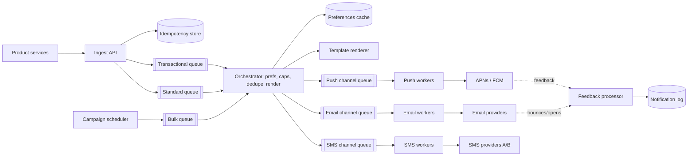

# Notification system

!!! abstract "At a glance"
    **Priority:** P0 · **Complexity:** 3/5 · **Est. time:** 2 h · **Phase:** 3 · **Prereqs:** [Messaging & streaming](../messaging-streaming.md), [Rate limiting](../rate-limiting.md), [Reliability patterns](../reliability-patterns.md), [API design](../api-design.md)
    **You're done when:** you can design a multi-channel notification platform with priority isolation, preferences, dedupe and provider failover, and explain why "exactly-once notification" is a product promise you engineer approximately.

A notification platform looks like "put a message on a queue and call APNs". The real design problems are **priority isolation** (an OTP must never wait behind a marketing blast), **user preferences and fatigue**, **third-party provider limits and failures**, and **idempotency** across retries.

## Problem statement

Design a shared notification service used by dozens of internal product teams to send push (iOS/Android/web), email, SMS, and in-app notifications — transactional (OTP, order shipped, payment failed) and bulk (marketing, digests) — with templates, preferences, scheduling, and delivery tracking.

## Clarifying questions to ask

| Question | Why | Assumption |
|---|---|---|
| Transactional vs marketing mix? | Priority classes, compliance | Both; transactional is latency-critical |
| Channels? | Provider integrations | APNs, FCM, web push, email (SES/SendGrid), SMS (Twilio-like), in-app |
| Volume and burstiness? | Queue sizing | 1 B/day avg; campaigns send 50 M in 30 min |
| Latency SLO? | Architecture of hot path | OTP p99 < 5 s end-to-end to provider; marketing within 1 h |
| Who owns content/templates? | Multi-tenancy | Product teams own templates; platform owns delivery |
| Legal constraints? | Opt-in, quiet hours, unsubscribe | CAN-SPAM/GDPR/TCPA-style rules; per-country SMS rules |

## Functional & non-functional requirements

**Functional:** send API (single + batch + audience/segment); templates with localisation; user preferences per category × channel; quiet hours & timezone-aware scheduling; dedupe; rate/frequency caps; delivery status (sent, delivered, opened, bounced); device token management; in-app inbox.

**Non-functional:** transactional p99 < 5 s; no lost transactional notifications (at-least-once, deduped); tenant isolation (one team's bug can't flood users or starve others); 99.95% availability of the ingest API; auditability.

## Back-of-envelope estimation

```text
Volume:      1 B/day ≈ 11.6 k/s avg
Campaign burst: 50 M in 30 min ≈ 28 k/s on top of baseline → plan for ~60 k/s peak
Channel mix (assumed): push 70%, email 20%, SMS 2%, in-app 8%
  push  ≈ 8 k/s avg, 40 k/s peak     email ≈ 2.3 k/s avg     SMS ≈ 230 /s avg (≈ 20 M/day)
SMS cost:    20 M/day × ~$0.01–0.05 (varies hugely by country) ≈ $200 k–1 M/day → SMS must be gated
Storage:     notification log 1 B × ~500 B ≈ 500 GB/day; keep 30–90 days hot ≈ 15–45 TB
Device tokens: 500 M users × 2 devices × ~200 B ≈ 200 GB
Preferences: 500 M × ~1 KB ≈ 500 GB, read on every send → cache (hit rate > 99%)
```

Two facts drive the design: SMS is **expensive** (cost controls are a requirement, not a nice-to-have), and providers throttle you (APNs/FCM/SES quotas), so your throughput is bounded by *their* limits.

## API design

```http
POST /v1/notifications
Idempotency-Key: order-123-shipped
{
  "tenant": "orders-team",
  "category": "order_updates",          # maps to preference + priority class
  "priority": "transactional",           # transactional | standard | bulk
  "recipient": { "user_id": "u_42" },
  "template_id": "order_shipped_v3",
  "data": { "order_id": "123", "eta": "2026-09-28" },
  "channels": ["push", "email"],        # optional; else resolved by policy
  "send_at": null, "expires_at": "2026-09-26T00:00:00Z"
}
→ 202 { "notification_id": "n_...", "status": "accepted" }

POST /v1/campaigns   { "segment_id": "...", "template_id": "...", "schedule": {...}, "throttle_per_min": 500000 }
GET  /v1/notifications/{id}   → status per channel
```

`202 Accepted` — the API is async. `expires_at` matters: an OTP delivered 10 minutes late is worse than not delivered.

## Data model

| Entity | Store | Notes |
|---|---|---|
| `notifications` | Wide-column / DynamoDB, TTL 90 d | id, tenant, user, category, status per channel, timestamps |
| `idempotency` | Redis / DynamoDB with TTL (24–72 h) | `(tenant, key) → notification_id` |
| `preferences` | KV + cache | user × category × channel → on/off, quiet hours, timezone |
| `devices` | KV | user → [token, platform, app version, last_seen]; prune invalid tokens |
| `templates` | Postgres (versioned) | per locale, per channel |
| `inbox` | Wide-column | `user_id` partition, `created_at DESC` |

## High-level design



Two layers of queues: **priority queues** before orchestration (isolation by urgency) and **channel queues** after (isolation by provider, so a slow SMS provider doesn't back up push).

## Deep dives

### 1. Priority isolation and fairness

| Option | Pros | Cons |
|---|---|---|
| One queue, priority field | Simple | Head-of-line blocking; bulk starves transactional |
| Separate queues per priority, dedicated consumers | Hard isolation | Idle capacity in quiet classes |
| Weighted fair queuing across priorities + per-tenant sub-queues | Efficient + fair | More complex scheduler |

**Decision:** separate physical queues per priority with dedicated minimum consumer capacity for transactional, plus per-tenant token buckets inside bulk/standard so one team can't monopolise throughput. Campaigns are *metered* into the bulk queue by the scheduler (e.g. 500 k/min) instead of dumped at once.

### 2. Idempotency and dedupe

Three distinct layers: (a) API idempotency key — retries from callers; (b) orchestrator dedupe — the same business event emitted by two services (content hash per user per window); (c) provider-level — APNs/FCM have collapse IDs so repeated pushes replace rather than stack. True exactly-once to a phone is impossible (provider accepted, ack lost → retry → duplicate), so aim for **at-least-once with dedupe keys and collapse IDs**, and make the product copy idempotent ("Your order has shipped" twice is tolerable; "$500 charged" twice is not — those need stronger dedupe).

### 3. Preferences, frequency caps and quiet hours

Evaluate per notification: category opt-in → channel opt-in → frequency cap (e.g. max 3 marketing pushes/day, sliding window counter in Redis) → quiet hours (defer to user's local morning, unless transactional) → channel selection (push if active device, else email; SMS only for OTP/critical). Keep this as a **policy engine with versioned rules**, not code in each product team. Store the evaluation result in the log — "why didn't I get the notification?" is the top support question.

### 4. Provider failover and backpressure

| Concern | Approach |
|---|---|
| Provider rate limits | Token bucket per provider account; respect 429/Retry-After |
| Provider outage | Circuit breaker per provider; failover to secondary SMS/email provider (costs + deliverability differ) |
| Invalid tokens | APNs 410 / FCM UNREGISTERED → delete token (else wasted sends and sender reputation hit) |
| Email reputation | Separate IP pools / subdomains for transactional vs marketing so marketing complaints don't hurt OTP deliverability |
| Retries | Exponential backoff with jitter, bounded by `expires_at`; DLQ after N attempts |

## Scaling & bottlenecks

- Orchestrator is stateless → scale horizontally; preferences cache must absorb ~60 k lookups/s.
- Campaign fan-out: resolve segments (50 M users) in batches from a data warehouse export; shard by user ID; stream into bulk queue at a controlled rate.
- Connection pooling to APNs (HTTP/2, many concurrent streams per connection) — Discord described handling push bursts of over a million requests per minute with Elixir GenStage-based backpressure.
- Notification log write volume (500 GB/day) → append-only wide-column with TTL; analytics into OLAP.

## Failure modes & reliability

| Failure | Impact | Mitigation |
|---|---|---|
| Buggy product service loops, sends 10 M pushes to one user | User rage, uninstalls | Per-user frequency caps as hard safety limit; per-tenant anomaly detection + auto-pause |
| Campaign sent to wrong segment | Brand/legal incident | Two-person approval, dry-run counts, canary send to 1% with metric check |
| APNs degraded | Push delays | Queue buffers; expire stale notifications; fall back to in-app inbox |
| Preferences store down | Can't evaluate opt-out | Fail **closed** for marketing (don't send), fail open for transactional with safe defaults |
| Duplicate delivery after retry | Annoyance | Collapse IDs, dedupe windows |

## Security & multi-tenancy

- Tenants (product teams) authenticate with service identities; categories are registered and owned; a tenant can only send categories it owns.
- PII in payloads: minimise content in push bodies (lock-screen visibility); don't put OTPs in logs; encrypt the notification log.
- Compliance: unsubscribe links (one-click), consent records with timestamps, per-country SMS sender rules, data retention.
- Quotas per tenant for cost (SMS budget per team/month with alerting).

## How the design changes at 10x / in an AI-era variant

**10x (10 B/day):** provider limits bind first → multiple provider accounts/regions, regional orchestrators near users, and more aggressive batching (email via bulk APIs). The notification log moves to object storage + table format for analytics.

**AI-era variant:** (1) **send-time optimisation** and channel selection via ML (predict engagement per user/hour); (2) LLM-generated/personalised copy — generate per *segment* and template variant, not per user, cache it, and run brand/safety evals before a campaign goes out; (3) **notification summarisation** (bundle 12 low-priority pings into one digest, like OS-level AI summaries) — needs faithfulness evals because a mis-summarised security alert is dangerous; (4) agents as senders: an agent that can trigger notifications must be rate-limited and scope-restricted like any tenant, with human approval for bulk sends.

## What a Staff-level answer adds (vs senior)

- Treats the platform as a **multi-tenant product** with governance: category registry, ownership, quotas, approval workflows for campaigns.
- Explicitly designs **fail-open vs fail-closed** per category.
- Brings in cost (SMS), deliverability/reputation (IP pools), and legal constraints as first-class requirements.
- Defines SLOs per priority class and measures end-to-end latency from event to provider acceptance, plus "notification regret" metrics (unsubscribes, disables).

## Resources

| Resource | Type | Why this one | Level | Cost |
|---|---|---|---|---|
| [Uber's Real-Time Push Platform](https://www.uber.com/gb/en/blog/real-time-push-platform/) | article | RAMEN: real-time push at Uber scale, delivery guarantees | advanced | free |
| [Uber's Next Gen Push Platform on gRPC](https://www.uber.com/us/en/blog/ubers-next-gen-push-platform-on-grpc/) :gem: | article | Why acks on a bidirectional stream improved delivery rates | advanced | free |
| [Discord — push request bursts with GenStage](https://discord.com/blog/how-discord-handles-push-request-bursts-of-over-a-million-per-minute-with-elixirs-genstage) :gem: | article | Backpressure design against provider limits | intermediate | free |
| [Firebase Cloud Messaging docs](https://firebase.google.com/docs/cloud-messaging) | docs | Collapse keys, priorities, token lifecycle | intermediate | free |
| [RFC 8030 — Generic Event Delivery Using HTTP Push](https://www.rfc-editor.org/rfc/rfc8030) | docs | Web push semantics (TTL, urgency, topics) | advanced | free |
| [AWS Builders' Library — Timeouts, retries and backoff with jitter](https://aws.amazon.com/builders-library/timeouts-retries-and-backoff-with-jitter/) | article | Retry discipline for provider calls | intermediate | free |
| [Alex Xu — System Design Interview Vol 1, ch. 10](https://bytebytego.com) | book | Baseline interview design | intermediate | paid |

## Follow-up questions

### L2 — Apply

??? question "Q1. An OTP must arrive within 10 s but a 50 M marketing campaign is running. Show how your design guarantees it."
    ??? success "Answer"
        OTP goes to the transactional queue with dedicated consumers (reserved capacity, e.g. 20% of orchestrator pool that bulk can't use), then to an SMS channel queue partitioned by priority with its own provider rate-limit budget reserved for transactional. Campaign traffic is metered by the scheduler and limited by per-tenant buckets. Measure: transactional p99 end-to-end with an alert at 5 s. `expires_at` = 5 min so a stale OTP is dropped rather than sent.

??? question "Q2. Estimate the Redis footprint for frequency caps: 500 M users, 3 categories capped, 24 h sliding window."
    ??? success "Answer"
        Use fixed-window counters per (user, category, day): key ~40 B + value 8 B + overhead ~50 B ≈ 100 B. Only users who received a capped notification today need a key — say 150 M × 3 ≈ 450 M keys × 100 B ≈ 45 GB. A sliding log per user would be far larger; approximate sliding window (two fixed windows weighted) is fine. Shard across ~6–8 nodes with replicas; TTL 48 h.

??? question "Q3. APNs returns 410 for 8% of tokens in a campaign. What do you do?"
    ??? success "Answer"
        Delete those tokens immediately (410 = token no longer valid), record the timestamp so late re-registrations with an older timestamp don't resurrect them, and alert if the rate is anomalous (a mass-invalidation often means an app-signing/environment mismatch — sandbox vs production — not real uninstalls). Pruning stale tokens also reduces wasted throughput.

### L3 — Design & trade-offs

??? question "Q4. Build vs buy (e.g. a SaaS like Braze/OneSignal/Twilio) for the notification platform?"
    ??? success "Answer"
        Buy gets you templates, segmentation, analytics, deliverability expertise quickly; costs scale per message/MAU and you inherit their limits and data residency. Build when volume makes per-message pricing dominant, when you need deep integration with internal preferences/identity, or strict residency. Common hybrid: build the ingest/orchestration/preferences layer (your policy, your data), plug in providers as channel adapters, and buy marketing campaign tooling. Decide with a 3-year TCO including headcount (a platform like this is 4–8 engineers).

??? question "Q5. Should preference checks happen at ingest or at send time?"
    ??? success "Answer"
        At send time (orchestrator), because notifications can be scheduled/deferred (quiet hours, campaigns) and preferences can change in between; an opt-out must be honoured for queued items. Optionally also a cheap early check at ingest to reject obviously opted-out traffic and save queue capacity. Log the decision for support.

??? question "Q6. Kafka vs SQS/RabbitMQ for the channel queues?"
    ??? success "Answer"
        Per-message retries with visibility timeouts, delayed delivery, and DLQs are native in SQS/RabbitMQ — ideal for provider calls that fail individually. Kafka excels at high-throughput ordered logs and replay (good for the ingest event stream and analytics) but per-message retry requires retry topics and consumer logic. Reasonable decision: Kafka for ingest/event log, a work queue (SQS/RabbitMQ or Kafka with retry topics) for channel delivery. Ordering per user rarely matters for notifications, which favours work queues.

### L4 — Staff-level ambiguity

??? question "Q7. 14 product teams each built their own notification sending. Users complain about spam. Propose a convergence strategy."
    ??? success "Answer"
        Start with data: measure notifications per user per day across teams (usually shocking). Create the platform with a minimal paved road (ingest API + preferences + caps), migrate the highest-volume senders first, and make global frequency caps the carrot/stick (teams outside the platform can't guarantee compliance). Governance: category registry, notification review for new categories, per-team budgets. Success metrics: notifications/user/day, opt-out rate, uninstall rate. Timeline 2–3 quarters; sponsor at VP level because it constrains product teams.

??? question "Q8. Marketing wants LLM-personalised copy per user for every campaign. What's your recommendation?"
    ??? success "Answer"
        Quantify: 50 M users × ~300 tokens is ~15 B tokens per campaign — real cost and latency; also risk of off-brand or incorrect claims at scale with no human review. Recommend: generate a small number of variants per segment (10–50), human-approve them, run automated brand/safety/claims evals, and use a bandit to pick variants per user. Per-user generation only for high-value, low-volume flows. Present the cost/risk comparison and an A/B plan with a guardrail on unsubscribe rate.

??? question "Q9. A bug sent 3 M users a 'your payment failed' notification. You're incident lead. What systemic changes follow?"
    ??? success "Answer"
        Immediate: pause tenant, send a correction via same channels, status page. Postmortem changes: anomaly detection on per-category send volume vs baseline with auto-pause; mandatory canary (1% then ramp) for any sender above N/min; sensitive categories (payments, security) require stronger dedupe and approval; template tests with production-like data; runbook for corrections. Track time-to-detect and time-to-pause as SLOs.

## Checklist

- [ ] I can draw the two-layer queue design and explain why both layers exist
- [ ] I can explain the three dedupe layers and why exactly-once is approximate
- [ ] I can list fail-open vs fail-closed decisions per category
- [ ] I can discuss provider limits, token hygiene, and email reputation isolation
- [ ] I answered all L3 questions out loud in < 3 min each
