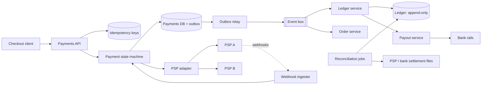
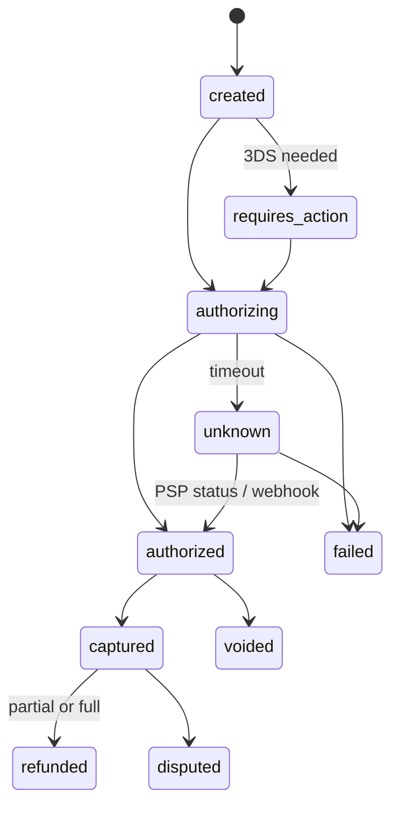

# Payment system

!!! abstract "At a glance"
    **Priority:** P0 · **Complexity:** 4/5 · **Est. time:** 3 h · **Phase:** 4 · **Prereqs:** [API design](../api-design.md), [Reliability patterns](../reliability-patterns.md), [Consistency models](../consistency-models.md), [Databases](../databases-sql-nosql.md), [Security](../security-authn-authz.md)
    **You're done when:** you can design a payment flow that never double-charges and never loses money under retries, timeouts and partial failures — with idempotency keys, a payment state machine, a double-entry ledger, and reconciliation.

Payments invert the usual interview: QPS is low, but **correctness is absolute**. The interviewer wants to hear how you handle the unknown outcome — "we called the card network and timed out; did the customer get charged?"

## Problem statement

Design the payment backend for an e-commerce/marketplace platform (think checkout at Amazon, Airbnb, or a logistics booking platform): accept payments via external payment service providers (PSPs: Stripe, Adyen, …), track money movement internally, pay out to sellers, handle refunds and chargebacks, and reconcile with bank/PSP statements.

## Clarifying questions to ask

| Question | Why | Assumption |
|---|---|---|
| Do we hold card data or use a PSP? | PCI DSS scope | PSP with tokenisation (hosted fields) — we never see PANs |
| Pay-in only or marketplace with payouts? | Ledger complexity | Marketplace: pay-in, hold, pay-out to sellers, platform fee |
| Currencies / FX? | Ledger design | Multi-currency, amounts in minor units; FX at pay-out |
| Volume? | Sizing | 10 M payments/day, peak 20x on sale days |
| Synchronous confirmation required? | Flow design | Yes for card auth; capture/pay-out async |
| Regulatory? | Audit, retention | 7–10 yr immutable records, SCA/3DS in EU |

## Functional & non-functional requirements

**Functional:** create payment intent; authorise/capture/void/refund; 3DS challenge flow; webhooks from PSP; wallet/balance per seller; payouts; ledger; reconciliation; reporting.

**Non-functional:** **exactly-once effect** (no double charge, no lost payment); strong consistency for balances; full auditability (immutable, append-only); availability 99.99% for checkout (every minute down is lost revenue); p99 checkout API < 1 s excluding PSP latency; PCI DSS scope minimised.

## Back-of-envelope estimation

```text
Payments:  10 M/day ≈ 116 /s avg → sale-day peak ×20 ≈ 2,300 /s
Ledger:    each payment ≈ 4–8 ledger entries (auth hold, capture, fee, seller credit, payout...)
           → ~60 M entries/day ≈ 700 /s avg, ~14 k/s peak
Storage:   60 M × ~300 B ≈ 18 GB/day ≈ 6.5 TB/yr; 10 yr retention ≈ 65 TB (fine for sharded Postgres)
PSP latency: auth 300 ms–2 s p50, tails to 10 s+ → timeouts are routine, not exceptional
Webhooks:  ~3 per payment ≈ 30 M/day ≈ 350 /s avg
```

Say it: *the numbers are small; a well-sharded relational database handles them. The design is about state machines, idempotency, and reconciliation.*

## API design

```http
POST /v1/payment_intents
Idempotency-Key: checkout-8f2c...
{ "order_id": "o_123", "amount": 12999, "currency": "EUR", "customer_id": "c_9", "payment_method_token": "pm_tok_..." }
→ 201 { "id": "pi_1", "status": "requires_action", "next_action": { "type": "3ds_redirect", "url": "..." } }

POST /v1/payment_intents/{id}/confirm     Idempotency-Key: ...
POST /v1/payment_intents/{id}/capture     { "amount": 12999 }
POST /v1/refunds                          { "payment_intent": "pi_1", "amount": 5000 }  Idempotency-Key: ...
POST /internal/webhooks/psp               # signed; deduped by PSP event id
```

Idempotency semantics (Stripe's model): the server stores `(key, request_hash) → response`; a replay with the same key returns the stored response; same key with a different body → 422. Keys expire after ~24 h.

## Data model

| Table | Key | Notes |
|---|---|---|
| `payment_intents` | `id` | order_id, amount, currency, status (state machine), psp, psp_reference, version |
| `payment_attempts` | `id` | intent_id, attempt_no, psp request id, outcome, raw response |
| `idempotency_keys` | `(merchant, key)` | request hash, locked_at, response code/body, recovery point |
| `ledger_entries` | `id` (append-only) | txn_id, account_id, amount (signed, minor units), currency, created_at |
| `ledger_transactions` | `id` | description, idempotency ref; invariant: entries sum to 0 per currency |
| `accounts` | `id` | type (customer_receivable, seller_payable, platform_revenue, psp_clearing, …) |
| `outbox` | `id` | events to publish (payment.succeeded) in same DB txn |

**Double-entry:** every movement debits one account and credits another; the sum of all entries is always zero. Balances are derived (materialised with a version for fast reads).

## High-level design



## Deep dives

### 1. Idempotency end-to-end

Every hop needs its own key: client→API (`Idempotency-Key`), API→PSP (pass a deterministic key, e.g. `pi_1:attempt_2`, which PSPs like Stripe honour), PSP→us (webhook `event_id` dedupe), service→ledger (`txn_id` unique constraint). Implementation per Brandur's pattern: an idempotency row with **recovery points** — atomic phases committed locally so a crashed request resumes from the last phase instead of starting over. Airbnb's Orpheus library formalised the same idea and notes a trap: *read the idempotency record from the primary, not a lagging replica*, or retries can double-execute.

### 2. Handling unknown outcomes (the timeout problem)

| Option | Pros | Cons |
|---|---|---|
| Treat timeout as failure, let user retry | Simple | **Double charge** if PSP actually succeeded |
| Retry immediately with same PSP idempotency key | Safe if PSP dedupes | Retry storms; PSP key TTL limits |
| Mark `UNKNOWN`, query PSP status / await webhook, then resolve | Correct | Latency; user sees "processing" |

**Decision:** state machine with explicit `PENDING_UNKNOWN`. On timeout: respond "processing" to the client, schedule status polling with backoff and rely on webhooks; a reconciliation sweeper resolves any intent stuck > N minutes. Never create a *new* PSP attempt until the previous attempt's outcome is known. This single idea is the heart of the interview.



### 3. Ledger design

| Option | Pros | Cons |
|---|---|---|
| Mutable balance column | Simple | No audit, race conditions, can't explain history |
| Double-entry append-only in relational DB | Auditable, invariants via transactions | Hot accounts (platform revenue) contend |
| Purpose-built ledger DB (TigerBeetle) | Very high throughput, built-in double-entry | New operational tech; integration |
| Event-sourced ledger on a log | Replayable | Harder to enforce invariants synchronously |

**Decision:** double-entry, append-only in Postgres, sharded by account; each ledger transaction written atomically with a sum-to-zero check; hot accounts split into N sub-accounts (sum on read). Corrections are **reversing entries**, never updates. Stripe's Ledger (Feb 2024 post) processes ~5 B events/day and treats explainability of every money movement as the product.

### 4. Reconciliation

Three-way match daily (and intraday for high volume): internal ledger ↔ PSP reports ↔ bank settlement files. Mismatch categories: missing internally (webhook lost), missing at PSP (our false success), amount/currency/fee differences, timing (settlement T+1/T+2). Output: exception queue for finance ops with auto-resolution rules. Reconciliation is the safety net that makes at-least-once + idempotency trustworthy.

## Scaling & bottlenecks

- 2,300 payments/s peak is comfortable for a sharded relational DB (shard by merchant or intent ID).
- Hot rows: platform revenue/fee accounts → sub-account splitting or batched aggregation.
- PSP rate limits and latency → connection pools, bulkheads per PSP, circuit breakers.
- Webhook bursts after PSP recovery → queue then process idempotently.

## Failure modes & reliability

| Failure | Mitigation |
|---|---|
| PSP timeout / unknown | `unknown` state, status query, webhook, sweeper |
| Our service crashes mid-request | Idempotency recovery points; outbox guarantees events are published after commit |
| Duplicate webhooks, out-of-order | Dedupe by event id; state machine rejects illegal transitions; use PSP object state, not event order |
| PSP outage | Route to secondary PSP for *new* payments (tokens may be PSP-specific → network tokens help) |
| Ledger/payments divergence | Continuous consistency checks + reconciliation |
| Region failure | Active-passive with synchronous replication for payments DB (RPO 0 is often required) — see [multi-region](../multi-region-dr.md) |

## Security & multi-tenancy

- **PCI DSS:** hosted fields/tokenisation keep PANs off your servers → drastically smaller scope (SAQ A vs full assessment).
- SCA/3DS2 in the EU; fraud scoring before auth (rules + ML, e.g. velocity checks).
- Webhook signature verification; mTLS to internal services; secrets in HSM/KMS.
- Least privilege: only the ledger service writes ledger tables; refunds above thresholds need 4-eyes approval.
- Multi-tenant marketplaces: per-merchant accounts, KYC/AML checks before payouts, data segregation for audits.

## How the design changes at 10x / in an AI-era variant

**10x:** ledger throughput becomes the constraint (~140 k entries/s peak) → purpose-built ledger DB or batched posting, sharded accounts, and asynchronous balance materialisation; multiple PSPs with smart routing by cost/auth rate.

**AI-era variant:** (1) **agentic commerce** — AI agents initiating payments on behalf of users (card-network agent tokens, delegated mandates with spending limits, merchant-side agent protocols emerging in 2025–26): design scoped, revocable payment credentials with per-agent limits, explicit user confirmation above thresholds, and audit trails attributing each payment to an agent + user; (2) LLM-assisted reconciliation exception triage and dispute evidence drafting — humans approve, models suggest; never let a model post ledger entries; (3) ML fraud models remain the core AI use and need drift monitoring.

## What a Staff-level answer adds (vs senior)

- Names the unknown-outcome problem first and designs the state machine around it.
- Treats reconciliation and finance operations as part of the system, with owners and SLAs.
- Discusses PCI scope reduction as an architecture decision, and multi-PSP strategy (cost, auth rates, resilience, lock-in via tokens).
- Designs for auditors and regulators: immutable records, reversing entries, retention, segregation of duties.
- Knows where not to use microservices: keep the payment state machine and ledger writes transactionally close; use sagas + outbox at boundaries (see [architecture: sagas & outbox](../../architecture/sagas-outbox.md)).

## Resources

| Resource | Type | Why this one | Level | Cost |
|---|---|---|---|---|
| [Stripe — Designing robust and predictable APIs with idempotency](https://stripe.com/blog/idempotency) | article | The canonical explanation of idempotency keys | intermediate | free |
| [Brandur — Implementing Stripe-like Idempotency Keys in Postgres](https://brandur.org/idempotency-keys) :gem: | article | Recovery points, atomic phases — production-grade detail | advanced | free |
| [Airbnb — Avoiding double payments in a distributed payments system](https://medium.com/airbnb-engineering/avoiding-double-payments-in-a-distributed-payments-system-2981f6b070bb) | article | Orpheus library; replica-lag trap | advanced | free |
| [Stripe — Ledger: tracking and validating money movement](https://stripe.dev/blog/ledger-stripe-system-for-tracking-and-validating-money-movement) | article | Ledger + data quality at 5 B events/day | advanced | free |
| [Modern Treasury — Accounting for Developers](https://www.moderntreasury.com/journal/accounting-for-developers-part-i) :gem: | article | Clearest intro to double-entry for engineers | intermediate | free |
| [TigerBeetle docs](https://docs.tigerbeetle.com/) :gem: | docs | Purpose-built ledger DB; great reading on debit/credit invariants | advanced | free |
| [Stripe API — Idempotent requests](https://docs.stripe.com/api/idempotent_requests) | docs | Exact semantics (key TTL, body mismatch) | intermediate | free |
| [Hello Interview — Payment system](https://www.hellointerview.com/learn/system-design/problem-breakdowns/payment-system) | article | Interview-paced walkthrough | intermediate | free |

## Follow-up questions

### L2 — Apply

??? question "Q1. The client retries POST /payment_intents with the same Idempotency-Key while the first request is still in flight. What happens?"
    ??? success "Answer"
        The first request inserted the idempotency row with `locked_at` set (unique constraint on `(merchant, key)`). The second sees a locked, incomplete row → return `409 Conflict` (retry later) rather than executing concurrently. After the first completes, replays get the stored response. If the first crashed, the lock times out and a retry resumes from the last recovery point.

??? question "Q2. Write the ledger entries for a €100 marketplace sale with a 10% platform fee, then a €30 partial refund."
    ??? success "Answer"
        Sale (captured): debit `psp_clearing` 100, credit `seller_payable` 90, credit `platform_revenue` 10. Refund €30 (fee pro-rated): debit `seller_payable` 27, debit `platform_revenue` 3, credit `psp_clearing` 30. Each transaction sums to zero. When the PSP settles to the bank: debit `bank_cash`, credit `psp_clearing` (net of PSP fees, which go to a `psp_fees` expense account).

??? question "Q3. A PSP webhook says 'charge.succeeded' but your intent is 'failed' (you timed out and marked it failed). What now?"
    ??? success "Answer"
        This is exactly why you shouldn't mark timeouts as failed — use `unknown`. If it happened anyway: the PSP is the source of truth for card outcome; transition via a compensating path: either honour the order (if still possible) or immediately refund, with ledger entries for both charge and refund. Alert — each occurrence is a customer-visible defect. Fix the state machine so `failed` is only set on a definitive PSP decline.

### L3 — Design & trade-offs

??? question "Q4. Microservices for payments: which boundaries, and where do you refuse to split?"
    ??? success "Answer"
        Reasonable services: checkout/payment orchestration, PSP adapters, ledger, payouts, fraud, reconciliation. Refuse to split the payment intent state and its idempotency record and outbox — they must commit in one local transaction. Ledger transaction entries must be atomic within the ledger service. Cross-service flows (payment succeeded → ledger → order fulfilment) use outbox + idempotent consumers (saga), not distributed 2PC.

??? question "Q5. Single PSP vs multi-PSP routing?"
    ??? success "Answer"
        Single: simpler, better pricing tiers, one integration. Multi: resilience to PSP outages, higher authorisation rates via routing (by card BIN/region), negotiating leverage. Costs: tokens are often PSP-scoped (use network tokens or a vault to be portable), reconciliation per PSP, more complex disputes. Decision threshold: once volume is large enough that a 1% auth-rate improvement or a 1-hour outage pays for the integration and team.

??? question "Q6. Balance reads for sellers are slow because you sum millions of entries. Fix without losing correctness."
    ??? success "Answer"
        Maintain a materialised balance per account updated in the same transaction as entries (with optimistic version), or periodic checkpoints (balance at entry N) + sum of entries after N. For hot accounts, split into sub-accounts. Verify materialised balances against full sums nightly. Keep the ledger append-only as source of truth.

### L4 — Staff-level ambiguity

??? question "Q7. Finance reports a €2 M discrepancy between the ledger and bank settlements last quarter. You lead the investigation and remediation."
    ??? success "Answer"
        Classify the gap via three-way reconciliation by day/PSP/currency: timing vs fees vs missing transactions vs FX. Typical causes: unrecorded PSP fees, chargebacks not ingested, lost webhooks, FX rounding. Remediation: correcting entries (reversals, never edits) approved by finance; systemic: daily automated reconciliation with exception SLAs, ingestion of all PSP report types, alarms on unreconciled amount thresholds. Communicate with finance leadership in money terms with a timeline; this is also a controls issue for auditors.

??? question "Q8. The product wants AI shopping agents to complete purchases autonomously for users. What must the payment platform provide?"
    ??? success "Answer"
        Delegated, scoped credentials (per-agent tokens with merchant/amount/time limits, revocable), strong customer authentication at mandate creation and step-up above limits, attribution of each payment to (user, agent, mandate) for disputes, fraud models retrained on agent behaviour patterns, and clear liability rules in terms. Architecturally: a mandate service in front of the payment intent API, with policy checks and full audit. Start with low limits and a narrow merchant set.

??? question "Q9. You inherit a payment system where balances are mutable columns updated in place. Plan the migration to a double-entry ledger."
    ??? success "Answer"
        Phase 1: start writing double-entry entries in parallel (shadow ledger) for every new movement; compare derived balances to mutable balances daily; investigate diffs. Phase 2: backfill opening balances as entries at a cutover date (audited). Phase 3: switch reads to ledger-derived balances per cohort. Phase 4: make mutable columns read-only, then remove. Throughout, keep reconciliation running and involve finance/audit early — their sign-off is the real exit criterion.

## Checklist

- [ ] I can draw the payment state machine including `unknown`
- [ ] I can explain idempotency at every hop (client, PSP, webhook, ledger)
- [ ] I can write double-entry postings for sale, fee, refund, payout
- [ ] I can describe three-way reconciliation and what it catches
- [ ] I answered all L3 questions out loud in < 3 min each
