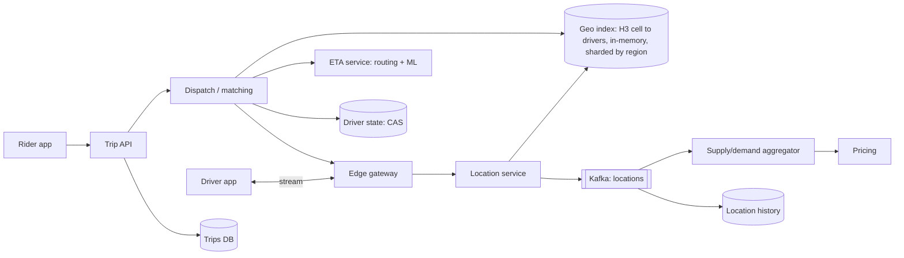

# Ride hailing / proximity service

!!! abstract "At a glance"
    **Priority:** P1 · **Complexity:** 4/5 · **Est. time:** 3 h · **Phase:** 5 · **Prereqs:** [Partitioning](../partitioning-sharding.md), [Caching](../caching.md), [Messaging & streaming](../messaging-streaming.md), [Consistency models](../consistency-models.md), [Multi-region & DR](../multi-region-dr.md)
    **You're done when:** you can design Uber-style location ingestion, a geospatial index (geohash/quadtree/H3), a dispatch/matching service with no double-assignment, and explain how it extends to logistics (trucks, containers, yards).

Two sub-problems hide inside: a **high-write, ephemeral geospatial index** (where are drivers right now?) and a **transactional matching workflow** (assign exactly one driver to one rider). Candidates who conflate them end up putting 250 k location writes/s into a transactional database.

## Problem statement

Design the backend for a ride-hailing app: drivers stream GPS locations; riders request a ride; the system finds nearby available drivers, offers the trip, handles acceptance, tracks the trip live, computes ETA and price. Variant: "find nearby restaurants" (Yelp) — static POIs, read-heavy.

## Clarifying questions to ask

| Question | Why | Assumption |
|---|---|---|
| Scale: online drivers, trips/day, cities? | Sizing & sharding | 1.5 M online drivers at global peak, 20 M trips/day, 500 cities |
| Location update frequency? | Write volume, freshness | Every 4 s while online |
| Matching: nearest driver or batch optimisation? | Dispatch algorithm | Batched matching every ~2 s per area |
| Pricing: surge? | Supply/demand aggregation | Yes, per H3 cell per minute |
| Trip history, receipts, payments? | Scope | Trip record + payment via [payment system](payment-system.md) |
| Static POI search variant? | Different index | Out of scope, contrast at the end |

## Functional & non-functional requirements

**Functional:** driver location updates; rider request; nearby drivers display; matching & offer/accept; live trip tracking; ETA; surge pricing; trip lifecycle & history.

**Non-functional:** nearby-query p99 < 100 ms; match time p95 < 5 s from request; no driver assigned to two trips; location staleness < 10 s; 99.99% availability for request/match (outage = stranded riders); regionally isolated (a failure in one city/region doesn't spread).

## Back-of-envelope estimation

```text
Location writes: 1.5 M drivers / 4 s ≈ 375 k updates/s globally (peak)
Payload:         driver_id 8 B + lat/lng 16 B + heading/speed/ts ~16 B ≈ 40 B (+ overhead ~100 B on wire)
Ingest bandwidth: 375 k × 100 B ≈ 37.5 MB/s — small
Live index size: 1.5 M × ~100 B ≈ 150 MB — fits in memory on one box; the problem is update rate & locality, not size
Trips:           20 M/day ≈ 230 /s avg → peak ×5 ≈ 1.2 k requests/s (city peaks: NYE, concerts)
Nearby queries:  riders opening app ≈ 10× requests ≈ 12 k/s peak, each scanning ~k cells
Trip location history: 20 M trips × 20 min × 15 pts/min × 40 B ≈ 240 GB/day (cold storage)
```

Say it: *index is tiny, write rate is high and localised by city → shard by geography, keep it in memory, treat locations as ephemeral (TTL), persist asynchronously for analytics.*

## API design

```text
Driver (persistent connection: WebSocket/gRPC stream)
  → LOCATION { lat, lng, heading, speed, ts, status: available|on_trip|offline }
  ← OFFER    { trip_id, pickup, eta, expires_in: 15s }
  → ACCEPT / DECLINE { trip_id }

Rider (HTTPS + push/stream for updates)
  GET  /v1/drivers/nearby?lat=&lng=&radius=2km        → approximate positions (privacy-blurred)
  POST /v1/trips   { pickup, dropoff, product: "standard" }   Idempotency-Key
  GET  /v1/trips/{id}  + stream of TRIP_UPDATE { state, driver_location, eta }
```

## Data model

| Data | Store | Notes |
|---|---|---|
| Driver live location | In-memory geo index sharded by region/cell (Redis GEO, custom service) | TTL 30 s; overwritten every 4 s |
| Driver state (available/on_trip) | Strongly consistent store per region (Postgres/Spanner/etcd-like) | Source of truth for assignment |
| Trips | Relational, sharded by city/trip_id | State machine, audit |
| Location history | Kafka → object storage / OLAP | Analytics, ETA training, disputes |
| Supply/demand per cell | Stream aggregates (Flink) → KV | Surge pricing input |

## High-level design



## Deep dives

### 1. Geospatial indexing

| Index | How | Pros | Cons |
|---|---|---|---|
| Geohash (base32 prefix of interleaved lat/lng bits) | String prefix = square-ish cell | Simple, works in any KV (Redis GEO uses 52-bit geohash scores) | Edge effects: neighbours may have different prefixes → query 9 cells; cells distort near poles |
| Quadtree (in-memory, split when > k points) | Adaptive to density | Great for static POIs with uneven density | Rebuild/rebalance cost with 375 k moves/s; harder to shard |
| S2 (Google, Hilbert curve on cube faces) | Hierarchical cells, good locality | Precise region coverings | Square cells, varying neighbour distances |
| H3 (Uber, hexagons, 16 resolutions) | Hierarchical hex grid | Uniform neighbour distance (all 6 neighbours equidistant), k-ring queries, great for aggregation (surge) | Hexagons don't nest perfectly (approximate parent/child) |

**Decision:** H3 at resolution ~8–9 (cells ~0.7 km² / ~0.1 km²) for driver indexing and surge aggregation; nearby search = `k-ring(cell, k)` then filter by exact distance. For static POIs (Yelp), a quadtree or geohash index in a DB (PostGIS/Elasticsearch geo) is simpler because data rarely changes.

### 2. Location ingestion at 375 k writes/s

Options: (a) write every update to a DB — wasteful, locations are ephemeral; (b) in-memory index only; (c) in-memory index + Kafka for durability/analytics. **Decision:** (c). Location service instances own geographic shards (city → shard), update the in-memory cell map (move driver between cells when crossing), TTL-expire silent drivers, and publish to Kafka asynchronously. If a shard dies, it rebuilds within one update interval (4 s) from the next updates — the state is self-healing, so no replication is strictly needed (replicas reduce blips).

### 3. Matching without double assignment

| Approach | Pros | Cons |
|---|---|---|
| Greedy nearest available, lock driver | Simple, fast | Globally suboptimal (steals drivers from nearby future requests) |
| Batched matching per area every 1–2 s (bipartite assignment minimising total ETA) | Better global efficiency, what large platforms do | Adds up to one batch interval of latency; more compute |
| Broadcast offer to several drivers, first accept wins | Fast acceptance | Poor driver experience; needs strict CAS |

Correctness: assignment is a **compare-and-set on driver state** (`available → offered(trip_id)` with version) in a strongly consistent store; offer expires in ~15 s (lease) → revert to available. Trip state machine: `requested → matching → driver_assigned → arriving → in_progress → completed | cancelled`. Idempotency keys on trip creation prevent duplicate requests from impatient taps. **Decision:** batched matching per H3 region with CAS-based leases on driver state.

### 4. ETA

Nearest by straight-line distance is wrong (rivers, one-ways). ETA = routing engine (road graph, contraction hierarchies, live traffic from driver speeds) + ML correction layer; Uber's DeepETA post describes an ML model refining routing-engine estimates. Cache ETAs between cell pairs for short horizons.

## Scaling & bottlenecks

- **Geographic sharding** with hot cities split into multiple shards (by H3 parent cells); boundary queries fan out to neighbour shards.
- **Event spikes** (stadium lets out): demand concentrated in a few cells → batch matching and surge smooth it; pre-scale by calendar.
- **Connection tier** for drivers: 1.5 M persistent streams → gateway fleet like in [chat](chat-system.md).
- **Driver-state store** contention: partition by city; CAS on single rows scales well.

## Failure modes & reliability

| Failure | Mitigation |
|---|---|
| Location shard crash | Rebuild from next updates (≤ 4 s); standby replica for zero-blip |
| Driver-state store unavailable | Stop new matches in that region (fail closed — double assignment is worse than delay); in-progress trips continue |
| GPS noise / spoofing | Map matching (snap to roads), speed sanity checks, fraud detection |
| Mobile network loss | Client buffers location & state changes; server tolerates gaps; trip state reconciled on reconnect |
| Region outage | Cells/cities homed in regions; failover plan with trip state replicated; see [multi-region](../multi-region-dr.md) |

## Security & multi-tenancy

Location data is highly sensitive: blur driver positions shown to riders before match, restrict access to precise trip traces (role-based, audited), retention limits, anonymise for analytics. Protect against scraping of nearby-driver APIs (rate limits, coarse positions). Driver/rider identity verification; safety features (share trip, anomaly detection on route deviation).

## How the design changes at 10x / in an AI-era variant

**10x:** more cities and delivery (food, freight) sharing the same marketplace → generalise into a **dispatch platform** with pluggable matching objectives; per-region cells; ETA and pricing as shared ML services.

**Logistics variant (natural for enterprise/shipping):** trucks, containers and vessels report position far less frequently (every 1–15 min via telematics/AIS) but carry richer state (load, temperature, customs status). Matching becomes **load-to-carrier assignment** with time windows and capacity (a VRP-style optimisation run in batches), geofences trigger events (arrived at terminal gate), and ETA prediction for vessels/ports is a core product. Same building blocks: geo index + event stream + consistent assignment state.

**AI-era variant:** LLM-powered support and dispatcher copilots (explain surge, handle "driver went the wrong way" disputes using trip traces), natural-language trip requests for voice, and agentic ops tools for city managers. Keep LLMs off the matching hot path; use them where latency tolerance is seconds and a human or policy check sits behind actions.

## What a Staff-level answer adds (vs senior)

- Separates ephemeral high-rate location state from transactional assignment state and chooses different consistency models for each.
- Discusses marketplace dynamics: batched matching, surge as a control loop, and the metrics that matter (match rate, pickup ETA, cancellation rate).
- Designs for city-level blast radius, calendar-driven capacity, and privacy of location data.
- Generalises the design to adjacent businesses (delivery, freight) and knows where it breaks (time windows, capacity constraints).

## Resources

| Resource | Type | Why this one | Level | Cost |
|---|---|---|---|---|
| [H3: Uber's Hexagonal Hierarchical Spatial Index](https://www.uber.com/us/en/blog/h3/) | article | Why hexagons; how Uber uses them for pricing/dispatch | intermediate | free |
| [H3 documentation](https://h3geo.org/) :gem: | docs | Resolution tables, k-ring, visual explanations | intermediate | free |
| [S2 Geometry](http://s2geometry.io/) | docs | Alternative hierarchical cell system, region coverings | advanced | free |
| [Redis GEOSEARCH docs](https://redis.io/docs/latest/commands/geosearch/) | docs | Practical geohash-backed proximity queries | intermediate | free |
| [Uber — DeepETA](https://www.uber.com/blog/deepeta-how-uber-predicts-arrival-times/) :gem: | article | Hybrid routing + ML ETA at scale | advanced | free |
| [Hello Interview — Design Uber](https://www.hellointerview.com/learn/system-design/problem-breakdowns/uber) | article | Interview-paced walkthrough incl. driver locking | intermediate | free |
| [Alex Xu — System Design Interview Vol 2, ch. 1 & 3](https://bytebytego.com) | book | Proximity service and nearby friends chapters | intermediate | paid |

## Follow-up questions

### L2 — Apply

??? question "Q1. A rider at a cell boundary sees no drivers though one is 100 m away. Why, and how do you fix it?"
    ??? success "Answer"
        The query only searched the rider's own cell; the driver is in the adjacent cell. Always query the cell plus its neighbours (geohash: 8 neighbours; H3: k-ring with k ≥ 1) and then filter by exact haversine distance. Choose resolution so that k=1–2 rings cover the search radius.

??? question "Q2. Pick an H3 resolution for 'drivers within 2 km' and estimate cells searched."
    ??? success "Answer"
        H3 res 8 hexagons have ~0.74 km² average area (edge ~0.46 km, centre-to-centre ~0.8 km). A 2 km radius circle is ~12.6 km², i.e. ~17 cells of area, but a k-ring must fully cover it: k=2 (19 cells) reaches only ~2 km at best, so use k=3 (37 cells, ~2.8 km) and filter by exact distance. At res 7 (~5.2 km²), k=1 (7 cells) suffices with more filtering. Trade-off: fewer, larger cells mean more candidates to distance-check.

??? question "Q3. Two dispatchers try to assign the same driver simultaneously. Show the mechanism that prevents double assignment."
    ??? success "Answer"
        `UPDATE drivers SET state='offered', trip_id=:t, version=version+1, offer_expires=now()+15s WHERE id=:d AND state='available' AND version=:v` — exactly one succeeds (row count 1); the other gets 0 and picks the next candidate. A sweeper (or TTL) reverts expired offers. In a KV store: conditional put on version.

### L3 — Design & trade-offs

??? question "Q4. Greedy nearest-driver vs batched matching — defend a choice for a dense city."
    ??? success "Answer"
        Greedy minimises individual latency but is myopic: it can assign a driver who is 1 min from rider A while rider B, arriving 1 s later, is 30 s from that driver and 6 min from anyone else. Batched assignment (every 1–2 s, solve min-cost bipartite matching over ETAs) improves average pickup time and fairness in dense areas at the cost of ≤ 2 s extra latency. In sparse areas, greedy is fine. Decision: adaptive — batch where density is high.

??? question "Q5. Should driver locations be replicated across nodes?"
    ??? success "Answer"
        Not necessarily for durability: the data is ephemeral and refreshed every 4 s, so a crashed shard rebuilds quickly from new updates. Replication buys availability during the rebuild window (no 'no drivers found' blip) and helps read scaling for nearby queries. Decision: async replica per shard (cheap), no synchronous replication; the durable copy for analytics goes to Kafka.

??? question "Q6. How would you compute surge pricing?"
    ??? success "Answer"
        Stream-aggregate supply (available drivers) and demand (requests, app opens) per H3 cell per minute (Flink/Kafka Streams), smooth over neighbours and time, compute a multiplier via a pricing model with caps and hysteresis to avoid oscillation, and publish to a KV read by the quoting service. Prices are quoted and locked per request (quote ID with TTL) so the rider pays what they saw.

### L4 — Staff-level ambiguity

??? question "Q7. The company wants to reuse the ride-hailing dispatch for freight trucking. What transfers and what doesn't?"
    ??? success "Answer"
        Transfers: location ingestion, geo index, geofencing, trip/shipment state machine, ETA infrastructure, event streaming. Doesn't: matching objective (time windows, capacity, multi-stop routes, driver hours-of-service regulations → VRP optimisation in batches of minutes, not seconds), pricing (contracts, spot market), documents (bills of lading, customs), much lower update rates. Propose a shared platform layer with domain-specific matching/pricing modules; avoid forcing freight into ride semantics.

??? question "Q8. Regulators in one country require location data to stay in-country. Impact on the architecture?"
    ??? success "Answer"
        Region-home that country's cities in an in-country deployment (location, trips, history), with only aggregated/anonymised data leaving. Global services (identity, payments) need data minimisation or local instances. Operationally: another region to run, with its own on-call/DR. Architecturally cheap if you already shard by geography — a good argument for city/region cells from day one.

??? question "Q9. City ops teams want an LLM agent that can adjust surge caps and driver incentives. How do you make that safe?"
    ??? success "Answer"
        Agent proposes, humans approve (or bounded autonomy: small changes within guardrails auto-applied, larger ones need approval). Tools are narrow, typed APIs with policy limits (max multiplier, budget caps), all actions audited and reversible, and simulation/backtest before apply. Evaluate the agent on historical scenarios. Monitor marketplace metrics after changes with automatic rollback triggers.

## Checklist

- [ ] I can compare geohash, quadtree, S2 and H3 and pick one per use case
- [ ] I can size location ingestion and explain why it's in-memory + stream
- [ ] I can show CAS-based driver assignment and the trip state machine
- [ ] I can explain batched matching and surge as a control loop
- [ ] I answered all L3 questions out loud in < 3 min each
