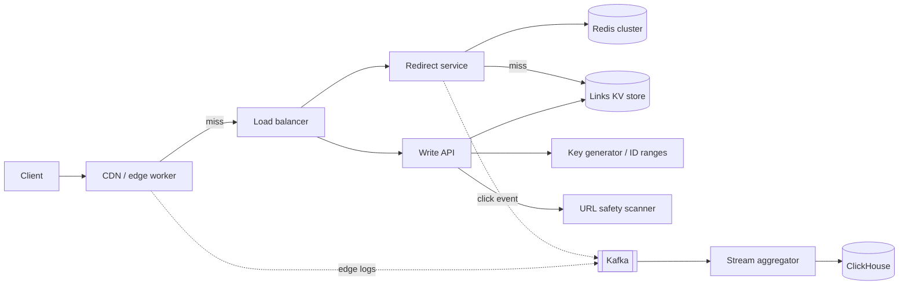

# URL shortener

!!! abstract "At a glance"
    **Priority:** P0 · **Complexity:** 2/5 · **Est. time:** 2 h · **Phase:** 1 · **Prereqs:** [Estimation](../framework-and-estimation.md), [Caching](../caching.md), [Partitioning](../partitioning-sharding.md), [API design](../api-design.md)
    **You're done when:** you can whiteboard the full design in 35 minutes, justify your key-generation scheme against two alternatives, and size the cache and storage from first principles.

The URL shortener is the "hello world" of system design, which is exactly why it is dangerous for a senior candidate: everyone knows the happy path, so the interview is decided on **ID generation, read-path latency, abuse, and analytics** — the parts most people rush.

## Problem statement

Design a service like bit.ly / TinyURL: given a long URL, return a short alias (`sho.rt/aZ3k9Qx`). Visiting the alias redirects to the long URL. Optionally: custom aliases, expiry, click analytics, per-tenant domains.

## Clarifying questions to ask

| Question | Why it matters | Assumption used below |
|---|---|---|
| Write volume and read:write ratio? | Drives everything | 100 M new links/day, 100:1 reads |
| Link lifetime? Can links be deleted/edited? | Storage + cache invalidation | Default forever; optional TTL; editable destination (enterprise) |
| Custom aliases / vanity domains? | Uniqueness checks, multi-tenancy | Yes, per-tenant domains |
| Is analytics real-time? Which dimensions? | Separate pipeline or not | Near-real-time (< 1 min), country/referrer/device |
| 301 vs 302? | Analytics accuracy vs origin load | 302 by default (see deep dive) |
| Predictable IDs acceptable? | Enumeration / privacy | No — IDs must not be guessable |
| Malicious URL handling? | Abuse is the #1 real-world cost | Scan on create + async rescans |

## Functional & non-functional requirements

**Functional:** create short link (optionally custom alias, TTL); redirect; delete/disable; per-link analytics; bulk API for enterprise.

**Non-functional:**

- Redirect p99 < 50 ms at the edge, < 10 ms server-side; availability 99.99% for redirects (a dead link is a broken email campaign), 99.9% for create.
- Durability: once returned, a mapping must never be lost or silently changed.
- No collisions; non-enumerable IDs.
- Reads can be eventually consistent for *edits* (seconds), but a freshly created link must resolve immediately (read-your-writes).

## Back-of-envelope estimation

```text
Writes:   100 M/day ÷ 86,400 s ≈ 1,160 /s avg  → peak ×5 ≈ 6,000 /s
Reads:    100 × writes ≈ 116,000 /s avg        → peak ≈ 600,000 /s
Rows:     100 M × 365 × 10 yr = 365 B mappings
Row size: key 8 B + long URL ~200 B avg + metadata ~100 B ≈ ~300–500 B
Storage:  365 B × 500 B ≈ 180 TB (10 yr, before replication; ×3 RF ≈ 550 TB)
Key space: base62^7 = 62^7 ≈ 3.5 × 10^12  → 365 B uses ~10% → 7 chars is enough
Cache:    Zipf — ~20% of links take ~80% of traffic.
          Daily distinct hot links ~20 M × 500 B ≈ 10 GB  → fits in one Redis node; use a cluster for QPS, not size.
Bandwidth (redirect): 600 k/s × ~500 B response ≈ 300 MB/s ≈ 2.4 Gbps at peak — trivial for a CDN.
Analytics events: 116 k/s × ~200 B ≈ 23 MB/s ≈ 2 TB/day raw.
```

The takeaway you should *say out loud*: storage and bandwidth are easy; the design is dominated by **read QPS at the edge** and **analytics volume**, which is ~10x larger than the core data.

## API design

```http
POST /v1/links
Idempotency-Key: 7b1e...
{ "long_url": "https://...", "custom_alias": "q4-launch", "expires_at": "2027-01-01T00:00:00Z", "domain": "go.acme.com" }
→ 201 { "short_url": "https://go.acme.com/q4-launch", "id": "q4-launch", "created_at": "..." }

GET /{id}              → 302 Location: <long_url>   (404/410 if unknown/expired)
GET /v1/links/{id}/stats?from=&to=&group_by=country
DELETE /v1/links/{id}  → 204  (soft-delete; tombstone kept so ID is never reused)
```

Nuances: the create endpoint is idempotent via `Idempotency-Key` (see [API design](../api-design.md)); optionally also dedupe on `(tenant, long_url)` — but only if the product wants it, because two campaigns may intentionally want two links to the same URL for separate analytics.

## Data model

| Table | Key | Columns | Store |
|---|---|---|---|
| `links` | `(domain, id)` | long_url, tenant_id, created_at, expires_at, status, owner | KV / wide-column (DynamoDB, Cassandra) or sharded Postgres |
| `aliases_by_tenant` | `(tenant_id, created_at)` | id | Secondary index for "my links" |
| `click_events` | time-partitioned | id, ts, country, referrer, ua_class | Kafka → ClickHouse/Druid/BigQuery |
| `click_rollups` | `(id, minute)` | count, uniques (HLL) | OLAP |

Access pattern is a pure point lookup by key — a KV store is the natural fit. Postgres is fine up to a few TB; beyond that, shard by hash of `id`.

## High-level design



Read path: edge cache (hot links, TTL 1–5 min) → Redis → KV store. Write path: validate + scan URL → get ID → write to KV (quorum) → populate cache (write-through, so read-your-writes holds).

## Deep dives

### 1. Short-ID generation

| Option | How | Pros | Cons |
|---|---|---|---|
| Hash + truncate | base62(MD5/SHA-256(url))[:7] | Stateless, natural dedupe | Collisions (birthday bound: in a 62^7 space, ~50% chance of *some* collision after only ~2.2 M keys), so every write needs check-and-retry with a salt |
| Global counter + base62 | DB sequence / Redis INCR | Simple, no collisions | Single point of contention; **sequential = enumerable** |
| Range allocation | Each writer leases a block of 1 M IDs from a coordinator (ZooKeeper/etcd/DB row) | No per-write coordination; 6 k/s is trivial | Gaps on crash (fine); still sequential unless obfuscated |
| Snowflake-style 64-bit | timestamp + worker + sequence | Decentralised, sortable | 64-bit → 11 base62 chars (too long); sortable = leaks creation time |
| Random 7–8 chars + conditional insert | CSPRNG, `PutItem if not exists` | Non-enumerable, no coordinator | Retry on collision; rate rises as space fills (at 10% fill, 10% of inserts retry once) |

**Decision:** range allocation + a keyed bijective permutation (e.g. a Feistel network or format-preserving encryption over the 42-bit range) → IDs are unique by construction *and* non-sequential. If you want a simpler answer, random 8 chars (62^8 ≈ 2.2 × 10^14; at 365 B keys collision probability per insert ~0.2%) with a conditional write is perfectly defensible. Custom aliases always go through a conditional insert.

### 2. 301 vs 302 and the edge

| | 301 Moved Permanently | 302 Found / 307 |
|---|---|---|
| Browser caching | Cached indefinitely by browser | Not cached (unless Cache-Control says so) |
| Origin load | Minimal after first hit | Every click reaches edge/origin |
| Analytics | Lost after first click per browser | Complete |
| Editable destinations | Broken — browsers keep the old target | Works |

**Decision:** 302 with `Cache-Control: private, max-age=0` for browsers, and **shared caching at your own CDN** (edge worker with KV, s-maxage 60 s). You get the load benefit of caching without surrendering analytics or editability; the CDN emits the click log.

### 3. Analytics at 116 k events/s

Options: (a) increment counters in the primary DB synchronously — kills write amplification and redirect latency; (b) async event to Kafka, stream-aggregate per minute into OLAP; (c) edge logs only (cheapest, loses app context).

**Decision:** (b), with the redirect handler firing-and-forgetting into a local buffer → Kafka (acks=1 is acceptable; losing 0.01% of clicks is fine, delaying redirects is not). Flink/ksqlDB or ClickHouse materialized views do per-minute rollups; HyperLogLog for unique visitors (12 KB per counter, ~0.8% error). This is a textbook case for [data pipelines](../data-pipelines.md).

### 4. Abuse and safety

Short links are a phishing vector. Create-time scan against a URL reputation service (e.g. Google Safe Browsing API), rate limits per account/IP ([rate limiting](../rate-limiting.md)), async re-scan of popular links (a link that was clean at creation may be flipped later), and a kill switch that disables a link globally within seconds (edge cache purge + status flag). This is where real bit.ly-like services spend engineering time.

## Scaling & bottlenecks

- **Hot keys:** a link in a Super Bowl ad can take 100 k+ RPS. Edge caching absorbs it; in Redis, replicate hot keys or use client-side local caches (1–5 s TTL).
- **KV partitioning:** hash of `id` gives uniform spread; never range-partition by sequential ID (write hotspot on the last partition).
- **Cache stampede** on expiry of a viral key: request coalescing (single-flight) at the redirect service.
- **Analytics** outgrows the core system first; keep it on separate infrastructure so an OLAP outage never affects redirects.

## Failure modes & reliability

| Failure | Impact | Mitigation |
|---|---|---|
| Redis cluster down | DB takes full 600 k/s | Edge cache + local LRU + DB provisioned for ~2x normal miss rate + load shedding |
| KV region outage | Redirects fail | Multi-region active-active reads (links are immutable → trivial to replicate) — see [multi-region](../multi-region-dr.md) |
| ID-range coordinator down | Writers exhaust leased ranges | Lease large blocks (hours of capacity); coordinator is off the hot path |
| Kafka down | Analytics lag | Local disk spool; redirects unaffected |
| Bad deploy corrupts mappings | Catastrophic | Immutable writes, versioned edits, PITR backups |

## Security & multi-tenancy

- Per-tenant custom domains: TLS cert automation (ACME), domain verification via DNS TXT record.
- AuthN via API keys/OAuth for create; redirects are public. Tenant ID is part of the key namespace so aliases don't collide across tenants.
- Private links: signed short links or require SSO before redirect (enterprise "go links").
- Open-redirect abuse: block `javascript:`/`data:` schemes; enforce allow-lists for tenants that want them.

## How the design changes at 10x / in an AI-era variant

**10x (1 B links/day, 6 M RPS reads):** edge-first architecture — mappings replicated to every PoP in an edge KV store; origin only handles creates and cold misses. Storage becomes ~1.8 PB over 10 years → tiered storage (cold links to object storage with an index), and ID length goes to 8 chars.

**AI-era variant:** "smart links" that generate a preview/summary of the destination, auto-tag campaigns, or route per user (deep links). Implications: LLM calls go on the **create path asynchronously** (never on redirect); summaries cached per canonical URL; content fetch must be sandboxed (SSRF risk — the fetcher must not reach internal networks); LLM-based phishing classification augments reputation lists but needs an eval set with precision/recall targets because false positives break customer campaigns.

## What a Staff-level answer adds (vs senior)

- Frames the problem as **read-path at the edge + analytics pipeline + abuse**, not as a CRUD service.
- Makes ID generation a security decision (enumeration), not just a uniqueness one.
- States SLOs and where error budgets differ (redirect 99.99% vs create 99.9%) and designs isolation accordingly.
- Talks about lifecycle: never reuse IDs, tombstones, legal takedown process, data retention for click logs (GDPR: IPs are personal data → truncate/hash at ingest).
- Cost: CDN egress and OLAP storage dominate; proposes retention tiers (raw 30 days, rollups forever).

## Resources

| Resource | Type | Why this one | Level | Cost |
|---|---|---|---|---|
| [Hello Interview — Design Bitly](https://www.hellointerview.com/learn/system-design/problem-breakdowns/bitly) | article | Interview-paced walkthrough with explicit level expectations | intermediate | free |
| [System Design Primer](https://github.com/donnemartin/system-design-primer) | docs | Classic Pastebin/URL-shortener exercise with estimation | intermediate | free |
| [Announcing Snowflake (Twitter, 2010)](https://blog.twitter.com/engineering/en_us/a/2010/announcing-snowflake) | article | Origin of time-ordered 64-bit IDs; trade-offs vs counters | intermediate | free |
| [Sam Who — Bloom filters](https://samwho.dev/bloom-filters/) :gem: | interactive | Beautiful visual explainer; useful for "does this alias exist" pre-checks | intermediate | free |
| [Stripe — Designing robust APIs with idempotency](https://stripe.com/blog/idempotency) | article | Idempotent create endpoint done right | intermediate | free |
| [Alex Xu — System Design Interview Vol 1, ch. 8](https://bytebytego.com) | book | Canonical estimation numbers and hash-vs-base62 discussion | intermediate | paid |

## Follow-up questions

### L2 — Apply

??? question "Q1. Size the Redis cluster for the redirect path: 600 k peak RPS, 95% cache hit target, p99 < 5 ms."
    ??? success "Answer"
        Working set ≈ 20 M hot keys × ~500 B ≈ 10 GB (plus ~2x overhead for Redis object/encoding ≈ 20 GB). A single Redis shard comfortably does ~100 k simple GETs/s at sub-ms latency; to keep headroom (≤ 50% CPU) plan ~150 k/s per 2 shards → **8–12 primary shards**, each ~2–3 GB, with 1 replica each (reads can go to replicas). With an edge cache absorbing ~70% of traffic, Redis sees ~180 k/s and 4–6 shards suffice. Miss traffic to DB: 5% × 600 k = 30 k/s — size the KV store for that plus a 2x failure margin.

??? question "Q2. A marketing customer wants to change the destination of a link after 1 M emails went out. What changes?"
    ??? success "Answer"
        This is why 302 matters: with 301, browsers that already clicked keep the old target forever. Implement edits as a versioned write (`destination_v2`, audit log), then invalidate: Redis delete, CDN purge by key (or short s-maxage like 60 s so staleness is bounded). Communicate the SLA: "edits propagate in ≤ 60 s". Keep the audit trail for abuse investigations (edit-after-scan is a classic phishing trick → re-scan on every edit).

??? question "Q3. Random 7-char IDs: at what fill level does the collision-retry rate hurt?"
    ??? success "Answer"
        Probability a random new key collides ≈ fill ratio = n / 62^7. At 365 B keys, fill ≈ 10% → 1 in 10 inserts needs a retry, 1 in 100 needs two. Latency cost is one extra conditional write (~5 ms) — acceptable. At 50% fill, expected attempts = 2 and tail latency degrades; move to 8 chars well before that (62^8 gives 62x headroom). Set an alarm on retry rate as a capacity signal.

### L3 — Design & trade-offs

??? question "Q4. Would you dedupe identical long URLs to the same short ID? Defend."
    ??? success "Answer"
        Not globally. Dedupe breaks per-campaign analytics, per-owner deletion (if user A deletes, user B's link dies), and leaks information (you can probe whether someone shortened a URL). Per-tenant, optional dedupe keyed on `(tenant, canonical_url)` is reasonable as a storage optimisation, but storage is cheap (~180 TB/10 yr) compared to product confusion. Idempotency keys solve the real problem — duplicate creates from retries.

??? question "Q5. SQL or NoSQL for the mapping store?"
    ??? success "Answer"
        Access pattern is point reads/writes by key, no joins, 365 B rows → a partitioned KV/wide-column store (DynamoDB, Cassandra/Scylla) is the natural fit, with conditional writes for alias uniqueness. Sharded Postgres (Citus, or app-level sharding) is equally valid and gives you secondary indexes for "list my links" and transactional edits; the cost is operating resharding. Decision criterion: team expertise and whether you need rich per-tenant querying. Mention that the analytics store is a *different* choice (columnar OLAP) regardless.

??? question "Q6. How do you guarantee a freshly created link resolves immediately, even from another region?"
    ??? success "Answer"
        Within region: write-through to the cache after the durable write. Cross-region: either (a) route creates and first reads via the home region (the short URL's domain resolves via geo-DNS, so a user in another region could miss), or (b) on a miss in a remote region, fall back to a synchronous read against the home region (encode the home region in a bit of the ID). Option (b) keeps replication async and costs one cross-region RTT (~70–150 ms) only for brand-new links. Negative caching must have a very short TTL (≤ 5 s) or you'll cache "404" for a link created 1 s ago.

### L4 — Staff-level ambiguity

??? question "Q7. Your company runs an internal go-links service used by 30 k employees and wants to offer it as an external product. What changes?"
    ??? success "Answer"
        Almost everything non-functional: multi-tenancy (tenant-scoped namespaces, custom domains, quotas), abuse (internal had none; external makes you a phishing target — safety scanning, takedown workflow, trust & safety staffing), SLAs and billing, GDPR/data residency for click logs, and an API with versioning. Architecture: split redirect plane (edge, read-only, globally replicated) from control plane (create/edit/analytics). Org: this needs an on-call rotation and a T&S process, not just code. Recommend a phased launch: invite-only tenants with verified domains first.

??? question "Q8. Analytics costs now exceed the redirect infrastructure 5:1. Leadership asks you to cut 50%. Plan?"
    ??? success "Answer"
        Measure first: raw event retention, OLAP storage, query patterns. Typical wins: (1) drop raw events after 30 days, keep per-minute rollups and HLL sketches (100x smaller); (2) sample raw events for low-value dimensions (1:10) while keeping exact counts; (3) push aggregation to the edge/stream so OLAP ingests rollups, not events; (4) tier storage to object storage (Parquet + Iceberg) for cold queries. Negotiate with product which dimensions actually drive revenue. Communicate accuracy changes explicitly (e.g. uniques ±1%).

??? question "Q9. Security finds that 0.5% of new links point to phishing pages. What's your multi-quarter plan?"
    ??? success "Answer"
        Short term: stricter rate limits for new/unverified accounts, create-time reputation checks, fast kill switch (edge purge in < 60 s). Medium: async crawler + classifier (heuristics + an LLM-assisted classifier evaluated against a labelled set; target precision > 99% because false positives break paying customers), interstitial warnings for low-confidence links instead of hard blocks. Long: account trust scoring, verified-domain tiers, abuse reporting API, metrics (time-to-takedown p95) owned by a T&S team. Make it an SLO, not a hero effort.

## Checklist

- [ ] I can derive QPS, storage, key length, and cache size from "100 M links/day" without notes
- [ ] I can compare 5 ID-generation schemes and pick one with a security argument
- [ ] I can explain 301 vs 302 vs CDN caching in one minute
- [ ] I can sketch the analytics pipeline and justify HLL for uniques
- [ ] I answered all L3 questions out loud in < 3 min each
