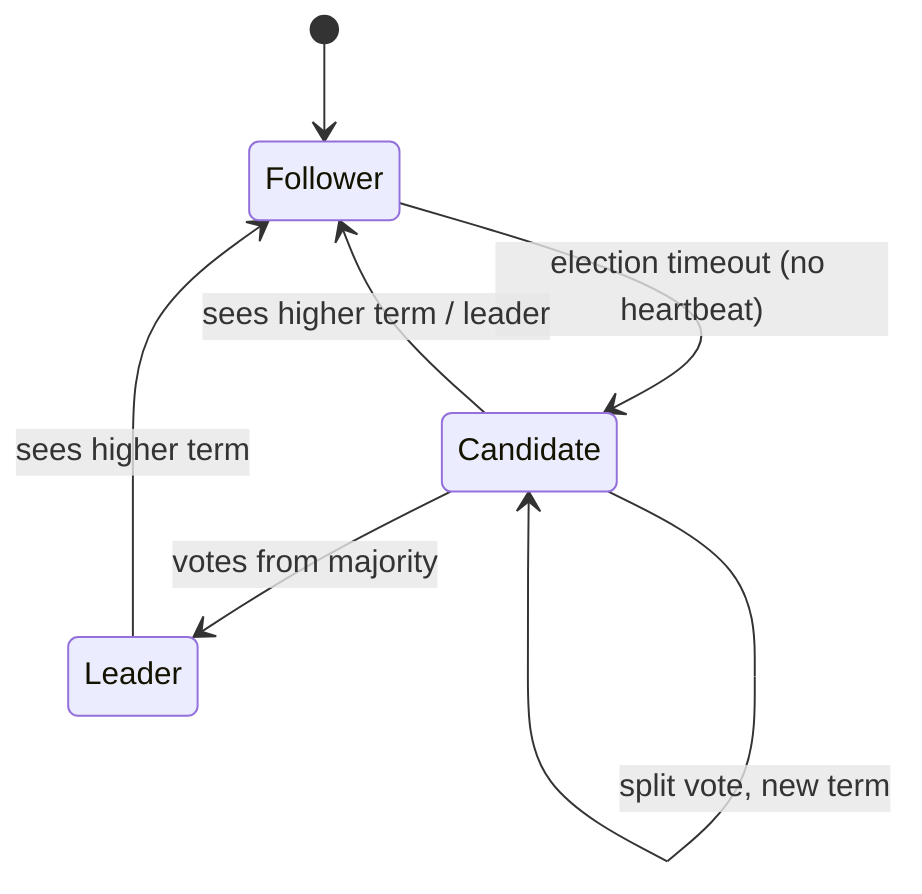
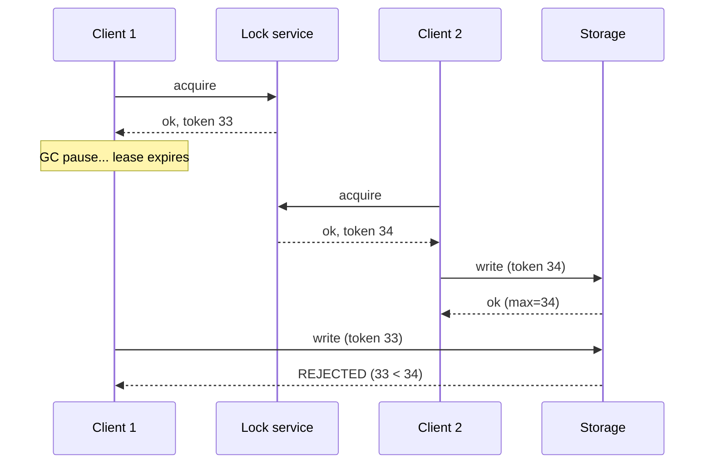

# Consensus: Raft, leases, fencing

!!! abstract "At a glance"
    **Priority:** P1 · **Complexity:** 5/5 · **Est. time:** 6 h · **Phase:** 5 · **Prereqs:** [Replication](replication.md), [Consistency models](consistency-models.md)
    **You're done when:** you can explain Raft leader election, log replication and commit rules including the safety argument; explain why leases need bounded clock drift and why distributed locks need fencing tokens; and decide when to use etcd/ZooKeeper vs a database vs Redis for coordination.

## Why it matters

Consensus is the foundation under everything that must not diverge: leader election, configuration, distributed locks, metadata for Kafka (KRaft), Kubernetes (etcd), distributed SQL (per-range Raft groups), and service discovery. Most engineers never implement it, but Staff engineers must understand it well enough to (a) choose the right coordination primitive, (b) avoid the classic "Redis lock without fencing" correctness bug, and (c) reason about the latency and availability of systems built on it (a Raft group of 5 across 3 regions has a very specific failure and latency profile).

AI angle: agent orchestration platforms need exactly-one-worker semantics for runs (only one worker executes a given agent step), durable execution engines (Temporal, Restate, DBOS) rely on consensus-backed stores, and GPU job schedulers use leader election. "Two workers both executed the tool call that sends money" is a fencing bug.

## Core concepts

### The problem

Get a group of nodes to agree on a sequence of values (a replicated log) despite crashes and message delays, such that: **safety** (never disagree; committed entries never lost) always holds, and **liveness** (progress) holds when a majority is up and the network is stable enough. FLP impossibility says no deterministic algorithm guarantees liveness in a fully asynchronous system with even one faulty process — practical algorithms use timeouts (partial synchrony) for liveness while preserving safety unconditionally.

Majority quorums: with 2f+1 nodes you tolerate f failures. 3 nodes → 1 failure; 5 nodes → 2. Even numbers add cost without extra tolerance.

### Raft in one page

- **Terms:** monotonically increasing epochs; each term has at most one leader. Any message with a higher term makes a node step down. Terms are Raft's logical clock and its built-in fencing.
- **Leader election:** follower times out (randomised 150–300 ms in the paper; larger in WAN deployments), increments term, votes for itself, requests votes. A node grants its vote only if the candidate's log is **at least as up-to-date** (compare last entry's term, then index) — this is the key to safety: a leader always holds all committed entries.
- **Log replication:** leader appends entries, sends `AppendEntries` with previous index/term for consistency check; followers reject mismatches and the leader backs up until logs match, then overwrites follower divergence.
- **Commit rule:** an entry is committed when stored on a majority *and* (subtle) the leader only directly commits entries from its **current term**; earlier-term entries become committed indirectly. (Figure 8 in the paper shows why.)
- **State machine:** committed entries are applied in order on every node → identical state.
- **Membership changes:** joint consensus or single-server changes to avoid two majorities during reconfiguration.
- **Log compaction:** snapshots + truncation.

Practical extensions: **PreVote** (a partitioned node doesn't disrupt the cluster with term inflation on rejoin), **CheckQuorum** (leader steps down if it can't reach a majority), **leader leases for reads**, **ReadIndex** (linearizable reads by confirming leadership via heartbeat round rather than writing to the log), learners/non-voting members, and batching/pipelining for throughput.

### Raft vs Paxos vs others

| | Raft | Multi-Paxos | ZAB (ZooKeeper) | EPaxos / leaderless |
|---|---|---|---|---|
| Understandability | Designed for it | Notoriously hard | Moderate | Hard |
| Leader | Strong leader | Distinguished proposer (optimisation) | Leader | None |
| Real systems | etcd, Consul, CockroachDB, TiKV, Kafka KRaft, RabbitMQ quorum queues | Spanner, Chubby | ZooKeeper | Research/some DBs |

Heidi Howard's "Paxos vs Raft" paper shows they're more similar than folklore suggests; Raft's value is its presentation and prescriptive design.

### Performance and deployment numbers

- Write latency ≥ one RTT from leader to the nearest majority + fsync. Single-AZ 3-node: ~1–5 ms. Three AZs: + ~1–2 ms. Across regions: ≥ the RTT to the second-closest region (e.g. 30–80 ms).
- Throughput: bottlenecked by leader and disk fsync; batching gives tens of thousands of writes/s in etcd-class systems, but **etcd is a metadata store** — keep data small (default request size limit ~1.5 MB; recommended DB size in the single-digit GB).
- Multi-Raft: distributed databases shard data into thousands of small Raft groups (one per range) to scale.

### Leases

A lease is a time-bounded grant ("you are leader/lock-holder until T"). It allows a leader to serve reads locally without a quorum round trip, or a lock holder to act without constant checks. **Leases depend on bounded clock drift** (not synchronised clocks, but rates): the holder must stop before the grantor believes the lease expired. Process pauses (GC, VM migration, page faults) of seconds break naive lease holders — the holder wakes up believing it still holds the lease.

### Fencing tokens

The fix for paused lease holders: the lock service issues a **monotonically increasing token** with each grant (Raft term, ZooKeeper zxid, etcd revision). Every write to the protected resource carries the token, and **the resource rejects tokens lower than the highest it has seen**.

This is Kleppmann's argument against Redlock for correctness-critical locking: without fencing, no lock algorithm based on timing is safe; with fencing, you need the resource to cooperate. If the resource can't check tokens (e.g. a third-party API), use **idempotency keys** and design for at-least-once effects.

### Choosing a coordination primitive

| Need | Use | Avoid |
|---|---|---|
| Leader election / config / service membership for infra | etcd, ZooKeeper, Consul; Kubernetes Lease objects | Hand-rolled heartbeats in a DB |
| "Only one worker processes job X" in an app | DB row lock (`SELECT … FOR UPDATE SKIP LOCKED`), conditional update with version, or a workflow engine | Redis lock without fencing for correctness |
| Efficiency lock (dup work is merely wasteful) | Redis `SET NX PX` | Heavyweight consensus |
| Exactly-once side effects | Idempotency keys at the effect + outbox | Believing a lock gives exactly-once |
| Durable multi-step workflows / agent runs | Temporal, Restate, DBOS, Azure Durable Functions | Ad-hoc locks + cron |

## Resources

| Resource | Type | Why this one | Level | Cost |
|---|---|---|---|---|
| [The Secret Lives of Data — Raft](https://thesecretlivesofdata.com/raft/) :gem: | interactive | Step-by-step animated Raft; the fastest way to intuition | intermediate | free |
| [Raft paper (extended)](https://raft.github.io/raft.pdf) | paper | Very readable; Figure 2 is the implementation spec | advanced | free |
| [raft.github.io](https://raft.github.io) | interactive | Official site with visualisation and implementation list | intermediate | free |
| [Kleppmann — How to do distributed locking](https://martin.kleppmann.com/2016/02/08/how-to-do-distributed-locking.html) | article | Fencing tokens and the Redlock critique; essential | advanced | free |
| [Eli Bendersky — Implementing Raft](https://eli.thegreenplace.net/2020/implementing-raft-part-0-introduction/) :gem: | article | Series building Raft in Go with tests; best guided implementation | advanced | free |
| [MIT 6.5840 Distributed Systems](https://pdos.csail.mit.edu/6.824/) | course | Labs implementing Raft and a sharded KV store; the gold standard | advanced | free |
| [Paxos vs Raft (Howard & Mortier)](https://arxiv.org/abs/2004.05074) | paper | Shows the algorithms are closer than folklore claims | advanced | free |
| [Fly.io Gossip Glomers](https://fly.io/dist-sys/) :gem: | interactive | Maelstrom challenges including linearizable KV; checks your correctness | advanced | free |
| [Patterns of Distributed Systems (Unmesh Joshi)](https://martinfowler.com/articles/patterns-of-distributed-systems/) | article | Lease, generation clock, quorum, HLC as patterns | advanced | free |
| [etcd docs](https://etcd.io/docs/) | docs | Leases, revisions, txn API, and operational limits | intermediate | free |

## Hands-on lab

**Goal:** implement Raft leader election and see fencing in action (2 h, can split).

1. Follow Eli Bendersky's Part 1 (elections) in Go, or a Python asyncio port: 3 nodes, randomised election timeouts, `RequestVote`, heartbeats. Write tests that partition the leader and verify a new leader with a higher term.
2. Extend to log replication (Part 2) if time permits; verify the "up-to-date log" vote restriction by constructing a scenario where a stale node cannot win.
3. Fencing demo: run etcd in Docker. Write two Python workers that acquire a lease-based lock (`etcd3` client), get the lock's revision as fencing token, and write to a "storage" service that rejects lower tokens. Inject a 10 s `time.sleep` in worker 1 after acquiring; verify worker 2 acquires with a higher revision and worker 1's late write is rejected.
4. **Expected output:** leader re-elected within a few hundred ms after partition; stale write rejected by token check; without the check, both writes succeed (demonstrate the bug).

## Questions

### L1 — Recall

??? question "Q1. What is a Raft term and what role does it play?"
    ??? success "Answer"
        A monotonically increasing integer epoch; each term begins with an election and has at most one leader. Every RPC carries the sender's term; a node seeing a higher term updates and steps down to follower; messages with stale terms are rejected. Terms detect stale leaders and act as a logical clock/fencing mechanism.

??? question "Q2. Why does Raft restrict votes to candidates with up-to-date logs?"
    ??? success "Answer"
        To guarantee Leader Completeness: any committed entry is on a majority; any winning candidate needs votes from a majority; these majorities intersect, and the voter in the intersection only votes for a candidate whose log is at least as up-to-date (last term, then index). So the new leader contains all committed entries and never overwrites them.

??? question "Q3. Why use an odd number of consensus nodes?"
    ??? success "Answer"
        Fault tolerance = floor((n−1)/2). 4 nodes tolerate 1 failure, same as 3, but need 3 acks per write (slower) and add cost. 5 tolerates 2. Even counts only make sense temporarily during membership changes.

??? question "Q4. What is a fencing token?"
    ??? success "Answer"
        A monotonically increasing number issued with each lock/lease grant. Clients attach it to operations on the protected resource; the resource tracks the highest token seen and rejects lower ones. It prevents a paused or partitioned former lock-holder from corrupting data after its lease expired.

### L2 — Apply

??? question "Q5. You deploy a 5-node etcd cluster across 3 regions (2-2-1). What's the write latency and what happens if one region fails?"
    ??? success "Answer"
        A write needs 3 acks: leader + 2 others. If the leader is in a 2-node region, it needs its local peer plus one node in another region → latency ≈ RTT to the nearest other region + fsync (tens of ms). Losing a 2-node region leaves 3/5 → still a majority, cluster survives. Losing the 1-node region is also fine. Losing any two regions loses quorum. Leader placement matters; tune election timeouts/heartbeats above WAN RTTs to avoid spurious elections. Many teams instead keep etcd regional and use async replication across regions for things that can tolerate it.

??? question "Q6. A cron job must run exactly once across 6 pods. Design it."
    ??? success "Answer"
        "Exactly once" execution isn't achievable; aim for at-most-one concurrent runner + idempotent effects. Options: Kubernetes CronJob with `concurrencyPolicy: Forbid` (single scheduler) or leader election (Kubernetes Lease / etcd) where only the leader schedules. The job records a run row keyed by `(job, scheduled_time)` with a unique constraint — a second instance fails the insert (DB as fencing). Effects use idempotency keys derived from the run ID. For complex jobs use a workflow engine (Temporal schedules) which provides this natively.

??? question "Q7. Why is `SET lock NX PX 30000` in Redis unsafe for protecting a financial update, and what would you do instead?"
    ??? success "Answer"
        The holder can pause (GC, network) beyond 30 s; the lock expires; another client acquires it; both update. Redis failover with async replication can also lose the lock key, granting it twice. There's no fencing token checked by the resource. Instead: perform the update in the database with a conditional write/row lock (`UPDATE … WHERE version = ?` or `SELECT … FOR UPDATE`) so the DB is the arbiter, or use a consensus store's revision as a fencing token checked by the resource, plus idempotency keys.

### L3 — Design & trade-offs

??? question "Q8. etcd/ZooKeeper vs the application's Postgres for leader election in a mid-size service."
    ??? success "Answer"
        Postgres: already operated, advisory locks or a lease row with `UPDATE … WHERE expires_at < now() OR holder = me` gives election plus fencing via a version column; failover of Postgres itself affects election, and session-based advisory locks can behave surprisingly with poolers (PgBouncer transaction mode). etcd/ZooKeeper: purpose-built, watches, leases, revisions as fencing tokens, but another critical system to run. On Kubernetes, the Lease API (backed by etcd) is free. Choose K8s Lease or Postgres lease row for app-level needs; dedicated etcd/ZK only for infrastructure-level coordination or when you need watches/ephemeral nodes at scale.

??? question "Q9. Explain how a Raft-based database serves linearizable reads, and the trade-offs of each method."
    ??? success "Answer"
        (1) Log reads: write a no-op/read entry through the log — simplest, costs a full replication round and log space. (2) ReadIndex: leader records commit index, confirms it's still leader via a heartbeat round to a majority, waits until applied, then serves — one network round, no disk write. (3) Lease reads: leader serves locally while holding a leader lease (followers promise not to elect a new leader for the lease period) — zero extra round trips but depends on bounded clock drift; a clock anomaly can violate linearizability. (4) Follower reads with ReadIndex from leader — offloads the leader. Choose ReadIndex by default; lease reads when latency is critical and clock discipline is strong.

??? question "Q10. Should an agent orchestration platform use distributed locks to ensure a run step executes once?"
    ??? success "Answer"
        Locks alone can't ensure once-only side effects (pauses, crashes after effect but before recording completion). Better: a durable execution model — each step's result is persisted before advancing (event history); workers claim tasks via a store with leases and fencing (task tokens/attempt numbers); side-effecting tool calls carry idempotency keys derived from (run_id, step_id), so retries are harmless; non-idempotent external actions go through an outbox with dedupe. Temporal/Restate/DBOS implement this. Locks are an implementation detail inside; the contract is "at-least-once execution, exactly-once effect via idempotency".

### L4 — Staff-level ambiguity

??? question "Q11. Incident review: two instances of a billing job ran concurrently after a network blip and double-charged 3,000 customers. The team proposes 'a better distributed lock'. What do you recommend?"
    ??? success "Answer"
        Reframe: the root issue is non-idempotent effects relying on mutual exclusion. Recommendations: (1) idempotency keys for charges (customer + billing period) enforced by the payment provider and by a unique constraint in the ledger — double execution becomes harmless; (2) fencing: the job's claim uses a monotonic token and writes check it; (3) move scheduling to a durable workflow engine; (4) reconciliation job comparing ledger vs provider daily with alerting; (5) chaos test: kill/pause the job mid-run in staging. Communicate: "No lock can be perfect under pauses and partitions; we'll make duplicates harmless and detectable." Track action items with owners; share the learning across teams running similar jobs.

??? question "Q12. A team wants to build its own consensus-based replicated store for a new product because existing options 'don't fit'. How do you evaluate?"
    ??? success "Answer"
        Consensus implementations are notoriously subtle (Jepsen has found bugs in most mature systems); building one is a multi-year commitment with a need for formal methods/TLA+, deterministic simulation testing, and deep expertise. Probe the requirements that "don't fit": latency, data model, embedding, licensing, cost. Evaluate alternatives: embedding a proven library (etcd raft library, hashicorp/raft, openraft), building on etcd/FoundationDB/distributed SQL, or relaxing requirements. If the business truly needs it (it's a core differentiator), require: TLA+ spec, deterministic simulation testing (FoundationDB/TigerBeetle-style), Jepsen testing, and staffing plan. Most of the time the recommendation is to build on a proven library/store.

## Real-world use cases

- **Kubernetes:** etcd (Raft) stores all cluster state; controllers use Lease objects for leader election.
- **Kafka 4.x:** KRaft replaces ZooKeeper for metadata (ZooKeeper mode removed in 4.0).
- **CockroachDB/TiKV/YugabyteDB:** multi-Raft — one group per range.
- **Logistics scheduling:** single active scheduler for berth/crane allocation via leader election; allocations written with version checks.

## Pitfalls & anti-patterns

- Using timing-based locks for correctness without fencing.
- Storing large data in etcd/ZooKeeper.
- Deploying 2 or 4 consensus nodes.
- WAN deployments with LAN election timeouts → constant elections.
- Believing consensus gives exactly-once side effects.
- Rolling your own consensus.

## Checklist

- [ ] I can explain Raft election, replication, commit rule and safety
- [ ] I can explain leases, clock drift and fencing tokens
- [ ] I implemented Raft elections and the etcd fencing demo
- [ ] I can choose a coordination primitive for a given need
- [ ] I answered all L3 questions out loud in < 3 min each
