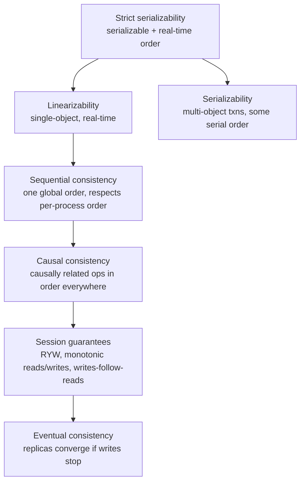

# Consistency models, CAP & PACELC

!!! abstract "At a glance"
    **Priority:** P0 · **Complexity:** 4/5 · **Est. time:** 4 h · **Phase:** 2 · **Prereqs:** [Replication](replication.md), [Partitioning](partitioning-sharding.md)
    **You're done when:** you can place linearizable, sequential, causal, session and eventual consistency on a hierarchy, explain what CAP actually says (and why "CP vs AP" labels mislead), use PACELC to reason about the latency cost of consistency, and choose per-operation consistency for a real product.

## Why it matters

Consistency is where system design stops being boxes and becomes semantics. The question is always *"what can a user or downstream system observe, and is that acceptable?"* Staff engineers must translate business invariants ("never oversell a seat", "a user always sees their own message") into precise consistency requirements, choose the cheapest model that satisfies them per operation, and explain the latency/availability cost to product leaders.

CAP is also the most misquoted theorem in the industry. Interviewers at Staff level often probe whether you understand that CAP only concerns behaviour **during partitions**, that its "consistency" means linearizability specifically, and that PACELC's "else latency vs consistency" trade-off matters far more day-to-day.

AI angle: agents and RAG systems read from many eventually consistent sources (search indexes, vector stores, caches, CRM replicas). An agent that reads stale inventory and then acts ("book the slot") turns a benign staleness into a correctness bug. Consistency requirements must be stated for **agent tools**, especially side-effecting ones.

## Core concepts

### The hierarchy (strongest → weakest)

| Model | Guarantee | Available under partition? | Typical cost |
|---|---|---|---|
| Linearizability | Every op appears to take effect atomically at some instant between invocation and response; everyone sees the same order consistent with real time | No (minority side must refuse) | Consensus/quorum RTT per op; cross-region = 100 ms+ |
| Sequential | Single total order respecting each client's program order, not real time | No | Similar |
| Causal | If A may have influenced B, everyone sees A before B; concurrent ops may be seen in different orders | **Yes** (strongest model that is) | Metadata (vector clocks / dependencies) |
| Session guarantees | Per-client: read-your-writes, monotonic reads, monotonic writes, writes-follow-reads | Yes (with sticky sessions) | Routing / version tracking |
| Bounded staleness | Reads lag by at most k versions or t seconds | Partially | Tunable |
| Eventual | Replicas converge eventually; no ordering promise | Yes | Cheapest |

**Linearizability vs serializability:** linearizability is about single objects and real-time recency (a register behaves like one copy); serializability is about transactions over multiple objects appearing in *some* serial order (possibly not real-time). Strict serializability = both (Spanner's "external consistency").

### CAP precisely

**CAP (Brewer; proved by Gilbert & Lynch):** in an asynchronous network where partitions can occur, a system cannot provide both **linearizability** and **availability** (every request to a non-failing node gets a non-error response) during a partition.

What people get wrong:

- It's not "pick 2 of 3". Partitions aren't optional; the choice is *what to do when one happens*.
- "C" means linearizability only; "A" means *total* availability — a stricter definition than any SLO. Most real systems are neither CAP-consistent nor CAP-available (e.g. a single-leader DB with async replicas and failover).
- It says nothing about latency, which is the everyday trade-off.
- Hence Kleppmann's "Please stop calling databases CP or AP".

### PACELC

**If Partition: choose Availability or Consistency; Else: choose Latency or Consistency.** Even without failures, stronger consistency costs coordination latency.

| System | P: A or C | E: L or C | Notes |
|---|---|---|---|
| DynamoDB (default) | A | L | Eventually consistent reads default; strongly consistent reads optional per request (same region) |
| Cassandra / ScyllaDB | A | L | Tunable per query (ONE/QUORUM/ALL); QUORUM ≠ linearizable without LWT |
| Spanner / CockroachDB | C | C | Consensus per write; TrueTime/HLC; pay latency for consistency |
| Cosmos DB | Tunable | Tunable | Five levels: strong, bounded staleness, session (default), consistent prefix, eventual |
| MongoDB | C (majority) | depends on read/write concern | `w:majority` + `readConcern: linearizable` for strong single-doc reads |
| Postgres + async replicas | Leader: C-ish; replicas: stale | L for replica reads | Consistency depends on which node you read |

### Choosing per operation

The mature approach: **consistency is a per-operation decision**, not a per-database one.

| Operation | Needed model | Why |
|---|---|---|
| Seat/inventory decrement, unique username claim | Linearizable (or serializable txn) | Invariant across concurrent actors |
| Payment ledger | Serializable within ledger; idempotency across boundary | Money |
| User editing own profile | Read-your-writes (session) | User perception |
| Chat messages in a thread | Causal (replies after messages) | Conversation must make sense |
| Like counts, view counts | Eventual | Approximate is fine |
| Search index, recommendations, RAG index | Eventual with freshness SLO | Derived data |
| Feature flags / config | Eventual with bounded propagation (seconds) | Safe rollouts need bounded staleness |
| Leader election, locks | Linearizable (consensus) | Safety |

### Techniques that give "enough" consistency cheaply

- **Session guarantees** via sticky routing or version tokens (see [Replication](replication.md)).
- **Causal consistency** via hybrid logical clocks or dependency tracking (e.g. MongoDB causal sessions).
- **Conditional writes / compare-and-set** on a single key (DynamoDB condition expressions, etcd txn, Postgres `UPDATE … WHERE version = ?`) give linearizable single-key updates without global coordination.
- **CRDTs** for convergent eventual consistency with no conflicts.
- **Escrow / reservation** for inventory: split stock across regions/shards so local decrements are safe; rebalance asynchronously.
- **Idempotency + reconciliation**: accept eventual consistency, detect and fix violations later (e.g. overbooking handled by business process — airlines do this deliberately).

### Consistency in AI/agent systems

- **Retrieval is eventually consistent**: embeddings lag source-of-truth; permission changes lag too — a revoked user may still retrieve a document until the index updates. For ACLs, check permissions at query time against the source of truth (or a strongly consistent authorization service) rather than trusting indexed ACL metadata alone.
- **Agent read-then-act**: an agent reading a cached price then placing an order must re-validate with a conditional write at the side-effecting tool ("book if still available at price ≤ X"). Design tools to be **idempotent and conditional**.
- **Memory stores** for agents: last-write-wins merges of user memories can silently drop facts; treat memory updates as append + consolidation.

## Resources

| Resource | Type | Why this one | Level | Cost |
|---|---|---|---|---|
| [Jepsen — Consistency models map](https://jepsen.io/consistency) :gem: | interactive | Clickable hierarchy with precise definitions and availability properties | advanced | free |
| [Kleppmann — Please stop calling databases CP or AP](https://martin.kleppmann.com/2015/05/11/please-stop-calling-databases-cp-or-ap.html) | article | The clearest demolition of CAP misuse | advanced | free |
| [Doug Terry — Replicated data consistency explained through baseball](https://www.microsoft.com/en-us/research/publication/replicated-data-consistency-explained-through-baseball/) :gem: | paper | Makes six consistency levels intuitive with one story; short | intermediate | free |
| [Abadi — PACELC paper](https://www.cs.umd.edu/~abadi/papers/abadi-pacelc.pdf) | paper | Origin of PACELC; argues latency trade-off matters more than CAP | advanced | free |
| [Azure Cosmos DB — Consistency levels](https://learn.microsoft.com/en-us/azure/cosmos-db/consistency-levels) | docs | A production system exposing five tunable levels with clear diagrams and costs | intermediate | free |
| [Aphyr — Strong consistency models](https://aphyr.com/posts/313-strong-consistency-models) | article | Linearizability vs serializability explained with care | advanced | free |
| [Kleppmann — Distributed Systems lectures](https://www.youtube.com/playlist?list=PLeKd45zvjcDFUEv_ohr_HdUFe97RItdiB) | video | Lectures on linearizability, causality and eventual consistency | intermediate | free |
| [DDIA 2e — Consistency and consensus](https://martin.kleppmann.com/2026/03/24/designing-data-intensive-applications-2e.html) | book | Canonical chapter linking linearizability, ordering and consensus | advanced | paid |

## Hands-on lab

**Goal:** observe consistency anomalies and use conditional writes (60–90 min).

1. Fly.io **Gossip Glomers** (https://fly.io/dist-sys/) challenges 1–4 (echo, unique IDs, broadcast, grow-only counter) using Maelstrom in Python or Go. The broadcast and counter challenges force you to reason about eventual consistency and partitions; Maelstrom's checker tells you if you violated the model.
2. With a local 3-node Cassandra/ScyllaDB (docker), write at `ONE` and read at `ONE` in a tight loop across nodes; measure stale reads. Repeat at `QUORUM/QUORUM`.
3. Implement an inventory decrement in Postgres three ways: read-modify-write (race it with 50 concurrent workers; oversell), `UPDATE … SET stock = stock - 1 WHERE id = ? AND stock > 0` (conditional), and serializable transaction with retries. Count oversells.
4. **Expected output:** stale reads at ONE/ONE, none (in steady state) at QUORUM/QUORUM; naive decrement oversells; conditional update never oversells and is fastest.

## Questions

### L1 — Recall

??? question "Q1. State CAP precisely."
    ??? success "Answer"
        In a system subject to network partitions, when a partition occurs you cannot guarantee both linearizability (every read sees the most recent write in real-time order) and availability (every request to a non-failed node receives a non-error response). You must sacrifice one for the duration of the partition. Outside partitions, CAP says nothing.

??? question "Q2. Difference between linearizability and serializability?"
    ??? success "Answer"
        Linearizability is a recency guarantee on individual objects: operations appear instantaneous and respect real-time order. Serializability is an isolation guarantee on transactions over multiple objects: the outcome equals some serial execution, not necessarily respecting real time. Strict serializability combines both.

??? question "Q3. What is the strongest consistency model that remains available during partitions?"
    ??? success "Answer"
        Causal consistency (more precisely, variants like real-time causal consistency have been shown to be the strongest achievable with availability). Operations that are causally related are seen in the same order by everyone; concurrent ones may be seen in different orders.

??? question "Q4. What does the 'ELC' in PACELC capture?"
    ??? success "Answer"
        Else (no partition), a system trades Latency against Consistency: stronger consistency requires coordination (quorums, consensus, synchronous replication), which adds latency on every operation, especially across regions.

### L2 — Apply

??? question "Q5. Assign consistency levels to a food delivery app: menu browsing, order placement, driver location, order status for the customer."
    ??? success "Answer"
        Menu browsing: eventual (cached, minutes of staleness fine; prices re-validated at checkout). Order placement: serializable/linearizable for payment and restaurant capacity, with idempotency keys. Driver location: eventual, latest-wins, seconds of staleness fine. Order status for customer: session guarantees — read-your-writes and monotonic reads so status never goes "backwards" (use versioned status and sticky reads or reject older versions on the client).

??? question "Q6. Cassandra with RF=3, writes at QUORUM, reads at QUORUM. Is this linearizable? What can go wrong?"
    ??? success "Answer"
        No. Overlapping quorums help, but: failed writes that reached one replica may be observed by later reads (no rollback) and then disappear; concurrent writes resolve by LWW timestamps with clock skew; read repair races can make a later read see an older value. For linearizable single-partition operations, Cassandra offers lightweight transactions (Paxos-based `IF` conditions) at much higher latency.

??? question "Q7. An agent tool reads flight availability from a cached search API and then books. How do you make this safe?"
    ??? success "Answer"
        Treat the read as advisory. The booking tool must perform a conditional, idempotent operation against the source of truth: "book fare class Y on flight F at price ≤ P, idempotency key K". If the condition fails, return a structured error the agent can reason about ("no longer available; current price P2") rather than retrying blindly. Require human confirmation for price changes above a threshold. Log both reads and the final conditional write for audit.

### L3 — Design & trade-offs

??? question "Q8. A global app needs usernames unique worldwide. Design options with consistency trade-offs."
    ??? success "Answer"
        (1) Single-region linearizable store (primary DB with unique constraint) — simple; remote regions pay ~100–200 ms for signups (rare operation, acceptable). (2) Distributed SQL / consensus across regions — correct, higher latency, more ops cost. (3) Partition username space by hash to "home" regions, each authoritative for its slice — local-ish latency, no global consensus. (4) Optimistic eventual + reconciliation (rename on conflict) — bad UX. Choose (1) or (3): signups are low-volume, and correctness matters more than 150 ms. This illustrates choosing strong consistency where cheap because the op is rare.

??? question "Q9. Your team wants 'strong consistency everywhere' for simplicity in a multi-region system. Argue for or against."
    ??? success "Answer"
        For: fewer anomalies, simpler reasoning, fewer bugs. Against: every write (and linearizable read) pays cross-region consensus latency (~100+ ms), availability drops during regional partitions (minority regions refuse writes), and cost rises. Most operations don't need it. Balanced position: strong consistency for the small set of invariant-bearing operations (money, inventory, identity), session/causal for user-facing data, eventual for derived data — with the consistency requirement documented per API. "Simplicity" can be achieved with clear per-operation contracts and libraries that encode them, rather than paying global latency on everything.

??? question "Q10. How should permission changes propagate in an enterprise RAG system where documents are indexed with ACL metadata?"
    ??? success "Answer"
        Indexed ACLs are eventually consistent, so a revoked user might retrieve a document until reindexing — a security issue, not a UX issue. Options: (1) post-filter retrieved chunks against a strongly consistent authorization service (Zanzibar-style/OpenFGA with consistency tokens) at query time — adds latency but correct; (2) index ACL metadata for pre-filtering (performance) plus query-time verification for correctness; (3) short propagation SLO for ACL changes with prioritised reindex events. Recommend (2): pre-filter for recall/performance, authoritative check before content enters the prompt. See [Security](security-authn-authz.md).

### L4 — Staff-level ambiguity

??? question "Q11. Product asks: 'Why can't we just guarantee customers always see the latest data?' Explain to a non-technical VP and propose what to promise."
    ??? success "Answer"
        Explain with an analogy: copies of data live in multiple places (regions, caches) so the app is fast and survives failures; keeping all copies identical at every instant means every action waits for the farthest copy to confirm — slower, and when a link breaks, the app must refuse actions rather than show slightly old data. Then propose concrete promises: "You always see your own changes immediately; others' changes appear within 2 seconds; money and bookings are always exact." Map these to per-operation consistency (session guarantees, bounded staleness SLO, strong consistency for transactions), show the latency/availability cost of the alternative, and commit to monitoring the staleness SLO. This converts a theoretical debate into product-level guarantees.

??? question "Q12. Multiple teams have made inconsistent assumptions about the consistency of a shared customer-profile service, causing bugs. How do you fix it at org level?"
    ??? success "Answer"
        (1) Document the service's actual guarantees per endpoint (e.g. writes linearizable on primary; reads from replicas bounded-staleness 1 s; events at-least-once, ordered per customer). (2) Make them explicit in the API: offer a `consistency=strong|session` parameter or a version/consistency token clients can pass to get read-your-writes. (3) Publish consumer guidance with examples (don't read-then-write without conditional update; dedupe events by version). (4) Add contract tests/Jepsen-style fault tests in CI for key guarantees. (5) Review past incidents to show the cost of ambiguity. (6) Make "consistency contract" a required section in API design reviews. The key is converting implicit behaviour into an explicit, tested contract.

## Real-world use cases

- **Spanner:** TrueTime-based external consistency for global transactions (Google Ads, F1).
- **Amazon shopping cart (Dynamo):** availability over consistency; merge conflicting carts — deleted items may reappear.
- **Cosmos DB:** session consistency default — cheap and matches user expectations.
- **Logistics:** vessel capacity bookings strongly consistent (no overbooking beyond policy); container tracking eventually consistent; customer-facing status monotonic via version checks.

## Pitfalls & anti-patterns

- Labelling databases "CP" or "AP" as if it settled anything.
- Assuming QUORUM means linearizable.
- Read-modify-write without conditional updates.
- Picking one consistency level for an entire system.
- Trusting indexed ACLs in RAG as authoritative.
- Agents acting on cached reads without conditional, idempotent tools.

## Checklist

- [ ] I can draw the consistency hierarchy and define each level
- [ ] I can state CAP precisely and explain PACELC with examples
- [ ] I completed Gossip Glomers 1–4 and the inventory race lab
- [ ] I can assign per-operation consistency for a product
- [ ] I answered all L3 questions out loud in < 3 min each
