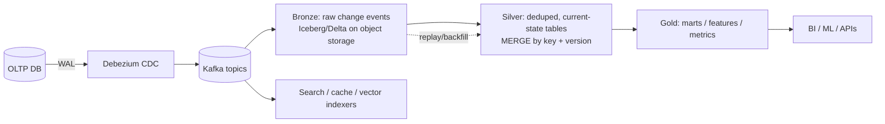
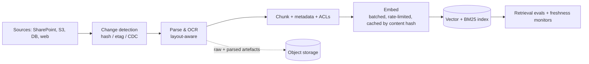

# Batch & stream data pipelines

!!! abstract "At a glance"
    **Priority:** P1 · **Complexity:** 3/5 · **Est. time:** 3 h · **Phase:** 3 · **Prereqs:** [Messaging & streaming](messaging-streaming.md), [Storage, CDN & edge](storage-cdn.md)
    **You're done when:** you can choose batch vs streaming vs micro-batch, explain event time, watermarks and windowing, design CDC-based ingestion into a lakehouse with idempotent, replayable pipelines, and design ingestion/embedding pipelines for RAG with freshness and cost controls.

## Why it matters

Every serious system eventually grows a second system: the data platform that feeds analytics, search indexes, ML features, caches, and now RAG corpora. Most incidents there are silent (wrong numbers, missing partitions, duplicates, stale indexes) rather than loud outages. Staff engineers are expected to design pipelines that are **replayable, idempotent, observable and evolvable**, and to know when the simpler batch job beats a streaming architecture (usually).

AI turns pipelines into product: document ingestion, parsing, chunking, embedding and indexing are ETL with an unusual, expensive transform (model inference) and a hard freshness/cost trade-off. Evaluation and trace data pipelines feed quality dashboards; feature/embedding pipelines feed ranking. Getting idempotency, backfill and versioning right decides whether re-embedding 200M chunks after a model upgrade takes a weekend or a quarter.

## Core concepts

### Batch, stream, or micro-batch

| Approach | Latency | Complexity | Fits | Tools |
|---|---|---|---|---|
| **Batch** (hourly/daily) | minutes to hours | Lowest; easy reprocessing | Reporting, ML training data, reconciliation, most analytics | Spark, dbt + warehouse, DuckDB, Airflow/Dagster/Prefect |
| **Micro-batch** | seconds to minutes | Low-moderate | Near-real-time dashboards, incremental tables | Spark Structured Streaming, incremental dbt, Delta/Iceberg merges |
| **Stream** | ms to seconds | Highest: state, time, ordering, exactly-once | Fraud detection, alerting, real-time personalisation, CDC sync | Flink, Kafka Streams, ksqlDB, Materialize/RisingWave, Beam |

Decision rule: **start with batch; move to streaming only where a business requirement demands latency measured in seconds**, since streaming adds operational and correctness burden (state stores, watermarks, backpressure, rescaling). Many "real-time" needs are satisfied by 1–5 minute incremental batches on a lakehouse.

**Lambda vs Kappa:** Lambda maintains separate batch and speed layers (duplicated logic, reconciliation pain). Kappa uses one streaming code path with replay from the log for reprocessing. Modern lakehouses with streaming ingestion and incremental processing largely converge on "one logic, replayable input".

### Event time, processing time, and watermarks

Events arrive late and out of order. **Event time** (when it happened) is what analytics needs; **processing time** (when we saw it) is what the system has. Streaming frameworks use **watermarks**: a heuristic "no more events older than T are expected", allowing windows to close.

- **Window types:** tumbling (fixed, non-overlapping), sliding/hopping, session (gap-based).
- **Late data:** allowed lateness with updates to already-emitted results (retractions/upserts), side outputs for very late events, or reconciliation in batch. Trade-off: waiting longer = more accurate, higher latency, more state.
- **State:** aggregations/joins need state (RocksDB in Flink); size and TTL it; checkpoint to durable storage. State growth is the classic slow-burn incident.
- **Exactly-once:** Flink checkpoints + transactional/idempotent sinks; end-to-end exactly-once requires both source offsets and sink writes to be atomic or idempotent (see [Messaging](messaging-streaming.md)).

Tyler Akidau's "Streaming 101/102" (and the Dataflow model paper) remains the clearest exposition of what/where/when/how.

### CDC and the lakehouse

- **Change data capture** (log-based: Debezium on Postgres/MySQL binlog) delivers every committed change in order per key, without load on OLTP tables or dual-write bugs. Handle **initial snapshot + streaming handoff**, schema changes (schema registry, compatibility rules), deletes (tombstones), and large transactions.
- **Medallion layering (bronze/silver/gold):** immutable raw first (the source of replay), then cleaned/conformed, then business-level. Raw retention enables reprocessing when logic bugs are found.
- **Table formats (Iceberg, Delta Lake, Hudi):** ACID commits on object storage via manifests and atomic metadata swaps (conditional writes), schema evolution, time travel, MERGE/upserts, compaction. Iceberg has emerged as the interoperable default across engines (Spark, Flink, Trino, DuckDB, Snowflake, BigQuery).
- **Small-file problem:** streaming writes produce many small files; schedule compaction and clustering.
- **Data contracts:** producers publish schema + semantic guarantees + SLAs (freshness, completeness); breaking changes go through versioning; contract tests in CI. Tools: schema registry, Great Expectations/Soda/dbt tests.

### Orchestration and correctness

- **Idempotent tasks:** a re-run for the same partition/time window overwrites (replace partition, MERGE by key) rather than appending duplicates. Parameterise by logical data interval, not `now()`.
- **Backfills** are first-class: same code path with a date range; dependency-aware; rate-limited so they don't starve production loads.
- **Orchestrators:** Airflow (ubiquitous), Dagster (asset-oriented, strong lineage), Prefect, Temporal for durable workflows. Choose by team and data-asset model; keep business logic out of DAG files.
- **Data quality:** freshness, volume, null rates, uniqueness, referential checks, distribution drift; fail closed for critical tables (quarantine bad data) and alert with owners. Data **observability** (lineage via OpenLineage) accelerates incident diagnosis.
- **Exactly-once effect via idempotent sinks:** upsert by primary key + version; dedupe by event ID; deterministic IDs for derived rows.
- **Late/duplicate/out-of-order data** is the norm, not the edge case: design for it.

### Cost and performance levers

- Columnar formats (Parquet) with partitioning (by date, not high-cardinality keys) and clustering/Z-order; file sizes 128 MB–1 GB.
- Push filters/projections down; avoid shuffles; broadcast small dimensions; skew handling (salting).
- Incremental models instead of full refresh; watermarked "process only new".
- Right-size streaming state; use compacted topics for changelogs.
- Storage lifecycle and query engines matched to workload (DuckDB/Polars for single-node tens-of-GB analytics is often faster and cheaper than a cluster).

### Pipelines for AI systems

Design points:

- **Change detection:** content hashes/ETags/versions so unchanged documents aren't re-embedded (embedding cost is real money); embed cache keyed by `hash(chunk_text, embedding_model, model_version)`.
- **Idempotent keyed upserts:** `(doc_id, doc_version, chunk_no)`; delete stale chunks of previous versions atomically (or version filter) so users don't see old + new chunks.
- **Version everything:** parser version, chunker config, embedding model, index schema. Store raw and parsed artefacts so re-chunking/re-embedding doesn't require re-parsing or re-fetching. **Blue/green indexes** for embedding-model upgrades: build in parallel, evaluate on judged queries, switch an alias, keep the old for rollback.
- **Throughput & rate limits:** embedding APIs have TPM limits; batch requests (many chunks per call), token-aware limiter, parallelism tuned to quota; prioritise interactive uploads over backfills (separate queues). Provider batch APIs (discounted, async) suit backfills.
- **Freshness SLO** (e.g. p95 upload-to-searchable < 60 s) and completeness checks (source count vs index count).
- **ACL propagation** as a first-class pipeline concern: permission changes flow quickly, and the query layer verifies at read time ([Consistency models](consistency-models.md)).
- **Quality gates:** parse-failure rates, empty-chunk rates, chunk-length distributions, sampled human/LLM review; DLQ for unparseable documents with owner and replay.
- **Data for evals and fine-tuning:** log traces to Parquet in object storage; build datasets with lineage; scrub PII before reuse.

## Resources

| Resource | Type | Why this one | Level | Cost |
|---|---|---|---|---|
| [Tyler Akidau — The world beyond batch: Streaming 101](https://www.oreilly.com/radar/the-world-beyond-batch-streaming-101/) | article | The clearest explanation of event time, windows, watermarks and triggers | intermediate | free |
| [Apache Flink docs](https://nightlies.apache.org/flink/flink-docs-stable/) | docs | State, checkpoints, watermarks, exactly-once sinks | advanced | free |
| [Debezium documentation](https://debezium.io/documentation/) | docs | Log-based CDC connectors, snapshotting, schema change handling | intermediate | free |
| [Apache Iceberg](https://iceberg.apache.org/) | docs | Table format spec and docs; understand snapshots, manifests, compaction | intermediate | free |
| [Start Data Engineering (Joseph Machado)](https://www.startdataengineering.com/) :gem: | article | Practical, opinionated data engineering with runnable projects and clear trade-offs | intermediate | free |
| [DDIA 2e — Batch & stream processing chapters](https://martin.kleppmann.com/2026/03/24/designing-data-intensive-applications-2e.html) | book | Conceptual unification: logs, derived data, dataflow | advanced | paid |
| [Jay Kreps — The Log](https://engineering.linkedin.com/distributed-systems/log-what-every-software-engineer-should-know-about-real-time-datas-unifying) :gem: | article | Why the log is the backbone of data integration | intermediate | free |
| [Kafka documentation](https://kafka.apache.org/documentation/) | docs | Connect, streams, semantics for pipeline integration | intermediate | free |

## Hands-on lab

**Goal:** build a CDC → lakehouse → vector-index pipeline with backfill (2–3 h; reuse for the capstone).

1. docker-compose: Postgres (logical replication), Kafka (KRaft), Debezium Connect, MinIO. Table `documents(id, tenant_id, title, body, version, updated_at)`.
2. Debezium → Kafka topic; a Python consumer writes bronze Parquet/Iceberg (PyIceberg) partitioned by day; a silver job MERGEs the latest version per `id` (DuckDB or PyIceberg + Polars).
3. Embedding stage: consume changes, chunk, look up embed cache by content hash (Postgres/Redis), batch embed via Ollama (or a fake embedder), upsert into pgvector by `(doc_id, version, chunk_no)`, delete old-version chunks in the same transaction.
4. Chaos: kill the embedder mid-batch; replay from last committed offset; verify no duplicates. Send out-of-order versions (v3 before v2) and verify the version guard.
5. Backfill: re-embed everything with a "new model" into `chunks_v2`, evaluate on 30 judged queries, swap a view/alias, keep `chunks_v1` for rollback.
6. **Expected output:** identical results on replay, correct latest-version-wins behaviour, cache hit rate near 100% on unchanged documents, and a documented cutover with rollback.

## Questions

### L1 — Recall

??? question "Q1. Distinguish event time and processing time; why do watermarks exist?"
    ??? success "Answer"
        Event time is when the event occurred; processing time is when the system handles it. Network delays and retries make arrival order differ from event order. Watermarks are the system's estimate of event-time progress ("no events earlier than T will arrive"), letting windows close and results emit while bounding state; late events beyond the watermark need allowed lateness, side outputs or reconciliation.

??? question "Q2. What does log-based CDC provide over polling or dual writes?"
    ??? success "Answer"
        It reads the database's committed transaction log, capturing every change including deletes in commit order with low overhead and no application changes, avoiding missed changes (polling misses intermediate states and deletes) and inconsistencies from dual writes (DB succeeds, message fails).

??? question "Q3. What problem do table formats like Iceberg/Delta solve on object storage?"
    ??? success "Answer"
        They add ACID transactions, snapshot isolation, schema evolution, time travel and efficient upserts on immutable files, using metadata/manifest files committed atomically (via conditional puts or a catalog), so multiple engines can read/write consistently and file listing isn't needed for query planning.

??? question "Q4. What makes a pipeline task idempotent?"
    ??? success "Answer"
        Re-running it for the same input interval yields the same output without duplicates: overwrite the target partition or MERGE by deterministic key/version, derive time from the logical interval rather than the wall clock, and avoid append-only writes without dedupe keys.

### L2 — Apply

??? question "Q5. A daily revenue table is off by 0.8% after a late-arriving event feed. Diagnose and fix."
    ??? success "Answer"
        The pipeline likely windows by processing time or closes daily partitions before late events arrive. Fix by partitioning on event time, running a reprocessing step for the trailing N days (e.g. 3-day lookback recompute) with idempotent overwrite, tracking a watermark/late-arrival metric, and reconciling to the source-of-truth totals daily with alerts on deviation > threshold. For streams, configure allowed lateness with upserts into the serving table.

??? question "Q6. Plan the re-embedding of 200M chunks after switching embedding models. Cost, time and risk controls?"
    ??? success "Answer"
        Estimate tokens: 200M × ~400 tokens = 80B tokens; at an example price of $0.02–0.13 per million tokens that's ~$1.6k–$10k via API, or GPU-hours if self-hosted (throughput of thousands of chunks/s on a modern GPU with a small model → a day or so). Use provider batch APIs (async, discount) or a GPU pool. Run as a backfill into a new index (`v2`) with checkpointing per shard/partition, rate-limited so production ingestion isn't starved, cached by content hash to skip duplicates. Evaluate on judged queries and compare recall/MRR before switching an alias; dual-serve or shadow-query for a week; keep `v1` for rollback. Watch dimension changes (index size/latency).

??? question "Q7. A streaming job's state grows unbounded and checkpoints take 20 minutes. What do you do?"
    ??? success "Answer"
        Identify the operator holding state (unbounded keyed aggregation, join without time bounds, missing TTL). Fix with state TTL or windowed/interval joins, key cardinality reduction, incremental (RocksDB) checkpointing with aligned/unaligned tuning, increased parallelism to spread state, and moving cold state to a batch layer. Add state size and checkpoint duration alerts before they cause failures.

### L3 — Design & trade-offs

??? question "Q8. Streaming (Flink) vs incremental batch on a lakehouse for a 'near-real-time' dashboard with a 5-minute freshness requirement."
    ??? success "Answer"
        Five minutes is well within micro-batch/incremental capability: Spark Structured Streaming or scheduled incremental dbt/Iceberg MERGE every 1–5 minutes, or a streaming ingest into a real-time OLAP store (ClickHouse/Druid/Pinot). Flink is warranted for sub-second latency, complex event processing, or heavy stateful streaming (fraud). Choose the simplest that meets the SLO; consider operational skill, cost (always-on streaming vs scheduled compute), and reprocessing ease. Decide with a short spike and cost estimate.

??? question "Q9. How do you make a RAG ingestion pipeline correct under permission changes and document deletions?"
    ??? success "Answer"
        Treat ACLs and deletions as first-class change events with priority lanes. On delete: tombstone event → remove chunks and vectors (by `doc_id`) and purge caches; verify with reconciliation jobs. On ACL change: update chunk metadata quickly (metadata-only update path without re-embedding) and rely on query-time authorisation for correctness while the index catches up. Keep an audit log; SLO for propagation (e.g. p99 < 5 min); compliance workflows (GDPR erasure) also purge parsed artefacts, embed caches and backups per policy.

??? question "Q10. Data contract violations from upstream teams break the warehouse weekly. What mechanisms do you put in place?"
    ??? success "Answer"
        Publish schemas in a registry with compatibility checks in the producer's CI (block breaking changes), define semantic and quality expectations (freshness, nullability, ranges) as executable tests run at ingestion with quarantine of violating batches, provide consumer-driven contract tests, agree ownership and escalation paths (producer on-call for contract issues), and version topics/tables for breaking changes with deprecation windows. Add lineage so impact analysis is instant. Organisationally, tie contract health to team metrics and give producers tooling that makes compliance easy.

### L4 — Staff-level ambiguity

??? question "Q11. The data platform has 400 nightly Airflow DAGs, frequent failures, and executives distrust dashboards. How do you turn this around?"
    ??? success "Answer"
        Establish trust with a small set of "tier-1" datasets (those feeding executive dashboards and finance): define owners, freshness/completeness SLOs, tests, and incident processes; monitor with data observability and lineage. Reduce fragility: idempotent tasks, retries with backoff, backfill tooling, and dependency-based (asset) orchestration rather than time-based waits. Consolidate duplicate pipelines, retire unused DAGs (usage analytics from the warehouse), and standardise templates. Communicate status via a public data health page. Run it as a programme with quarterly targets (% tier-1 datasets meeting SLO) and celebrate incident reduction; avoid a big-bang rewrite.

??? question "Q12. Three product teams built separate document-ingestion pipelines with different parsers, chunkers and embedding models. Propose convergence."
    ??? success "Answer"
        Build a shared ingestion platform exposing stages as a pipeline with pluggable configs: connectors, parsers, chunking strategies, embedding models, and sinks, all versioned and observable. Start by extracting common infrastructure (queues, idempotency, DLQ, ACL handling, cost/rate limiting, evals) that all teams need, while allowing per-corpus configuration justified by retrieval evals. Provide a shared evaluation harness so decisions are evidence-based; migrate teams by demonstrating quality/cost wins. Governance: config-as-code, review for new parsers, and a catalogue of corpora with owners and freshness SLOs. Avoid forcing one chunker if evals show different corpora need different strategies.

## Real-world use cases

- **Uber/Netflix:** streaming platforms (Flink/Kafka) for real-time metrics and pricing; lakehouse for analytics.
- **Airbnb/Shopify:** CDC into warehouse for near-real-time reporting; data contracts and quality tooling.
- **Logistics:** vessel/container event streams normalised into a lakehouse; ETA models trained from historical events; freshness SLOs on tracking data.
- **Enterprise RAG:** incremental ingestion with change detection, cached embeddings, blue/green index upgrades.

## Pitfalls & anti-patterns

- Streaming everything by default.
- Append-only loads with no dedupe keys; non-replayable pipelines.
- Windowing by processing time; ignoring late data.
- No raw layer, so bugs can't be reprocessed.
- Small-file explosions; partitioning on high-cardinality keys.
- Re-embedding unchanged content; no version tags on parser/chunker/model.
- Silent data quality failures with no owners.

## Checklist

- [ ] I can choose batch vs micro-batch vs stream with justification
- [ ] I can explain event time, watermarks, windows and late data
- [ ] I built a CDC → lakehouse → vector pipeline with replay and versioned backfill
- [ ] I can design idempotent, observable pipelines with data contracts
- [ ] I answered all L3 questions out loud in < 3 min each
