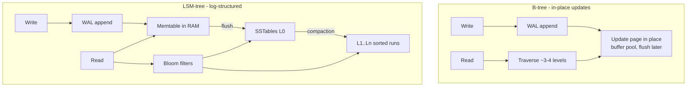

# Databases: SQL vs NoSQL, storage engines

!!! abstract "At a glance"
    **Priority:** P0 · **Complexity:** 3/5 · **Est. time:** 5 h · **Phase:** 2 · **Prereqs:** [Scalability fundamentals](scalability-fundamentals.md)
    **You're done when:** you can choose a database from access patterns (not brand loyalty), explain B-tree vs LSM trade-offs in terms of read/write/space amplification, reason about isolation anomalies, and defend "Postgres + pgvector" vs a dedicated vector DB for an AI workload.

## Why it matters

Database choice is the most expensive decision to reverse in most systems. Staff engineers are expected to reason from **access patterns, consistency needs, scale envelope and operational capability**, and to know what's actually happening underneath (storage engine, indexes, isolation) so they can predict failure modes. The "SQL vs NoSQL" framing is outdated: modern Postgres does JSON, full-text and vectors; DynamoDB does transactions; distributed SQL (Spanner, CockroachDB, YugabyteDB, Aurora DSQL) scales horizontally with SQL semantics. The real question is *which trade-offs you want to pay for*.

AI workloads added new pressure: embeddings (vector search), agent state/checkpoints (high-write, small documents), conversation history, eval results and traces (append-heavy analytics). The 2025–26 consensus is "start with Postgres (pgvector) unless you have a specific reason not to" — and a Staff engineer should know exactly what those reasons are.

## Core concepts

### Data models and when they fit

| Model | Examples | Fits | Watch out |
|---|---|---|---|
| Relational | Postgres, MySQL, SQL Server, Oracle | Rich relationships, ad-hoc queries, transactions, integrity constraints | Horizontal write scaling needs sharding or distributed SQL |
| Distributed SQL | Spanner, CockroachDB, YugabyteDB, Aurora DSQL, TiDB | Global scale + SQL + serializable/strong consistency | Higher write latency (consensus), cost, hot-range tuning |
| Key-value / wide-column | DynamoDB, Cassandra, ScyllaDB, Bigtable | Massive scale with known access patterns, predictable latency | Must design tables around queries; limited ad-hoc; secondary indexes costly |
| Document | MongoDB, Couchbase, Cosmos DB, Postgres JSONB | Aggregates read/written together, flexible schema | Joins and cross-document transactions are weaker/costlier |
| Graph | Neo4j, Neptune, Postgres + recursive CTEs | Deep traversal queries (fraud rings, lineage) | Scaling traversals across partitions; often overused |
| Time-series | TimescaleDB, InfluxDB, ClickHouse, Prometheus | Append-heavy, time-range queries, downsampling | Cardinality explosions |
| Columnar / OLAP | ClickHouse, DuckDB, Snowflake, BigQuery, Iceberg+engine | Scans and aggregations over billions of rows | Point updates and high-concurrency OLTP |
| Search | Elasticsearch/OpenSearch, Vespa | Full-text, relevance, faceting | Not a system of record; see [Search systems](search-systems.md) |
| Vector | pgvector, Qdrant, Milvus, Weaviate, Pinecone, turbopuffer | ANN similarity search over embeddings | Recall/latency/cost tuning; filtering; see [Vector databases](../agentic-ai/vector-databases.md) |

### Storage engines: B-tree vs LSM-tree

| Property | B-tree (Postgres, InnoDB, SQL Server) | LSM (RocksDB, Cassandra, ScyllaDB, many NewSQL engines) |
|---|---|---|
| Write amplification | Moderate-high (page rewrites, full-page writes) | Can be high due to compaction, but writes are sequential |
| Read amplification | Low: O(log n) pages, predictable | Higher: check memtable + multiple levels (Bloom filters help) |
| Space amplification | Fragmentation, bloat (Postgres MVCC) | Obsolete versions until compaction; tiered compaction ~2× temporary |
| Best for | Read-heavy, range scans, mixed OLTP | Write-heavy ingestion, time-series, KV at scale |
| Operational pain | Vacuum (Postgres), page splits, index bloat | Compaction storms, tombstones, tuning compaction strategy |

RUM conjecture: you can optimise two of **R**ead, **U**pdate, **M**emory/space amplification, not all three.

### Indexes — where most performance lives

- **B-tree index**: equality and range; composite index column order matters (equality columns first, then range; leftmost prefix rule).
- **Covering / index-only scans**: include needed columns to avoid heap lookups.
- **Partial indexes**: index only `WHERE status = 'open'` — tiny and fast.
- **GIN** (JSONB, arrays, full-text), **BRIN** (huge naturally ordered tables, e.g. time), **hash**.
- **Vector indexes**: HNSW (fast, memory-heavy, good recall), IVFFlat (cheaper build, needs training/lists tuning). pgvector supports both, plus iterative index scans for filtered queries (0.8+).
- Every index costs writes and storage. A table with 12 indexes has ~12× write amplification on insert.

### Transactions and isolation

| Level | Prevents | Still allows | Notes |
|---|---|---|---|
| Read committed (Postgres default) | Dirty reads | Non-repeatable reads, lost updates, write skew | Most apps run here unknowingly |
| Repeatable read / snapshot isolation | + non-repeatable reads, lost updates (in PG) | **Write skew**, phantoms (in some engines) | Postgres RR = SI |
| Serializable (PG SSI) | All anomalies | — (aborts with serialization failures; must retry) | Cost: aborts under contention |

**Write skew** example: two on-call doctors each check "at least one other doctor is on call" and both go off call. Snapshot isolation allows it. Fixes: `SELECT … FOR UPDATE` on the rows the invariant depends on, materialise the conflict (a row to lock), or use serializable. Seniors know which anomalies their default level permits; Jepsen reports repeatedly show databases that don't deliver the advertised level.

**MVCC:** readers don't block writers; old versions kept until garbage-collected (Postgres vacuum, InnoDB purge). Long-running transactions prevent cleanup → bloat, and in Postgres, the risk of transaction ID wraparound if vacuum can't keep up.

### Choosing: a decision procedure

1. List **access patterns** with rates and latency targets (the top 5 queries matter most).
2. Identify **invariants** that need transactions (money, inventory, uniqueness).
3. Estimate **data size and write rate** over 3 years.
4. Decide **consistency** needs per pattern (see [Consistency models](consistency-models.md)).
5. Factor **operational capability**: managed service availability, team expertise, backup/restore, observability.
6. Default: **managed Postgres** for OLTP; add specialised stores (search, OLAP, cache, vector) fed via CDC when a pattern outgrows it. Choose DynamoDB/Cassandra when access patterns are known, scale is huge, and single-digit ms at any scale matters more than flexibility.

### AI workloads

- **Vectors in Postgres (pgvector)**: transactional consistency with metadata, joins with ACLs, one system to operate. Good to tens of millions of vectors on a single node with HNSW + quantisation; filtered search needs care.
- **Dedicated vector DB**: when you need billions of vectors, very high QPS, advanced filtering at scale, multi-tenancy with thousands of namespaces, or object-storage-backed cost profiles (turbopuffer, S3 Vectors-style).
- **Agent checkpoints (LangGraph etc.)**: frequent small writes per step; Postgres or Redis; plan retention and TTLs.
- **Traces/evals**: append-heavy, analytical reads → ClickHouse (Langfuse moved to ClickHouse-backed storage) or columnar.

## Resources

| Resource | Type | Why this one | Level | Cost |
|---|---|---|---|---|
| [Designing Data-Intensive Applications 2e](https://martin.kleppmann.com/2026/03/24/designing-data-intensive-applications-2e.html) | book | Ch. on storage engines, data models, transactions — the definitive treatment, updated 2026 | advanced | paid |
| [Use The Index, Luke](https://use-the-index-luke.com/) :gem: | article | The clearest explanation of how SQL indexes actually work and why queries are slow | intermediate | free |
| [CMU 15-445/645 Database Systems](https://15445.courses.cs.cmu.edu/) | course | Andy Pavlo's lectures on storage, indexes, concurrency control — free videos | advanced | free |
| [PlanetScale — B-trees and database indexes](https://planetscale.com/blog/btrees-and-database-indexes) :gem: | interactive | Beautiful interactive visualisation of B-trees, page splits and why UUIDv4 keys hurt | intermediate | free |
| [Database Internals (Alex Petrov)](https://www.databass.dev/) | book | Deep dive into B-trees, LSM, and distributed DB algorithms | advanced | paid |
| [Discord — How Discord stores trillions of messages](https://discord.com/blog/how-discord-stores-trillions-of-messages) | article | Real migration Cassandra → ScyllaDB with hot-partition lessons | intermediate | free |
| [Andy Pavlo — Databases year in review](https://www.cs.cmu.edu/~pavlo/blog/) :gem: | article | Annual opinionated survey of the database landscape; best way to stay current | intermediate | free |
| [Jepsen analyses](https://jepsen.io/analyses) | article | Evidence of what databases actually guarantee under faults | advanced | free |
| [pgvector](https://github.com/pgvector/pgvector) | docs | HNSW/IVFFlat parameters, filtering, quantisation options | intermediate | free |

## Hands-on lab

**Goal:** feel index design and isolation anomalies in Postgres (90 min).

1. `docker run postgres:17` (or 18). Create `orders(id bigserial, customer_id int, status text, created_at timestamptz, total numeric)` with 10M rows (`generate_series`).
2. Query "open orders for customer X in the last 30 days, newest first". Run `EXPLAIN (ANALYZE, BUFFERS)` with: no index; index on `customer_id`; composite `(customer_id, created_at DESC)`; partial composite `WHERE status='open'`. Record timings and buffers.
3. Isolation: open two `psql` sessions at `REPEATABLE READ` and reproduce write skew (on-call doctors). Then fix with `SERIALIZABLE` and observe `could not serialize access`; implement a retry loop in Python.
4. Add pgvector: insert 1M random 768-d vectors with a `tenant_id`; build HNSW; run filtered top-10 queries for a small tenant with and without `hnsw.iterative_scan` and compare recall/latency.
5. **Expected output:** composite/partial index reduces the query from seconds to sub-millisecond; write skew reproduced then prevented; filtered vector queries show recall drop without iterative scan for selective filters.

## Questions

### L1 — Recall

??? question "Q1. What is write amplification, and why is it high in both B-trees and LSM-trees for different reasons?"
    ??? success "Answer"
        Bytes physically written per byte of logical write. B-trees rewrite whole pages (e.g. 8 KB) for small updates, plus WAL and full-page images after checkpoints. LSM-trees write sequentially but rewrite data repeatedly during compaction as it moves through levels (leveled compaction can be 10–30×). LSM trades this for sequential I/O and high ingest throughput.

??? question "Q2. What anomaly does snapshot isolation allow that serializable prevents?"
    ??? success "Answer"
        Write skew (and related phantom-based anomalies): two transactions read overlapping data, make disjoint writes based on what they read, and together violate an invariant that each alone preserved. Example: two doctors both go off call because each saw the other on call.

??? question "Q3. Why does a long-running transaction hurt a Postgres database?"
    ??? success "Answer"
        MVCC keeps old row versions visible to the oldest open snapshot; vacuum can't remove dead tuples newer than it, causing table/index bloat, slower scans, and — in extreme cases — risk of transaction ID wraparound. It can also hold locks that block DDL and create lock queues. Also blocks logical replication slots from advancing.

??? question "Q4. What do Bloom filters do in an LSM engine?"
    ??? success "Answer"
        Each SSTable has a Bloom filter over its keys; a point lookup checks the filter and skips files that definitely don't contain the key, avoiding disk reads. False positives cost an unnecessary read; there are no false negatives. They don't help range scans (prefix Bloom filters partially do).

### L2 — Apply

??? question "Q5. Design the DynamoDB table for an order system with patterns: get order by id, list a customer's orders by date, list open orders by warehouse."
    ??? success "Answer"
        Base table: PK=`ORDER#<id>` for get-by-id, or single-table design with PK=`CUSTOMER#<cid>`, SK=`ORDER#<created_at>#<id>` for customer listing, plus an item or GSI for get-by-id. GSI1: PK=`WAREHOUSE#<wid>#STATUS#open`, SK=`created_at` — a sparse index where only open orders carry the GSI attributes (remove on close). Watch hot partitions: a huge warehouse's open-orders partition may exceed per-partition throughput → write-shard the GSI key (`#<0..N>`) and scatter-gather. Transactions (TransactWriteItems) for order+inventory updates if needed.

??? question "Q6. A composite index on (status, created_at) isn't used for `WHERE created_at > now() - interval '1 day' AND customer_id = 42`. Why, and what index do you create?"
    ??? success "Answer"
        The query doesn't filter on the leading column `status`, so the leftmost-prefix rule prevents efficient use (at best a full index scan). Create `(customer_id, created_at)`: equality column first, range column second, which lets the planner seek directly to customer 42's recent rows. Add `INCLUDE` columns for index-only scans if hot.

??? question "Q7. You need to store 200M embeddings (1536-d) with tenant filtering for a RAG platform. Is Postgres + pgvector viable?"
    ??? success "Answer"
        Raw float32: 200M × 1536 × 4 B ≈ 1.2 TB — too large for a single node's RAM for HNSW. Options within Postgres: halfvec (2 bytes/dim → ~600 GB), binary quantisation for candidate generation + rerank on full vectors, partitioning by tenant (per-tenant or per-tenant-group indexes, which also improves filtered recall), or Citus to shard. Viable but operationally heavy at this size. A dedicated engine with quantisation, disk-based indexes, and native multi-tenancy (Qdrant, Milvus, turbopuffer on object storage) may be cheaper and simpler. Decide by QPS, latency target, tenant count distribution, and team expertise; prototype both with your recall target.

### L3 — Design & trade-offs

??? question "Q8. Postgres vs DynamoDB for a new multi-tenant SaaS core (orders, invoices, users). Decide."
    ??? success "Answer"
        Postgres: relational integrity, ad-hoc queries for reporting/support, transactions across entities, flexible evolution, row-level security for tenancy; scaling limits appear at very high write volume or if one database can't serve all tenants — mitigate with tenant-based sharding later (Citus or app-level). DynamoDB: effortless scale and ops, predictable latency, but requires knowing access patterns upfront, awkward for ad-hoc queries and evolving relationships, and costs can surprise on scans/GSIs. For a new product with evolving requirements and relational data: Postgres (managed, e.g. Aurora/Azure Flexible Server), designed with `tenant_id` in every key to keep sharding possible. Choose DynamoDB if the patterns are simple and stable and the team is AWS-native and wants zero DB ops.

??? question "Q9. When would you pick an LSM-based store over a B-tree store, concretely?"
    ??? success "Answer"
        Write-heavy workloads with ingest rates beyond what in-place updates handle efficiently: event/IoT ingestion, time-series, messaging (Discord), activity logs, KV stores at huge scale; workloads where recent data is hot and old data is cold; SSD-friendly sequential writes. Avoid when you need predictable low-latency reads with many point lookups across cold data and frequent updates/deletes (tombstone overhead), or heavy range scans across many levels. Also consider operational maturity: compaction tuning is real work.

??? question "Q10. Distributed SQL (Spanner/CockroachDB) vs sharded Postgres for a global logistics booking system."
    ??? success "Answer"
        Distributed SQL gives automatic sharding/rebalancing, cross-shard ACID transactions, and geo-partitioning (pin rows to regions for latency/residency) with SQL. Costs: higher per-write latency due to consensus (and cross-region quorums if not geo-partitioned), licensing/managed cost, and different performance tuning (hot ranges, contention). Sharded Postgres: mature tooling and performance per node, but cross-shard transactions and rebalancing are your problem, and global distribution needs custom routing. For bookings that must be consistent (capacity on a vessel) and served globally with residency requirements, distributed SQL with regional partitioning by booking origin is a strong fit; if 95% of traffic is regional and cross-region transactions are rare, regional Postgres clusters with async cross-region replication may be cheaper. Model the transaction patterns first.

### L4 — Staff-level ambiguity

??? question "Q11. Your company runs 9 database technologies across 60 services, with thin expertise in several. Propose a data platform strategy."
    ??? success "Answer"
        Goal: reduce cognitive and operational load without forcing bad fits. (1) Inventory: engines, versions, data size, criticality, incidents, expertise, cost. (2) Define a **paved road**: a small supported set (e.g. managed Postgres for OLTP, Redis for caching, Kafka for streams, a lakehouse for analytics, one search engine; pgvector as default vector store) with golden configs, backups, observability, and runbooks owned by a platform team. (3) Exceptions require an ADR justifying the need (scale/access pattern) and a named owning team with on-call. (4) Migrate opportunistically: prioritise engines with high risk (unsupported versions, single-expert ownership) and low migration cost; don't migrate stable systems just for uniformity. (5) Measure: number of engines, incidents per engine, time to provision, cost. Communicate as risk reduction and speed, not standardisation for its own sake.

??? question "Q12. A team wants to adopt a new vector database startup for their RAG product because 'Postgres is too slow'. How do you evaluate the claim and the decision?"
    ??? success "Answer"
        Ask for the benchmark: data size, dimensions, filter selectivity, target recall@k, p95 latency, QPS, and the Postgres configuration used (HNSW params `m`/`ef_construction`/`ef_search`, quantisation, iterative scans, memory sizing). Often "slow" means untuned or missing indexes. Run a fair bake-off on production-like data with the same recall target. Beyond performance evaluate: data consistency with source-of-truth (dual write vs CDC), ACL filtering, multi-tenancy, backup/restore, security/compliance, vendor viability (startup risk; exit path — can we re-embed and move?), cost at 3× scale, and operational burden. Decide with a scorecard; if the new DB wins, isolate it behind a retrieval interface so it's swappable, and feed it via CDC from the system of record.

## Real-world use cases

- **Discord:** Cassandra → ScyllaDB with a data-services layer that coalesces hot-partition requests.
- **Notion/Figma:** scaling Postgres via application-level sharding rather than switching engines.
- **Logistics tracking:** Postgres for bookings (transactions), time-series/columnar store for container events, search for shipment lookup, lakehouse for analytics — all fed via CDC.
- **RAG platform:** pgvector for per-tenant corpora under 10M vectors; dedicated vector engine for the global public corpus.

## Pitfalls & anti-patterns

- Choosing NoSQL "for scale" with 50 GB of data and evolving relational queries.
- Using the default isolation level without knowing its anomalies.
- Random UUIDv4 primary keys in B-tree tables at high insert rates (page splits, cache misses) — prefer UUIDv7/ULID or sequences.
- Indexing everything; never checking unused indexes.
- Long transactions (including idle-in-transaction connections) in Postgres.
- Using a search engine or cache as system of record.
- Dual writes to DB and vector store without reconciliation.

## Checklist

- [ ] I can map access patterns to a data model and engine and defend it
- [ ] I can explain B-tree vs LSM amplification trade-offs
- [ ] I reproduced write skew and fixed it
- [ ] I can size and justify pgvector vs dedicated vector DB
- [ ] I answered all L3 questions out loud in < 3 min each
