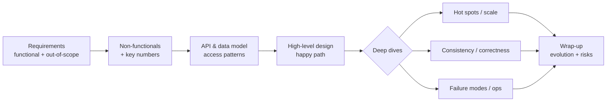

# Interview framework & back-of-envelope estimation

!!! abstract "At a glance"
    **Priority:** P0 · **Complexity:** 2/5 · **Est. time:** 3 h · **Phase:** 1 · **Prereqs:** [Scalability fundamentals & latency numbers](scalability-fundamentals.md)
    **You're done when:** you can run a 45-minute design session end-to-end with a timed structure, and produce a defensible QPS / storage / bandwidth / GPU estimate for any prompt in under 5 minutes, stating which number drives the architecture.

## Why it matters

At Staff/Principal level the interview (and the real design review) stops rewarding "knows the boxes" and starts rewarding **judgement under time pressure**: scoping ruthlessly, finding the one or two numbers that actually decide the architecture, and spending depth where the risk is. Seniors who fail Staff loops rarely fail on knowledge; they fail on *pacing* (15 minutes on requirements), *no quantification* ("it needs to scale"), or *breadth without a thesis* (every box, no deep dive).

In 2026 there is a second reason: AI systems changed the dominant cost unit. A classic web service is bounded by QPS and bytes; an LLM feature is bounded by **tokens per second, GPU-hours and dollars per request**. A Staff candidate who can say "at 2k RPS with 3k input / 400 output tokens we need roughly X output tokens/s, which is Y H100-class GPUs or $Z/day on an API" signals they have run these systems for real.

## Core concepts

### A timed framework (45–60 min)

| Phase | Time (45 min) | Output | Staff-level signal |
|---|---|---|---|
| 1. Requirements | 4–6 min | 3–5 functional reqs, explicit **out of scope** list | You pick the hard part and say why |
| 2. Non-functionals + estimates | 4–5 min | Scale, latency targets, consistency, availability, cost envelope | Only the numbers that change the design |
| 3. API + data model | 5 min | Core endpoints/events, entities, access patterns | Access patterns drive storage choice |
| 4. High-level design | 8–10 min | End-to-end happy path that satisfies functional reqs | Simple first; no premature Kafka |
| 5. Deep dives | 15–20 min | 2–3 of: hot spots, consistency, failure modes, scaling a component | You drive; you name trade-offs and choose |
| 6. Wrap-up | 2–3 min | Bottlenecks, what you'd do next, operability | Evolution path, not a laundry list |

The Hello Interview "delivery framework" is the cleanest public version of this; the key insight is that **high-level design must satisfy functional requirements, deep dives satisfy non-functionals**. Don't mix them.

### Estimation: the minimum toolkit

**Constants to memorise** (rounded for mental arithmetic):

- 1 day ≈ 86,400 s ≈ **10^5 s**. 1 month ≈ 2.5 × 10^6 s. 1 year ≈ 3 × 10^7 s.
- 1M requests/day ≈ **12 RPS** average. 1B/day ≈ 12k RPS.
- Peak ≈ **2–3× average** for consumer traffic; 5–10× for spiky (sales, sports, batch kicks).
- Powers of two: 2^10 ≈ 10^3 (KB), 2^20 ≈ 10^6 (MB), 2^30 ≈ 10^9 (GB), 2^40 ≈ 10^12 (TB).
- One commodity server: ~10k–50k simple RPS (in-memory, small payload), ~1–5k RPS for typical CRUD with a DB call. One Postgres primary: ~10k–50k simple point reads/s, ~5k–20k writes/s before real tuning pain. One Redis shard: ~100k ops/s.
- Network: 10–25 Gbps per server NIC is normal in cloud; cross-AZ ~0.5–1 ms, cross-region 30–150 ms.
- Tokens: 1 token ≈ 4 English characters ≈ 0.75 words. A page of text ≈ 500–700 tokens.

**The estimation pipeline** — always in this order:

1. **Users → actions → requests/s** (average, then peak).
2. **Read:write ratio** → tells you whether caching/replicas or partitioning/log-structured storage is the lever.
3. **Payload size × rate → bandwidth** (ingress and egress separately; egress costs money).
4. **Storage = writes/s × size × retention × replication factor** (and index overhead ~1.3–2×).
5. **Memory for hot set** (Pareto: 20% of keys → 80% of reads) → cache size.
6. **Machines = peak load / per-machine capacity × headroom (~1.5–2×)**.
7. **For LLM paths**: tokens/request × requests/s → tokens/s; divide by per-GPU throughput or multiply by $/token.

### LLM-era estimation

LLM serving has two phases with different bottlenecks: **prefill** (process input tokens; compute-bound, parallel) and **decode** (generate output tokens one at a time; memory-bandwidth-bound). Consequences for estimates:

- **Latency** ≈ TTFT (time to first token, dominated by prefill + queueing) + output_tokens × TPOT (time per output token, typically 10–50 ms on hosted frontier models, faster on small models).
- **Cost** is quoted per million input and output tokens; output is usually 3–5× the input price. Cached input tokens can be ~10% of the base input price (provider-specific; check current pricing pages).
- **Throughput** on self-hosted GPUs depends massively on batch size and KV-cache memory. A single modern GPU running an 8B model with vLLM can serve thousands of output tokens/s aggregate; a 70B model on 4–8 GPUs serves far fewer per GPU. Treat any per-GPU number as "order of magnitude, benchmark before committing".

Worked mini-example: 5M requests/day RAG assistant, 4k input tokens (retrieved context) + 300 output.

- 5M/day ≈ 58 RPS avg, ~150 RPS peak.
- Input tokens/day = 5M × 4k = 20B; output = 1.5B.
- If input costs $X/M and output $5X/M: daily ≈ 20,000X + 7,500X = 27,500X. The **input side dominates** — so prompt caching and context pruning are the levers, not output-length tuning. That single observation is the Staff-level insight.

### Senior nuance juniors miss

- **Estimate to decide, not to impress.** State the decision the number drives: "150 writes/s — a single Postgres primary is fine; no sharding in v1."
- **Averages lie; design for peaks and tails.** Capacity for p99 at peak, not mean.
- **Replication factor and indexes** multiply storage (3× replication, 1.5× index, plus backups/snapshots).
- **Fan-out multiplies load**: one post to 1M followers = 1M writes (push) or 1M reads spread over time (pull). Estimate the *amplified* number.
- **Cost is a non-functional requirement.** Especially for AI features, give a $/month envelope early.
- **Precision is fake.** Round aggressively (86,400 → 10^5) and say so; interviewers reward speed and sanity checks ("that's ~1 PB/year — plausible for a video service, absurd for a URL shortener").

## Resources

| Resource | Type | Why this one | Level | Cost |
|---|---|---|---|---|
| [Hello Interview — Delivery framework](https://www.hellointerview.com/learn/system-design/in-a-hurry/delivery) | article | Best public timed framework; clear split between functional (HLD) and non-functional (deep dives) | intermediate | free |
| [Hello Interview — System Design in a Hurry](https://www.hellointerview.com/learn/system-design/in-a-hurry/introduction) | article | Compact refresher of the whole interview surface, written by ex-FAANG interviewers | intermediate | freemium |
| [Napkin Math (Simon Eskildsen)](https://github.com/sirupsen/napkin-math) :gem: | docs | Measured, up-to-date throughput/latency numbers for estimation, with a methodology to derive your own | advanced | free |
| [Latency numbers every programmer should know](https://gist.github.com/jboner/2841832) | article | The canonical table; memorise orders of magnitude | intermediate | free |
| [System Design Primer](https://github.com/donnemartin/system-design-primer) | docs | Broad reference with estimation appendix; good for gap-filling | intermediate | free |
| [ByteByteGo newsletter](https://blog.bytebytego.com/) | article | Visual explanations of common designs; skim for vocabulary | intermediate | freemium |
| [Jordan has no life (YouTube)](https://www.youtube.com/@jordanhasnolife5163) :gem: | video | Deep, opinionated walkthroughs that go past the "boxes" layer | advanced | free |
| *System Design Interview Vol. 1 & 2* (Alex Xu) | book | Chapter 2 of Vol. 1 is the classic estimation primer; case studies for practice | intermediate | paid |

## Hands-on lab

**Goal:** build a personal estimation cheat sheet and a reusable calculator (60–90 min).

1. Create `estimate.py` (plain Python, no deps) with functions: `rps(daily)`, `peak(avg, factor)`, `storage(writes_per_s, bytes, days, rf=3, index=1.5)`, `llm_cost(rps, in_tok, out_tok, in_price, out_price, cache_hit=0.0, cached_discount=0.9)`.
2. Run it for three prompts: (a) URL shortener 100M new URLs/month, 10:1 read:write; (b) chat app 50M DAU, 40 messages/user/day; (c) enterprise RAG 20k employees, 30 queries/day each, 6k input / 500 output tokens.
3. For each, write one sentence: *"The number that drives the design is ___ because ___."*
4. **Expected output:** (a) ~40 writes/s, ~400 reads/s avg — trivial compute, storage ~ a few TB over 5 years; the design driver is ID generation and read caching, not scale. (b) ~23k messages/s avg, ~70k peak — driver is connection count and fan-out. (c) ~7 RPS avg, but ~3.6B input tokens/month — driver is token cost, so prompt caching and retrieval precision matter more than infra.
5. Keep the script in the capstone repo under `tools/`; you will reuse it in [LLM capacity, latency & cost planning](../ai-system-design/capacity-cost-planning.md).

## Questions

### L1 — Recall

??? question "Q1. What are the phases of a system design interview and roughly how long should each take in 45 minutes?"
    ??? success "Answer"
        Requirements (~5 min), non-functionals + estimates (~5), API/data model (~5), high-level design (~10), deep dives (~15–20), wrap-up (~2–3). The high-level design should satisfy functional requirements end-to-end; the deep dives address non-functional requirements (scale, latency, consistency, fault tolerance). Staff candidates *drive* the deep-dive selection rather than waiting to be asked.

??? question "Q2. How many requests per second is 1 billion requests per day, and what peak would you plan for?"
    ??? success "Answer"
        1B / 86,400 ≈ 11.6k RPS average (use 10^5 s/day → 10k RPS for speed). Plan for 2–3× peak (≈25–35k RPS) for diurnal consumer traffic, more for event-driven spikes. Add headroom (1.5–2×) for failover: losing one AZ of three should not overload the other two, so size each AZ for ~50% of peak.

??? question "Q3. Why are LLM output tokens more expensive and slower than input tokens?"
    ??? success "Answer"
        Input tokens are processed in parallel in the **prefill** phase (compute-bound, efficient on GPUs). Output tokens are generated **autoregressively**, one per forward pass, each needing to read the model weights and the KV-cache from HBM — decode is memory-bandwidth-bound and poorly utilises compute unless heavily batched. So providers price output at a multiple of input, and latency scales roughly linearly with output length (TPOT × tokens).

??? question "Q4. What multiplies raw data volume when estimating storage?"
    ??? success "Answer"
        Replication factor (typically 3), index overhead (1.3–2×), metadata/envelope overhead, backups/snapshots and point-in-time recovery retention, compaction headroom for LSM stores (up to 2× temporarily), and for search/vector systems the index structures (HNSW graphs can add significant memory over raw vectors). Also multi-region copies.

### L2 — Apply

??? question "Q5. Estimate storage for a photo-sharing service: 10M uploads/day, 2 MB average original, three resized variants totalling 500 KB, 5-year retention, blob store with 11 nines durability."
    ??? success "Answer"
        Per day: 10M × 2.5 MB = 25 TB/day. Per year ≈ 9 PB; 5 years ≈ 45 PB logical. Object stores handle redundancy internally (erasure coding, roughly 1.3–1.8× overhead, which you pay for implicitly in price) so you don't multiply by 3. Metadata: 10M rows/day × ~1 KB = 10 GB/day → ~18 TB over 5 years including indexes — needs partitioning eventually but not day one. Design implications: tier older originals to infrequent-access/archive classes (most photos are cold after 30 days), serve variants through a CDN, and consider not storing some variants at all (generate on demand + cache).

??? question "Q6. A support copilot will handle 200k conversations/day, 6 turns each, with a 2k-token system prompt, growing history (avg 3k tokens), 1k retrieved tokens per turn, 250 output tokens. Estimate daily token volume and the effect of prompt caching."
    ??? success "Answer"
        Turns/day = 1.2M. Input per turn ≈ 2k + 3k + 1k = 6k → 7.2B input tokens/day; output = 300M tokens/day. The system prompt (2k) plus the stable prefix of history is cacheable: if ~70% of input tokens hit the prompt cache at ~10% of the price, effective input cost drops to roughly 0.3 + 0.7 × 0.1 = 37% of uncached. That's the biggest lever; next is trimming history (summarise after N turns) and reducing retrieved chunks via reranking. Also check latency: 6k-token prefill adds hundreds of ms of TTFT; caching reduces that too.

??? question "Q7. You estimate 30k writes/s of 1 KB events. Walk through what storage options this rules in or out."
    ??? success "Answer"
        30 MB/s ingress ≈ 2.6 TB/day raw, ~8 TB/day with RF=3. A single relational primary at 30k durable writes/s is possible with batching on good hardware but leaves no headroom and makes index maintenance painful — so either shard the RDBMS or use a log/LSM-based store (Kafka for ingestion; Cassandra/ScyllaDB/DynamoDB or a time-series store for serving). If the events are append-only and queried by time ranges, write to Kafka and land in columnar files (Parquet/Iceberg on object storage) for analytics. Retention policy matters more than engine choice at 8 TB/day.

### L3 — Design & trade-offs

??? question "Q8. The interviewer says 'design Twitter'. How do you scope it in 5 minutes, and what do you explicitly exclude?"
    ??? success "Answer"
        Clarify core: post tweets, follow users, home timeline read, maybe search. Pick the hard part explicitly: **home timeline generation at fan-out scale** (celebrity problem). Exclude: ads, DMs, trends, media transcoding, notifications, moderation — say you'd happily discuss them if time permits. Non-functionals: ~200M DAU, timeline read p99 < 200 ms, eventual consistency acceptable (a tweet appearing seconds late is fine), high availability over consistency for reads. Numbers: ~500M tweets/day ≈ 6k writes/s; reads 100× → ~600k timeline reads/s peak — this makes the read path (precomputed timelines in cache, hybrid push/pull) the design centre. Stating the exclusions and the reason for the focus is the Staff signal.

??? question "Q9. When is back-of-envelope estimation actively misleading, and how do you guard against it?"
    ??? success "Answer"
        (1) **Heavy-tailed distributions**: average payload/fan-out hides celebrities or whale tenants; estimate p99 actors separately. (2) **Queueing effects**: utilisation near 80%+ makes latency explode non-linearly; linear capacity math ignores it. (3) **Coordination costs**: throughput doesn't scale linearly with nodes (Amdahl/USL). (4) **LLM throughput**: per-GPU token rates vary 10× with batch size, context length, quantisation and prefix-cache hit rate. (5) **Cost**: egress, cross-AZ traffic and managed-service request pricing often dominate compute. Guards: sanity-check against a known system, prototype + load test the riskiest component, keep ranges not points, and revisit estimates when real telemetry exists.

??? question "Q10. How do you decide which 2–3 deep dives to do?"
    ??? success "Answer"
        Rank by **risk × interviewer interest**: (a) the component where the non-functional requirement is hardest (e.g. the hot write path, the fan-out, the exactly-once payment step); (b) the place where a naive design fails catastrophically (hot partition, thundering herd, split brain); (c) anything the interviewer hinted at. Announce the plan ("I'd like to go deep on timeline fan-out and then cache consistency; anything you'd rather see?"). Avoid deep-diving on commodity parts (load balancer algorithms) unless asked. In AI systems, evaluation/quality control and cost are often the most valuable deep dives because most candidates skip them.

### L4 — Staff-level ambiguity

??? question "Q11. A VP asks 'can we launch the AI assistant to all 40k employees next month?' You have no usage data. How do you produce a credible capacity and cost estimate and communicate the uncertainty?"
    ??? success "Answer"
        Build a **scenario model**, not a point estimate: adoption (10/30/60% weekly active), queries per active user/day (5/15/30), tokens per query from a pilot sample, model mix (small model for 70% of traffic via routing). Produce low/expected/high monthly cost and peak tokens/s, and map peaks against provider rate limits/quotas (TPM/RPM) — quota, not money, is often the launch blocker. Identify the levers with their effect sizes (prompt caching, routing, context limits, per-user quotas). Recommend a staged rollout (1k → 10k → all) with a cost dashboard and a kill switch, and a budget alert at the "expected" line. Communicate as: "Expected $X/month, 90% confident below $Y; the main risk is adoption above 50%, mitigated by per-user quotas. Go/no-go gate after 2 weeks at 10k users." That frames uncertainty as a managed risk rather than a hedge.

??? question "Q12. Your org's design reviews keep producing designs with no numbers. How would you change the culture without becoming the 'estimation police'?"
    ??? success "Answer"
        Make it cheap and valuable rather than mandatory-and-punitive: (1) add a short "Scale & cost" section to the design-doc template with 5 prompts (peak RPS, data growth/year, p99 target, $/month, the number that drives the design); (2) publish a shared calculator/notebook and an internal "napkin numbers" page measured on *your* infrastructure (DB write rates, cache latency, LLM tokens/s on your gateway); (3) in reviews, ask curious questions ("what breaks first at 10×?") and model it yourself; (4) celebrate a case where an estimate avoided over-engineering (e.g. killed an unnecessary Kafka cluster) — show it saves work, not adds it; (5) after launches, compare estimate vs actual in retros to calibrate. Success metric: % of docs with a quantified driver, and fewer post-launch capacity surprises.

## Real-world use cases

- **Logistics tracking (e.g. container/shipment events):** tens of millions of IoT/EDI events/day look scary until you compute ~1–2k events/s average — the real drivers are burstiness (vessel arrivals dump batches), idempotent ingestion, and 7-year retention for compliance.
- **Enterprise RAG launch:** estimating tokens reveals input context dominates cost; the team invests in reranking (fewer chunks) and prompt caching before buying reserved capacity.
- **Black Friday e-commerce:** peak factor of 10× over average forces pre-warmed capacity and queue-based checkout rather than autoscaling alone (autoscaling reacts in minutes; spikes arrive in seconds).
- **Video platform:** egress bandwidth ($/GB) dominates; estimation pushes design toward CDN offload > 95% and multi-CDN contracts.

## Pitfalls & anti-patterns

- Spending > 8 minutes on requirements; or skipping them and designing the wrong system.
- Computing numbers you never use. Every estimate should end with "therefore…".
- Designing for Google scale when the prompt implies 10k users — over-engineering is a red flag at Staff level.
- Forgetting peak factor, replication, or fan-out amplification.
- Treating LLM calls as ordinary RPCs: ignoring tokens, TTFT, rate limits (TPM) and per-request cost.
- Drawing every box in the HLD and having no time left for depth.

## Checklist

- [ ] I can recite the timed framework and what each phase must produce
- [ ] I can convert daily volume → RPS → peak → machines in under 60 seconds
- [ ] I can estimate LLM tokens/day and $/day, and name the dominant cost term
- [ ] I built `estimate.py` and ran it on three prompts
- [ ] I answered all L3 questions out loud in < 3 min each
