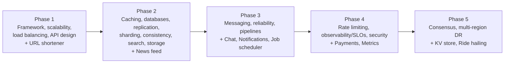

# System Design

## Reading order

Read top to bottom; each page's *You're done when* line is the exit check before moving on.

1. [Interview framework & back-of-envelope estimation](framework-and-estimation.md) — P0, ~3 h
2. [Scalability fundamentals & latency numbers](scalability-fundamentals.md) — P0, ~3 h
3. [Load balancing & proxies](load-balancing.md) — P0, ~2 h
4. [Caching strategies](caching.md) — P0, ~4 h
5. [Databases: SQL vs NoSQL, storage engines](databases-sql-nosql.md) — P0, ~5 h
6. [Replication](replication.md) — P0, ~3 h
7. [Partitioning & sharding, consistent hashing](partitioning-sharding.md) — P0, ~3 h
8. [Consistency models, CAP & PACELC](consistency-models.md) — P0, ~4 h
9. [Consensus: Raft, leases, fencing](consensus-raft.md) — P1, ~6 h
10. [Message queues & streaming (Kafka)](messaging-streaming.md) — P0, ~5 h
11. [API design: REST, gRPC, GraphQL, idempotency, pagination](api-design.md) — P0, ~3 h
12. [Rate limiting & quotas](rate-limiting.md) — P0, ~3 h
13. [Search systems & inverted indexes](search-systems.md) — P1, ~3 h
14. [Blob storage, CDN & edge](storage-cdn.md) — P1, ~2 h
15. [Reliability: retries, backoff, circuit breakers, bulkheads](reliability-patterns.md) — P0, ~3 h
16. [Observability, SLOs & error budgets](observability-slos.md) — P0, ~3 h
17. [Batch & stream data pipelines](data-pipelines.md) — P1, ~3 h
18. [Multi-region, DR & failover](multi-region-dr.md) — P1, ~3 h
19. [Security: authN/Z, OAuth2/OIDC, zero trust, multi-tenancy](security-authn-authz.md) — P0, ~3 h
20. [URL shortener](case-studies/url-shortener.md) — P0, ~2 h *(case study)*
21. [News feed / timeline](case-studies/news-feed.md) — P0, ~3 h *(case study)*
22. [Chat / messaging system](case-studies/chat-system.md) — P0, ~3 h *(case study)*
23. [Notification system](case-studies/notification-system.md) — P0, ~2 h *(case study)*
24. [Payment system](case-studies/payment-system.md) — P0, ~3 h *(case study)*
25. [Distributed key-value store](case-studies/distributed-kv-store.md) — P1, ~4 h *(case study)*
26. [Metrics & monitoring system](case-studies/metrics-monitoring.md) — P1, ~3 h *(case study)*
27. [Ride hailing / proximity service](case-studies/ride-hailing-proximity.md) — P1, ~3 h *(case study)*
28. [Distributed job scheduler](case-studies/job-scheduler.md) — P1, ~3 h *(case study)*

## Goal of the track

You already design systems well. This track upgrades that from "knows the boxes" to **Staff/Principal judgement**: quantify before choosing, state the consistency and failure semantics of every component, pick the simplest architecture that meets an explicit SLO, and explain trade-offs to engineers and executives. It is also the classical foundation under the AI system design track: LLM systems are still distributed systems, with new cost units (tokens), new failure modes (semantic failure, prompt injection, runaway agents) and new bottlenecks (GPU capacity, KV-cache, provider rate limits).

Every topic page ends with graded questions (L1 recall to L4 Staff ambiguity), a hands-on lab, and a section on how the concept shows up in AI/LLM systems in 2026.

## How to study it

1. **Read the page's "At a glance" box first**; the "You're done when" line is the exit criterion.
2. **Skim Core concepts, then do the lab before the resources**: constructing a failure (retry storm, stale replica, cache stampede) teaches more than reading about it.
3. **Answer L3/L4 questions out loud, in under 3 minutes each**, then open the model answer and compare structure (assumptions, options, decision, risks).
4. **Cycle case studies after the topics they exercise**: the case studies are where topics combine under a time limit.
5. **Keep a personal "napkin numbers" sheet** built from [Interview framework & estimation](framework-and-estimation.md); update it from your own measurements.
6. Use the [cross-topic question bank](questions.md) for weekly mixed review and mock interviews (weeks 4/8/12/16/20/24 checkpoints).

## Topics

Hours are the planned study time per topic (lab included).

| Topic | Priority | Complexity | Phase | Hours |
|---|---|---|---|---|
| [Interview framework & back-of-envelope estimation](framework-and-estimation.md) | P0 | 2 | 1 | 3 |
| [Scalability fundamentals & latency numbers](scalability-fundamentals.md) | P0 | 2 | 1 | 3 |
| [Load balancing & proxies](load-balancing.md) | P0 | 2 | 1 | 2 |
| [API design: REST, gRPC, GraphQL, idempotency, pagination](api-design.md) | P0 | 2 | 1 | 3 |
| [Caching strategies](caching.md) | P0 | 3 | 2 | 4 |
| [Databases: SQL vs NoSQL, storage engines](databases-sql-nosql.md) | P0 | 3 | 2 | 5 |
| [Replication](replication.md) | P0 | 3 | 2 | 3 |
| [Partitioning & sharding, consistent hashing](partitioning-sharding.md) | P0 | 3 | 2 | 3 |
| [Consistency models, CAP & PACELC](consistency-models.md) | P0 | 4 | 2 | 4 |
| [Search systems & inverted indexes](search-systems.md) | P1 | 3 | 2 | 3 |
| [Blob storage, CDN & edge](storage-cdn.md) | P1 | 2 | 2 | 2 |
| [Message queues & streaming (Kafka)](messaging-streaming.md) | P0 | 3 | 3 | 5 |
| [Reliability: retries, backoff, circuit breakers, bulkheads](reliability-patterns.md) | P0 | 3 | 3 | 3 |
| [Batch & stream data pipelines](data-pipelines.md) | P1 | 3 | 3 | 3 |
| [Rate limiting & quotas](rate-limiting.md) | P0 | 3 | 4 | 3 |
| [Observability, SLOs & error budgets](observability-slos.md) | P0 | 3 | 4 | 3 |
| [Security: authN/Z, OAuth2/OIDC, zero trust, multi-tenancy](security-authn-authz.md) | P0 | 3 | 4 | 3 |
| [Consensus: Raft, leases, fencing](consensus-raft.md) | P1 | 5 | 5 | 6 |
| [Multi-region, DR & failover](multi-region-dr.md) | P1 | 4 | 5 | 3 |

Topic hours: 64 h.

## Case studies

Case studies apply the topics under interview-style constraints. Each is written as: requirements and estimates, API and data model, high-level design, deep dives, failure modes, AI/LLM angle.

| Case study | Priority | Complexity | Phase | Hours | Exercises mainly |
|---|---|---|---|---|---|
| [URL shortener](case-studies/url-shortener.md) | P0 | 2 | 1 | 2 | estimation, ID generation, caching |
| [News feed / timeline](case-studies/news-feed.md) | P0 | 3 | 2 | 3 | fan-out, caching, partitioning |
| [Chat / messaging system](case-studies/chat-system.md) | P0 | 4 | 3 | 3 | connections, ordering, storage |
| [Notification system](case-studies/notification-system.md) | P0 | 3 | 3 | 2 | queues, rate limiting, retries |
| [Payment system](case-studies/payment-system.md) | P0 | 4 | 4 | 3 | idempotency, consistency, reconciliation |
| [Distributed key-value store](case-studies/distributed-kv-store.md) | P1 | 5 | 5 | 4 | replication, consensus, partitioning |
| [Metrics & monitoring system](case-studies/metrics-monitoring.md) | P1 | 4 | 4 | 3 | time series, streaming, SLOs |
| [Ride hailing / proximity service](case-studies/ride-hailing-proximity.md) | P1 | 4 | 5 | 3 | geo-indexing, real-time matching |
| [Distributed job scheduler](case-studies/job-scheduler.md) | P1 | 4 | 3 | 3 | leases, fencing, reliability |

Case-study hours: 26 h.

## Recommended path

Dependencies worth respecting: estimation and scalability before everything; replication before partitioning and consistency; consistency before consensus; messaging and reliability before the payment and scheduler case studies; rate limiting and observability before the LLM-gateway and evaluation designs in the [AI system design](../ai-system-design/framework.md) track.

Suggested weekly rhythm (about 4 h/week on this track): one topic read + lab (2.5 h), L1-L3 questions (1 h), one case study or mixed-question session (30-60 min). Move consensus (P1, complexity 5) earlier only if a real project demands it.

## Where this track meets the AI tracks

| System design topic | Shows up in AI systems as |
|---|---|
| Estimation | Tokens/s, GPU count, $/request, TTFT and TPOT budgets |
| Load balancing | KV-cache and prefix-aware routing across vLLM replicas |
| Caching | Prompt caching, semantic caches (with tenant scoping), embedding caches |
| Databases / search | pgvector vs dedicated vector DB, hybrid BM25 + dense retrieval, reranking |
| Replication / consistency | Index freshness SLOs, ACL propagation, agent read-then-act safety |
| Messaging / pipelines | Ingestion, chunk, embed, index pipelines; async agent runs |
| Rate limiting | Per-token, per-tenant limits, reserve/settle accounting, denial-of-wallet |
| Reliability | Provider failover, retry budgets in tokens, runaway agent loops |
| Observability | OTel GenAI traces, quality SLIs, cost telemetry |
| Security | Delegated agent tokens, MCP auth, prompt injection and the lethal trifecta |
| Multi-region | GPU capacity and model availability per region, data residency |

## Practice for this chapter

The [case studies](#case-studies) above are this chapter's practice — do one after every 2–3 topics that feed it, not all at the end.

Interview prep (40 system-design prompts, graded easy → Staff-ambiguous) lives in [Staff+ → Interview prep](../staff-skills/interview-prep/mock-prompts.md#system-design-40), scored with the [unified rubric](../staff-skills/interview-prep/rubric.md).

## Key books and reading

- *Designing Data-Intensive Applications*, 2nd ed. (Kleppmann & Riccomini, 2026): the backbone; read the replication, partitioning, transactions, and consistency chapters alongside the matching topics.
- *System Design Interview* Vol. 1 & 2 (Alex Xu): case-study practice and estimation drills.
- *Understanding Distributed Systems* (Roberto Vitillo): compact, practical, good on reliability and observability.
- *Database Internals* (Alex Petrov): storage engines and distributed algorithms.
- *Site Reliability Engineering* and *The SRE Workbook* (Google, free online): SLOs, cascading failures, overload.
- *Systems Performance* 2nd ed. (Brendan Gregg): when you need to know where the time goes.
- Free courses and lectures: Kleppmann's Cambridge distributed systems lectures, MIT 6.5840 labs, CMU 15-445 (Pavlo), Fly.io Gossip Glomers.
- Blogs worth following: Marc Brooker, the AWS Builders' Library, Murat Demirbas, Jepsen analyses, Cloudflare and Discord engineering blogs.

All curated links for this track live in `data/resources/system-design.yml`.
