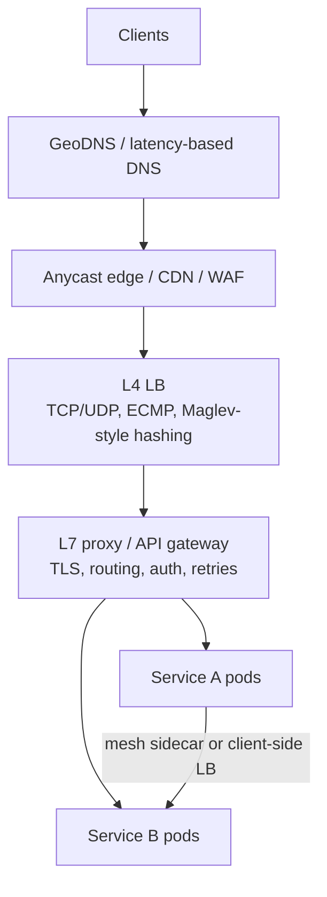

# Load balancing & proxies

!!! abstract "At a glance"
    **Priority:** P0 · **Complexity:** 2/5 · **Est. time:** 2 h · **Phase:** 1 · **Prereqs:** [Scalability fundamentals](scalability-fundamentals.md)
    **You're done when:** you can choose between L4/L7, DNS/anycast, client-side and service-mesh load balancing for a given system, pick an algorithm (and justify P2C/least-request over round robin), and explain how LLM inference load balancing differs (KV-cache/prefix-aware routing).

## Why it matters

Load balancers are where availability, latency, security and deployment strategy meet. Most outages involving "the LB" are really about health checks, retries, connection draining or uneven load — subtle behaviours that seniors often treat as defaults. A Staff engineer should know what each layer (DNS, anycast, L4, L7, sidecar/mesh, client library) is responsible for, and where the failure modes hide.

In 2026 there is a genuinely new variant: **LLM inference load balancing**. Requests differ by 100× in cost (input/output length), GPU replicas hold stateful KV-caches, and routing a request to a replica that already has the prompt prefix cached can halve latency and cost. Kubernetes' Gateway API Inference Extension and vLLM/SGLang routers exist precisely because round robin is terrible for LLMs.

## Core concepts

### The layers

| Layer | Operates on | Strengths | Weaknesses | Examples |
|---|---|---|---|---|
| DNS / GeoDNS | Name resolution | Global steering, cheap | TTL caching → slow failover (clients ignore TTLs), coarse | Route 53, Azure Traffic Manager |
| Anycast | BGP routing | Same IP everywhere, DDoS absorption, fast | Route flaps can break long TCP connections | Cloudflare, Google front end |
| L4 (transport) | IP/port, TCP/UDP | Very fast, protocol-agnostic, millions of conns | Can't see HTTP; per-connection balancing (bad for HTTP/2, gRPC) | AWS NLB, Maglev, Katran, IPVS |
| L7 (application) | HTTP/gRPC | Path/header routing, per-request balancing, retries, TLS termination, auth | More CPU, more latency (~0.1–1 ms), more config risk | Envoy, NGINX, HAProxy, ALB, API gateways |
| Client-side / mesh | In process or sidecar | No extra hop, per-request, rich policy | Needs service discovery; library per language (or sidecar cost) | gRPC xDS, Finagle, Istio/Linkerd, ambient mesh |

**The HTTP/2 / gRPC trap:** an L4 LB balances *connections*. gRPC multiplexes all requests over one long-lived connection, so every request from a client lands on one backend. You need L7 (per-request) balancing, client-side balancing, or periodic connection recycling (`max_connection_age`).

### Algorithms

| Algorithm | How | Good for | Bad for |
|---|---|---|---|
| Round robin / weighted | Rotate | Homogeneous, uniform requests | Variable request cost; slow backends still get equal share |
| Least connections / least outstanding requests | Pick backend with fewest in-flight | Variable latency | Needs global view; herding when many LBs see the same "least" |
| **Power of two choices (P2C)** | Pick 2 at random, choose the less loaded | Distributed LBs with stale info; default in Envoy/Finagle | Slightly worse than perfect least-conn with perfect info (irrelevant in practice) |
| EWMA / latency-aware | Score by recent latency × load | Heterogeneous backends, noisy neighbours | Can be fooled by fast failures (errors are "fast") |
| Consistent hashing / ring hash / Maglev | Hash a key to a backend | Cache affinity, sticky sessions, stateful backends | Hot keys; uneven load without bounded-load variant |
| Random | Pick uniformly | Surprisingly OK at scale | Higher variance at small N |

**Why P2C wins:** with many independent LB instances each holding slightly stale load info, "least connections" makes them all pile onto the same backend (herd). Random choice of two breaks the herd while still avoiding the worst backend — the "balls into bins" result: max load drops from O(log n / log log n) to O(log log n). Marc Brooker's short post is the clearest explanation.

**Fast-failure trap:** a backend returning errors in 1 ms looks like the least-loaded, fastest server and attracts *more* traffic ("black hole"). Combine latency-aware balancing with **outlier detection** (eject hosts with elevated 5xx/timeouts) and **panic thresholds** (if > X% of hosts are unhealthy, stop ejecting and spread load — ejecting everything is worse).

### Health checking, draining, and slow start

- **Active health checks** (probe `/healthz`) vs **passive** (observe real traffic errors — outlier detection). Use both.
- **Liveness ≠ readiness.** Readiness should reflect "can serve traffic now" (warm caches, connections established); liveness only "process not wedged". Don't make readiness depend on downstream dependencies, or one DB blip ejects every pod at once (correlated failure).
- **Connection draining:** on deploy/scale-down, stop sending new requests, let in-flight finish (with a deadline). For long-lived streams (WebSockets, SSE, LLM streaming responses of 30–60 s) draining windows must be long, or you need client reconnection with resume.
- **Slow start / warm-up:** new instances (cold JIT, empty caches) get ramped traffic; otherwise autoscaling adds capacity that immediately falls over.

### Proxies: forward, reverse, sidecar, gateway

- **Reverse proxy / API gateway:** TLS termination, routing, authN, rate limiting, request shaping. Keep business logic out of it.
- **Sidecar mesh (Istio, Linkerd):** mTLS, retries, telemetry uniformly; cost is per-pod CPU/memory and operational complexity. 2025–26 trend: **sidecar-less / ambient** modes and eBPF-based dataplanes reduce overhead.
- **Forward/egress proxy:** control outbound traffic — increasingly important for **AI agents** calling tools and external APIs (allow-lists, secret injection, audit, preventing data exfiltration).

### LLM inference load balancing (2026)

Why generic LBs fail for LLMs:

- **Request cost varies wildly:** a 100-token prompt vs a 100k-token prompt; 10 vs 4,000 output tokens. Least-requests treats them equally.
- **KV-cache locality:** replicas that recently processed the same system prompt/document hold its KV-cache (prefix caching). Routing there skips prefill — lower TTFT and GPU cost.
- **Queue depth and KV memory are the real load signals**, not CPU or connection count.
- **LoRA adapters:** a replica may have specific adapters loaded; routing elsewhere forces loading.

Approaches: **prefix-aware / cache-aware routing** (hash on prompt prefix with load bounds — e.g. SGLang router, vLLM production-stack router, llm-d), and the **Kubernetes Gateway API Inference Extension** (an "endpoint picker" that uses model-server metrics like queue length and KV-cache utilisation, plus model/LoRA-aware routing). At the API level, **LLM gateways** (LiteLLM, cloud gateways) balance across providers/deployments using TPM/RPM headroom and fall back on 429s. See [Design a multi-tenant LLM gateway](../ai-system-design/llm-gateway.md) and [Inference serving](../agentic-ai/inference-serving.md).

## Resources

| Resource | Type | Why this one | Level | Cost |
|---|---|---|---|---|
| [Sam Who — Load balancing](https://samwho.dev/load-balancing/) :gem: | interactive | Animated simulations of RR, least-conn, weighted and PEWMA; builds intuition in 20 minutes | intermediate | free |
| [Marc Brooker — The power of two random choices](https://brooker.co.za/blog/2012/01/17/two-random.html) :gem: | article | Clearest short explanation of why P2C beats least-conn in distributed LBs | advanced | free |
| [Google SRE book — Load balancing at the frontend](https://sre.google/sre-book/load-balancing-frontend/) | book | DNS + anycast + L4 from Google's perspective | advanced | free |
| [Google SRE book — Load balancing in the datacenter](https://sre.google/sre-book/load-balancing-datacenter/) | book | Subsetting, weighted round robin, lame-duck state — real production detail | advanced | free |
| [Envoy — Load balancing overview](https://www.envoyproxy.io/docs/envoy/latest/intro/arch_overview/upstream/load_balancing/overview) | docs | Authoritative on P2C, ring hash, Maglev, panic threshold, outlier detection | advanced | free |
| [Maglev paper (Google)](https://research.google/pubs/maglev-a-fast-and-reliable-software-network-load-balancer/) | paper | Software L4 LB with consistent hashing and connection tracking | advanced | free |
| [Cloudflare — Unimog edge load balancer](https://blog.cloudflare.com/unimog-cloudflares-edge-load-balancer/) | article | How an L4 LB works on every edge server; great real-world detail | advanced | free |
| [Gateway API Inference Extension](https://gateway-api-inference-extension.sigs.k8s.io/) | docs | Kubernetes-native model-aware, KV-cache-aware routing for LLM serving | advanced | free |

## Hands-on lab

**Goal:** observe algorithm differences and the gRPC connection trap (60 min).

1. Run three copies of a small HTTP service where one instance is 5× slower (inject latency). Put Envoy in front (docker-compose) with `ROUND_ROBIN`, then `LEAST_REQUEST` (P2C by default).
2. Drive 300 RPS with k6 (constant arrival rate). Record p50/p99 and per-backend request counts.
3. Make the slow instance return 503 in 1 ms instead of being slow; observe traffic attraction with least-request; enable `outlier_detection` and re-run.
4. Bonus: run a gRPC service behind an L4 (TCP) proxy with one client; observe all requests hit one backend. Switch Envoy to HTTP/2 L7 routing and re-run.
5. **Expected output:** least-request cuts p99 dramatically vs round robin with a slow node; the fast-failing node attracts traffic until outlier detection ejects it; gRPC over L4 shows ~100% on one backend.

## Questions

### L1 — Recall

??? question "Q1. What's the difference between L4 and L7 load balancing?"
    ??? success "Answer"
        L4 balances at the transport layer using IP/port, forwarding TCP/UDP flows without parsing payloads — fast, cheap, protocol-agnostic, but per-connection. L7 terminates the application protocol (HTTP/gRPC), so it can route on paths/headers, balance per request, retry, terminate TLS, apply auth and rate limits, at higher CPU/latency cost and with more configuration risk.

??? question "Q2. Why is DNS-based failover slow?"
    ??? success "Answer"
        Resolvers and clients cache records; many ignore low TTLs (JVMs historically cached forever, browsers and OS caches have their own rules), so traffic keeps flowing to dead endpoints for minutes. DNS also can't see per-request health. Use it for coarse global steering, combined with anycast or health-checked L4/L7 layers for fast failover.

??? question "Q3. What is outlier detection and why do you need a panic threshold?"
    ??? success "Answer"
        Outlier detection passively watches real traffic and ejects hosts with consecutive 5xx/gateway errors or abnormal latency for a period. A panic threshold (e.g. if < 50% of hosts are healthy) disables ejection and spreads traffic across all hosts, because when a shared dependency fails and *every* host errors, ejecting most of them concentrates load on a few and causes total collapse.

??? question "Q4. Why doesn't an L4 load balancer spread gRPC traffic well?"
    ??? success "Answer"
        gRPC uses HTTP/2, which multiplexes many requests over a single long-lived TCP connection. An L4 LB picks a backend per connection, so all requests from a client go to one backend. Fixes: L7 proxy with per-request balancing, client-side LB (gRPC xDS/lookaside), or connection max-age to force periodic rebalancing.

### L2 — Apply

??? question "Q5. You have 20 LB instances in front of 50 backends; least-connections is causing periodic overload on individual backends. Explain and fix."
    ??? success "Answer"
        Each LB sees only its own in-flight counts or stale shared state; when a backend looks least loaded, all 20 LBs send to it simultaneously (herding), overloading it; it then looks busiest and the herd moves. Fix: power-of-two-choices (random pair, pick lesser) which is robust to stale info, possibly weighted by EWMA latency; plus slow start for new hosts. Subsetting (each LB talks to a subset of backends) also reduces connection counts at large scale.

??? question "Q6. Design health checks for a service that depends on Postgres and Redis."
    ??? success "Answer"
        Liveness: process responsive (event loop not blocked), no dependency checks — restart only if wedged. Readiness: service initialised, config loaded, local caches warm, and connection pools *able to exist*; avoid failing readiness on transient dependency errors or you get correlated ejection of the whole fleet when Postgres blips. Handle dependency failure at request level (degrade, circuit break, return 503 with Retry-After). Add passive outlier detection at the LB for real traffic signal. Health endpoints should be cheap and not hit the DB on every probe (or cache the result for a few seconds).

??? question "Q7. A deployment causes a spike of 502s every time. What's likely wrong?"
    ??? success "Answer"
        Missing or too-short connection draining: pods receive SIGTERM and exit while the LB still routes to them (endpoint removal propagation lag of seconds in Kubernetes), or keep-alive connections are reused after the server closes them. Fix: preStop hook sleep (5–15 s) so endpoints are removed before shutdown, graceful shutdown that finishes in-flight requests, idle timeout on the server longer than the LB's, readiness set to false at shutdown start, and slow start for new pods. For streaming/LLM responses, longer termination grace periods or resumable streams.

### L3 — Design & trade-offs

??? question "Q8. Service mesh sidecars vs client-side libraries vs a central L7 gateway for east-west traffic in a 300-service org — choose."
    ??? success "Answer"
        Central gateway for east-west adds a hop and a shared failure/scaling bottleneck; fine for north-south, poor for internal. Client libraries (gRPC xDS) give best latency but need parity across languages and coordinated upgrades — viable in a monoglot org. Sidecar mesh gives uniform mTLS, retries, telemetry and policy for polyglot fleets at the cost of per-pod resources and ops complexity; ambient/sidecar-less modes cut the cost. For 300 services, polyglot, with zero-trust requirements: a mesh (ambient mode where available) with a platform team owning it, plus sane defaults (retry budgets, timeouts). Revisit if only a few languages dominate.

??? question "Q9. How would you load-balance a fleet of vLLM replicas serving a chat product with a long shared system prompt and per-customer document contexts?"
    ??? success "Answer"
        Use cache-aware routing: hash the prompt prefix (system prompt + customer document ID) to prefer a replica that holds that prefix's KV-cache, but with **bounded load** (fall back to least-loaded if the preferred replica's queue depth or KV utilisation exceeds a threshold) to avoid hot spots. Load signal = waiting queue length + KV-cache utilisation from model-server metrics, not connection count. Route by model/LoRA adapter. Use long drain windows for streaming. Implement via Gateway API Inference Extension endpoint picker or a vLLM/SGLang router. Measure prefix-cache hit rate, TTFT p95 and GPU utilisation to tune.

??? question "Q10. Sticky sessions: when are they justified, and what do they cost?"
    ??? success "Answer"
        Justified for stateful backends where locality matters: WebSocket/game servers, in-memory session state (legacy), cache affinity (consistent hashing to shards), LLM prefix caching. Costs: uneven load (hot users), painful deploys and scale-in (state loss unless migrated), failover loses state, and autoscaling benefits are slower to materialise. Prefer externalising session state (Redis) and using affinity only as an optimisation with bounded load, never as a correctness requirement.

### L4 — Staff-level ambiguity

??? question "Q11. Your company runs three different ingress stacks (NGINX, a cloud ALB, and a homegrown Go proxy) across teams. An outage traced to inconsistent retry config. Propose a path forward."
    ??? success "Answer"
        Don't lead with "rip and replace". (1) Inventory: traffic, features used, owners, incident history. (2) Define a **minimum policy contract** every ingress must satisfy: timeouts, retry budgets (≤10% extra), outlier detection, draining, mTLS, telemetry schema — enforced via config linting and fitness tests. (3) Pick a target (e.g. Envoy-based gateway via Gateway API) because it's declarative, portable and supports the policy set; justify with an ADR. (4) Migrate by risk/value: new services default to target; the homegrown proxy (highest bus-factor risk) goes first; keep the ALB for simple cases if it meets the contract. (5) Platform team owns golden config; teams own routes. Measure: config drift violations, incident count, time-to-onboard. The convergence is about consistent *behaviour*, not a single product.

??? question "Q12. Finance asks why inference GPU utilisation is 35% while users complain about latency. How do you investigate and what might you change in load balancing?"
    ??? success "Answer"
        Likely causes: round-robin/least-connection routing sending long-context requests to already-busy replicas while others idle; no prefix-cache affinity (repeated prefill waste); head-of-line blocking from huge prompts; over-provisioning per model because traffic is split across many small deployments. Investigate per-replica queue depth, KV-cache utilisation, TTFT vs TPOT breakdown, request size distribution, cache hit rates. Changes: cache/load-aware endpoint picking, separating long-context traffic to dedicated pools, chunked prefill or prefill/decode disaggregation, consolidating models/LoRA adapters onto shared pools, and autoscaling on queue depth instead of CPU. Report both user latency SLO and $/1M tokens as the joint objective so neither side optimises alone.

## Real-world use cases

- **Cloudflare / Google:** anycast + L4 software LBs (Unimog, Maglev) on commodity servers, consistent hashing for connection stability.
- **Lyft (Envoy origin):** L7 mesh for polyglot microservices; P2C least-request, outlier detection and retries centralised.
- **Logistics booking APIs:** partner-facing gateway with per-partner routing, rate limits and mTLS; internal services with client-side/mesh LB.
- **LLM platforms:** prefix-aware routing across vLLM replicas; gateway-level fallback across Azure OpenAI deployments/regions on 429s.

## Pitfalls & anti-patterns

- Readiness checks that include downstream dependencies → fleet-wide ejection.
- Retries at LB *and* client *and* service → retry storms (see [Reliability patterns](reliability-patterns.md)).
- Balancing gRPC with an L4 LB.
- Least-latency without outlier detection → fast-failing black holes.
- No draining on deploys; no slow start on scale-out.
- Round-robin for LLM inference.

## Checklist

- [ ] I can explain each LB layer and when to use it
- [ ] I can explain P2C and the fast-failure trap
- [ ] I ran the Envoy lab and saw least-request vs round robin
- [ ] I can describe prefix/KV-cache-aware routing for LLMs
- [ ] I answered all L3 questions out loud in < 3 min each
