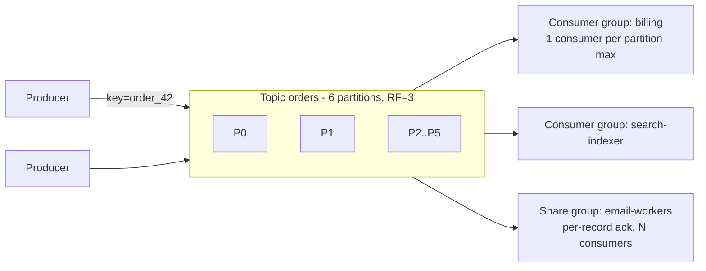

# Message queues & streaming (Kafka)

!!! abstract "At a glance"
    **Priority:** P0 · **Complexity:** 3/5 · **Est. time:** 5 h · **Phase:** 3 · **Prereqs:** [Partitioning](partitioning-sharding.md), [Replication](replication.md)
    **You're done when:** you can choose between a queue and a log, design Kafka topics (partition count, keys, retention, replication), explain delivery semantics honestly (at-least-once + idempotency; Kafka EOS scope), handle ordering, retries, DLQs and backpressure, and apply these to LLM/agent pipelines.

## Why it matters

Asynchronous messaging is how large systems decouple teams, absorb load spikes, and build derived data (search indexes, caches, analytics, embeddings). It is also where the hardest production bugs live: duplicates, reordering, poison messages, consumer lag spirals, and "exactly-once" misunderstandings. Staff engineers are expected to know when *not* to introduce a broker, how to size and key topics, and how to design consumers that are correct under redelivery.

In AI systems, queues and logs are everywhere: document ingestion → chunk → embed → index pipelines; async agent runs (a user submits a task, workers pick it up, progress events stream back); batch LLM inference; eval runs; LLM request buffering to smooth provider rate limits. Kafka 4.x also changed the landscape: ZooKeeper is gone (KRaft only since 4.0), and **share groups (KIP-932, "Queues for Kafka") are production-ready as of Kafka 4.2 (Feb 2026)**, making Kafka viable for true work-queue semantics.

## Core concepts

### Queue vs log

| Aspect | Message queue (RabbitMQ, SQS, Azure Service Bus) | Log (Kafka, Kinesis, Pulsar, Redpanda, Event Hubs) |
|---|---|---|
| Consumption | Competing consumers; message deleted on ack | Consumers track offsets; data retained by time/size |
| Replay | No (DLQ aside) | Yes — rewind offsets, add new consumers later |
| Ordering | Per queue (weak with competing consumers); FIFO queues/sessions | Per partition, strong |
| Parallelism | Scale consumers freely | Bounded by partition count (classic consumer groups); share groups lift this |
| Per-message ack/retry | Native, with delays and DLQs | Offset-based (head-of-line); share groups add per-record ack |
| Best for | Task/work distribution, commands, per-message routing | Event streams, CDC, derived data, event sourcing, fan-out to many consumers |

Rule of thumb: **commands/tasks → queue; facts/events many consumers care about → log.**

### Kafka mechanics

- **Partition** = ordered, append-only log; unit of parallelism and ordering. Key → partition via hash; same key → same partition → ordered.
- **Replication:** each partition has a leader and followers; **ISR** (in-sync replicas). With `acks=all` and `min.insync.replicas=2` on RF=3, an acknowledged write survives one broker loss.
- **Consumer groups:** each partition consumed by exactly one member of a group; offsets committed to `__consumer_offsets`. The new consumer rebalance protocol (KIP-848, GA in 4.0) reduces stop-the-world rebalances.
- **Share groups (KIP-932):** multiple consumers read the same partition cooperatively with per-record acknowledgement, delivery counts, and redelivery — queue semantics without partition-count limits; no per-key ordering guarantees.
- **Retention:** time/size based, or **log compaction** (keep latest value per key — changelog/state topics).
- **Tiered storage** (KIP-405) moves old segments to object storage; diskless topics (KIP-1150) and systems like WarpStream push toward object-storage-native Kafka for cost.

### Sizing numbers of thumb

- Partition count: target throughput ÷ per-partition consumer throughput (and producer throughput). A partition commonly handles ~5–50 MB/s depending on hardware and message size; a consumer's processing rate is usually the real limit. Start with enough for 2–3 years' peak consumer parallelism (e.g. 12–48), because increasing partitions later **changes key→partition mapping** and breaks per-key ordering during the transition.
- Too many partitions: more open files, longer leader elections/recovery, more metadata; KRaft raised practical limits substantially but don't create 10k partitions for a 1 MB/s topic.
- Batching: `linger.ms` 5–20 ms and compression (zstd/lz4) increase throughput massively at small latency cost.

### Delivery semantics — the honest version

- **At-most-once:** commit offset before processing; lose messages on crash.
- **At-least-once:** process, then commit; duplicates on crash/rebalance. **The default you should design for.**
- **Exactly-once:** Kafka's EOS (idempotent producer + transactions + `read_committed`) gives exactly-once **within Kafka** (consume-transform-produce between topics, Kafka Streams). The moment a consumer writes to an external DB or calls an API, you need **idempotent consumers**: dedupe by message ID/business key, upserts, conditional writes, or storing offsets transactionally with the output.

Idempotent consumer patterns: processed-messages table with unique constraint (in the same transaction as the effect); natural idempotency (`UPSERT … WHERE version < new_version`); idempotency keys to downstream APIs.

### Ordering

- Guaranteed only within a partition, and only if producers don't reorder on retries (`enable.idempotence=true`, the default in modern clients, preserves order with `max.in.flight ≤ 5`).
- Choose keys that match the ordering domain (per order, per account, per document). Global ordering = one partition = no parallelism.
- Retries break ordering: a failed message sent to a retry topic lets later messages for the same key overtake it. For strict per-key ordering, either block the partition (pause and retry in place) or park all subsequent messages for that key.

### Retries, DLQs, poison messages

- Classify errors: **transient** (timeouts, 429s → retry with backoff), **permanent** (validation, schema → DLQ immediately).
- Retry topics with increasing delays (e.g. 1 min, 10 min, 1 h) → DLQ. Include error metadata headers.
- DLQs need **owners, alerts and a replay tool**; an unmonitored DLQ is a data-loss mechanism with extra steps.
- Poison messages in a log block their partition — bounded retries then skip to DLQ.

### Backpressure and lag

- Consumer lag (offsets or time behind) is the key metric; alert on **time lag** (how old the oldest unprocessed message is) rather than message count.
- Queues absorb spikes but hide overload: a queue that grows without bound means capacity < demand, and latency for new messages grows linearly. Sam Rose's interactive queueing essay makes this vivid.
- Strategies: autoscale consumers on lag (up to partition count, or unbounded with share groups/queues), shed or sample low-priority work, prioritised queues, LIFO for freshness-sensitive work (drop stale).

### Outbox and CDC

Never dual-write DB + broker. Use the **transactional outbox** (write the event to an outbox table in the same transaction; a relay/Debezium publishes it) — see [Sagas, outbox & distributed transactions](../architecture/sagas-outbox.md). CDC with Debezium turns DB changes into Kafka events for derived stores.

### Messaging in LLM and agent systems

- **Ingestion pipelines:** `documents` topic keyed by document ID → chunker → embedder (batched calls, respects provider TPM) → indexer; idempotent by (doc_id, version, chunk_no); DLQ for unparseable files.
- **Async agent runs:** request → queue → worker executes (long, minutes) → progress events published to a per-run stream consumed by the UI via SSE/WebSocket. Durable execution engines often replace hand-built queue choreography here.
- **Rate-limit smoothing:** buffer LLM calls through a queue whose consumers are throttled to your TPM/RPM quota; priority lanes for interactive vs batch.
- **Batch APIs:** providers offer discounted asynchronous batch endpoints (typically ~50% cheaper with up-to-24h completion windows) — a natural fit for queue-based eval runs and backfills.
- **Event-driven agents:** agents triggered by business events (a delayed shipment event triggers a customer-comms agent); ensure idempotency since events are at-least-once.

## Resources

| Resource | Type | Why this one | Level | Cost |
|---|---|---|---|---|
| [Jay Kreps — The Log](https://engineering.linkedin.com/distributed-systems/log-what-every-software-engineer-should-know-about-real-time-datas-unifying) :gem: | article | The essay that explains *why* logs unify data systems; still the best conceptual foundation | intermediate | free |
| [Sam Rose — Queueing (Encore)](https://encore.dev/blog/queueing) :gem: | interactive | Animated explanation of queues, backpressure, priority and dropping; builds real intuition | intermediate | free |
| [Apache Kafka documentation](https://kafka.apache.org/documentation/) | docs | Authoritative on configs, semantics, KRaft and share groups | advanced | free |
| [Apache Kafka 4.2 release announcement](https://kafka.apache.org/blog/2026/02/17/apache-kafka-4.2.0-release-announcement/) | docs | Share groups production-ready and other 2026 changes | intermediate | free |
| [Confluent Developer courses](https://developer.confluent.io/) | course | Free, well-produced courses on Kafka internals, Streams and patterns | intermediate | free |
| [KIP-932: Queues for Kafka](https://cwiki.apache.org/confluence/display/KAFKA/KIP-932%3A+Queues+for+Kafka) | docs | Design rationale for share groups; read for semantics and limits | advanced | free |
| [DDIA 2e — Stream processing chapter](https://martin.kleppmann.com/2026/03/24/designing-data-intensive-applications-2e.html) | book | Logs, CDC, event sourcing and stream joins in one coherent frame | advanced | paid |
| [WarpStream blog](https://www.warpstream.com/blog) | article | Deep posts on object-storage-native Kafka economics and design | advanced | free |
| *Kafka: The Definitive Guide 2e* (Shapira et al.) | book | Operational depth on producers, consumers, reliability | advanced | paid |

## Hands-on lab

**Goal:** build an idempotent, retrying ingestion pipeline (2 h; capstone-relevant).

1. docker-compose Kafka 4.x (KRaft, single node) + Postgres. Topic `documents` (6 partitions), `documents.retry.1m`, `documents.dlq`.
2. Producer: publishes `{doc_id, version, text}` keyed by `doc_id`, `acks=all`, idempotence on.
3. Consumer (Python `confluent-kafka`): chunks text, "embeds" (call Ollama or a fake with random 10% transient failures and 1% permanent failures), upserts into pgvector with `(doc_id, version, chunk_no)` unique; commits offsets after DB commit.
4. Kill the consumer mid-batch (`kill -9`), restart; verify no duplicate rows. Send poison messages; verify DLQ with error headers. Write a replay script for the DLQ.
5. Measure lag with `kafka-consumer-groups.sh --describe` while throttling the consumer; then scale to 3 consumers and watch lag drain.
6. Bonus: create a share group consumer (Kafka 4.2+ client support permitting) and compare behaviour with 10 consumers on 6 partitions.
7. **Expected output:** exactly-once *effects* despite at-least-once delivery; poison messages isolated; lag drains with parallelism up to partition count.

## Questions

### L1 — Recall

??? question "Q1. What ordering guarantee does Kafka provide?"
    ??? success "Answer"
        Total order within a partition only. Records with the same key go to the same partition (given a stable partition count and default partitioner), so per-key ordering holds. No ordering across partitions. With idempotent producers, retries don't reorder within a partition. Share groups don't preserve ordering across consumers.

??? question "Q2. What does `acks=all` with `min.insync.replicas=2` guarantee on RF=3?"
    ??? success "Answer"
        A write is acknowledged only after all in-sync replicas (at least 2) have it, so an acknowledged write survives the loss of any one broker. If ISR shrinks below 2, producers get errors (NotEnoughReplicas) — availability traded for durability. Unclean leader election must be disabled to avoid electing an out-of-sync replica.

??? question "Q3. What does Kafka's exactly-once semantics actually cover?"
    ??? success "Answer"
        Idempotent producers (no duplicates from producer retries within a session) and transactions that atomically write to multiple partitions and commit consumer offsets — so consume-process-produce loops *within Kafka* are exactly-once for `read_committed` consumers. It does not cover side effects in external systems (DBs, APIs); those need idempotent consumers or transactional offset storage alongside outputs.

??? question "Q4. What problem do Kafka share groups solve?"
    ??? success "Answer"
        Classic consumer groups cap parallelism at partition count and use offset-based (head-of-line) acknowledgement, making work-queue use cases awkward. Share groups let many consumers cooperatively consume the same partitions with per-record acknowledgement, delivery attempt counting and redelivery — queue semantics on Kafka. Trade-off: no per-key ordering.

### L2 — Apply

??? question "Q5. Size a topic for 200k events/s of 1 KB, retained 7 days, RF=3, with consumers that process 5k events/s per instance."
    ??? success "Answer"
        Throughput 200 MB/s ingress; with RF=3, 600 MB/s replicated write across the cluster, plus consumer egress. Storage: 200 MB/s × 604,800 s ≈ 121 TB × 3 ≈ 363 TB (compression might cut 3–5×; tiered storage moves older segments to object storage). Consumer parallelism: 200k/5k = 40 consumers → at least 40 partitions; plan ~64–96 for growth and headroom. Broker count by disk/network: e.g. 12–18 brokers with 25 Gbps NICs, or fewer with tiered storage. Validate with a load test.

??? question "Q6. Design an idempotent consumer that writes orders to Postgres and sends a confirmation email."
    ??? success "Answer"
        In one DB transaction: insert into `processed_messages(message_id)` (unique) and upsert the order; if the unique insert conflicts, skip. Also insert an `outbox` row for the email with a deterministic idempotency key (order_id + 'confirmation'). Commit, then commit the Kafka offset. A separate relay sends emails from the outbox using the idempotency key with the email provider (or records sent status) so retries don't double-send. Crash at any point results in either a replay that's deduplicated or a pending outbox row that's retried.

??? question "Q7. A consumer's lag grows every afternoon and recovers overnight. What do you investigate and change?"
    ??? success "Answer"
        Consumption capacity is below afternoon peak arrival rate. Check per-message processing time (downstream DB/API latency — maybe the LLM/embedding provider slows or throttles at peak), rebalances (long GC or processing exceeding `max.poll.interval.ms` causes churn), partition skew (a hot key). Changes: autoscale consumers on time-lag up to partition count (or add partitions carefully), batch downstream calls, fix hot keys, separate priority traffic, increase `max.poll.records` with async processing within partition ordering constraints, and set a lag SLO with alerts on oldest-message age.

### L3 — Design & trade-offs

??? question "Q8. SQS/Service Bus vs Kafka for dispatching document-processing jobs that take 30 s–10 min each."
    ??? success "Answer"
        Long, variable-duration tasks with independent processing favour a queue: per-message visibility timeouts/locks, per-message retry and DLQ, scale consumers freely, no head-of-line blocking. Classic Kafka consumer groups suffer: a 10-min task blocks its partition, rebalances trigger on long processing, parallelism capped. Kafka share groups (4.2+) now address much of this with per-record ack and lock renewal (RENEW), so if Kafka is already the platform, share groups are viable. Otherwise SQS/Service Bus, or a workflow engine if tasks are multi-step with state. Keep Kafka for the event stream of "document uploaded" facts that multiple consumers need.

??? question "Q9. How do you handle retries while preserving per-key ordering?"
    ??? success "Answer"
        Options: (1) retry in place with backoff, blocking the partition — preserves order but stalls unrelated keys on that partition; bounded by a max then DLQ (and then what about subsequent messages for that key?); (2) on failure, park the key: record the key as "blocked", route all subsequent messages for that key to a holding topic/store until the failed one succeeds or is resolved, while other keys proceed — complex but precise; (3) design consumers to be order-insensitive using versions (apply only if version > current), so out-of-order retries are harmless — often the best answer. Prefer (3), fall back to (2) for strictly sequential domains (ledger per account).

??? question "Q10. Event-carried state transfer vs thin notification events for integrating 15 services."
    ??? success "Answer"
        Fat events (full entity state): consumers don't call back, decoupled at runtime, supports building local read models and replay; costs: larger payloads, schema coupling (need schema registry + compatibility rules), sensitive data proliferation (PII in many topics — GDPR deletion harder). Thin events ("order 42 changed"): small, less schema coupling, but consumers call the source API (runtime coupling, load spikes, race conditions reading a newer state). Common balance: domain events carrying the fields consumers need (not whole aggregates), versioned schemas with backward compatibility, PII minimised or tokenised, and compacted "entity state" topics for consumers building replicas. See [API contracts, versioning & schema evolution](../architecture/api-contracts-versioning.md).

### L4 — Staff-level ambiguity

??? question "Q11. Your company runs RabbitMQ, SQS, Kafka, and Redis Streams across teams, with repeated incidents from DLQs nobody owns. Propose a messaging strategy."
    ??? success "Answer"
        (1) Classify use cases: event streaming/CDC/fan-out (Kafka), task queues (managed queue or Kafka share groups), ephemeral pub/sub (Redis). (2) Define a paved road with at most two primary technologies plus managed options, golden client configs (idempotence, acks, retries, tracing headers), a schema registry, and standard retry/DLQ topology. (3) Ownership: every topic/queue and DLQ has a named owning team in a catalogue; DLQ depth and oldest-message age alert the owner; a standard replay tool. (4) Migrate high-incident or unsupported deployments first; leave stable ones until natural rewrite. (5) Metrics: incidents per month from messaging, DLQ ages, onboarding time. The DLQ ownership rule alone typically removes a class of incidents.

??? question "Q12. Leadership proposes making Kafka the 'central nervous system' for all inter-service communication, including request/response. Respond."
    ??? success "Answer"
        Support Kafka for events, CDC and derived data; push back on request/response over Kafka: it adds latency, complicates error handling and timeouts (correlation IDs, reply topics), hides synchronous coupling behind async plumbing, and makes tracing harder. Recommend: synchronous APIs (HTTP/gRPC) for queries and commands needing immediate answers; events for facts; queues/workflows for long-running tasks. Also caution against a centralised "integration team" owning all topics (bottleneck) — prefer domain teams owning their topics with platform-provided tooling. Frame it as fitting the tool to the interaction style, with an ADR and examples.

## Real-world use cases

- **LinkedIn/Uber/Netflix:** Kafka as the backbone for activity streams, CDC and real-time analytics.
- **Logistics:** container/vessel events (EDI, IoT) keyed by container ID; ETA recomputation and customer notifications as consumers; DLQ for malformed partner messages with replay after mapping fixes.
- **E-commerce:** order events fan out to billing, fulfilment, email, search, analytics — each its own consumer group.
- **RAG platforms:** document-change events drive chunk/embed/index pipelines with idempotent upserts and freshness SLOs.

## Pitfalls & anti-patterns

- Dual writes to DB and broker without an outbox.
- Believing Kafka EOS covers external side effects.
- Too few partitions (can't scale consumers) or changing partition counts on keyed topics casually.
- Unowned, unmonitored DLQs.
- Using queues to hide chronic under-capacity.
- Request/response over Kafka as a default.
- Large payloads (documents, images) in messages — store in blob storage and pass references (claim check).

## Checklist

- [ ] I can choose queue vs log vs share group for a use case
- [ ] I can size partitions and replication for a workload
- [ ] I built the idempotent pipeline with retries and DLQ
- [ ] I can explain Kafka EOS scope honestly
- [ ] I answered all L3 questions out loud in < 3 min each
