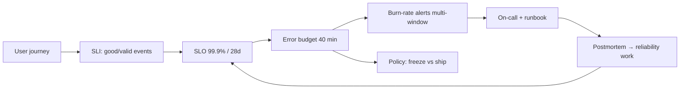

# Observability, SLOs & error budgets

!!! abstract "At a glance"
    **Priority:** P0 · **Complexity:** 3/5 · **Est. time:** 3 h · **Phase:** 4 · **Prereqs:** [Scalability fundamentals](scalability-fundamentals.md), [Reliability patterns](reliability-patterns.md)
    **You're done when:** you can define SLIs/SLOs for a service, compute error budgets and multi-window burn-rate alerts, choose signals (metrics, logs, traces, profiles, events) and control their cost and cardinality, and define SLOs plus telemetry for LLM systems (quality, latency, cost).

## Why it matters

You can't run what you can't see, and you can't prioritise reliability work without a shared, numeric definition of "reliable enough". SLOs convert reliability from a feeling into a budget that product, engineering and leadership negotiate; error budgets settle the perennial "features vs stability" argument. At Staff level you are expected to define the SLO framework, keep alerting actionable (page on symptoms that burn budget, not on causes), and make observability affordable (telemetry cost can rival compute cost).

AI systems add a new dimension: **a request can succeed technically and fail semantically** (hallucination, unhelpful answer, wrong tool), so classical availability/latency SLOs are necessary but insufficient. You need quality SLIs (eval scores, user feedback), plus token/cost telemetry, traced across multi-step agent runs. OpenTelemetry GenAI semantic conventions (still in "Development" status as of mid-2026) standardise spans and attributes for model calls, tool calls and agent steps.

## Core concepts

### Three pillars are not enough

| Signal | Answers | Strength | Cost/risk |
|---|---|---|---|
| **Metrics** | "Is it broken? How much?" | Cheap aggregates, alerting, trends | Cardinality explosion kills TSDBs |
| **Logs** | "What happened in this event?" | Rich detail | Volume; unstructured logs are expensive to query |
| **Traces** | "Where did the time/error come from across services?" | Causality in distributed calls | Sampling needed; instrumentation gaps |
| **Profiles** (continuous) | "Which code burns CPU/memory?" | Code-level performance | Newer; storage |
| **Events / wide structured events** | "Slice by any dimension" | High-cardinality debugging (Honeycomb-style) | Storage/query cost |

Observability = ability to ask **new questions** of a running system without shipping new code, which requires high-cardinality, high-dimensionality data (user, tenant, version, region, model) stored as **wide events** or traces, not only pre-aggregated metrics. Charity Majors' framing: monitoring handles known-unknowns; observability handles unknown-unknowns.

### Standard methods

- **RED** (services): Rate, Errors, Duration. **USE** (resources): Utilisation, Saturation, Errors. **Four Golden Signals** (Google SRE): latency, traffic, errors, saturation. Latency should separate successful from failed requests.
- **Histograms** for latency (not averages) with fixed buckets aligned to SLO thresholds, or exponential/native histograms (Prometheus native histograms, OpenTelemetry exponential histograms) enabling accurate percentile aggregation across instances.
- **Cardinality:** each unique label combination is a series. Never put user IDs, request IDs or unbounded values in metric labels; put them in traces/events. Budget series count per service.

### OpenTelemetry

Vendor-neutral APIs/SDKs/collector/OTLP protocol for traces, metrics, logs (and profiles). Architecture: app SDK → OTel Collector (batching, sampling, redaction, routing) → backend(s) (Tempo/Jaeger, Prometheus/Mimir, Loki, Honeycomb, Datadog, Grafana Cloud...). Use **auto-instrumentation** for HTTP/DB/queue clients then add manual spans/attributes for business meaning. **Context propagation** (W3C `traceparent`) must flow through queues and async hops (inject into message headers) or traces break.

**Sampling:**
- Head-based (decide at root; cheap; can miss rare errors).
- **Tail-based** (collector decides after seeing the whole trace: keep all errors and slow traces, sample 1–5% of the rest); needs stateful collectors but yields far better debugging value per dollar.
- Exemplars link metric points to representative traces.

### SLIs, SLOs, SLAs, error budgets

- **SLI:** a ratio of *good events / valid events* measured from the user's perspective (availability: non-5xx / all; latency: requests < 300 ms / all; freshness: data younger than 1 min; correctness).
- **SLO:** target for the SLI over a window (e.g. 99.9% over 28 days). **SLA:** contractual, looser than SLO, with penalties.
- **Error budget** = 1 − SLO. 99.9% over 30 days = 43.2 minutes of full outage (or equivalent bad-request fraction). 99.99% = 4.3 min; 99% = 7.2 h.
- **Policy:** when the budget is exhausted, freeze risky launches and prioritise reliability work; when there is budget, ship faster. The power is in the pre-agreed policy, not the number.
- Choose SLOs from **user needs and dependency reality**, not aspiration. 100% is the wrong target; each extra nine costs roughly 10× more. Dependencies bound you: a service at 99.99% depending serially on a 99.9% service can't exceed ~99.9% unless it degrades gracefully.
- Fewer, better SLOs: per **critical user journey** (checkout, search, upload), not per microservice. Measure at the edge/load balancer/client where possible.

### Burn-rate alerting (SRE Workbook)

Alert on **how fast the budget is being consumed**, not on raw error thresholds. Burn rate 1 = consuming exactly the budget over the window; 14.4× burns 2% of a 30-day budget in 1 hour.

| Severity | Long window | Short window | Burn rate | Budget consumed |
|---|---|---|---|---|
| Page | 1 h | 5 min | 14.4 | 2% |
| Page | 6 h | 30 min | 6 | 5% |
| Ticket | 3 days | 6 h | 1 | 10% |

The short window makes alerts reset quickly once the issue is fixed; the long window filters blips. Alert on symptoms (user-visible SLO burn), diagnose with cause-oriented dashboards. Avoid alerts that need no action; every page should have a runbook and an owner; track alert precision and pages per on-call shift.

### Making observability affordable

Costs scale with cardinality, log volume, trace volume and retention. Levers: drop debug logs in production or sample them, structured logs with severity discipline, tail-based trace sampling, metric label hygiene, tiered retention (hot 7–15 days, cold in object storage), pre-aggregation of high-volume metrics, collector-side filtering/redaction, and cost attribution per team. Treat telemetry cost as a product with owners and budgets.

### Observability for LLM/agent systems

Additional signals:

- **Traces of agent runs:** span per LLM call (model, prompt version, input/output tokens, cached tokens, latency, TTFT, finish reason), per tool call (args, result size, errors, retries), per retrieval (query, top-k IDs, scores). Correlate the whole run with a `run_id`/`trace_id`. Use OTel GenAI semantic conventions (`gen_ai.*` attributes) for portability; be aware they're still evolving (pin versions).
- **Cost and token metrics:** tokens per request/tenant/feature/model, cost per successful task, cache hit rate; alert on anomalies (denial-of-wallet, runaway loops).
- **Quality SLIs:** online evals sampled from production (LLM-as-judge or heuristic checks), user feedback (thumbs), task success rate, escalation to human rate, groundedness/citation validity for RAG, guardrail trigger rates. Set SLOs like "95% of sampled answers score ≥ 4/5 groundedness over 28 days" and treat regressions like incidents.
- **Privacy:** prompts and responses contain sensitive data; redact/tokenise at the collector, control retention, gate access (see [Security](security-authn-authz.md)).
- **Tooling:** Langfuse (OSS; acquired by ClickHouse in Jan 2026), Arize Phoenix, LangSmith, plus general APM with OTel. See [LLM observability](../agentic-ai/llm-observability.md) and [Design an LLM evaluation & observability platform](../ai-system-design/evaluation-platform.md).
- **Latency SLIs for streaming:** TTFT p95, inter-token latency, time-to-complete by output length bucket (don't mix short and long generations in one percentile).

### Incident response tie-in

Observability shortens **time to detect (TTD)** and **time to mitigate (TTM)**: deploy markers on graphs, feature-flag change events, correlated dashboards, and exemplar links. Postmortems (blameless) feed back into SLOs and alerts. See [Incident leadership & blameless postmortems](../staff-skills/incident-leadership.md).

## Resources

| Resource | Type | Why this one | Level | Cost |
|---|---|---|---|---|
| [Google SRE book — Service Level Objectives](https://sre.google/sre-book/service-level-objectives/) | book | Foundational definitions of SLI/SLO/SLA and how to choose them | intermediate | free |
| [SRE Workbook — Implementing SLOs](https://sre.google/workbook/implementing-slos/) | book | Worked examples of SLIs, error budget policies | intermediate | free |
| [SRE Workbook — Alerting on SLOs](https://sre.google/workbook/alerting-on-slos/) | book | Multi-window multi-burn-rate alerts: the reference | advanced | free |
| [OpenTelemetry docs](https://opentelemetry.io/docs/) | docs | Signals, collector, sampling, context propagation | intermediate | free |
| [OTel GenAI semantic conventions](https://opentelemetry.io/docs/specs/semconv/gen-ai/) | docs | Standard attributes for LLM/agent telemetry (Development status) | intermediate | free |
| [Charity Majors' blog](https://charity.wtf/) :gem: | article | Sharp thinking on observability, high-cardinality events, on-call, cost | intermediate | free |
| [Brendan Gregg — USE method](https://www.brendangregg.com/usemethod.html) | article | Resource-centric troubleshooting checklist | intermediate | free |
| [Langfuse docs](https://langfuse.com/docs) | docs | Open-source LLM tracing, evals and prompt management | intermediate | free |
| *Observability Engineering* (Majors, Fong-Jones, Miranda) | book | Wide events, SLOs, sampling and org adoption | advanced | paid |

## Hands-on lab

**Goal:** instrument a service, define SLOs, and fire a burn-rate alert (2 h).

1. FastAPI service with OTel auto-instrumentation + manual spans; run the OTel Collector, Prometheus, Grafana, Tempo (or Grafana LGTM docker image).
2. Define SLIs: availability (non-5xx/all, from the load balancer or middleware histogram) and latency (< 300 ms). Record with Prometheus recording rules; create SLO dashboards with remaining error budget.
3. Implement multi-window burn-rate alert rules (14.4× 1 h/5 min and 6× 6 h/30 min for a 99.9% SLO). Inject 5% errors for 10 minutes with a fault flag and observe the alert firing and resolving.
4. Add tail-based sampling in the Collector (keep errors and >1 s traces, 5% of others); compare storage volume.
5. LLM extension: wrap an LLM call with `gen_ai.*` span attributes (model, tokens, TTFT), export to Langfuse or Phoenix; add a sampled LLM-judge groundedness score as a metric and an SLO on it.
6. **Expected output:** budget consumption graph, alert fires within minutes at 5% errors but not for a 30-second blip, trace volume reduced 10–20× with tail sampling while retaining all errors, and a quality SLI panel next to latency/cost.

## Questions

### L1 — Recall

??? question "Q1. Define SLI, SLO, SLA and error budget."
    ??? success "Answer"
        SLI: a measured indicator of service quality expressed as good events over valid events. SLO: the internal target for an SLI over a time window (99.9% over 28 days). SLA: the external contractual commitment with consequences, usually looser than the SLO. Error budget: 1 − SLO, the amount of unreliability you may "spend" in the window; a policy determines what happens when it's exhausted.

??? question "Q2. How much downtime does 99.9% allow per 30 days?"
    ??? success "Answer"
        0.1% of 43,200 minutes = 43.2 minutes (equivalent budget in bad requests if partial failures). 99.99% → ~4.3 min; 99.95% → ~21.6 min.

??? question "Q3. Why are high-cardinality labels dangerous in metrics?"
    ??? success "Answer"
        Each unique label combination creates a separate time series in the TSDB, consuming memory, storage and query time. Labels such as user_id or request_id can create millions of series, causing ingestion failures and cost explosions. Put such dimensions in traces/logs/wide events instead.

??? question "Q4. What is tail-based sampling and why is it better than head-based for debugging?"
    ??? success "Answer"
        The sampling decision happens after the trace completes, so the collector can keep 100% of error and slow traces and sample only a small fraction of healthy ones. Head-based decides at the start, blind to outcome, so it drops most interesting traces at low sampling rates.

### L2 — Apply

??? question "Q5. Define SLIs and SLOs for a checkout API and a RAG chat assistant."
    ??? success "Answer"
        Checkout: availability SLI = successful (non-5xx, valid response) checkout requests / valid requests at the load balancer, SLO 99.95% over 28 days; latency SLI = requests < 800 ms, SLO 99% (and p99 tracked); correctness via reconciliation (orders paid but not recorded = 0). RAG assistant: availability (answer returned within 15 s) 99.5%; latency: TTFT < 2 s for 95%, time-to-complete < 12 s for 90% (split by output-length class); quality: sampled groundedness ≥ 4/5 for 95% and citation validity ≥ 98%; safety: guardrail violations reaching users < 0.1%; cost: $/successful task within budget (guard, not SLO). Different windows per SLI.

??? question "Q6. Your 99.9% SLO showed 0.5% errors for 30 minutes. How much budget was consumed, and what alert should have fired?"
    ??? success "Answer"
        Burn rate = 0.5% / 0.1% = 5×. The budget is 43.2 minutes of full outage per 30 days; 30 minutes at a 0.5% error fraction equals 0.005 × 30 = 0.15 minutes of full-outage equivalent, i.e. about 0.35% of the monthly budget. A 5× burn is below the 6× and 14.4× paging thresholds, so no page fires (intended: this is not urgent). If it persisted for 6 hours it would consume roughly 4% of the budget, which the 1× ticket alert (3-day/6-hour windows) would surface as a ticket, not a page.

??? question "Q7. Which LLM-specific telemetry would you capture per request, and where do you send it?"
    ??? success "Answer"
        Trace span per model call with model/provider/deployment, prompt template version, input/output/cached token counts, TTFT and total latency, finish reason, retries/fallbacks, error codes; span per tool/retrieval call; user/tenant/feature identifiers as span attributes (not metric labels); cost computed from token counts. Emit via OTel to a collector that redacts PII, then to an LLM-aware backend (Langfuse/Phoenix) and APM. Aggregate token/cost metrics with bounded labels (model, feature, tenant tier) into the TSDB. Store raw prompts/responses only with retention and access controls.

### L3 — Design & trade-offs

??? question "Q8. Metrics-first vs wide-events/traces-first observability stack — decide for a 100-service platform."
    ??? success "Answer"
        Metrics remain essential for SLOs, alerting and capacity (cheap, fast). But debugging distributed systems needs high-cardinality context: adopt OTel traces with tail sampling and structured wide events for key services so engineers can slice by tenant/version/model. Architecture: Prometheus-compatible metrics for RED/USE/SLO; traces for causality; logs structured and correlated by trace ID; exemplars linking. Cost-control with sampling and retention tiers. Investment ordering: standard instrumentation library and conventions first (consistency), then SLO tooling, then advanced (profiling, wide events). Avoid buying three overlapping tools; choose a single OTel-based pipeline with vendor-swappable backends.

??? question "Q9. How would you set SLOs for a new service with no historical data and a dependency at 99.9%?"
    ??? success "Answer"
        Begin with a conservative, dependency-bounded target (e.g. 99.5–99.9%), measure for 4–8 weeks, then adjust using observed performance and user tolerance. Compute achievable ceiling from dependencies (serial multiplication) and design degraded modes to lift it. Publish initial SLOs as provisional with a review date, define the error budget policy up front (what triggers a freeze), and avoid contractual SLAs until data supports them. Use canary/dark launches to gather data pre-GA.

??? question "Q10. How do you decide the sampling strategy for traces in a system with 50k RPS and multi-step LLM agent runs?"
    ??? success "Answer"
        Use tail-based sampling at a collector tier: keep 100% of errors, high latency, guardrail hits and runs exceeding cost thresholds; keep 100% of a small canary/tenant allowlist; sample ~1–5% of healthy traces. For agent runs, sample at the *run* level (all spans of a run kept or dropped together) so traces aren't fragmented. Always emit metrics (unsampled) for rates and token counts. Keep prompt/response payloads only on kept traces with redaction. Revisit the rate with cost dashboards and debugging needs; make it dynamically adjustable during incidents.

### L4 — Staff-level ambiguity

??? question "Q11. Leadership sees SLOs as bureaucracy; teams have 300 alerts and burnout. How do you drive adoption?"
    ??? success "Answer"
        Start with pain: pages per on-call shift, false-positive rate, and incident TTD data. Pilot with two willing teams on one critical journey each: define SLI, SLO, burn-rate alerts replacing dozens of cause-based alerts; demonstrate fewer pages and faster detection. Provide templates/tooling (SLO-as-code, generators like Sloth/OpenSLO, standard dashboards) so cost is low. Get product involved in error budget policy using a real trade-off example (a freeze that avoided a bigger outage). Report an org dashboard of SLO attainment and budget burn per journey; retire alerts that don't map to SLO or runbooks. Expand by demand and celebrate wins.

??? question "Q12. AI features ship weekly with prompt changes, and quality regressions reach users before infra alerts fire. What observability and process changes do you propose?"
    ??? success "Answer"
        Treat prompts, models, retrieval configs and tools as versioned deployable artefacts with release markers in telemetry. Add quality SLIs: offline eval gates in CI for every change (regression suite with judged examples) and online sampled evals plus user feedback in production, with SLOs and burn-rate-like alerts on quality drops. Use canary/shadow deployments for prompt/model changes with automatic comparison. Log per-version metrics to attribute regressions quickly and enable one-click rollback (prompt/model flags). Add incident practices: quality incidents get postmortems that add cases to the eval set. Organisationally, assign ownership of the eval set per feature and integrate results into release approvals. See [Evals I](../agentic-ai/evals-error-analysis.md).

## Real-world use cases

- **Google SRE:** error-budget policies governing launch velocity; multi-window burn-rate alerts.
- **Honeycomb/Netflix:** wide events and tracing for high-cardinality debugging.
- **Logistics platforms:** journey SLOs (booking confirmation < 3 s, tracking freshness < 2 min) instead of per-service CPU alerts.
- **LLM platforms:** cost, token and quality dashboards with alerts on denial-of-wallet and groundedness regressions.

## Pitfalls & anti-patterns

- Averages instead of percentiles/histograms; percentiles averaged across hosts.
- Alerting on causes (CPU 80%) instead of user-visible symptoms.
- SLOs at 100% or per microservice with no user linkage.
- Ignoring dependency maths.
- Unbounded metric label values; logging everything at DEBUG.
- Traces broken across async boundaries; no context propagation in queues.
- Sending raw prompts with PII to third-party observability tools without controls.

## Checklist

- [ ] I can define SLIs/SLOs and compute error budgets and burn rates
- [ ] I configured multi-window burn-rate alerts and tail-based sampling
- [ ] I can design telemetry (traces, tokens, quality SLIs) for LLM systems
- [ ] I can control cardinality and observability cost
- [ ] I answered all L3 questions out loud in < 3 min each
