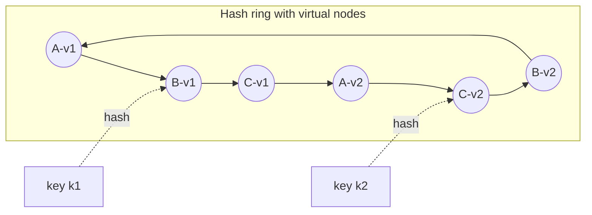

# Partitioning & sharding, consistent hashing

!!! abstract "At a glance"
    **Priority:** P0 · **Complexity:** 3/5 · **Est. time:** 3 h · **Phase:** 2 · **Prereqs:** [Databases](databases-sql-nosql.md), [Replication](replication.md)
    **You're done when:** you can choose a partition key from access patterns, compare range/hash/directory partitioning, explain consistent hashing (ring + virtual nodes, jump hash, rendezvous) and bounded loads, handle hot partitions, and plan an online resharding migration.

## Why it matters

Partitioning is how a system scales beyond one machine's write throughput or storage, and the partition key is the single most consequential data-model decision in a scaled system. Get it wrong and you get hot shards, scatter-gather queries on every request, cross-shard transactions, and a multi-quarter migration. Staff engineers are expected to recognise when sharding is *not yet* needed (most of the time), to design data models that keep it *possible* later, and to lead resharding without downtime.

AI systems partition too: vector indexes sharded by tenant or by embedding space, KV-caches pinned to GPU replicas (prefix-affinity routing is consistent hashing with bounded load), Kafka partitions for ingestion pipelines, and per-tenant isolation for LLM platforms.

## Core concepts

### Partitioning schemes

| Scheme | How | Pros | Cons | Used by |
|---|---|---|---|---|
| **Range** | Contiguous key ranges per shard | Efficient range scans; natural for time/ordered keys | Hot spots on monotonic keys (all new writes to last range); needs splitting | Bigtable/HBase, Spanner, CockroachDB, TiKV |
| **Hash** | `hash(key) mod N` or ring | Even distribution | Range queries scatter; `mod N` remaps almost everything when N changes | Cassandra, DynamoDB, Redis Cluster (slots) |
| **Consistent hashing** | Keys and nodes on a ring | Adding/removing a node moves ~1/N keys | Uneven without virtual nodes | Dynamo, Cassandra vnodes, many caches |
| **Fixed slots** | Key → one of S slots (S ≫ nodes); slots → nodes map | Simple rebalancing by moving slots | Slot count fixed upfront | Redis Cluster (16,384), Elasticsearch shards, Vitess keyspace ranges |
| **Directory / lookup** | Explicit map key → shard | Total flexibility; move individual tenants | Directory is a critical dependency (cache it) | Tenant routing in SaaS, Notion/Figma-style setups |
| **Geographic / tenant** | Partition by region or tenant | Isolation, residency, blast-radius control | Skew (whale tenants) | Multi-tenant SaaS, cell architectures |

### Choosing the partition key

Good partition keys have **high cardinality, even access distribution, and align with the dominant access pattern** so most queries hit one partition.

- **Chat app:** partition messages by `channel_id` (queries are "messages in channel X by time"); cluster by time within the partition. Discord used `(channel_id, bucket)` where bucket is a time window to bound partition size.
- **SaaS:** partition by `tenant_id` — nearly all queries are tenant-scoped, and it gives isolation. Whale tenants need special handling.
- **Orders:** by `customer_id` for customer views; secondary access by merchant needs a secondary index or a separate projection.
- **Anti-pattern:** partitioning by `created_date` (all writes hit today's partition) or by low-cardinality `status`.

### Consistent hashing variants

- **Ring with virtual nodes:** each physical node gets 100–256 tokens; smooths distribution and lets heterogeneous nodes take more tokens. Key goes to the first token clockwise.
- **Jump consistent hash (Lamping & Veach):** no memory, perfectly even, very fast; but nodes must be numbered 0..N−1 and you can only add/remove at the end — great for sharded storage with stable numbering, not for arbitrary node removal.
- **Rendezvous (highest random weight):** score every node with `hash(key, node)`, pick the max. Minimal disruption, trivially supports weights and top-k replicas, O(N) per lookup (fine for tens–hundreds of nodes).
- **Maglev hashing:** lookup table for fast, near-even L4 load balancing with minimal disruption.
- **Consistent hashing with bounded loads (Mirrokni et al.; used by Vimeo, Google):** cap each node at (1+ε)× average load; overflow keys move to the next node. Essential when key popularity is skewed — this is exactly what LLM prefix-affinity routers need.

### Hot partitions (the real problem)

Even distribution of *keys* ≠ even distribution of *load*. Causes: celebrity users, a viral product, a whale tenant, monotonic keys.

Mitigations:

1. **Key salting / write sharding:** append a suffix `key#0..N-1` for hot keys; reads scatter-gather over N (DynamoDB's documented pattern).
2. **Split hot ranges** automatically (range-partitioned stores do this; DynamoDB adaptive capacity and split-for-heat).
3. **Cache hot reads** in front (see [Caching](caching.md)); request coalescing (Discord's data services).
4. **Isolate whales** into dedicated shards/cells (directory-based placement).
5. **Change the key** to include a time bucket or sub-entity.

### Secondary indexes on partitioned data

- **Local (document-partitioned) index:** each shard indexes its own data; writes are local, but queries by secondary attribute scatter-gather to all shards (tail latency!).
- **Global (term-partitioned) index:** index partitioned by the secondary key; reads hit one shard, writes update a remote index shard (usually async → eventual consistency). DynamoDB GSIs are global and asynchronous.

### Cross-shard operations

- **Joins:** avoid by co-locating related data (same partition key — "interleaved tables"/colocation in Citus/Spanner), denormalising, or doing it in the application.
- **Transactions:** 2PC across shards (latency, coordinator availability), distributed SQL (handles it at a cost), or redesign with sagas (see [Sagas, outbox & distributed transactions](../architecture/sagas-outbox.md)).
- **Aggregations:** pre-aggregate via streams, or push to an OLAP store.

### Rebalancing and resharding

- Prefer **many small fixed partitions** (e.g. 1,024 logical shards on 8 physical nodes) so rebalancing moves whole partitions without rehashing.
- **Online resharding pattern:** (1) create target shards; (2) backfill copy; (3) dual-write or CDC-stream changes; (4) verify (checksums, shadow reads); (5) cut over reads, then writes per key-range/tenant with a brief write freeze or fencing; (6) clean up. Vitess's `MoveTables`/`Reshard` workflows automate this; Notion and Figma blogged their Postgres journeys.
- **Automatic rebalancing** is convenient but dangerous when combined with automatic failure detection (a slow node triggers rebalancing, which adds load, which slows more nodes). Many operators prefer human-approved rebalancing.

### Partitioning for AI systems

- **Vector search:** partition by tenant (isolation, better filtered recall, per-tenant deletion for GDPR) vs a global index (better for cross-tenant public corpora). Sharding an ANN index splits recall into per-shard top-k merges — oversample (k' > k) per shard.
- **LLM serving:** consistent hashing on prompt prefix with bounded load for KV-cache reuse.
- **Kafka topics feeding embedding pipelines:** partition by document ID to keep per-document ordering (updates after creates).

## Resources

| Resource | Type | Why this one | Level | Cost |
|---|---|---|---|---|
| [Sam Who — Hashing](https://samwho.dev/hashing/) :gem: | interactive | Visual, interactive intuition for hash functions and distribution | intermediate | free |
| [Hello Interview — Consistent hashing](https://www.hellointerview.com/learn/system-design/deep-dives/consistent-hashing) | article | Clear ring + vnodes explanation in interview framing | intermediate | free |
| [Jump Consistent Hash paper](https://arxiv.org/abs/1406.2294) :gem: | paper | 5 lines of code, memoryless, perfectly balanced — short and elegant | advanced | free |
| [DDIA 2e — Partitioning/Sharding chapter](https://martin.kleppmann.com/2026/03/24/designing-data-intensive-applications-2e.html) | book | Secondary index strategies, rebalancing, request routing | advanced | paid |
| [Notion — Sharding Postgres at Notion](https://www.notion.com/blog/sharding-postgres-at-notion) | article | Real application-level sharding with logical shards and migration via double writes | intermediate | free |
| [Figma — How Figma's databases team lived to tell the scale](https://www.figma.com/blog/how-figmas-databases-team-lived-to-tell-the-scale/) :gem: | article | Horizontal sharding of Postgres with "colos" and a query proxy; excellent trade-off discussion | advanced | free |
| [Discord — How Discord stores trillions of messages](https://discord.com/blog/how-discord-stores-trillions-of-messages) | article | Partition key design, hot partitions and request coalescing in practice | intermediate | free |
| [Vitess docs](https://vitess.io/docs/) | docs | Keyspaces, vindexes and online resharding workflows for MySQL | advanced | free |

## Hands-on lab

**Goal:** implement and compare hashing schemes; simulate hot keys (60–90 min).

1. In Python, implement: `mod N`, ring with virtual nodes (configurable count), jump hash, rendezvous.
2. Distribute 1M keys over 10 nodes; report stddev of keys per node for each (vnodes = 1, 16, 256).
3. Add an 11th node; report % of keys that moved for each scheme (expect ~91% for mod N, ~9% for the others).
4. Generate Zipfian key popularity (s=1.1) and compute *load* per node; implement bounded-load consistent hashing (ε = 0.25) and compare max/avg load.
5. **Expected output:** vnodes reduce stddev dramatically; mod N moves nearly all keys; Zipf load produces a hot node even with even key counts; bounded loads cap max/avg ≤ 1.25 at the cost of some affinity.

## Questions

### L1 — Recall

??? question "Q1. Why is `hash(key) mod N` bad for a cache or storage cluster that changes size?"
    ??? success "Answer"
        Changing N remaps almost every key (≈ N/(N+1) of keys move when adding one node), causing a mass cache miss or a massive data migration. Consistent hashing, fixed slots, jump hash or rendezvous move only ~1/N of keys.

??? question "Q2. What do virtual nodes solve?"
    ??? success "Answer"
        With one token per node, ring arcs are uneven, so some nodes own far more key space; removal dumps all of a node's keys onto a single neighbour. Many tokens per node average out arc sizes, spread a leaving node's load across many nodes, and allow weighting heterogeneous hardware by token count.

??? question "Q3. Local vs global secondary indexes on a partitioned store?"
    ??? success "Answer"
        Local: each partition indexes its own rows; writes stay local and consistent, but a query by the secondary key must scatter to all partitions. Global: the index is itself partitioned by the secondary key; reads go to one index partition, but writes must update a (usually remote) index partition, often asynchronously, so the index is eventually consistent.

??? question "Q4. What is consistent hashing with bounded loads?"
    ??? success "Answer"
        A variant where each node has a capacity of ⌈(1+ε) × average load⌉; if a key's assigned node is full, it moves clockwise to the next node with capacity. It preserves most affinity while guaranteeing no node exceeds (1+ε)× average — important with skewed popularity (caches, LLM prefix routing).

### L2 — Apply

??? question "Q5. Pick a partition key for a ride-hailing trips table: queries are 'trips by rider (history)', 'trips by driver (earnings)', and 'active trips in a city'."
    ??? success "Answer"
        No single key serves all three. Primary store partitioned by `trip_id` or `rider_id` (rider history is the high-volume read); a projection partitioned by `driver_id` for earnings (fed by CDC/events); active trips live in a separate real-time store partitioned by geo cell (e.g. H3 cell / city) with TTL, since they're transient and queried spatially. This is CQRS in practice: different read models per access pattern.

??? question "Q6. A DynamoDB table keyed by `event_date` is throttling. Why, and how do you fix it?"
    ??? success "Answer"
        All writes for today go to one partition key → hot partition exceeding per-partition throughput limits regardless of provisioned table capacity. Fix: key by a high-cardinality attribute (device/entity ID) with date in the sort key; if date-based access is required, write-shard: `event_date#<random 0..N-1>` and scatter-gather reads across N suffixes; or use a GSI on date with sharding. Also consider streaming raw events to S3/Iceberg for date-range analytics.

??? question "Q7. You shard a SaaS by tenant across 16 Postgres instances. One tenant is 30% of load. What do you do?"
    ??? success "Answer"
        Use directory-based placement so the whale can be isolated on its own (possibly larger) instance or cell. If it still exceeds one node, sub-partition within the tenant by a secondary key (e.g. `(tenant_id, project_id)`), giving the whale its own internal sharding. Add per-tenant rate limits/quotas to protect others. Price/contract accordingly. Keep the directory cached and versioned; migrations move tenants individually with CDC-based copying and a short write freeze.

### L3 — Design & trade-offs

??? question "Q8. Range vs hash partitioning for a time-series metrics store."
    ??? success "Answer"
        Pure range on timestamp → all writes hit the latest range (hot tail). Pure hash on series ID → even writes but time-range queries across many series scatter everywhere. Common design: partition by hash(series_id) (or tenant+metric) and cluster/sort by time within each partition, with time-bucketed partitions (per day/week) for retention by dropping whole buckets. Queries for a single series over time hit one partition; dashboards aggregating many series use pre-aggregated rollups. Prometheus/Mimir/M3/InfluxDB use variants of this.

??? question "Q9. Your team proposes 2PC for cross-shard order + inventory updates. Evaluate alternatives."
    ??? success "Answer"
        2PC: atomic, but blocking if the coordinator fails mid-protocol, adds round trips and holds locks, reducing throughput; operationally tricky with heterogeneous stores. Alternatives: (1) **co-locate** order and inventory reservation for the same warehouse in one shard (partition by warehouse) so it's a local transaction; (2) **saga** with reservation + compensation (reserve inventory, create order, confirm or release) using the outbox pattern; (3) **distributed SQL** that implements distributed transactions with consensus. Prefer co-location if the access pattern allows; else saga for loosely coupled services; distributed SQL if strong cross-entity invariants are pervasive.

??? question "Q10. Tenant-partitioned vs global vector index for a multi-tenant RAG platform with 5,000 tenants of wildly varying sizes."
    ??? success "Answer"
        Tenant-partitioned: strong isolation, simple deletion, better filtered recall (no post-filtering), per-tenant tuning; but thousands of small indexes waste memory and many tiny HNSW graphs have overhead. Global index with tenant filter: efficient memory, but filtered ANN with selective filters hurts recall/latency and isolation relies on correct filtering (a leak risk). Hybrid: small tenants share pooled indexes partitioned by tenant group with mandatory filter enforcement in the retrieval service; large tenants get dedicated indexes/collections; or use an engine with native multi-tenancy/namespaces (Qdrant payload-based tenancy with tenant-aware indexing, turbopuffer namespaces). Decide based on tenant size distribution and compliance demands.

### L4 — Staff-level ambiguity

??? question "Q11. The main Postgres cluster will hit its limits in ~12 months. Lead the decision: vertical scale, read replicas, functional partitioning, horizontal sharding, or distributed SQL."
    ??? success "Answer"
        Start with analysis: which limit (CPU, write IOPS, storage, connections, vacuum), growth rate, top queries by load. Apply cheap levers first with measured gains: query/index tuning, connection pooling, moving reads to replicas, archiving cold data, moving analytics to a warehouse, caching. Then **functional partitioning** (split tables owned by distinct domains into separate databases) buys time with modest complexity. If a single domain still outgrows the biggest instance, choose between app-level sharding (Notion/Figma path; control, but you own routing and resharding) and distributed SQL (less custom code, new operational model, migration risk). Write an RFC with options, cost, risk, timeline; run a proof-of-concept on the top 3 query patterns; decide by month 3 so migration completes with 6 months margin. Staff value: sequencing and de-risking, not picking the fanciest option.

??? question "Q12. After sharding by customer, the analytics and support teams complain every query is now a scatter-gather nightmare. How do you respond organisationally and technically?"
    ??? success "Answer"
        Acknowledge a missed requirement: the sharding design optimised OLTP but broke secondary consumers. Technically: provide purpose-built read models — CDC from all shards into a warehouse/lakehouse for analytics (minutes lag acceptable), a search index for support lookups by email/order number, and a global lookup table (secondary key → shard) for point lookups. Organisationally: add "secondary access patterns and consumers" to the design-doc template, involve downstream teams in data-model reviews, and assign ownership of the derived stores (platform or data team) with freshness SLOs. Use it as a learning in a blameless retro.

## Real-world use cases

- **Discord:** messages partitioned by (channel, time bucket) to bound partition size; hot channels handled via request coalescing.
- **Instagram (historic):** thousands of logical shards mapped to fewer physical Postgres servers; IDs embed shard number.
- **Redis Cluster:** 16,384 hash slots moved between nodes for rebalancing.
- **Logistics:** shipment events partitioned by shipment/container ID in Kafka to preserve per-container ordering; bookings partitioned by origin region for residency.

## Pitfalls & anti-patterns

- Sharding prematurely — operational cost is permanent.
- Monotonic partition keys (timestamps, auto-increment) on hash-less range partitioning.
- Assuming even key distribution means even load.
- Scatter-gather on the hot path.
- Too few logical shards to rebalance later.
- Automatic rebalancing triggered by slowness, creating feedback loops.

## Checklist

- [ ] I can pick a partition key from access patterns and name the secondary-access solution
- [ ] I implemented four hashing schemes and measured key movement
- [ ] I can explain bounded-load consistent hashing and where LLM routing uses it
- [ ] I can outline an online resharding plan
- [ ] I answered all L3 questions out loud in < 3 min each
