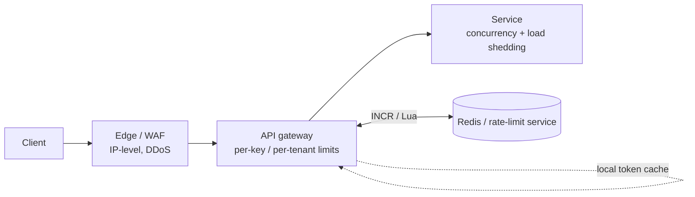

# Rate limiting & quotas

!!! abstract "At a glance"
    **Priority:** P0 · **Complexity:** 3/5 · **Est. time:** 3 h · **Phase:** 4 · **Prereqs:** [API design](api-design.md), [Caching](caching.md)
    **You're done when:** you can compare token bucket, leaky bucket, fixed/sliding window algorithms, design a distributed limiter (Redis, local + global), distinguish rate limits, quotas, concurrency limits and load shedding, and design per-token, per-tenant limits for an LLM gateway.

## Why it matters

Rate limiting protects availability (against abuse and accidents), enforces fairness across tenants, and implements commercial plans. It is also a frequent interview topic where candidates recite algorithms but miss the real design questions: *what is the key* (IP, user, API key, tenant, model), *where does it run*, *what happens when the limiter is down*, *how do clients learn their limits*, and *what is limited* (requests, cost, concurrency).

In 2026 the dominant new case is **LLM APIs**, where the scarce resource is *tokens* (and GPU capacity), the cost of a request isn't known until it finishes, and providers limit by RPM, TPM (input and output tokens per minute) and concurrent requests. Anyone building an LLM gateway or agent platform builds a per-token, per-tenant, multi-provider limiter.

## Core concepts

### Four different controls (don't conflate)

| Control | Question it answers | Typical mechanism | Response |
|---|---|---|---|
| **Rate limit** | How fast may a client call? | Token bucket / windows | 429 + `Retry-After` |
| **Quota** | How much in a billing period? | Counters per day/month, metering | 429/402 or throttle; upsell |
| **Concurrency limit** | How many in-flight at once? | Semaphore / adaptive (AIMD, Vegas) | 429/503 or queue |
| **Load shedding** | Protect the server when overloaded regardless of who | Priority-based drop, adaptive limits | 503 (drop lowest priority first) |

Rate limits protect *fairness*; load shedding protects *the service*; conflating them means a well-behaved client gets shed while an abusive one is within its limit. Amazon's Builders' Library on load shedding and Google SRE's overload chapter cover the latter.

### Algorithms

| Algorithm | State per key | Behaviour | Pros | Cons |
|---|---|---|---|---|
| **Fixed window counter** | count + window start | Reset at boundaries | Trivial, cheap | Boundary burst: 2× limit across a window edge |
| **Sliding window log** | timestamp per request | Exact | Precise | O(requests) memory |
| **Sliding window counter** | 2 counters (current, previous) | Weighted estimate | Cheap and smooth; Cloudflare reports ~0.003% error | Approximate |
| **Token bucket** | tokens + last refill time | Allows bursts up to capacity, sustained rate = refill | Bursty-friendly, O(1), industry default (Stripe, AWS) | Two params to tune |
| **Leaky bucket (as meter/queue)** | level + last time | Smooths output to constant rate | Protects downstream with steady flow | Queueing adds latency; bursts dropped |
| **GCRA** | one timestamp (theoretical arrival time) | Equivalent to token bucket, very compact | Single value; atomic-friendly | Less familiar |
| **Adaptive concurrency** | in-flight + latency | Adjusts limit from observed latency | No manual tuning; handles capacity shifts | Needs care to avoid oscillation |

Token bucket in Redis (atomic via Lua; store `tokens`, `ts`; compute refill on read; set TTL) is the workhorse. Stripe operates request rate limiters, concurrent-request limiters, fleet-usage load shedders and worker-utilisation shedders in layers ("Scaling your API with rate limiters").

### Architecture

Where to enforce:

- **Edge/CDN/WAF:** IP-based, bot/DDoS, coarse; cheap and early.
- **Gateway/sidecar:** per-API-key/tenant/plan. Envoy supports local rate limiting (per instance, no dependency) and a **global rate limit service** (gRPC to a shared Redis-backed service).
- **In-service:** concurrency and priority-aware shedding, which needs application knowledge (cost of endpoint).

Distributed design decisions:

- **Centralised counter (Redis):** accurate, adds ~0.3–1 ms and a dependency; Redis Cluster shards by key. Hot keys (one giant tenant at 50k RPS) melt a shard → use local pre-aggregation.
- **Local approximate + periodic sync:** each node enforces `limit / N` or reserves batches of tokens from the central store (Figma's alternative approach; Cloudflare's eventual approach). Cheaper and resilient, at the price of accuracy; fine when limits are "protective", not "billing exact".
- **Fail-open vs fail-closed:** if the limiter store is down — fail open for protective limits (availability over precision) with local fallback limits; fail closed only for security-sensitive limits (login attempts, OTP). Make this an explicit, tested decision.
- **Clock/time:** derive time from the store (Redis `TIME`) or use monotonic elapsed logic to avoid client clock skew.
- **Race conditions:** read-modify-write must be atomic (Lua/`INCR` + `EXPIRE` pitfalls: set TTL atomically).

### Communicating limits

- Return `429 Too Many Requests` with `Retry-After`; use the IETF `RateLimit` / `RateLimit-Policy` headers (draft) so clients can self-throttle. Provide separate signals for quotas.
- Client-side: honour `Retry-After`, add **jitter**, use **retry budgets**, and prefer client-side token buckets so you don't hammer the server (see [Reliability patterns](reliability-patterns.md)).
- Document limits per plan; expose usage APIs/dashboards.

### Choosing the key and the fairness model

- Keys: API key/tenant (default), user, IP (weak: NAT, IPv6, botnets), endpoint/cost class, model (LLM), and combinations (tenant × endpoint).
- **Weighted cost:** a `search` may cost 5 units, a `GET` 1 (GraphQL cost analysis; LLM tokens).
- **Fair sharing:** per-tenant limits plus a global cap; when global capacity is scarce use weighted fair queuing or max-min fairness so one tenant can't starve others. Priority tiers: interactive > batch; batch can use leftover capacity and be preempted.
- **Bursts:** token bucket capacity = burst tolerance; sustained rate = refill.

### LLM rate limiting (2026)

Provider limits (Anthropic, OpenAI, Azure OpenAI/Foundry, Bedrock) typically include RPM, input TPM, output TPM (or combined TPM), and concurrency; Azure adds per-deployment quota in TPM allocated per region/subscription. Implications for your own gateway:

1. **Limit by tokens, not requests.** Estimate at admission: `input_tokens (tokenise) + max_tokens` reserved; after completion, **reconcile** with actual usage (refund unused). This "reserve then settle" pattern is the LLM equivalent of a two-phase counter.
2. **Multiple budgets simultaneously:** per-tenant TPM, per-tenant monthly $ budget, per-user, per-model, plus the global provider TPM you must not exceed.
3. **Concurrency limits** matter as much as TPM because streaming responses hold capacity for tens of seconds (Little's Law, see [Scalability fundamentals](scalability-fundamentals.md)).
4. **Priority lanes:** interactive chat vs batch evals; reserve capacity for interactive, let batch scavenge.
5. **Handle provider 429s:** honour `retry-after`, fail over to another deployment/region/provider or smaller model, queue with deadlines. Track remaining-limit headers from responses to steer routing proactively.
6. **Agent loops:** cap steps, tool calls and cumulative tokens per run (a runaway agent is a self-inflicted DoS and budget burn); per-run budgets are rate limits with a lifetime of one task.
7. **Abuse and denial-of-wallet:** unauthenticated or lightly authenticated endpoints backed by LLMs need strict per-IP/per-user token caps and CAPTCHA/attestation, since a single attacker can burn thousands of dollars.

See [Design a multi-tenant LLM gateway](../ai-system-design/llm-gateway.md) and [Model routing & gateways](../agentic-ai/model-routing-gateways.md).

## Resources

| Resource | Type | Why this one | Level | Cost |
|---|---|---|---|---|
| [Stripe — Scaling your API with rate limiters](https://stripe.com/blog/rate-limiters) | article | Four layered limiters (rate, concurrency, fleet load shedding, worker load shedding) from production | intermediate | free |
| [Cloudflare — Counting things, a lot of different things](https://blog.cloudflare.com/counting-things-a-lot-of-different-things/) | article | Sliding window counter and distributed counting at massive scale | advanced | free |
| [Brandur — Rate limiting with Redis (GCRA)](https://brandur.org/rate-limiting) :gem: | article | GCRA explained with a Redis implementation; compact and correct | advanced | free |
| [Figma — An alternative approach to rate limiting](https://www.figma.com/blog/an-alternative-approach-to-rate-limiting/) :gem: | article | Fixed-window counters with sliding approximation and practical trade-offs | intermediate | free |
| [Envoy — Global rate limiting](https://www.envoyproxy.io/docs/envoy/latest/intro/arch_overview/other_features/global_rate_limiting) | docs | Local vs global limiting architecture in a widely used proxy | advanced | free |
| [IETF RateLimit header fields draft](https://datatracker.ietf.org/doc/draft-ietf-httpapi-ratelimit-headers/) | docs | The emerging standard for advertising limits | intermediate | free |
| [Anthropic — Rate limits](https://docs.claude.com/en/api/rate-limits) | docs | Real LLM provider limits: RPM, ITPM, OTPM, token-bucket behaviour, cache-aware counting | intermediate | free |
| [Azure OpenAI / Foundry quotas and limits](https://learn.microsoft.com/en-us/azure/ai-foundry/openai/quotas-limits) | docs | TPM quota per deployment/region — what you plan capacity against | intermediate | free |
| [AWS Builders' Library — Using load shedding to avoid overload](https://aws.amazon.com/builders-library/using-load-shedding-to-avoid-overload/) | article | Load shedding distinct from rate limiting; priorities and goodput | advanced | free |

## Hands-on lab

**Goal:** implement token bucket in Redis and an LLM token-aware limiter with reserve/settle (90 min).

1. Implement token bucket as a Redis Lua script (`KEYS[1]` bucket, args: capacity, refill/s, cost, now from `redis.call('TIME')`). Return allowed + remaining + retry_after. Test with 50 concurrent clients via `asyncio`.
2. Compare fixed window vs sliding window counter vs token bucket by sending a burst straddling a window boundary; plot accepted requests over time.
3. Build a FastAPI dependency `limit(tenant, tokens_estimate)`: reserve `estimated_input + max_tokens`, call the model (Ollama/provider), read actual usage, settle by refunding the difference. Add a per-tenant concurrency semaphore and a global TPM bucket.
4. Failure test: stop Redis; verify fail-open with local fallback limits for chat, fail-closed for a `/login` route.
5. **Expected output:** fixed window admits ~2× at boundary, sliding/token bucket don't; refunds keep effective throughput near the true token budget; the Redis outage behaves per the documented policy.

## Questions

### L1 — Recall

??? question "Q1. Compare token bucket and leaky bucket."
    ??? success "Answer"
        Token bucket: tokens accrue at a fixed rate up to a capacity; each request consumes tokens; it permits bursts up to capacity while enforcing the average rate. Leaky bucket (queue variant): requests enter a queue drained at a constant rate, smoothing output and overflowing when full; (meter variant) equals a token bucket without burst credit. Use token bucket for API limits with burst tolerance; leaky bucket to protect a downstream needing steady flow.

??? question "Q2. What is the fixed-window boundary problem?"
    ??? success "Answer"
        A client can send the full limit at the end of one window and the full limit again at the start of the next, achieving up to 2× the intended rate within a short interval spanning the boundary. Sliding window (log or counter) and token bucket avoid it.

??? question "Q3. What's the difference between a rate limit and load shedding?"
    ??? success "Answer"
        Rate limits enforce per-client fairness/policy irrespective of server state. Load shedding drops or degrades work when the *server* is overloaded, prioritising important traffic, irrespective of whether any client exceeded its limit. You need both: the first prevents abuse, the second preserves goodput during genuine capacity shortfalls.

??? question "Q4. Why should LLM rate limiting account for output tokens and concurrency, not just request count?"
    ??? success "Answer"
        Cost and capacity scale with tokens (prefill compute and decode time), so RPM says little; providers meter input/output TPM separately. Streaming responses occupy capacity for many seconds, so concurrent stream count (Little's Law) is a binding limit. Output length is unknown at admission, hence reservation with `max_tokens` and post-hoc settlement.

### L2 — Apply

??? question "Q5. Design a per-tenant limiter for 10k tenants, 200k total RPS, limits from 10 to 5,000 RPS, with a Redis backend."
    ??? success "Answer"
        Token bucket per (tenant, plan) in Redis with Lua for atomicity; keys sharded by tenant across the cluster (200k RPS of ~1 ms Lua is feasible across a few shards, but reduce load): use **local batch leasing** — each gateway node holds a small local bucket refilled from Redis in chunks (e.g. every 100 ms or after N tokens), so Redis sees ~10 ops/s per node per active tenant instead of per-request. Heavy tenants (5k RPS) get larger chunks. Accept slight over-admission bounded by outstanding leases. Emit metrics per tenant, expose headers, fail open to local-only limits at 2× conservative rates if Redis is unreachable.

??? question "Q6. A client retries immediately on 429 and creates a retry storm. What server and client changes fix it?"
    ??? success "Answer"
        Server: return `Retry-After` (with jitter server-side to desynchronise), stable rate-limit headers, and consider penalising abusive retriers (increased cost for rejected requests, escalating backoff). Client: exponential backoff with full jitter honouring Retry-After, retry budgets (at most ~10% extra traffic), client-side token bucket to self-throttle, circuit breaker after repeated 429s, and idempotent retries. Document all of this in the SDK defaults, not just in prose.

??? question "Q7. You must enforce 1M tokens/minute per tenant against an LLM gateway. Explain the reserve/settle flow with numbers."
    ??? success "Answer"
        Request has ~3,000 input tokens (counted with the tokenizer) and `max_tokens=1,000`. Reserve 4,000 from the tenant's TPM bucket (reject/queue with Retry-After if unavailable). Also reserve one concurrency slot. After the response, actual usage is 3,000 + 420 = 3,420; refund 580. If the request errors early, refund everything not consumed. Cached input tokens may count differently by provider; mirror the provider's accounting or you'll drift. Track reservations with TTL so crashed requests don't leak tokens.

### L3 — Design & trade-offs

??? question "Q8. Centralised Redis counters vs local approximate limiters — decide for a public API at 500k RPS."
    ??? success "Answer"
        Centralised exact counting at 500k RPS costs a Redis round trip on every request (latency, hot keys, and a critical dependency). Local limiters with periodic synchronisation (or token leasing) scale linearly, keep working during Redis outages, and add no per-request latency; error is bounded by sync interval × node count. Choose hybrid: local token buckets with leased budgets for the fast path; exact central accounting for billing quotas (asynchronously aggregated). Use central strictness only where exactness is contractual (per-minute paid SLA caps) or security-critical (login attempts).

??? question "Q9. Design fair sharing between interactive chat traffic and batch evaluation jobs on a shared LLM capacity of 2M TPM."
    ??? success "Answer"
        Two priority classes with reserved and burstable shares: interactive gets a guaranteed 60% (1.2M) plus can borrow unused batch capacity; batch gets 20% guaranteed and scavenges idle capacity, preemptible with queueing and deadlines. Implement with hierarchical token buckets (parent global 2M, children per class, then per tenant), queue batch requests with slow drain and jittered retries, and use provider batch APIs where possible. Admission for interactive uses tight deadlines and fails fast to a fallback model; monitor p95 queue time per class and adjust shares.

??? question "Q10. Should the limiter fail open or closed? Justify by endpoint type."
    ??? success "Answer"
        Protective limits on general APIs: fail open with conservative local fallback limits — an outage of the limiter shouldn't become an outage of the product. Security-critical (login, password reset, OTP, payment attempts): fail closed or use strict local limits, since abuse during a limiter outage is the very scenario attackers exploit. LLM endpoints with cost exposure: fail to tight local per-tenant caps (not fully open) to avoid denial-of-wallet. Test each mode in game days.

### L4 — Staff-level ambiguity

??? question "Q11. A major customer demands 'guaranteed 10k RPS' while your shared platform can't reserve that capacity today. How do you resolve this?"
    ??? success "Answer"
        Separate the commercial promise from the mechanism. Clarify what they need (peak RPS? latency at that rate? burst duration?). Options: dedicated capacity/cell for that customer (isolation, higher price), reserved capacity within the pool via weighted fair share with priority and admission control (guarantee = floor, not exclusive), or a burst-credit token bucket (sustained 3k, bursts to 10k for 60 s). Price accordingly, define SLOs and what happens beyond the guarantee, and include load-test evidence. Escalate capacity planning and align with sales on standard tiers so you don't create a bespoke SLA per customer.

??? question "Q12. Leadership wants to cut LLM spend 40% without hurting user experience. How does rate limiting/quotas fit in a broader plan?"
    ??? success "Answer"
        Limits are a governance tool, not the first lever. Sequence: (1) Attribution: cost per tenant/feature/route in the gateway; find the top 5 spenders and unbounded agent loops. (2) Efficiency: prompt caching, routing simple tasks to smaller models, trimming context, batch APIs for offline work. (3) Guardrails: per-run token/step budgets for agents, per-user daily caps for free tiers, per-tenant monthly budgets with alerts at 80%/100%, denial-of-wallet protections. (4) Policy: tiered plans where heavy use is priced. Communicate effect sizes and monitor quality metrics (eval scores, user satisfaction) to ensure savings don't regress experience. Present the plan with expected savings per lever.

## Real-world use cases

- **Stripe:** layered request, concurrency and load-shedding limiters protect the API.
- **Cloudflare:** distributed counting with sliding windows at the edge.
- **GitHub/Slack:** per-token rate limits with headers; GraphQL cost-based limits.
- **LLM gateways (LiteLLM etc.):** per-key/team TPM/RPM, budgets, and fallback on provider 429s.
- **Logistics partner APIs:** per-partner quotas and bursts around vessel-schedule publication times.

## Pitfalls & anti-patterns

- Limiting only by IP.
- Non-atomic read-modify-write in the limiter (races).
- Fail-open without fallback limits; fail-closed for everything.
- 429 without `Retry-After`; clients retrying instantly.
- Limiting LLM requests by RPM only; no per-run agent budgets.
- Using rate limits to solve genuine capacity shortfalls (that is load shedding and capacity planning).

## Checklist

- [ ] I can compare token bucket, sliding window, GCRA and leaky bucket
- [ ] I built a Redis token bucket with Lua and tested failure modes
- [ ] I can design reserve/settle token limiting for LLMs
- [ ] I can separate rate limits, quotas, concurrency limits and load shedding
- [ ] I answered all L3 questions out loud in < 3 min each
