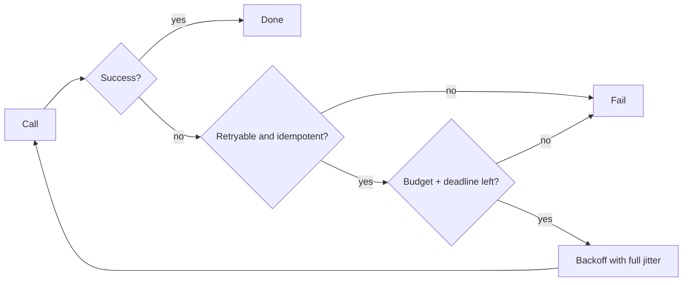

# Reliability: retries, backoff, circuit breakers, bulkheads

!!! abstract "At a glance"
    **Priority:** P0 · **Complexity:** 3/5 · **Est. time:** 3 h · **Phase:** 3 · **Prereqs:** [Scalability fundamentals](scalability-fundamentals.md), [Rate limiting](rate-limiting.md)
    **You're done when:** you can set timeouts from a latency budget, design retries that don't amplify outages (backoff, jitter, budgets, idempotency), apply circuit breakers, bulkheads, load shedding and graceful degradation, and explain metastable failures and how LLM/agent calls change these patterns.

## Why it matters

Most large outages are not caused by a component failing; they are caused by *how the system reacts* to a component failing: retry storms, thread-pool exhaustion, unbounded queues, cascading timeouts, and recoveries that re-trigger the overload. The Google SRE chapters on cascading failures and overload, the AWS Builders' Library, and the metastable failures paper (Bronson et al.) all say the same thing: **resilience patterns misconfigured are the outage**.

A Staff engineer sets org-wide defaults (timeouts, retry budgets, deadline propagation), and reviews designs for amplification. In AI systems these matter more: LLM calls are slow (seconds), expensive (retries cost money), rate limited (429s are normal), and non-deterministic (a "retry" may return a different answer or repeat a non-idempotent tool action). Agent loops add a new failure class: **runaway loops** that are retries with reasoning.

## Core concepts

### Failure taxonomy

| Type | Example | Default response |
|---|---|---|
| Crash / unavailable | Pod dead, connection refused | Fast fail, retry on another instance |
| Slow (gray failure) | 10× latency, partial packet loss | Timeouts, hedging, outlier ejection; the hardest class |
| Overload | Load exceeds capacity | Shed load; do not retry into it |
| Incorrect | Wrong data, bad deploy | Validation, canaries, rollback, kill switches |
| Dependency correlated | Shared DB/DNS/auth down | Bulkheads, static stability, degraded modes |

Slow is worse than down: down fails fast, slow holds threads, connections and memory, triggering cascades.

### Timeouts and deadlines

- **Every remote call needs a timeout**; defaults of "infinite" (or 30–60 s) are outage generators.
- Set from data: timeout ≈ p99.9 of the dependency under normal load (not the SLA). Below it you create false failures; far above it you hold resources.
- **Deadline propagation:** pass the *remaining* time budget downstream (gRPC deadlines, `X-Request-Deadline`), so a service doesn't work on a request whose caller already gave up. Budget across a chain: if the user-facing SLO is 2 s and there are 3 sequential hops, each gets a slice, and retries must fit in the remainder.
- Separate **connect timeout** (short: ~100s of ms) from **read/total timeout**.
- Cancel work on timeout (context cancellation, `asyncio.timeout`), else abandoned requests keep consuming capacity ("zombie work").

### Retries

Retries turn transient failures into successes and permanent failures/overloads into **amplified load**. With depth d and r retries per layer, worst-case amplification is (r+1)^d: 3 layers × 2 retries = 27× load on the deepest service during an outage.

Rules:

1. **Retry only safe operations** — idempotent, or protected by idempotency keys ([API design](api-design.md)).
2. **Only retry retryable errors** — timeouts, 503, connection resets, 429 (with `Retry-After`). Never 400/401/403/404/422.
3. **Exponential backoff with jitter** — `sleep = random(0, min(cap, base × 2^attempt))` ("full jitter" per the AWS Architecture Blog gives the best completion time/load trade-off). Without jitter, clients synchronise into waves.
4. **Retry budgets** — allow retries only up to ~10% of successful request volume (token bucket per client/service; Envoy's retry budgets, gRPC's retry throttling). This caps amplification regardless of depth.
5. **Retry at one layer** — typically the edge/closest-to-user or the layer that owns idempotency; lower layers fail fast. Otherwise multiplicative amplification.
6. **Cap total time** with the deadline; do not retry when there's insufficient budget left.
7. **Hedging** (a second request after p95) reduces tail latency for idempotent reads (see Tail at Scale) — a controlled, bounded form of retry.

### Circuit breakers

States: **Closed** (normal, count failures) → **Open** (fail immediately for a cool-down) → **Half-open** (allow a few probes; success closes, failure re-opens).

- Purpose: stop sending traffic to a struggling dependency (giving it room to recover), and **fail fast** so callers don't tie up resources.
- Trip on error rate and/or slow-call rate over a sliding window with a minimum request volume (Resilience4j: failureRateThreshold, slowCallRateThreshold, minimumNumberOfCalls).
- Per **dependency and (where relevant) per endpoint or per tenant**, not one global breaker.
- Pair with **fallbacks**: cached data, default values, degraded feature, or a clear error. A breaker with no fallback still helps by shedding pressure.
- Pitfalls: thresholds too sensitive (flapping), too lax (useless), breakers per instance vs shared state (client-side breakers are per client process by design), and **hiding failures** — expose breaker state in metrics/alerts.
- In service meshes, **outlier detection** is the LB-level analogue (see [Load balancing](load-balancing.md)).

### Bulkheads and isolation

Partition resources so one failure domain can't consume everything: separate **thread pools/connection pools/semaphores per dependency**, separate queues per tenant or priority, separate **cells** (independent stacks serving a slice of customers; blast radius = 1/N). AWS and Slack use cell-based architecture to bound blast radius; see [Multi-region, DR & failover](multi-region-dr.md).

- With async runtimes, a semaphore per downstream limits concurrent calls (also Little's Law-based sizing).
- Isolate slow/experimental features (recommendations) from critical paths (checkout).
- Shuffle sharding: assign each tenant to a random small subset of workers so a poison tenant only harms the few tenants sharing its whole subset (Route 53, Kafka-like designs).

### Load shedding, backpressure, and queues

- **Shed early and by priority** when utilisation is high: reject cheap-to-reject requests fast (503 + Retry-After) rather than accept and time out. Protect goodput (successful work), not throughput. Prioritise critical traffic (health checks, checkout) over background traffic.
- **Bounded queues only.** Unbounded queues convert overload into latency and memory exhaustion; queue delay beyond the client's deadline is wasted work. Use **LIFO or CoDel-style** queue management under overload so fresh requests succeed. AWS: "Avoiding insurmountable queue backlogs".
- **Backpressure** propagates saturation upstream (reactive streams, TCP, bounded channels, HTTP 429/503).
- **Adaptive concurrency limits** (Netflix concurrency-limits, AIMD) find capacity automatically.

### Graceful degradation

Design explicit degraded modes: serve stale cache, hide non-critical widgets, disable recommendations, queue writes for later, read-only mode, cheaper model, shorter context. Decide which features are **critical vs best-effort** upfront and encode with feature flags/kill switches. **Static stability:** the data plane keeps working when the control plane is down (don't need to call the orchestrator to serve requests).

### Metastable failures

A trigger (a blip) pushes the system into a state where a **sustaining effect** (retry storm, cache miss storm, GC thrash, queue backlog) keeps it overloaded even after the trigger is gone. Recovery requires reducing load below the *lower* recovery threshold (shed, disable retries, warm caches, scale up), not just fixing the trigger. Guards: retry budgets, load shedding, bounded queues, capacity planning for cold-cache state, circuit breakers, and the ability to **rapidly shed all non-critical load**.

### Reliability with LLMs and agents

- **Provider failures are routine:** 429s, 500s, overloaded errors, slow generations, model deprecations, regional outages. Implement: retry with backoff honouring `retry-after`; **fallback chain** (same model other region → alternate provider → smaller model), each with its own breaker; per-call timeouts (time-to-first-token timeout plus total timeout; streaming stalls need an inter-token timeout).
- **Cost of retries:** a retried 100k-token prompt is real money and adds to TPM pressure; budget retries in tokens, not just counts; use idempotency/caching so identical retried requests hit prompt caches.
- **Output failures** (malformed JSON, refusals, hallucinated tool args): bounded re-prompt loops (max 2–3) with validation errors fed back; then fail over to deterministic handling or a human.
- **Agent loops:** hard caps on steps, wall-clock, tokens and tool calls per run; detect repeated identical tool calls; circuit-break a failing tool so the agent doesn't hammer it and instead re-plans.
- **Tool side effects:** retries of non-idempotent tools cause duplicates; enforce idempotency keys in tools ([API design](api-design.md)); durable execution frameworks checkpoint each step so a crash doesn't repeat completed effects ([Durable execution](../agentic-ai/durable-execution-hitl.md)).
- **Degraded modes:** if the LLM is down, return retrieval results without generation, or cached answers; if a reranker is down, skip it.
- **Testing:** chaos/failure injection for provider errors and latency in staging; replay real failures in evals.

## Resources

| Resource | Type | Why this one | Level | Cost |
|---|---|---|---|---|
| [AWS Builders' Library — Timeouts, retries and backoff with jitter](https://aws.amazon.com/builders-library/timeouts-retries-and-backoff-with-jitter/) | article | The definitive practical guide from Amazon's experience | intermediate | free |
| [AWS Architecture Blog — Exponential backoff and jitter](https://aws.amazon.com/blogs/architecture/exponential-backoff-and-jitter/) | article | Simulations showing why full jitter wins | intermediate | free |
| [Google SRE book — Addressing cascading failures](https://sre.google/sre-book/addressing-cascading-failures/) | book | Retry amplification, load shedding, deadline propagation with real incidents | advanced | free |
| [Google SRE book — Handling overload](https://sre.google/sre-book/handling-overload/) | book | Client-side throttling, criticality, adaptive throttling | advanced | free |
| [Marc Brooker — Will circuit breakers solve my problems?](https://brooker.co.za/blog/2022/02/28/retries.html) :gem: | article | Nuanced take on retries, breakers and when they help or hurt | advanced | free |
| [Metastable Failures in the Wild / Bronson et al. (HotOS '21)](https://sigops.org/s/conferences/hotos/2021/papers/hotos21-s11-bronson.pdf) :gem: | paper | Names and explains the failure mode behind many big outages | advanced | free |
| [AWS Builders' Library — Using load shedding to avoid overload](https://aws.amazon.com/builders-library/using-load-shedding-to-avoid-overload/) | article | Practical load-shedding design and pitfalls | advanced | free |
| [AWS Builders' Library — Avoiding insurmountable queue backlogs](https://aws.amazon.com/builders-library/avoiding-insurmountable-queue-backlogs/) | article | Queue backlogs, LIFO, prioritisation, isolation | advanced | free |
| [Resilience4j docs](https://resilience4j.readme.io/) | docs | Concrete breaker/bulkhead/retry/rate-limiter semantics and parameters | intermediate | free |

## Hands-on lab

**Goal:** trigger and fix a retry storm and a metastable failure (90–120 min).

1. Build three FastAPI services A → B → C (docker-compose). C has capacity ~100 RPS (semaphore + sleep) and a fault switch adding latency/500s.
2. Client load: 80 RPS steady with k6. Configure retries (3× at every layer, no jitter, fixed 100 ms). Inject a 20-second fault in C. Record C's incoming RPS (expect ≫ 300% amplification) and time to recover after the fault ends (likely never: metastable).
3. Fix in stages and re-run: (a) deadline propagation and timeouts; (b) full-jitter exponential backoff; (c) retries only at A with budget 10%; (d) circuit breaker at B → C (pybreaker or Resilience4j in Java); (e) bounded queue + load shedding at C returning 503; (f) bulkhead semaphores per dependency.
4. Add an LLM-call wrapper with provider-429 simulation: fallback chain (primary → secondary → small model), token-budgeted retries, inter-token stall timeout.
5. **Expected output:** graphs showing C's load with amplification before, and bounded near 1.1× after; recovery within seconds after fix (c)+(e); LLM wrapper keeps success rate high during simulated 429 bursts at a bounded cost.

## Questions

### L1 — Recall

??? question "Q1. What is a retry budget and why use one?"
    ??? success "Answer"
        A limit on retries as a fraction of regular traffic (e.g. retries ≤ 10% of requests over a window, implemented as a token bucket refilled by successful requests). It caps worst-case load amplification regardless of failure rate or call depth, unlike per-request retry counts which multiply.

??? question "Q2. Why add jitter to exponential backoff?"
    ??? success "Answer"
        Without jitter, all clients that failed at the same moment retry at the same instants (1s, 2s, 4s), producing synchronised waves that keep the dependency overloaded. Randomising delay spreads retries over time, lowering peak load and total completion time.

??? question "Q3. Describe the three circuit breaker states."
    ??? success "Answer"
        Closed: calls flow, failures are counted. Open: calls fail immediately (or use a fallback) for a cool-down period. Half-open: a limited number of probe calls are allowed; if they succeed the breaker closes, otherwise it reopens.

??? question "Q4. What is a metastable failure?"
    ??? success "Answer"
        A failure where a temporary trigger pushes the system into an overloaded state that is sustained by internal feedback (retries, cache misses, queue backlogs), so it stays broken after the trigger disappears, and only recovers when load is reduced sufficiently (shedding, disabling retries, scaling, warming).

### L2 — Apply

??? question "Q5. A 4-tier call chain has 3 retries at each layer. During a database brownout, what load reaches the DB and what do you change?"
    ??? success "Answer"
        Each layer amplifies up to 4× (1 original + 3 retries), across 4 layers the worst case is ~4^4 = 256× (or 4^3 for the three hops below the entry). Changes: retry at only one layer (the edge or the layer owning idempotency), retry budgets, circuit breakers at hops, deadline propagation so deeper layers drop expired requests, and load shedding at the DB proxy. Also make lower layers return `503` fast rather than hold connections.

??? question "Q6. Choose timeouts for a chain where the user SLO is 3 s, with services A → B → C; C's p99.9 is 400 ms and B's own work is 100 ms."
    ??? success "Answer"
        Budget top-down: A's total deadline 3 s → passes ~2.7 s to B (reserving ~300 ms for A's own work and response); B → C timeout ≈ 500–600 ms (p99.9 plus margin), allowing at most one retry of C within B's remaining budget (e.g. attempt 1 timeout 500 ms, jittered backoff ~50 ms, attempt 2 ≤ 500 ms) while keeping B under ~1.3 s. Propagate the *remaining* deadline; if less than the minimum useful time remains, fail fast. Retries only if idempotent.

??? question "Q7. Your service calls an LLM provider and gets bursts of 429s. Design the client behaviour."
    ??? success "Answer"
        Honour `Retry-After`/rate-limit headers; per-model client-side concurrency and token-rate limiter so you don't cause the 429s; exponential backoff with full jitter and a retry budget in tokens; after N consecutive 429s trip a per-deployment breaker and route to a fallback (secondary region/provider or smaller model) with quality guardrails; queue non-interactive work with deadlines; surface degraded-mode UX for interactive users (e.g. "using faster model"); emit metrics on 429 rate and fallback rate for capacity planning.

### L3 — Design & trade-offs

??? question "Q8. Circuit breaker vs adaptive concurrency limit vs load shedding: how do they differ and how do you combine them?"
    ??? success "Answer"
        Circuit breakers are *client-side*, react to a dependency's failure/slow rate, and stop sending altogether for a cool-down; they protect the caller's resources and give the dependency room. Adaptive concurrency limits (client or server) continuously bound in-flight work based on latency, keeping the system at the knee without manual tuning. Load shedding is *server-side* rejection when overloaded, prioritising critical traffic. Combine: server sheds by priority with fast 503s; clients treat 503/timeouts as signals for adaptive limits and breakers; retries are budgeted so they don't undo the shedding.

??? question "Q9. How do you design an agent runtime so a failing tool doesn't cause a runaway retry loop?"
    ??? success "Answer"
        Per-tool circuit breakers and retry policies (idempotent read tools retry with backoff; side-effect tools don't retry without idempotency keys); structured error results returned to the model classifying failures as retryable vs terminal (with "don't retry" guidance); run-level budgets (max steps, tokens, wall-clock, cost); loop detection (same tool+args N times) forcing re-plan or escalation; timeouts per tool call; and a dead-man switch/cancellation path. Persist state via durable execution so restarts don't repeat side effects. Alert on runs hitting limits since they signal bugs or attacks.

??? question "Q10. Fail fast with errors vs degrade gracefully with stale data: how do you decide per feature?"
    ??? success "Answer"
        Classify by correctness impact and user expectations. Where stale data is harmless or clearly labelled (catalogue, recommendations, dashboards), degrade with cached data plus `stale-if-error`. Where staleness causes harm (payments, inventory commits, authorisation), fail fast with a clear error and a safe path (retry later, queue with confirmation). Encode these choices in design docs and code (explicit fallback handlers), test them via fault injection, and give product owners visibility into the degraded modes.

### L4 — Staff-level ambiguity

??? question "Q11. Postmortem: a small network blip caused a 3-hour outage as retries and cold caches kept the database saturated. What systemic changes do you drive across the org?"
    ??? success "Answer"
        Treat as a metastable failure class. Actions: (1) org defaults in shared client libraries/mesh: timeouts, deadline propagation, jittered backoff, retry budgets, default breakers; (2) load-shedding and bounded queue standards for critical services with priority classification; (3) capacity planning for cold-cache state and cache-loss game days; (4) an "emergency shed" runbook and feature-flagged kill switches to disable non-critical traffic quickly; (5) dashboards for retry rate and amplification factor; (6) design-review checklist item "what amplifies under failure?"; (7) verify via chaos experiments. Communicate outcomes with measured reduction in blast radius. Own follow-through: without enforcement in shared libraries, defaults decay.

??? question "Q12. Product wants five-nines for an AI assistant that depends on a single LLM provider with a 99.9% SLA. What do you say and propose?"
    ??? success "Answer"
        Compute the maths: serial dependencies multiply availability; a 99.9% provider can't yield 99.999% without redundancy or degraded modes. Options: multi-provider/multi-region routing with health-based failover (cost, quality-parity and prompt-portability challenges; needs evals per model), graceful degradation (retrieval-only answers, cached answers, smaller local/fallback model), and redefining the SLO to what the user experiences (answer available in degraded form vs full quality). Present cost/complexity for each level (99.9 → 99.95 → 99.99), recommend a realistic target with degraded-mode accounting and error budget policies, and agree what "available" means (e.g. any useful response within 10 s). See [Observability, SLOs & error budgets](observability-slos.md).

## Real-world use cases

- **AWS:** retry budgets, jittered backoff and load shedding built into SDKs and services; cell-based architecture for blast radius.
- **Netflix:** Hystrix (then adaptive concurrency limits), fallbacks and chaos engineering.
- **Slack 2021 incidents:** cascading provisioning/retry issues motivated cell architecture.
- **Logistics booking flow:** optional enrichment (ETA prediction) behind breakers so bookings continue when it fails.
- **LLM gateway:** provider fallback chains, per-provider breakers, token-aware retry budgets.

## Pitfalls & anti-patterns

- No timeouts or the same timeout at every layer.
- Retrying non-idempotent operations; retrying 4xx.
- Retries at every layer; no jitter; no budgets.
- Unbounded queues and thread pools.
- Breakers without fallbacks/metrics; a single global breaker.
- Health checks depending on downstreams (correlated ejection).
- Unbounded agent loops and retries with no cost caps.

## Checklist

- [ ] I can compute retry amplification and explain retry budgets
- [ ] I can set timeouts from a latency budget with deadline propagation
- [ ] I reproduced a retry storm and fixed it with layered controls
- [ ] I can design fallback/degradation strategies for LLM dependencies
- [ ] I answered all L3 questions out loud in < 3 min each
