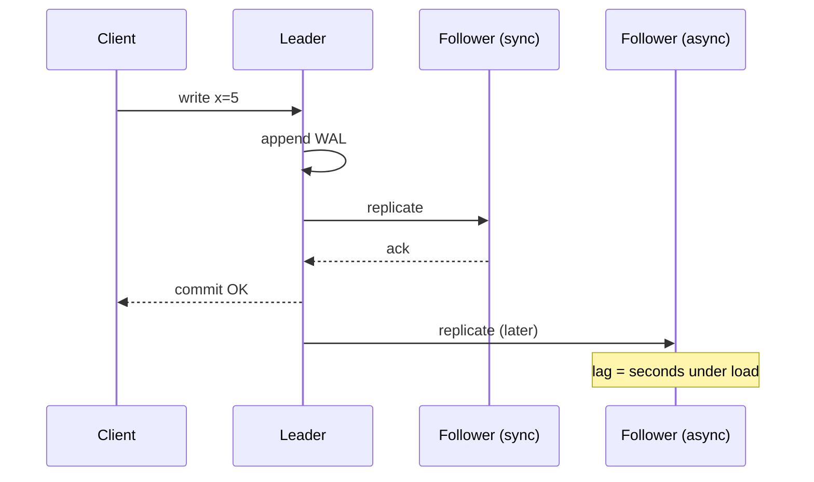

# Replication

!!! abstract "At a glance"
    **Priority:** P0 · **Complexity:** 3/5 · **Est. time:** 3 h · **Phase:** 2 · **Prereqs:** [Databases](databases-sql-nosql.md)
    **You're done when:** you can compare single-leader, multi-leader and leaderless replication, explain sync vs async vs semi-sync durability trade-offs with RPO numbers, handle replication lag anomalies (read-your-writes, monotonic reads), and describe safe failover including split-brain prevention.

## Why it matters

Replication is how systems get availability, read scale, and geographic proximity — and it is the source of most subtle data bugs: users not seeing their own writes, data "going back in time", lost writes after failover, split-brain with two primaries. Staff engineers must be able to state an explicit **RPO/RTO** for each data store, explain what happens to acknowledged writes during failover, and pick replication topologies consistent with product requirements.

AI systems replicate too: vector indexes replicated for read throughput, agent state/checkpoints that must survive failover mid-run, model artefacts replicated across regions, and embedding pipelines that are effectively asynchronous replication (source DB → vector index) with lag that users notice ("I uploaded the document but the assistant can't find it").

## Core concepts

### Topologies

| Topology | How writes work | Pros | Cons | Examples |
|---|---|---|---|---|
| **Single-leader** | All writes to leader; followers replay log | Simple, no write conflicts, easy reasoning | Leader is write bottleneck; failover complexity; cross-region write latency | Postgres, MySQL, MongoDB replica sets, Kafka partitions |
| **Multi-leader** | Writes accepted at several leaders; async exchange | Local writes in each region, offline clients | **Write conflicts** need resolution; hard to reason | Multi-region MySQL setups, CouchDB, collaborative editing, Cosmos DB multi-write |
| **Leaderless (Dynamo-style)** | Client/coordinator writes to N replicas, waits for W; reads R | High availability, no failover | Conflicts, sloppy quorums, read repair; weaker guarantees than they seem | Cassandra, ScyllaDB, Riak, DynamoDB (internally leader-based per partition) |
| **Consensus-based (Raft/Paxos)** | Leader commits when majority acknowledges | Strong consistency, automatic safe failover | Majority must be reachable; write latency = quorum RTT | etcd, CockroachDB, Spanner, TiKV, Kafka KRaft metadata |

### Synchronous vs asynchronous

| Mode | Durability on leader loss | Write latency | Availability risk |
|---|---|---|---|
| Async | Lose writes not yet replicated (RPO = replication lag, usually ms–s, can spike to minutes) | Lowest | None from followers |
| Sync (all) | No loss | Slowest follower RTT | Any follower down blocks writes |
| Semi-sync / quorum (1 of N or majority) | No loss if a sync replica survives | + one RTT to nearest replica | Tolerates some follower failures |

Postgres `synchronous_standby_names = 'ANY 1 (s1, s2)'` gives quorum commit; MySQL semi-sync has subtleties (falls back to async on timeout — a durability trap). Aurora writes to 6 copies across 3 AZs and needs 4/6 for writes: replication moved into the storage layer.

**Senior nuance:** "we have replicas" says nothing about RPO. Ask: *if the primary's disk vanishes right now, which acknowledged writes are lost?* With async replication the honest answer is "whatever was in flight — and during a lag spike, minutes of data".

### Replication lag anomalies and fixes

| Anomaly | Scenario | Fix |
|---|---|---|
| **Read-your-writes** violation | User updates profile, reload reads from lagging replica, sees old data | Read own recent writes from leader (for N seconds after write, or for "own" resources); track LSN/GTID and wait until replica catches up |
| **Monotonic reads** violation | Successive reads hit different replicas; data goes back in time | Pin user/session to one replica (hash user → replica) |
| **Consistent prefix** violation | Observer sees answer before question (causally related writes on different partitions) | Causal ordering; write related data to same partition; version vectors |

Lag-aware routing: many drivers/proxies can route reads to replicas below a lag threshold, or wait for a replica to reach a given LSN (`pg_last_wal_replay_lsn()`, MySQL `WAIT_FOR_EXECUTED_GTID_SET`).

### Failover

Steps: detect failure (timeouts — inherently ambiguous), choose new leader (most up-to-date replica), reconfigure clients, fence the old leader.

Failure modes:

- **Lost writes:** async follower promoted; old leader's unreplicated writes discarded (or conflict when it rejoins). GitHub's 2018 incident: a 43-second network partition caused cross-region failover and ~24 hours of degraded service while reconciling writes.
- **Split brain:** old leader didn't die, still accepts writes. Prevent with **fencing** (STONITH, fencing tokens, leases with epoch numbers — see [Consensus](consensus-raft.md)), and use a consensus-based coordinator (Patroni with etcd, orchestrator with Raft) rather than ad-hoc scripts.
- **Flapping:** too-aggressive timeouts cause failovers under load, which cause more load. Timeouts should be longer than typical GC/network hiccups; automate but rate-limit failovers.
- **Auto-increment/ID reuse** after losing writes can corrupt external references (GitHub 2012 MySQL incident with Redis keys referencing reused IDs).

### Conflict resolution (multi-leader / leaderless)

- **Last-write-wins (LWW)** by timestamp: simple, silently loses data, clock skew makes "last" arbitrary.
- **Version vectors / vector clocks**: detect concurrency; application merges siblings.
- **CRDTs**: data types that merge deterministically (counters, sets, sequences — Automerge, Yjs for collaborative editing).
- **Avoid conflicts**: route all writes for a given record to one "home" leader (e.g. per-user home region) — the most practical approach.

### Leaderless quorums

N replicas, write to W, read from R. If **W + R > N**, read and write sets overlap — but this is *not* linearisability: sloppy quorums, hinted handoff, concurrent writes, and partial failures break it. Typical: N=3, W=2, R=2. Anti-entropy via read repair and Merkle-tree comparisons.

### Change data capture as replication

Logical replication (Postgres logical decoding, MySQL binlog) → Debezium → Kafka → derived stores (search index, cache, vector DB, warehouse). This is asynchronous replication into heterogeneous systems — same lag and ordering concerns. For RAG freshness: embed-on-change pipelines with lag SLOs ("new document searchable within 2 minutes p95") and UI signals ("indexing…").

## Resources

| Resource | Type | Why this one | Level | Cost |
|---|---|---|---|---|
| [DDIA 2e — Replication chapter](https://martin.kleppmann.com/2026/03/24/designing-data-intensive-applications-2e.html) | book | Best single treatment of topologies, lag anomalies and quorums | advanced | paid |
| [Kleppmann — Distributed Systems lectures (Cambridge)](https://www.youtube.com/playlist?list=PLeKd45zvjcDFUEv_ohr_HdUFe97RItdiB) | video | Replication, quorums and broadcast explained clearly with diagrams | intermediate | free |
| [Patterns of Distributed Systems (Unmesh Joshi)](https://martinfowler.com/articles/patterns-of-distributed-systems/) :gem: | article | Leader-follower, high-water mark, generation clock as implementable patterns | advanced | free |
| [GitHub — October 21 post-incident analysis](https://github.blog/2018-10-30-oct21-post-incident-analysis/) :gem: | article | A real cross-region failover with lost writes; the best case study on why automated failover is hard | advanced | free |
| [Amazon Aurora design paper](https://www.amazon.science/publications/amazon-aurora-design-considerations-for-high-throughput-cloud-native-relational-databases) | paper | Quorum replication pushed into storage (4/6 writes) | advanced | free |
| [Dynamo paper (SOSP 2007)](https://www.allthingsdistributed.com/files/amazon-dynamo-sosp2007.pdf) | paper | Leaderless replication, sloppy quorums, vector clocks — origin of the style | advanced | free |
| [PostgreSQL — High availability, load balancing & replication](https://www.postgresql.org/docs/current/high-availability.html) | docs | Streaming, synchronous and logical replication options concretely | intermediate | free |
| [Jepsen analyses](https://jepsen.io/analyses) | article | What replicated databases actually do during partitions | advanced | free |

## Hands-on lab

**Goal:** observe lag, read-your-writes violations, and failover data loss (90 min).

1. docker-compose a Postgres primary + two streaming replicas (e.g. Bitnami images or Patroni + etcd for bonus).
2. Write a Python script: update a row on primary, immediately read from a replica, count stale reads over 10k iterations. Add artificial latency to one replica with `tc netem` (or `pg_sleep`-heavy load) to magnify lag.
3. Implement read-your-writes: after a write, capture `pg_current_wal_lsn()`; before reading from a replica, poll `pg_last_wal_replay_lsn()` until ≥ that LSN (with timeout → fall back to primary).
4. Failover: with async replicas, run inserts at high rate, kill the primary (`docker kill`), promote a replica, and count acknowledged-but-missing rows. Repeat with `synchronous_standby_names='ANY 1 (...)'`.
5. **Expected output:** stale reads in a small percentage of iterations; zero stale reads with LSN waiting; non-zero lost writes with async failover, zero with quorum sync (at higher write latency — record it).

## Questions

### L1 — Recall

??? question "Q1. What is the RPO of asynchronous replication?"
    ??? success "Answer"
        Equal to the replication lag at the moment of failure — usually milliseconds to seconds, but unbounded under load, network issues or long-running replays. Any write acknowledged by the leader but not yet received by the promoted follower is lost.

??? question "Q2. Define read-your-writes and monotonic reads."
    ??? success "Answer"
        Read-your-writes: after a user writes, their subsequent reads reflect that write (not necessarily others'). Monotonic reads: a user never sees data move backwards in time across successive reads (e.g. by reading from a more-lagged replica after a less-lagged one).

??? question "Q3. Why doesn't W + R > N give linearisability in Dynamo-style systems?"
    ??? success "Answer"
        Sloppy quorums may write to nodes outside the preference list; concurrent writes can be resolved by LWW with clock skew; a write that failed on some replicas may still be visible on others (no rollback); read repair timing means a later read can see an older value than an earlier read. Overlap guarantees at least one replica with the latest *acknowledged* value, not a single global order.

??? question "Q4. What is split brain and how is it prevented?"
    ??? success "Answer"
        Two nodes both believe they are leader and accept writes, diverging data. Prevent with a consensus-based leader election (majority quorum), leases with epochs, and fencing: the storage or downstream systems reject writes carrying an older epoch/fencing token; or STONITH (power off the old leader).

### L2 — Apply

??? question "Q5. Users complain that after posting a comment, it sometimes disappears on refresh. Diagnose and propose two fixes with trade-offs."
    ??? success "Answer"
        Reads are served by async replicas lagging the leader → read-your-writes violation. Fix 1: route the author's reads of that thread to the leader for ~N seconds after writing (simple; adds leader load; N must exceed typical lag). Fix 2: return the write's LSN/version to the client (cookie), and have the read path pick a replica caught up to that LSN or wait/fall back (precise; more complexity). Fix 3 (UI): optimistic rendering of the user's own comment client-side. Combine 3 with 1 or 2.

??? question "Q6. Choose replication settings for a payments ledger on Postgres in one region, 3 AZs."
    ??? success "Answer"
        Primary in AZ-a, synchronous quorum replicas in AZ-b and AZ-c with `ANY 1 (b, c)` so commit requires one other AZ — RPO 0 for single-AZ loss while tolerating one replica down. Use Patroni (or managed service equivalent) with etcd for leader election and fencing; only promote a synchronous replica. Add an async cross-region replica for DR (RPO seconds) plus WAL archiving/PITR for logical corruption (replication faithfully copies bad writes). Accept ~1–2 ms added commit latency.

??? question "Q7. A RAG assistant can't find a document uploaded 30 seconds ago. Frame this as a replication problem and design the fix."
    ??? success "Answer"
        The vector index is an asynchronously replicated derived store (upload → queue → chunk → embed → index). Lag = queue wait + embedding latency + index refresh. Fix: define a freshness SLO (e.g. p95 < 60 s) and monitor pipeline lag; prioritise interactive uploads over bulk backfills (separate queues); show indexing status in the UI; for immediate use, include the just-uploaded document directly in context (read-your-writes by bypassing the index for the uploader's own recent docs); make indexing idempotent keyed by document version.

### L3 — Design & trade-offs

??? question "Q8. Multi-leader across regions vs single-leader with cross-region reads for a global SaaS app — decide."
    ??? success "Answer"
        Multi-leader gives local write latency everywhere but introduces write conflicts, complex resolution and hard-to-test behaviour. Single-leader keeps correctness simple; remote users pay ~100–200 ms on writes; reads can be local (with lag). Middle ground: **partitioned home-region leadership** — each tenant/user has a home region that leads their data (single leader per partition, located near the user), which avoids conflicts and gives local writes for most users. Choose multi-leader only for data types with natural merge semantics (CRDT-friendly: presence, counters, collaborative docs) or offline-first clients.

??? question "Q9. Automatic vs manual failover for the primary database — what would you choose?"
    ??? success "Answer"
        Automatic failover reduces RTO from tens of minutes to seconds–a minute, but risks false positives (flapping under load), split brain if fencing is weak, and data loss if async replicas are promoted. Manual failover gives human judgement but slow RTO and 3 a.m. errors. Recommendation: automatic within a region using consensus-based tooling (Patroni/etcd or managed service), promoting only synchronous replicas, with conservative detection timeouts and failover rate limits; **manual (or human-approved) cross-region failover**, since cross-region promotion usually involves data loss and application-level implications. Test both regularly.

??? question "Q10. When is LWW acceptable for conflict resolution?"
    ??? success "Answer"
        When losing concurrent updates is harmless and the data is effectively overwrite-only: caches, last-known location/status pings, user preferences where the latest intention wins, idempotent state snapshots. Not acceptable for counters, carts, collaborative content, financial data, or anything where concurrent updates both carry intent. Also only acceptable if clock skew is bounded and small relative to update frequency, or you use hybrid logical clocks.

### L4 — Staff-level ambiguity

??? question "Q11. An audit reveals no team can state the RPO/RTO of their data stores. Design a programme to fix it."
    ??? success "Answer"
        (1) Define data tiers with target RPO/RTO (e.g. Tier 0 ledger: RPO 0, RTO 15 min; Tier 1 business: RPO 1 min, RTO 1 h; Tier 2 derived: rebuildable). (2) Each team classifies stores, documents replication mode and backup/PITR, and states current measured RPO/RTO. (3) Platform provides paved-road configs per tier (sync quorum, cross-region replica, backups with restore tests). (4) Verification: quarterly restore drills and failover game days with measured results; automated checks (replication lag alerts, backup freshness). (5) Report a dashboard to leadership: stores meeting tier targets. Tie to incident reviews. The key cultural shift: RPO/RTO are *measured*, not assumed.

??? question "Q12. Product wants 'active-active in two regions' for the order service to hit 99.99%. The team proposes multi-leader Postgres. Respond."
    ??? success "Answer"
        Clarify the goal: availability during region loss, latency, or both. Multi-leader Postgres for orders risks conflicts (double-booked inventory, lost updates) and complex operations for modest gain. Alternatives: (a) active-passive with fast, rehearsed failover (RTO minutes) — maybe enough if 99.99% is measured monthly (4.3 min) but region loss is rare; (b) **partitioned active-active**: orders homed by region/customer with single leadership per partition, cross-region async replicas for failover; (c) distributed SQL with regional quorum for strong consistency at higher write latency. Present cost/complexity/risk for each against the actual SLO math, including dependencies (a 99.99% order service on a 99.9% payment provider doesn't reach 99.99%). Recommend (b) and record in an ADR; see [Multi-region, DR & failover](multi-region-dr.md).

## Real-world use cases

- **GitHub 2018:** cross-region MySQL failover after a brief partition; writes on both sides took ~24 hours to reconcile.
- **Aurora:** 6-way storage replication, 4/6 write quorum, 3/6 read quorum; survives AZ + 1 failure.
- **Collaborative editors (Figma, Google Docs, Yjs):** multi-leader with custom or CRDT merges.
- **Logistics:** booking DB single-leader with sync standby; tracking events multi-region via Kafka replication; derived search/vector indexes rebuilt via CDC.

## Pitfalls & anti-patterns

- Claiming "no data loss" with async replicas.
- Reading from replicas without handling read-your-writes.
- Hand-rolled failover scripts without fencing.
- Treating replication as backup: replicas copy `DROP TABLE` instantly; you still need PITR.
- MySQL semi-sync silently degrading to async.
- LWW on data where both concurrent writes matter.

## Checklist

- [ ] I can compare the four topologies and their failure modes
- [ ] I can state RPO for sync/async/quorum configurations
- [ ] I reproduced replica lag and failover data loss
- [ ] I can design read-your-writes with LSN tracking
- [ ] I answered all L3 questions out loud in < 3 min each
