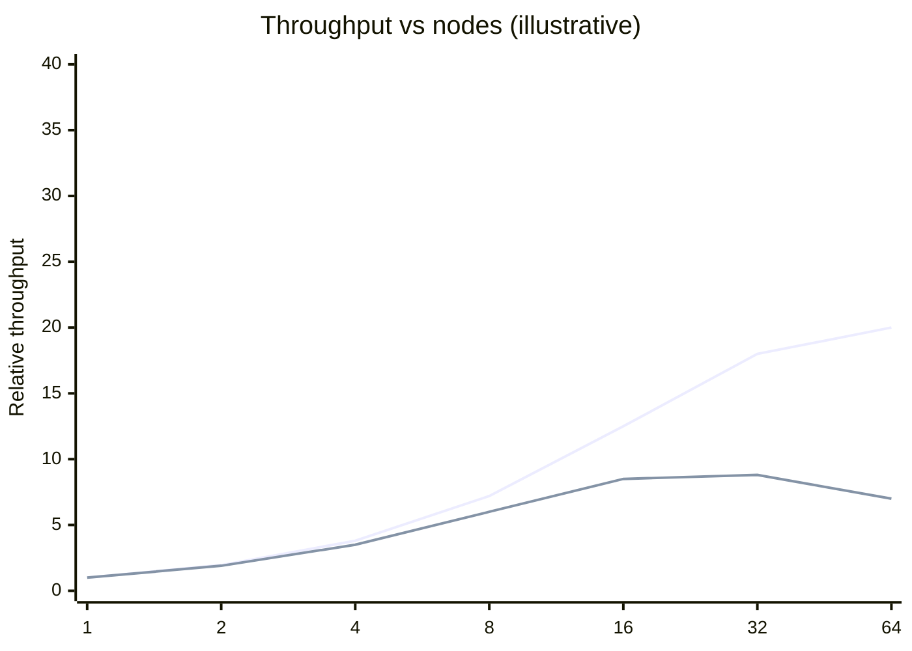

# Scalability fundamentals & latency numbers

!!! abstract "At a glance"
    **Priority:** P0 · **Complexity:** 2/5 · **Est. time:** 3 h · **Phase:** 1 · **Prereqs:** none
    **You're done when:** you can explain Little's Law, Amdahl/USL and tail-latency amplification with numbers, and predict where a given system will saturate first (CPU, memory, disk, network, locks, or a downstream dependency).

## Why it matters

"Scalability" is the most abused word in design reviews. At Staff level you must be precise: *which dimension* (throughput, data size, tenants, geography, team count), *which resource saturates first*, and *what the cost curve looks like past that point*. You also need an intuition for latency at every layer — nanoseconds in cache, microseconds in the datacenter, milliseconds across regions — because almost every design argument ("add a cache", "call it synchronously", "put it in another region") is really a latency-budget argument.

AI systems make this sharper. An LLM call is a 500 ms–30 s dependency with its own queueing behaviour, a hard concurrency ceiling (provider rate limits or GPU KV-cache memory), and heavy-tailed latency driven by output length. Treating it like a 5 ms RPC produces thread-pool exhaustion, timeouts and cascading failures.

## Core concepts

### Latency numbers (orders of magnitude, 2026 hardware)

| Operation | Approx. latency | Mental model |
|---|---|---|
| L1 cache reference | ~1 ns | free |
| Main memory reference | ~100 ns | 100× L1 |
| Compress 1 KB (fast codec) | ~1–2 µs | |
| Read 1 MB sequentially from memory | ~10–50 µs | memory bandwidth tens of GB/s |
| NVMe SSD random read (4 KB) | ~20–100 µs | ~100k–1M IOPS per device |
| Round trip within same AZ | ~100–500 µs | |
| Redis GET (same AZ, incl. network) | ~0.2–1 ms | network dominates |
| Cross-AZ round trip | ~0.5–2 ms | |
| Postgres indexed point read (warm) | ~0.5–2 ms | |
| Read 1 MB from network (10 Gbps) | ~1 ms | |
| HDD seek | ~5–10 ms | avoid for random access |
| Cross-region round trip (e.g. EU↔US East) | ~70–100 ms | speed of light in fibre ≈ 200 km/ms |
| LLM TTFT (hosted, short prompt) | ~200 ms–1 s | queueing + prefill |
| LLM full response (500 tokens) | ~3–15 s | TPOT × tokens |

Two rules fall out: **anything crossing a network costs ~1000× a memory access**, and **anything crossing a region costs ~100× a same-AZ call**. Chatty service designs die by a thousand round trips.

### Throughput, latency and Little's Law

**Little's Law:** `L = λ × W` — concurrent requests in the system = arrival rate × time in system. It is distribution-free and brutally useful:

- 2,000 RPS × 50 ms = 100 concurrent requests → a thread pool of 100 is saturated with zero headroom.
- An LLM endpoint at 20 RPS with 8 s average latency needs **160 concurrent streams**. If your provider limit or GPU batch capacity is 100, requests queue and latency climbs without bound.

**Utilisation and queueing:** for a simple M/M/1 queue, waiting time ∝ ρ/(1−ρ). At 50% utilisation waiting ≈ 1× service time; at 80% ≈ 4×; at 90% ≈ 9×; at 95% ≈ 19×. This is why **you plan for ~60–70% steady-state utilisation** on latency-sensitive tiers and why "we're only at 85% CPU" is not reassuring.

### Why scaling isn't linear: Amdahl and USL

- **Amdahl's Law:** speed-up is capped by the serial fraction. 5% serial → max 20× regardless of cores.
- **Universal Scalability Law (Gunther):** adds a *coherency* term (cost of nodes coordinating — cache invalidation, locks, consensus, cross-shard queries). With coherency > 0, throughput **peaks and then declines** as you add nodes. This is the mathematical form of "adding servers made it slower".

Upper line: contention only (Amdahl-like plateau). Lower line: contention + coherency (USL retrograde). Your job is to find the coherency cost in a design — global locks, a single sequencer, cross-partition transactions, fan-out queries — and remove it.

### Vertical vs horizontal, stateless vs stateful

| Dimension | Vertical (scale up) | Horizontal (scale out) |
|---|---|---|
| Complexity | Low; no distribution | High; partitioning, coordination, rebalancing |
| Ceiling | Largest instance (hundreds of cores, TBs RAM in 2026) | Theoretically unbounded |
| Failure blast radius | Whole service | Fraction (if well partitioned) |
| Cost curve | Superlinear at top end | Roughly linear + coordination overhead |
| When | Databases, until it hurts; early stage | Stateless tiers always; data tier when growth demands |

Senior nuance: **modern single machines are huge**. A well-tuned Postgres on a big instance handles more than most companies ever need; many "we need to shard" decisions are really "we need an index, a read replica, and to stop N+1 queries". Scale the stateless tier horizontally from day one (it's cheap), scale the stateful tier vertically as long as you can, and design the *data model* so that partitioning is possible later (a natural partition key exists).

### Tail latency and fan-out

If a request fans out to N backends and each has probability p of being slow (above its p99), the chance the whole request is slow is `1 − (1−p)^N`. With p = 1% and N = 100, **63%** of user requests hit at least one slow backend. This is the core argument of Dean & Barroso's *The Tail at Scale*. Mitigations:

- **Hedged requests:** send a second request after the p95 latency elapses; take the first answer (cost: ~5% extra load).
- **Tied requests / cancellation:** enqueue on two servers, cancel the loser.
- **Micro-partitioning and selective replication** of hot items.
- **Reduce fan-out** (denormalise, precompute, scatter-gather only on a subset).
- **Latency-aware load balancing** (least-outstanding-requests, P2C — see [Load balancing](load-balancing.md)).

LLM angle: **agentic workflows are fan-out in time**. An agent that makes 8 sequential LLM calls with p99 of 10 s each has an awful end-to-end tail. Parallelise independent tool calls, use smaller/faster models for routing steps, stream partial results, and set per-step and per-run deadlines.

### Measuring properly

- Report **percentiles** (p50/p95/p99/p99.9), never averages, and never average percentiles across hosts (merge histograms instead — HDR or t-digest/DDSketch).
- Beware **coordinated omission**: closed-loop load generators stop sending when the system stalls, hiding the worst latency. Use open-loop (constant arrival rate) tools like `wrk2`, `k6` with arrival-rate executors, or Vegeta.
- **USE method** (Utilisation, Saturation, Errors) for every resource; **RED** (Rate, Errors, Duration) for every service.

## Resources

| Resource | Type | Why this one | Level | Cost |
|---|---|---|---|---|
| [Interactive latency numbers (Colin Scott)](https://colin-scott.github.io/personal_website/research/interactive_latency.html) :gem: | interactive | Shows how the classic numbers evolved by year — builds intuition about which ones changed | intermediate | free |
| [The Tail at Scale (Dean & Barroso)](https://research.google/pubs/the-tail-at-scale/) | paper | The foundational argument for hedging and why fan-out makes tails dominate | advanced | free |
| [Napkin Math](https://github.com/sirupsen/napkin-math) :gem: | docs | Measured numbers on modern hardware plus exercises | advanced | free |
| [Gil Tene — How NOT to measure latency (InfoQ)](https://www.infoq.com/presentations/latency-response-time/) | video | Coordinated omission and percentile pitfalls; changes how you read every dashboard | advanced | free |
| [USE method (Brendan Gregg)](https://www.brendangregg.com/usemethod.html) | article | Systematic resource bottleneck analysis | intermediate | free |
| [Systems Performance 2e (Brendan Gregg)](https://www.brendangregg.com/systems-performance-2nd-edition-book.html) | book | The reference for where time actually goes in a machine | advanced | paid |
| [Marc Brooker's blog](https://brooker.co.za/blog/) :gem: | article | Short, rigorous essays on queueing, scale and tail latency from an AWS distinguished engineer | advanced | free |
| [Designing Data-Intensive Applications 2e](https://martin.kleppmann.com/2026/03/24/designing-data-intensive-applications-2e.html) | book | Ch. 1–2 frame reliability/scalability/maintainability with modern examples (2e, 2026) | intermediate | paid |

## Hands-on lab

**Goal:** see queueing theory and coordinated omission with your own eyes (60–90 min).

1. Write a tiny FastAPI endpoint that sleeps a random time from a log-normal distribution (median 20 ms, p99 ~200 ms). Run with a fixed worker count (e.g. `uvicorn --workers 1` with a semaphore of 20 concurrent requests).
2. Load test with `k6` using `constant-arrival-rate` at 200, 500, 800, 950 RPS. Record p50/p99.
3. Repeat with a closed-loop executor (`constant-vus`) and compare p99 — observe how closed-loop hides stalls.
4. Compute Little's Law: at each rate, predicted concurrency = RPS × mean latency. Note where it crosses 20 (your concurrency cap) — latency should explode right there.
5. Add a fan-out endpoint that calls the slow endpoint 10× in parallel and returns when all complete; measure its p99 versus a single call. Then add hedging (second call after 50 ms) and re-measure.
6. **Expected output:** p99 roughly flat until ~70% of capacity then a knee; closed-loop p99 noticeably lower than open-loop at high load; fan-out p99 ≈ single-call p99.9; hedging cuts fan-out p99 substantially for ~5–10% extra calls.

## Questions

### L1 — Recall

??? question "Q1. State Little's Law and give one design use."
    ??? success "Answer"
        L = λW: average number in system = arrival rate × average time in system. Use: size thread/connection pools and concurrency limits. 500 RPS × 200 ms = 100 concurrent requests, so a DB pool of 20 connections with 200 ms queries caps you at 100 RPS. Also applies to queues: backlog = arrival rate × wait time.

??? question "Q2. Roughly how much slower is a cross-region round trip than a same-AZ round trip, and why can't engineering fix it?"
    ??? success "Answer"
        ~100× (≈0.5 ms vs ≈70–150 ms). Light in fibre travels ~200 km/ms; London–Virginia is ~6,000 km → ~30 ms one way minimum, ~60 ms RTT before routing and processing. Physics caps it; the only fixes are fewer round trips (batching, async replication, edge termination) or moving data closer.

??? question "Q3. What is coordinated omission?"
    ??? success "Answer"
        A measurement bias where the load generator waits for a response before sending the next request; when the system stalls, the generator stops issuing requests, so the stall is recorded as one slow sample instead of the many requests that *would* have arrived and waited. Results understate tail latency, sometimes by orders of magnitude. Fix with open-loop, constant-arrival-rate load generators and latency measured from intended send time.

??? question "Q4. What does the Universal Scalability Law add over Amdahl's Law?"
    ??? success "Answer"
        A coherency/crosstalk term (β) representing the pairwise cost of keeping nodes consistent (cache coherence, locking, distributed coordination). With β > 0 throughput reaches a maximum and then **decreases** as nodes are added, whereas Amdahl only predicts a plateau.

### L2 — Apply

??? question "Q5. A service has 16 worker threads, each request does one 40 ms DB call plus 10 ms CPU. What's max throughput, and what happens at 90% of it?"
    ??? success "Answer"
        Each request occupies a thread for ~50 ms → 20 req/s per thread → 320 RPS max. At ~290 RPS (90%), queueing theory predicts waiting ≈ 9× service time, so latency goes from ~50 ms to ~500 ms average and far worse at p99. Options: async I/O so threads aren't held during DB waits (then the DB pool becomes the limit), more workers, or reduce DB time. Plan capacity for ≤70% utilisation.

??? question "Q6. A page makes 40 parallel backend calls, each with p99 = 80 ms, p50 = 10 ms. What's the page's approximate p99, and what would you do?"
    ??? success "Answer"
        P(at least one call > 80 ms) = 1 − 0.99^40 ≈ 33%, so the page's p67 is already ~80 ms and its p99 is dominated by the backends' p99.9+. Actions: reduce fan-out (aggregate/denormalise, a BFF that batches), hedge requests after ~p95 (e.g. 30 ms), set per-call timeouts with graceful degradation (render without the slow widget), and fix the backend's tail (GC pauses, noisy neighbours).

??? question "Q7. Your LLM provider allows 400 concurrent requests. Average response time is 6 s with a p99 of 25 s. What sustained RPS can you support, and how would you protect the service?"
    ??? success "Answer"
        Little: λ = L/W = 400/6 ≈ 66 RPS on average — but long responses hold slots, so a burst of long generations can exhaust capacity; plan for ~70% → ~45 RPS. Protect with: a client-side concurrency limiter (semaphore) per model/deployment; queue with a bounded size and a deadline; `max_tokens` caps; routing overflow to a secondary deployment/region or smaller model; streaming so users see progress; per-tenant fair-share so one tenant can't monopolise slots.

### L3 — Design & trade-offs

??? question "Q8. The team wants to shard Postgres because p99 is 800 ms at 3k QPS. What do you investigate first, and when is sharding actually justified?"
    ??? success "Answer"
        First: query plans (missing indexes, seq scans), N+1 patterns, lock contention (long transactions, hot rows), connection storms (use PgBouncer), vacuum/bloat, checkpoint I/O spikes, and whether reads can go to replicas or a cache. 3k QPS is small for a well-tuned Postgres. Sharding is justified when: write throughput or working set exceeds the largest practical instance, storage growth outpaces vertical headroom, or blast-radius/tenant-isolation requirements demand it. Even then consider partitioning within one instance, or Citus/Aurora-style options before app-level sharding — sharding costs cross-shard queries, rebalancing, and operational complexity forever.

??? question "Q9. Scale up or scale out for a new vector search service holding 50M 1024-dim embeddings?"
    ??? success "Answer"
        50M × 1024 × 4 bytes ≈ 200 GB raw float32, plus HNSW graph overhead (~1.2–1.5×) → ~250–300 GB in RAM. That fits on one large memory-optimised instance, or much less with quantisation (int8 ≈ 50 GB; binary + rescoring ≈ 6–7 GB + originals on disk). Start scaled up with replicas for read throughput and availability; scale out (sharding) only when data or write rate exceeds one node or you need tenant isolation. Horizontal sharding of ANN indexes hurts recall/latency (scatter-gather, per-shard top-k), so defer it. Also consider disk-based indexes (DiskANN-style) for cost.

??? question "Q10. Why do agentic workflows have much worse tail latency than single LLM calls, and how do you design around it?"
    ??? success "Answer"
        Sequential steps sum latencies, and each step's latency is heavy-tailed (variable output length, provider queueing, tool calls to slow systems); p99 of the sum is roughly driven by the worst step's tail at each position. Plus retries on malformed outputs. Design: parallelise independent tool calls, use small fast models for classification/routing steps, cap steps and tokens per step, stream intermediate progress, set a run-level deadline with partial answers, cache deterministic tool results, and move long-running tasks to async (job + notification) instead of synchronous request/response. See [Durable execution & human-in-the-loop](../agentic-ai/durable-execution-hitl.md).

### L4 — Staff-level ambiguity

??? question "Q11. Leadership wants the platform to 'scale 10× next year'. How do you turn that into an actionable plan?"
    ??? success "Answer"
        Decompose "10×" into dimensions: traffic (RPS), data volume, tenants, regions, features, and headcount/teams. Get the growth model from product/finance (10× what, by when, with what peak shape). For each tier, identify the first saturating resource via load tests and USE analysis at 2×/5×/10× synthetic load, plus cost curves. Output a ranked list: "at 3× the orders DB write rate saturates; at 5× the search cluster; at 8× cross-AZ egress cost exceeds budget". Pair each with a fix, lead time and owner, and schedule so fixes land before the forecast crossing point with margin. Also identify organisational scaling limits (a shared team that becomes a bottleneck). Revisit quarterly with real growth data.

??? question "Q12. Two teams argue: one wants synchronous calls to an LLM-based classifier in the checkout path; the other wants async. The business wants fraud caught before payment. Decide."
    ??? success "Answer"
        Quantify: checkout p99 budget (say 1.5 s), classifier latency (p50 400 ms, p99 4 s), availability of the provider (99.9% → ~43 min/month of failures), and cost of false negatives vs lost conversions. A synchronous hard dependency with a 4 s tail and third-party availability is unacceptable in the checkout critical path. Compromise design: synchronous *fast path* using a cheap deterministic/ML risk score (ms), with a strict timeout (e.g. 300 ms) on an LLM check only for the risky segment; if the LLM times out, fall back to rules + hold high-risk orders for async review before fulfilment (payment authorised but not captured). This preserves conversion, bounds latency, and still catches fraud before money moves. Document it as an ADR with the SLO and fallback behaviour.

## Real-world use cases

- **Google search:** hedged and tied requests to control tail latency across thousands of leaf servers.
- **Shipment tracking portal:** a BFF aggregates 12 backend calls (ETA, customs, vessel position); fan-out tail forced parallelisation, per-widget timeouts and cached fallbacks.
- **LLM gateway:** Little's Law determines concurrency limits per model deployment; queues with deadlines prevent GPU/provider saturation from cascading.
- **Discord/Slack-style chat:** vertical scaling of hot components (single big nodes) coexists with horizontal scaling of stateless gateways.

## Pitfalls & anti-patterns

- Reporting average latency or averaging p99s across hosts.
- Running at 90% utilisation "because it's efficient" on a latency-sensitive tier.
- Load testing with closed-loop tools and declaring victory.
- Sharding before exhausting indexes, caching, replicas and vertical headroom.
- Chatty microservices crossing AZs or regions dozens of times per request.
- Treating LLM calls as fast RPCs: no concurrency limits, no deadlines, no streaming.

## Checklist

- [ ] I can explain Little's Law, M/M/1 knee, Amdahl and USL with numbers
- [ ] I know the latency table to the right order of magnitude without notes
- [ ] I ran the k6 lab and saw the utilisation knee and coordinated omission
- [ ] I can compute fan-out tail probability and name three mitigations
- [ ] I answered all L3 questions out loud in < 3 min each
