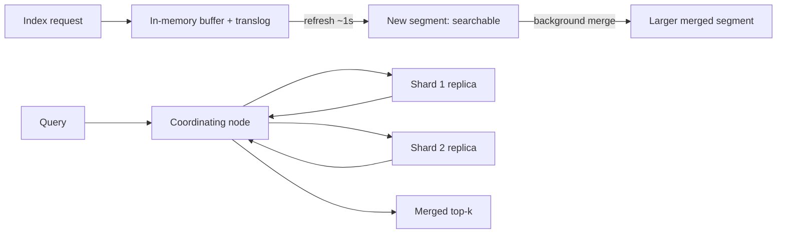

# Search systems & inverted indexes

!!! abstract "At a glance"
    **Priority:** P1 · **Complexity:** 3/5 · **Est. time:** 3 h · **Phase:** 2 · **Prereqs:** [Databases](databases-sql-nosql.md), [Partitioning](partitioning-sharding.md)
    **You're done when:** you can explain inverted indexes, BM25 and Lucene segments, design a sharded search cluster with an indexing pipeline and freshness SLO, and argue hybrid (lexical + vector) retrieval with rank fusion and reranking for an AI application.

## Why it matters

Search is a distinct workload from OLTP: read-heavy, relevance-driven, denormalised, approximate, and eventually consistent with the source of truth. Staff engineers must know when a database `LIKE`/full-text index is enough, when a search engine is justified, and how to run one (shard sizing, reindexing, relevance evaluation) without it becoming a fragile snowflake.

In 2026 search is the retrieval layer of nearly every AI product. The mainstream RAG default is **hybrid retrieval (BM25 + dense vectors + metadata filters) with a cross-encoder reranker**, because lexical search wins on exact terms (IDs, part numbers, acronyms) and dense search wins on paraphrase. Understanding classic IR makes you far better at RAG than knowing only embeddings.

## Core concepts

### Inverted index

Forward index: document → terms. **Inverted index: term → postings list** (sorted doc IDs, optionally with term frequencies, positions, offsets). Query = fetch postings for each term and intersect/union (skip lists, block-max WAND for fast top-k).

Pipeline at index time: **analysis** = character filters → tokenizer → token filters (lowercase, stop words, stemming/lemmatisation, synonyms, n-grams for autocomplete). Query time must use compatible analysis. Most "search doesn't find X" bugs are analyzer mismatches.

### Relevance: TF-IDF → BM25

BM25 scores a term by saturating term frequency (diminishing returns for repeats, parameter k1 ≈ 1.2) and normalising by document length (b ≈ 0.75), weighted by inverse document frequency (rare terms matter more). It's the strong baseline that still beats many neural models out-of-domain (BEIR benchmark). Field boosts (title^3), phrase/proximity queries and recency/popularity signals sit on top.

### Lucene architecture (Elasticsearch/OpenSearch/Solr)

- **Segments are immutable.** Updates = delete marker + reindex; deletes are reclaimed at merge. Near-real-time: a `refresh` (default 1 s) makes new segments searchable; `flush`/translog gives durability.
- **Sharding:** an index is split into primary shards (fixed at creation — reindex/split to change) each with replicas. A query fans out to one copy of each shard, each returns local top-k, the coordinator merges (scatter-gather → tail latency; see [Scalability fundamentals](scalability-fundamentals.md)).
- **Sizing rules of thumb:** shards of ~10–50 GB; avoid thousands of tiny shards (per-shard overhead in heap); keep replicas ≥ 1 for availability and read scaling; more shards ≠ faster for small indices.
- **Distributed scoring caveat:** IDF is computed per shard by default, so tiny or skewed shards give inconsistent scores (DFS query mode fixes at a cost).
- **Deep pagination** is expensive (`from+size` × shards); use `search_after` or PIT for deep cursors.
- **Mappings and reindexing:** changing analyzers or field types requires reindex; use aliases and blue/green index versions (`products_v7` behind `products`).

### Architecture: search as a derived store

Never make the search engine the system of record. Feed it from the source of truth via **CDC or outbox → queue → indexer** (see [Messaging](messaging-streaming.md), [Batch & stream data pipelines](data-pipelines.md)):

- Indexer is idempotent, version-aware (`external_gte` versioning) so out-of-order events don't regress documents.
- Full reindex path (backfill) must exist and be routinely exercised (schema changes, analyzer changes, corruption).
- **Freshness SLO** (e.g. p95 < 5 s from commit to searchable) measured end-to-end, with lag alerts.
- Handle deletes and permission changes promptly (security implications).
- Bulk indexing tuning: batches of 5–15 MB, disable refresh during backfills, replicas=0 during initial load.

### Query understanding and ranking

- Layers: query parsing/spell-correct/synonyms → retrieval (recall, cheap) → ranking (precision, expensive: learning-to-rank or cross-encoder on top ~100–1000 candidates) → business rules.
- **Evaluate relevance offline** with judged query sets (NDCG@10, MRR, recall@k) and online with A/B tests; without evaluation, relevance tuning is superstition. The same discipline is central to RAG evals.
- Autocomplete: edge n-grams or completion suggesters/FSTs with popularity weighting; latency budget ≤ 50 ms.
- Faceting/aggregations use doc values (columnar) — memory and cardinality cost.

### Semantic and hybrid search

- **Dense retrieval:** embed docs and queries; ANN index (HNSW, IVF-PQ, DiskANN). Handles synonyms and paraphrase; weak on rare tokens, exact codes, negation and out-of-domain text.
- **Sparse learned (SPLADE) / late interaction (ColBERT):** intermediate options with strong quality and higher index cost.
- **Hybrid:** run BM25 and vector search in parallel, fuse. **Reciprocal Rank Fusion (RRF):** score = Σ 1/(k + rank_i), k≈60; robust because it needs no score calibration. Alternative: weighted normalised scores.
- **Reranking:** cross-encoder (or LLM listwise) rescoring of the top 50–200 fused candidates; typically the highest-ROI quality upgrade, at 50–300 ms added latency.
- **Filtering:** pre-filter vs post-filter vs filtered HNSW; selective filters + post-filtering kills recall (see [Databases](databases-sql-nosql.md) on pgvector iterative scans).
- Engines: Elasticsearch/OpenSearch (BM25 + kNN + RRF), Vespa, Postgres (FTS + pgvector), Qdrant/Weaviate (hybrid), Azure AI Search, turbopuffer (object-storage-native BM25+vector). Pick by operational fit and scale; for < 10M documents Postgres FTS + pgvector is often enough.
- See [Hybrid search & reranking](../agentic-ai/hybrid-search-reranking.md) and [AI-powered semantic search](../ai-system-design/ai-search.md).

### Failure modes

- **Mapping explosion** (dynamic fields with unbounded keys) → heap exhaustion.
- **Hot shards** (routing by tenant with a giant tenant), **oversharding**, GC pauses from big aggregations, expensive wildcard/regex queries.
- **Split brain / red cluster** during master election problems (modern ES uses a Raft-like coordination layer).
- **Divergence** from the source of truth (missed events) → periodic reconciliation jobs comparing counts/checksums.
- **Relevance regressions** after analyzer changes — gate reindexes with offline eval.

## Resources

| Resource | Type | Why this one | Level | Cost |
|---|---|---|---|---|
| [Introduction to Information Retrieval (Manning et al.)](https://nlp.stanford.edu/IR-book/) | book | Free, definitive text on inverted indexes, scoring, evaluation | advanced | free |
| [Doug Turnbull — softwaredoug](https://softwaredoug.com/) :gem: | article | Practical relevance engineering, hybrid search, evaluation; from a search practitioner | advanced | free |
| [Elastic — Practical BM25 part 2](https://www.elastic.co/blog/practical-bm25-part-2-the-bm25-algorithm-and-its-variables) | article | Clearest explanation of BM25 parameters and behaviour | intermediate | free |
| [OpenSearch documentation](https://opensearch.org/docs/latest/) | docs | Sharding, hybrid search, neural search pipelines, RRF | intermediate | free |
| [Pinecone — Rerankers and two-stage retrieval](https://www.pinecone.io/learn/series/rag/rerankers/) | article | Why and how to rerank; concrete latency/quality trade-offs | intermediate | free |
| [turbopuffer blog](https://turbopuffer.com/blog) :gem: | article | Object-storage-native search/vector architecture and cost analysis | advanced | free |
| [pgvector](https://github.com/pgvector/pgvector) | docs | Vector search inside Postgres; combine with FTS for hybrid | intermediate | free |
| [Qdrant documentation](https://qdrant.tech/documentation/) | docs | Hybrid queries, filtering, quantisation in a dedicated engine | intermediate | free |

## Hands-on lab

**Goal:** build and evaluate hybrid search on a real corpus (2 h).

1. Take ~50k documents (e.g. Wikipedia subset, or your own docs). Load into Postgres with `tsvector` FTS (GIN) and pgvector embeddings (a small local embedding model via Ollama or sentence-transformers). Alternative: OpenSearch in Docker.
2. Create 40 judged queries (mix: exact-ID lookups, paraphrases, acronyms) with relevant doc IDs — an LLM can draft candidates but review by hand.
3. Implement BM25-only, vector-only, and RRF hybrid; compute recall@10 and MRR for each. Add a cross-encoder rerank (e.g. `bge-reranker` via sentence-transformers) over top 50.
4. Break it: change the analyzer (drop stemming) and re-measure; show a reindex with an alias swap.
5. **Expected output:** BM25 wins on exact/ID queries, vectors win on paraphrases, hybrid beats both overall, reranking adds several points of MRR for +100–300 ms; analyzer change shows measurable regression on some query classes.

## Questions

### L1 — Recall

??? question "Q1. What is an inverted index and how does a multi-term AND query use it?"
    ??? success "Answer"
        A map from each term to a sorted postings list of document IDs (plus frequencies/positions). An AND query fetches postings for each term and intersects them, starting from the shortest list and using skip pointers or block-max structures to jump; results are scored (BM25) and the top-k collected.

??? question "Q2. Why are Lucene segments immutable, and what are the consequences?"
    ??? success "Answer"
        Immutability enables lock-free reads, OS page cache friendliness, compression, and simple crash recovery. Consequences: updates are delete+insert; deleted docs linger until segment merge; frequent refreshes create many small segments requiring background merges (I/O); near-real-time visibility depends on refresh interval.

??? question "Q3. Explain BM25's two key ideas beyond TF-IDF."
    ??? success "Answer"
        Term-frequency saturation (each additional occurrence adds less, controlled by k1) and document-length normalisation (long documents are penalised, controlled by b), combined with IDF weighting so rare terms count more.

??? question "Q4. What is Reciprocal Rank Fusion and why is it popular?"
    ??? success "Answer"
        Combine ranked lists by summing 1/(k+rank) across lists (k≈60). It needs only ranks, so no calibration between incomparable scores (BM25 vs cosine), is robust, and has no training requirement.

### L2 — Apply

??? question "Q5. Size an Elasticsearch/OpenSearch cluster for 500M documents averaging 2 KB with 1 replica and 300 QPS."
    ??? success "Answer"
        Raw ≈ 1 TB; indexed size is often 1–1.5× raw depending on mappings (source + inverted + doc values) → ~1.2 TB primary, ~2.4 TB with a replica. At ~30 GB per shard: ~40 primary shards (80 total). Data nodes with ~1–2 TB NVMe each (keeping disk usage < 70–80%) → ~4–6 nodes; heap ≤ ~31 GB with the remainder as page cache (the filesystem cache matters most for latency). 300 QPS with 40-shard fan-out = 12k shard-queries/s across nodes — feasible, but check p99 (tail from fan-out); consider time- or tenant-based index partitioning (routing) to reduce fan-out. Validate with a load test on real queries.

??? question "Q6. Users can't find product 'AB-1234X' but can find similar text. Diagnose."
    ??? success "Answer"
        Probably tokenization: the standard analyzer splits on hyphens and lowercases, so query and index tokens differ, or a stemmer mangles part numbers. Check with `_analyze`. Fixes: a dedicated keyword/exact subfield for SKUs (with normalisation), word-delimiter filters preserving originals, and boost exact matches. For hybrid/RAG, this is why pure dense retrieval is risky on identifiers: keep a lexical retriever in the mix.

??? question "Q7. Your pipeline shows the index is missing ~0.3% of documents versus the database. Design detection and repair."
    ??? success "Answer"
        Causes: dropped events, indexer failures, DLQ ignored, out-of-order updates. Detection: periodic reconciliation comparing counts and per-partition checksums (or max updated_at/version) between DB and index; a sampled document-diff job. Repair: replay from CDC offsets or run a targeted reindex by ID ranges. Prevention: idempotent, version-guarded upserts; DLQ monitoring with replay tooling; freshness and completeness dashboards; reindex drills.

### L3 — Design & trade-offs

??? question "Q8. Dedicated search engine vs Postgres FTS + pgvector for an enterprise knowledge assistant with 5M chunks."
    ??? success "Answer"
        5M chunks is comfortably within Postgres capability: one system, transactional consistency with ACLs and metadata, simple ops, hybrid queries in SQL with RRF. Limits: less sophisticated relevance tooling (no built-in analyzers of the same breadth, fewer ranking features), and scaling beyond ~50–100M chunks or very high QPS. A dedicated engine (OpenSearch/Vespa/Azure AI Search) wins for advanced text analysis, faceting, multi-language analyzers, and scale. Start with Postgres given team and scale; put retrieval behind an interface and keep a reindexable pipeline so migration is possible. Decide with an eval set comparing the two.

??? question "Q9. Design search for a multi-tenant SaaS with 20k tenants (from 100 docs to 50M docs each)."
    ??? success "Answer"
        One index per tenant is unworkable (20k tiny indices = shard overhead). Use shared indices with a mandatory `tenant_id` filter and custom routing so each tenant's docs land on a subset of shards (limits fan-out); for whale tenants create dedicated indices (directory-based placement). Enforce the tenant filter in a query-layer service (never trusting the client) and via filtered aliases to prevent leaks. Apply per-tenant query limits and timeouts. Plan reindexing by tenant tiers. For vector search, use tenant-partitioned collections or engines with native multi-tenancy.

??? question "Q10. Where should reranking happen and what's the latency/quality trade-off?"
    ??? success "Answer"
        After a cheap first-stage retriever returns 50–200 candidates. Cross-encoders (bge-reranker, Cohere Rerank) score query-document pairs jointly, giving big precision gains but cost O(candidates) model calls, typically 50–300 ms on GPU or hosted API. Trade-offs: candidates count (recall vs latency), model size, batching, and caching of reranks for repeated queries. LLM listwise rerankers give higher quality at multiples of the latency/cost — use selectively (offline, high-value queries). Measure gains with NDCG/MRR on your data before committing.

### L4 — Staff-level ambiguity

??? question "Q11. Three teams have built three search/RAG retrieval stacks (Elasticsearch, pgvector, Pinecone). Leadership wants convergence. Propose a plan."
    ??? success "Answer"
        Inventory workloads (corpus sizes, QPS, latency, freshness, ACLs, languages) and build a shared **retrieval evaluation harness** with judged sets per team. Compare candidate platforms against the same evals, cost and operability. Define a platform "retrieval service" API (query, filters, hybrid, rerank, ACL enforcement, observability) that hides the backend, and migrate teams incrementally behind it — starting with the team with the highest operational pain. Allow exceptions where evidence justifies (very large scale, special needs). Track quality (recall@k), latency, cost per 1k queries, incidents. The API and evals matter more than picking one engine.

??? question "Q12. Search quality complaints are anecdotal; leadership wants to know if a new embedding model is worth the migration cost. How do you decide?"
    ??? success "Answer"
        Build measurement first: a judged query set from production logs (stratified: head/torso/tail, exact vs semantic), with human or calibrated LLM judgments; compute offline metrics for the current and candidate models on the same pipeline. Estimate migration cost: re-embedding (tokens × price or GPU hours), reindexing time, dual-index storage, rollout. Run an online shadow/A-B on a slice with click/success metrics. Decide by improvement per query class relative to cost and risk, with a rollback plan (keep the old index until stable). Document in an ADR; schedule periodic re-evaluation because embedding models turn over fast.

## Real-world use cases

- **E-commerce:** BM25 + business rules + LTR; facets and autocomplete; synonyms managed by merchandisers.
- **Enterprise knowledge assistants:** hybrid retrieval with ACL filtering and cross-encoder rerank feeding an LLM.
- **Logistics:** shipment/booking lookups by ID, partial names and free text; exact-match boosting for container and BL numbers plus fuzzy party-name search.
- **Log/observability search:** time-partitioned indices with hot/warm/cold tiers.

## Pitfalls & anti-patterns

- Search engine as system of record; no reindex path.
- Dynamic mappings without limits; oversharding.
- Tuning relevance by anecdote without judged queries.
- Dense-only retrieval for identifier-heavy domains.
- Post-filtering vector results with selective ACL filters (recall collapse).
- Ignoring permission changes in the index.

## Checklist

- [ ] I can explain inverted indexes, BM25 and Lucene segments
- [ ] I can design an indexing pipeline with freshness SLO and reconciliation
- [ ] I built and evaluated hybrid + rerank retrieval
- [ ] I can choose between Postgres, a search engine, and a vector DB with evidence
- [ ] I answered all L3 questions out loud in < 3 min each
