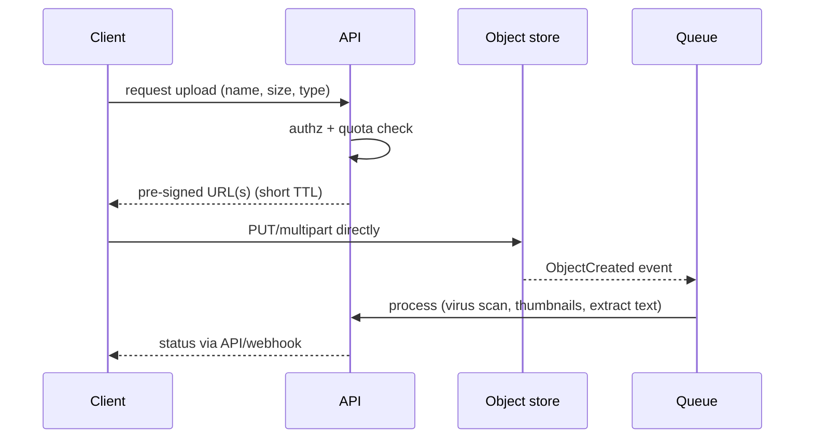

# Blob storage, CDN & edge

!!! abstract "At a glance"
    **Priority:** P1 · **Complexity:** 2/5 · **Est. time:** 2 h · **Phase:** 2 · **Prereqs:** [Caching](caching.md)
    **You're done when:** you can design an upload/download path with pre-signed URLs and multipart uploads, choose storage classes and lifecycle rules, configure CDN caching and invalidation correctly, and explain object storage's role for data lakes, ML artefacts and vector/RAG pipelines.

## Why it matters

Object storage is the default substrate for large data: media, backups, logs, data lakes (Parquet/Iceberg), model weights, datasets and increasingly vector indexes and even database storage layers (S3-backed Kafka, turbopuffer, Neon-style storage separation). It is durable (11 nines), cheap and effectively infinite, but with very different semantics from a filesystem or database. CDNs and edge platforms remove latency and origin load, and are also your first DDoS/WAF layer.

Staff engineers are expected to design the data path (who uploads, who pays for bandwidth, how it's secured), cost (egress dominates), and consistency (S3 is strongly consistent since Dec 2020 but has no rename, no atomic multi-object ops). In 2026, AI adds large artefacts (model weights of tens to hundreds of GB), datasets, embedding shards, and user-uploaded documents feeding ingestion pipelines.

## Core concepts

### Object storage semantics

- **Flat namespace of key → immutable object** (+ metadata, tags); "folders" are key prefixes. No in-place edits: overwrite replaces the whole object. **No rename** (copy + delete). Listings are paginated and slow at scale.
- **Consistency:** S3 provides strong read-after-write and list consistency. **Conditional writes** (`If-None-Match`, `If-Match`; S3 added these in 2024) enable lock-free coordination such as leader election or manifest commits, the basis of table formats like Delta/Iceberg and object-storage-native systems.
- **Durability vs availability:** 11 nines durability via replication/erasure coding across AZs; availability SLA ~99.9–99.99%. Durability doesn't protect against your own `DELETE` or a bad lifecycle rule — use **versioning, MFA delete/object lock, and cross-region replication** for accidental/malicious deletion.
- **Throughput:** scales by prefix/partition (S3 supports thousands of requests/s per prefix, and auto-partitions); large objects are read with parallel **range GETs**; first-byte latency ~10–100 ms (S3 Express One Zone offers single-digit ms).
- **Multipart upload:** split large files (≥ 100 MB recommended, parts 5 MB–5 GB, up to 10,000 parts), upload parts in parallel with retries, then complete. Abort incomplete uploads via lifecycle rules to avoid hidden cost.
- **Small files problem:** millions of tiny objects are expensive (per-request cost, listing) and slow for analytics; compact into larger files (Parquet 128 MB–1 GB).

### Upload and download architecture

- **Pre-signed URLs** let clients upload/download directly, bypassing your servers (saves bandwidth and compute). Constrain by key, size (`content-length-range` in POST policies), content type and short expiry. Never embed long-lived credentials in clients.
- **Never trust uploaded content:** scan for malware, validate types by content (magic bytes), strip metadata (EXIF), process in a sandbox, store in a quarantine bucket until verified. Serve user content from a **separate domain** to avoid cookie/XSS issues.
- **Resumable uploads** (tus, GCS resumable sessions, S3 multipart) for mobile/flaky networks.
- **Checksums:** end-to-end integrity via `Content-MD5`/SHA-256 checksums verified by the store.
- **Metadata in a database, blobs in the store:** keep an authoritative table (ID, owner, hash, size, state) so you can enforce authorisation, list per user, and reconcile orphaned objects.
- **Deduplication:** content-addressed keys (hash) give dedupe and immutability, at the cost of hard deletion semantics and privacy considerations.

### Storage classes and cost

| Class (S3 naming) | Use | Retrieval | Notes |
|---|---|---|---|
| Standard | Hot data | ms | Highest storage price |
| Intelligent-Tiering | Unknown/changing access | ms | Automatic tiering, small monitoring fee |
| Standard-IA / One Zone-IA | Infrequent access | ms, per-GB retrieval fee | 30-day minimum |
| Glacier Instant/Flexible/Deep Archive | Archive, compliance | ms to hours | Minimum durations; retrieval fees |

**Egress and request costs often exceed storage costs.** Cross-region replication and inter-region transfer, NAT gateway processing, and small-object PUT/GET all add up. Lifecycle rules (transition and expire), abort-incomplete-multipart, and compacting small files are the standard cost controls.

### CDN and edge

A CDN caches responses at points of presence (PoPs) close to users, terminates TLS, absorbs traffic spikes and attacks, and can run code at the edge.

Key mechanics:

- **Cache key** = URL (path + selected query params/headers/cookies). Every extra header/cookie in the key fragments the cache; normalise (strip tracking params, forward only what changes the response). `Vary: Accept-Encoding` is normal; `Vary: Cookie` kills hit rate.
- **`Cache-Control`:** `max-age` (browser), `s-maxage` (shared caches), `immutable`, `stale-while-revalidate`, `stale-if-error`, `no-store` for sensitive data; `private` for per-user responses. Validate with `ETag`/`Last-Modified`.
- **Invalidate by versioning, not purging:** fingerprinted asset URLs (`app.3f9a1c.js`) with `max-age=31536000, immutable`; HTML short-lived. Purge APIs exist but are slower and rate limited; use surrogate keys/cache tags for group purges.
- **Tiered caching / origin shield:** regional collapse layer so origin sees one request per object (protects origin from stampedes; coalesces concurrent misses).
- **Origin failover, request collapsing, and `stale-if-error`** turn origin outages into non-events for cacheable content.
- **Dynamic content acceleration:** even uncacheable traffic benefits from persistent optimised connections from PoP to origin and TLS termination near users.
- **Video/large files:** HTTP range requests, segmented streaming (HLS/DASH) with adaptive bitrate; segments are immutable and cache perfectly.
- **Security:** WAF, bot management, rate limiting at the edge, signed URLs/cookies for private content, origin locked to CDN IPs or private links (otherwise attackers bypass the CDN).

### Edge compute

Workers/Compute@Edge/Lambda@Edge run code near users: auth checks, A/B routing, header manipulation, personalisation, and increasingly **AI inference at the edge** (small models, embeddings) and **LLM gateway functions** (caching, auth, and routing before requests reach regional GPU pools). Constraints: limited CPU/memory, cold starts, data locality (edge KV is eventually consistent); keep edge logic thin and stateless. Durable Objects-style primitives give per-key single-writer state at the edge.

### Storage for AI systems

- **Model artefacts and datasets:** tens–hundreds of GB; distribute via regional buckets + node-local caches; parallel range downloads; avoid pulling 140 GB of weights at every pod start (bake into images, use a shared cache/volume, or lazy loading). Cold-start time of GPU pods is dominated by this.
- **RAG ingestion:** raw documents in blob storage → event → parse/chunk/embed pipeline; keep raw + derived artefacts (parsed text, chunk manifests) so you can re-embed when models change without re-parsing.
- **Vector indexes on object storage:** new architectures (turbopuffer, S3 Vectors, LanceDB) keep vectors/indexes in object storage with SSD/memory caching for cost — trade higher tail latency on cold queries for 10× lower storage cost.
- **Evals/traces:** append Parquet/JSONL to blob storage; query with DuckDB/ClickHouse.
- **Multimodal:** presigned URLs for images/audio/video passed to models; beware of provider fetch limits and SSRF when accepting URLs from users.

## Resources

| Resource | Type | Why this one | Level | Cost |
|---|---|---|---|---|
| [Andy Warfield — Building and operating a pretty big storage system called S3](https://www.allthingsdistributed.com/2023/07/building-and-operating-a-pretty-big-storage-system.html) :gem: | article | Insider view of S3's scale, erasure coding, heat management and engineering culture | intermediate | free |
| [Amazon S3 strong consistency announcement](https://aws.amazon.com/blogs/aws/amazon-s3-update-strong-read-after-write-consistency/) | article | What changed in 2020 and why it enabled new architectures | intermediate | free |
| [S3 conditional requests docs](https://docs.aws.amazon.com/AmazonS3/latest/userguide/conditional-requests.html) | docs | `If-None-Match`/`If-Match` for lock-free coordination | advanced | free |
| [MDN — HTTP caching](https://developer.mozilla.org/en-US/docs/Web/HTTP/Caching) | docs | Authoritative on Cache-Control, validation, stale directives | intermediate | free |
| [Facebook Haystack (OSDI 2010)](https://www.usenix.org/legacy/event/osdi10/tech/full_papers/Beaver.pdf) | paper | Classic paper on storing billions of photos efficiently; small-file lessons | advanced | free |
| [AWS S3 Vectors overview](https://aws.amazon.com/s3/features/vectors/) | docs | Object-storage-native vector search as of 2025–26 | intermediate | free |
| [Cloudflare blog](https://blog.cloudflare.com/) | article | Deep posts on CDN, edge compute, R2 and caching internals | intermediate | free |
| [turbopuffer blog](https://turbopuffer.com/blog) :gem: | article | Architecting search/vector on object storage with caching tiers | advanced | free |

## Hands-on lab

**Goal:** build a secure upload pipeline behind a CDN (90 min).

1. MinIO (S3-compatible) or a real S3/Azure Blob bucket. API endpoint `POST /uploads` returns a pre-signed multipart upload (or POST policy with size/type constraints).
2. Upload a 500 MB file with parallel parts (boto3 `TransferConfig`), kill mid-way and resume; abort stale multiparts via a lifecycle rule.
3. On `ObjectCreated` (MinIO notifications to a queue), run a worker that verifies content type, computes SHA-256, writes metadata to Postgres and moves the object from `quarantine/` to `clean/`.
4. Put a caching proxy (nginx or Cloudflare free tier) in front of downloads with `Cache-Control: public, max-age=31536000, immutable` on content-addressed keys; verify hit ratio with repeated requests and inspect `Age`/`CF-Cache-Status`.
5. **Expected output:** parallel multipart is several times faster than single PUT; resume works; only verified objects are downloadable; second request is a CDN hit (Age > 0).

## Questions

### L1 — Recall

??? question "Q1. Why use pre-signed URLs for uploads?"
    ??? success "Answer"
        They let clients upload directly to object storage with a time-limited, scoped signature, so large payloads don't transit your application servers (saving bandwidth, CPU and scaling headaches) while your API still performs authorisation and quota checks before issuing the URL. Constrain key, size, type, and expiry.

??? question "Q2. How should CDN-cached static assets be invalidated?"
    ??? success "Answer"
        Prefer versioned/fingerprinted URLs with long immutable TTLs so new deployments use new URLs and no purge is required; keep HTML/manifests short-lived. Use purge APIs or surrogate-key tagging only for exceptions (takedowns, wrong content).

??? question "Q3. What operations does object storage lack compared to a filesystem?"
    ??? success "Answer"
        Atomic rename, in-place partial updates, directories with atomic semantics, multi-object transactions, and cheap listing. Overwrites replace whole objects. Systems needing these semantics layer them on top (table formats with manifests and conditional writes).

??? question "Q4. What is an origin shield?"
    ??? success "Answer"
        A designated CDN tier (usually one region) that sits between edge PoPs and the origin so cache misses from many PoPs are collapsed into one origin request per object, improving hit ratio and protecting the origin from stampedes.

### L2 — Apply

??? question "Q5. Estimate monthly cost drivers for serving 200 TB/month of video from S3 directly vs through a CDN."
    ??? success "Answer"
        Direct S3 internet egress ≈ $0.05–0.09/GB → ~$10–18k/month plus request costs. Through a CDN with 90–95% hit ratio, origin egress to the CDN is small (S3-to-CloudFront transfer is free on AWS), and CDN egress is cheaper at volume and negotiable (~$0.02–0.05/GB at scale, less committed) → a fraction of the cost and far better latency. Use prices as order-of-magnitude, verify current rate cards. The design levers: hit ratio, cache key hygiene, segment sizes, and multi-CDN contracts.

??? question "Q6. Users upload 5 GB files from mobile networks and often fail at 90%. Fix the design."
    ??? success "Answer"
        Use multipart/resumable uploads with 8–64 MB parts, parallelism 3–6, per-part retries with backoff, and persistence of upload state (uploadId, completed parts) on the client so it can resume after app restarts; verify each part's checksum; complete server-side and verify the final hash. Use transfer acceleration/nearest-region endpoints for global users, and lifecycle-abort stale uploads. Provide progress UI and background upload APIs on mobile OS.

??? question "Q7. A CDN hit ratio is 30% for an API that returns product JSON. What do you check?"
    ??? success "Answer"
        Cache key fragmentation (cookies, Authorization, tracking query params, `Vary` headers), missing/short `Cache-Control` or `private/no-store` set by frameworks, per-user data mixed into shared responses, unnormalised query-param order, POST/`Set-Cookie` disabling caching, and low TTLs. Fix by separating public from personalised content (fetch user-specific parts separately), normalising keys, setting `s-maxage` with `stale-while-revalidate`, and using surrogate keys for purges on updates.

### L3 — Design & trade-offs

??? question "Q8. Design storage and delivery for user-uploaded documents in an enterprise RAG product with strict tenant isolation and data residency."
    ??? success "Answer"
        Per-region buckets (EU data stays in EU) with tenant prefixes and per-tenant KMS keys (bring-your-own-key where required); uploads via pre-signed URLs scoped to tenant prefix; quarantine → scan → clean promotion; metadata and ACLs in Postgres in the same region; ingestion events processed in-region (embedding via region-local model endpoints to respect residency). Downloads via short-lived signed URLs or proxied through an authorising service; no public buckets; access logs and object lock for retention. Deletion: tenant offboarding deletes objects, derived chunks and vectors, and rotates/destroys the key (crypto-shredding). CDN only for non-sensitive assets or with signed cookies and tenant-aware cache keys.

??? question "Q9. Store embeddings/vector indexes in object storage or in a memory-based engine? Decide."
    ??? success "Answer"
        Memory/SSD engines give low latency (single-digit to tens of ms) and high QPS but cost scales with RAM. Object-storage-native systems cut storage cost by an order of magnitude and scale to billions of vectors with cached hot data, but cold queries pay object-store latency (hundreds of ms) and features may lag. Choose by access pattern: hot, latency-critical, high-QPS tenants → memory/SSD engine; large, sparsely queried corpora (per-tenant archives, long-tail knowledge bases) → object-storage-native. Hybrid tiering (hot tenants promoted) is common. Decide with a latency SLO and cost model per tenant tier.

??? question "Q10. How do you prevent both accidental and malicious data loss in a critical bucket?"
    ??? success "Answer"
        Versioning + MFA delete or Object Lock (compliance/governance retention) to make deletion recoverable/impossible for a period; separate AWS account/role for replication with cross-account, cross-region replication (so compromise of the primary account can't delete replicas); least-privilege IAM and bucket policies denying `DeleteObject*` except for a break-glass role; lifecycle rules reviewed via code review/IaC with plan diffs; alerts on mass deletions and `PutBucketLifecycle`; periodic restore drills. Durability guarantees do not cover operator error.

### L4 — Staff-level ambiguity

??? question "Q11. Cloud egress and storage costs doubled in a year. Finance asks engineering for a plan. What do you do?"
    ??? success "Answer"
        Get attribution first: cost by bucket/prefix/tag/team, traffic by source (CDN, cross-region, cross-AZ, NAT, internet), request-type breakdown, and access-frequency analytics (S3 Storage Lens). Typical wins: lifecycle tiering and expiry for stale data, abort-multipart cleanup, compaction of small files, CDN offload and better cache keys, VPC endpoints to avoid NAT charges, colocating compute and data to remove cross-region transfers, compressing logs/Parquet, deleting redundant copies/orphaned objects. Estimate savings and effort per item, execute the top few in a quarter, and establish ongoing FinOps: tagging standards, budgets and anomaly alerts, and cost as a design-review section. Report as $ saved per engineer-week to prioritise.

??? question "Q12. Multiple teams store model weights and datasets ad hoc in personal buckets, causing slow deployments and lost artefacts. Propose a solution."
    ??? success "Answer"
        Create an artefact platform: a central registry (e.g. MLflow/Hugging Face Hub-style or OCI artefacts) backed by versioned, immutable, replicated object storage with content hashes and metadata (training data lineage, eval results). Provide SDK/CLI for push/pull with parallel range downloads and a regional pull-through cache so cluster nodes don't each download from origin; bake frequently used weights into base images or mount a shared read-only volume. Enforce retention and access policies, and integrate with CI/CD so deployments reference artefact digests. Measure pod cold-start time and artefact lookup success rates; migrate teams with tooling that makes the paved road faster than the ad hoc path.

## Real-world use cases

- **Netflix/YouTube:** immutable segments cached at ISP-embedded/edge caches; origin shielding for stampedes.
- **Dropbox/Google Photos:** deduplicated, content-addressed blocks in object stores.
- **Data lakes:** Parquet/Iceberg on S3/ADLS with catalog and conditional-write commits.
- **Logistics:** bill-of-lading PDFs and EDI archives in tiered storage with retention locks; document images processed by OCR/LLM pipelines triggered by object events.
- **LLM platforms:** distributing model weights to GPU nodes with regional caches.

## Pitfalls & anti-patterns

- Proxying large uploads/downloads through application servers.
- Public buckets; long-lived credentials in clients; skipping content validation.
- Cookies/`Vary` fragmenting CDN cache; caching personalised responses publicly.
- Millions of tiny objects; no lifecycle rules.
- Trusting "11 nines" as backup.
- Origin reachable directly (CDN bypass).

## Checklist

- [ ] I can design a secure pre-signed multipart upload with post-processing
- [ ] I can configure CDN cache keys, headers and invalidation correctly
- [ ] I can identify the major cost drivers in blob/CDN architectures
- [ ] I can describe artefact and vector storage patterns for AI systems
- [ ] I answered all L3 questions out loud in < 3 min each
