# Tech radar — September 2026

Personalised for: Python-first agentic engineering, Azure/Foundry + cloud-agnostic, Java 25 / Spring AI 2.0 alongside, Staff/AI-architect path.
See [how the radar is maintained](index.md). All statuses **as of 2026-09-25** unless stated. Version numbers were read from PyPI/official docs on that date.

!!! warning "Fast-moving areas"
    Agent frameworks, MCP and A2A change monthly. Treat *Trial* entries as "learn the concepts and keep code portable", not "marry the API".

## Overview by ring

```mermaid
flowchart LR
    subgraph Adopt
      A1[uv · Pydantic v2 · FastAPI]
      A2[LangGraph 1.x · MCP · AGENTS.md]
      A3[Hybrid search + rerank · pgvector]
      A4[Error-analysis-first evals · Langfuse]
      A5[Prompt caching · Structured outputs]
    end
    subgraph Trial
      T1[Pydantic AI · DSPy/GEPA]
      T2[A2A v1 · AG-UI]
      T3[Claude Agent SDK · OpenAI Agents SDK]
      T4[MS Agent Framework · Google ADK · Spring AI 2.0]
    end
    subgraph Assess
      S1[GraphRAG/LazyGraphRAG · Letta]
      S2[MCP 2026-07-28 · Bedrock AgentCore]
      S3[GRPO fine-tuning · Zensical]
    end
    subgraph Hold
      H1[AutoGen · Semantic Kernel new work]
      H2[Assistants API · SSE MCP transport]
      H3[Naive agentic RAG · unaligned LLM judge]
    end
    Adopt --> Trial --> Assess --> Hold
```

## Quadrant 1 — Frameworks & libraries

| Blip | Ring | Rationale | As of | Link |
|---|---|---|---|---|
| Pydantic v2 | Adopt | Validation/typing backbone of FastAPI, Pydantic AI and structured outputs; 2.13.x current. | 2026-09-25 | [docs](https://docs.pydantic.dev/latest/) |
| FastAPI | Adopt | Default Python API layer for agent backends; pairs with Pydantic v2 and async streaming. | 2026-09-25 | [docs](https://fastapi.tiangolo.com/) |
| LangGraph 1.x | Adopt | Durable, checkpointed graph orchestration; 1.0 GA Oct 2025, 1.2.x current. Best fit for stateful/human-in-the-loop agents. | 2026-09-25 | [docs](https://langchain-ai.github.io/langgraph/) |
| Pydantic AI | Trial | Type-safe agents, dependency injection, Logfire/OTel, A2A and AG-UI support; PyPI shows 2.x (V2 line). Fits your Pydantic-first stack; verify API stability before committing. | 2026-09-25 | [docs](https://ai.pydantic.dev/) |
| DSPy 3.x / GEPA | Trial | Programmatic prompt optimisation; `dspy.GEPA` reflective optimizer (ICLR 2026 Oral); 3.4.0 current. Best used where you have a metric and a dev set. | 2026-09-25 | [dspy.ai](https://dspy.ai/) |
| Claude Agent SDK | Trial | Agent loop, tools, MCP, sub-agents and hooks as a library (formerly Claude Code SDK). Good for coding/ops agents. | 2026-09-25 | [docs](https://code.claude.com/docs/en/agent-sdk/overview) |
| OpenAI Agents SDK | Trial | Lightweight handoffs/guardrails/tracing; sandbox agents added Apr 2026 (beta). Provider-agnostic enough to learn from. | 2026-09-25 | [docs](https://openai.github.io/openai-agents-python/) |
| Microsoft Agent Framework 1.0 | Trial | GA 2026-04-03; merges AutoGen and Semantic Kernel concepts; relevant for Foundry/Azure work. | 2026-09-25 | [docs](https://learn.microsoft.com/en-us/agent-framework/overview/) |
| Google ADK 2.0 | Trial | Graph-based workflow runtime in 2.x; useful as a comparison and for Vertex/Kaggle content. | 2026-09-25 | [adk.dev](https://adk.dev/) |
| Spring AI 2.0 | Trial | GA 2026-06-12 on Boot 4.x/Framework 7; MCP annotations, Streamable HTTP. Your Java-track default. | 2026-09-25 | [release post](https://spring.io/blog/2026/06/12/spring-ai-2-0-0-GA-available-now/) |
| LiteLLM | Trial | Provider gateway/proxy for multi-model routing, budgets and fallbacks; 1.10x current. Pin versions and review security advisories. | 2026-09-25 | [docs](https://docs.litellm.ai/) |
| Mem0 | Trial | Agent memory layer (v3 Apr 2026; 2.x on PyPI packaging). Evaluate against simple summary/vector memory first. | 2026-09-25 | [docs](https://docs.mem0.ai/) |
| Ragas / DeepEval / promptfoo | Trial | Eval harnesses for RAG and red-teaming; promptfoo stays OSS after OpenAI acquisition announcement (2026-03-09). Use them *after* manual error analysis. | 2026-09-25 | [promptfoo OWASP agentic preset](https://www.promptfoo.dev/docs/red-team/owasp-agentic-ai/) |
| Letta | Assess | Stateful agents with self-managed memory (MemGPT lineage); interesting model, thinner production evidence. | 2026-09-25 | [docs](https://docs.letta.com/) |
| Graphiti (Zep) | Assess | Temporal knowledge-graph memory; assess for entity-heavy domains. | 2026-09-25 | [GitHub](https://github.com/getzep/graphiti) |
| CrewAI | Assess | Role-based multi-agent; popular but the "Don't build multi-agents" caution applies; know the concepts. | 2026-09-25 | [site](https://www.crewai.com/) |
| AutoGen | Hold | Placed in maintenance mode as Microsoft consolidates on Agent Framework; read for history, do not start new work. | 2026-09-25 | [GitHub](https://github.com/microsoft/autogen) |
| Semantic Kernel (new work) | Hold | Superseded by Microsoft Agent Framework for new builds; keep only for existing codebases. | 2026-09-25 | [GitHub](https://github.com/microsoft/semantic-kernel) |
| OpenAI Assistants API | Hold | Retired 2026-08-26; migrate to Responses API / Agents SDK. | 2026-09-25 | [migration guide](https://platform.openai.com/docs/assistants/migration) |

## Quadrant 2 — Protocols & standards

| Blip | Ring | Rationale | As of | Link |
|---|---|---|---|---|
| MCP (2025-11-25 spec) | Adopt | De facto tool/context protocol, stewarded by the Linux Foundation's Agentic AI Foundation since Dec 2025; build one server and one client. | 2026-09-25 | [spec](https://modelcontextprotocol.io/specification/2025-11-25) |
| AGENTS.md | Adopt | Cross-tool repo instruction file; already the operating protocol of this repo. | 2026-09-25 | [agents.md](https://agents.md/) |
| A2A v1.0 | Trial | Agent-to-agent protocol (v1 announced 2026-03-12): signed Agent Cards, JSON-RPC/gRPC/REST. Try one cross-framework call; MCP is for tools, A2A for peers. | 2026-09-25 | [a2a-protocol.org](https://a2a-protocol.org/) |
| AG-UI | Trial | Event protocol between agents and UIs (streaming, state sync, human input); supported by several frameworks. | 2026-09-25 | [docs](https://docs.ag-ui.com/) |
| OpenTelemetry GenAI semantic conventions | Trial | Standard span/metric names for LLM calls; still "Development" status, now in a dedicated repo. Use them but expect attribute renames. | 2026-09-25 | [repo](https://github.com/open-telemetry/semantic-conventions-genai) |
| OWASP Top 10 for Agentic Applications 2026 | Trial | Threat model vocabulary (ASI01–ASI10) for agent design reviews; pair with the LLM Top 10. | 2026-09-25 | [OWASP](https://genai.owasp.org/resource/owasp-top-10-for-agentic-applications-for-2026/) |
| MCP 2026-07-28 revision | Assess | Stateless core (no `initialize`, no `Mcp-Session-Id`), `server/discover`, tasks as an extension, Multi Round-Trip Requests, Sampling/Roots/Logging deprecated, DCR deprecated in favour of Client ID Metadata Documents. Read the changelog; SDK support is still catching up. | 2026-09-25 | [changelog](https://modelcontextprotocol.io/specification/2026-07-28/changelog) |
| MCP HTTP+SSE transport | Hold | Deprecated since 2025-03-26 and formally reclassified as Deprecated; use Streamable HTTP. | 2026-09-25 | [spec](https://modelcontextprotocol.io/specification/2026-07-28/changelog) |

## Quadrant 3 — Platforms & infrastructure

| Blip | Ring | Rationale | As of | Link |
|---|---|---|---|---|
| uv (+ ruff) | Adopt | One tool for Python versions, envs, locking and running; Astral tools remain OSS after the OpenAI acquisition announcement (2026-03-19). | 2026-09-25 | [uv](https://docs.astral.sh/uv/) |
| Python 3.14 | Adopt | Current release; free-threaded build officially supported (PEP 779). Use 3.14 for new services. | 2026-09-25 | [free-threading guide](https://py-free-threading.github.io/) |
| JDK 25 (LTS) | Adopt | Current LTS: Scoped Values final, compact object headers; structured concurrency still preview. | 2026-09-25 | [OpenJDK 25](https://openjdk.org/projects/jdk/25/) |
| pgvector | Adopt | Default vector store when you already run Postgres; enough for most enterprise RAG scale. | 2026-09-25 | [GitHub](https://github.com/pgvector/pgvector) |
| Langfuse | Adopt | OSS tracing/evals/prompt management, self-hostable; acquired by ClickHouse in Jan 2026 but stays OSS (4.x). | 2026-09-25 | [docs](https://langfuse.com/docs) |
| Ollama | Adopt | Local model serving for dev and offline labs. | 2026-09-25 | [ollama.com](https://ollama.com/) |
| Microsoft Foundry (Agent Service) | Trial | Renamed from Azure AI Foundry; Agent Service runs on the Responses API. Use for the Azure leg of the capstone. | 2026-09-25 | [docs](https://learn.microsoft.com/en-us/azure/foundry/agents/overview) |
| vLLM | Trial | Open-source inference standard (PagedAttention, continuous batching); run once for the serving lab. | 2026-09-25 | [docs](https://docs.vllm.ai/) |
| SGLang | Trial | High-throughput serving with RadixAttention/structured generation; compare with vLLM on your workload. | 2026-09-25 | [docs](https://docs.sglang.ai/) |
| Arize Phoenix | Trial | OSS tracing/eval UI on OTel; an alternative to Langfuse. | 2026-09-25 | [docs](https://arize.com/docs/phoenix) |
| Qdrant | Trial | Dedicated vector DB with strong filtering/hybrid features when pgvector isn't enough. | 2026-09-25 | [docs](https://qdrant.tech/documentation/) |
| AWS Bedrock AgentCore | Assess | Managed runtime, gateway, memory, identity, policy and evaluations (Policy/Evaluations GA Mar 2026; new Runtime GA Sep 2026). Assess for AWS-centric employers; keep your agent code portable. | 2026-09-25 | [AWS](https://aws.amazon.com/bedrock/agentcore/) |
| Zensical | Assess | Successor to MkDocs Material from the same team; Material is in maintenance mode with critical fixes announced until May 2027; Zensical is pre-0.1 (0.0.x on PyPI) and reads `mkdocs.yml`. Track it; migrate this site only after a stable line. | 2026-09-25 | [announcement](https://squidfunk.github.io/mkdocs-material/blog/2025/11/05/zensical/) · [upcoming changes](https://zensical.org/upcoming-changes/) |

## Quadrant 4 — Techniques

| Blip | Ring | Rationale | As of | Link |
|---|---|---|---|---|
| Hybrid search + reranking | Adopt | BM25 + dense + metadata filters, then cross-encoder rerank; the default RAG retrieval baseline. | 2026-09-25 | [Pinecone rerankers](https://www.pinecone.io/learn/series/rag/rerankers/) |
| Error-analysis-first evals | Adopt | Read traces, code failure modes, then build binary graders; tools come second. | 2026-09-25 | [Evals FAQ](https://hamel.dev/blog/posts/evals-faq/) |
| Prompt caching | Adopt | Large cost/latency win for stable prefixes; design prompts and tool order for cache hits. | 2026-09-25 | [Claude docs](https://platform.claude.com/docs/en/build-with-claude/prompt-caching) |
| Structured outputs | Adopt | Schema-constrained generation with Pydantic models; removes a class of parsing failures. | 2026-09-25 | [OpenAI docs](https://platform.openai.com/docs/guides/structured-outputs) |
| Context engineering | Adopt | Treat context as a budget: compaction, retrieval on demand, sub-agents, notes. | 2026-09-25 | [Anthropic](https://www.anthropic.com/engineering/effective-context-engineering-for-ai-agents) |
| Workflows before agents | Adopt | Prefer deterministic workflows (chain/route/parallelise) and add autonomy only where needed. | 2026-09-25 | [Building effective agents](https://www.anthropic.com/engineering/building-effective-agents) |
| Threat-modelling with the lethal trifecta | Adopt | Private data + untrusted input + exfiltration path; design reviews should remove one leg. | 2026-09-25 | [Simon Willison](https://simonwillison.net/2025/Jun/16/the-lethal-trifecta/) |
| Prompt/program optimisation (GEPA) | Trial | Reflective evolution of prompts using traces; cheap alternative to RL when you have a metric. | 2026-09-25 | [GEPA paper](https://arxiv.org/abs/2507.19457) |
| Contextual retrieval | Trial | Prepend chunk-level context before embedding/BM25; measurable retrieval gains. | 2026-09-25 | [Anthropic](https://www.anthropic.com/news/contextual-retrieval) |
| Code execution with MCP tools | Trial | Let the model write code against tool APIs instead of loading every schema; cuts tokens. | 2026-09-25 | [Anthropic](https://www.anthropic.com/engineering/code-execution-with-mcp) |
| Free-threaded Python (3.14t) | Trial | Test CPU-bound and thread-heavy code; check that your dependencies support it before production. | 2026-09-25 | [py-free-threading](https://py-free-threading.github.io/) |
| LazyGraphRAG / GraphRAG | Assess | Helps corpus-level questions; costly indexing (lazy variant reduces it). Only where vector search demonstrably fails. | 2026-09-25 | [Microsoft Research](https://www.microsoft.com/en-us/research/blog/lazygraphrag-setting-a-new-standard-for-quality-and-cost/) |
| GRPO / RLVR fine-tuning | Assess | RL with verifiable rewards via TRL/Unsloth; try one small run in Phase 5; rarely needed before prompting/RAG/DSPy. | 2026-09-25 | [Unsloth RL guide](https://unsloth.ai/docs/get-started/reinforcement-learning-rl-guide) · [TRL](https://huggingface.co/docs/trl) |
| Agentic RAG everywhere (naive) | Hold | Agent-loop retrieval adds cost/latency and is not consistently better than tuned classic pipelines. | 2026-09-25 | [arXiv 2601.07711](https://arxiv.org/abs/2601.07711) |
| LLM-as-judge without human alignment | Hold | Unvalidated judges drift; require agreement checks against labelled examples first. | 2026-09-25 | [Judge guide](https://hamel.dev/blog/posts/llm-judge/) |
| Multi-agent by default | Hold | Coordination overhead and context conflicts; start with one agent and tools. | 2026-09-25 | [Cognition](https://cognition.ai/blog/dont-build-multi-agents) |

## Counts (2026-09-25)

Adopt 18 · Trial 23 · Assess 8 · Hold 7 = 56 blips.
